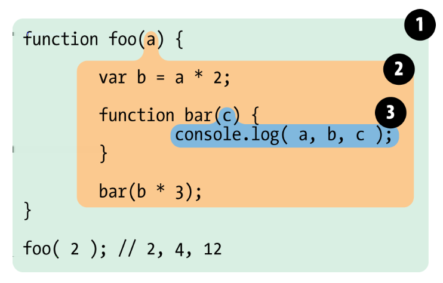
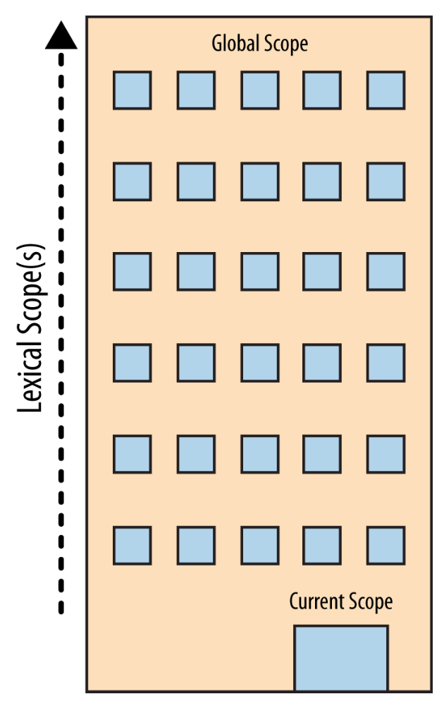
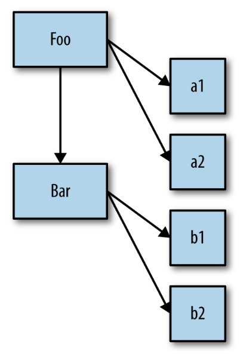
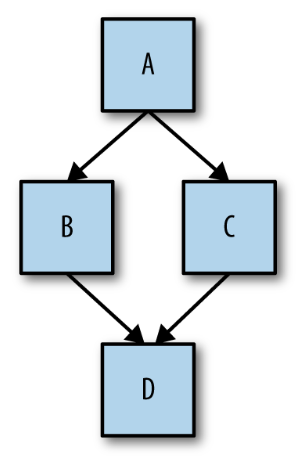

# Appunti JavaScript - Completi

_Ultimo aggiornamento: 13 Febbraio 2026_

---

## 1. Introduzione

### 1.1 Che cos'è Javascript

JavaScript (JS) è un linguaggio di programmazione versatile, comunemente usato per creare interattività nelle pagine web. Permette di manipolare dinamicamente i contenuti, animare elementi, gestire eventi (come il click di un pulsante) e comunicare con un server per aggiornare parti della pagina senza doverla ricaricare completamente.

Sebbene sia spesso descritto come un linguaggio interpretato (interpreted), la sua esecuzione è più complessa. I moderni motori JavaScript (JavaScript engines) — come V8 (in Chrome) o SpiderMonkey (in Firefox) — non si limitano a interpretare il codice riga per riga. Eseguono invece una compilazione Just-In-Time (JIT), traducendo il codice sorgente (source code) in codice macchina ottimizzato poco prima dell'esecuzione, garantendo così prestazioni molto più elevate.

JavaScript è un linguaggio a tipizzazione debole e dinamica (weakly and dynamically typed). Questo significa che non è necessario dichiarare il tipo di dato di una variabile (es. numero, testo, ecc.) quando la si crea. Una stessa variabile può contenere tipi di dati diversi nel corso del programma. Il linguaggio gestisce inoltre conversioni di tipo automatiche, un processo chiamato coercizione di tipo (type coercion). Questa flessibilità può accelerare lo sviluppo, ma richiede attenzione per evitare errori e comportamenti inattesi.

```javascript
/*
 * Esempi di interattività e tipizzazione dinamica in JavaScript
 */

// Manipolazione dinamica del contenuto
document.getElementById("titolo").textContent = "Benvenuto!";

// Gestione di eventi (click di un pulsante)
document.getElementById("mioBottone").addEventListener("click", function () {
  alert("Hai cliccato il pulsante!");
});

// Animazione di elementi
let box = document.querySelector(".box");
box.style.transform = "translateX(100px)";

// Tipizzazione dinamica - la stessa variabile può contenere tipi diversi
let valore = 42; // numero
console.log(typeof valore); // "number"

valore = "Ciao"; // ora è una stringa
console.log(typeof valore); // "string"

valore = true; // ora è un booleano
console.log(typeof valore); // "boolean"

// Type coercion (conversione automatica di tipo)
let risultato = "5" + 3; // "53" (il numero viene convertito in stringa)
let somma = "5" - 3; // 2 (la stringa viene convertita in numero)
let confronto = "10" == 10; // true (i valori vengono confrontati dopo conversione)

/*
 * Comunicazione con un server (AJAX)
 * Permette di aggiornare parti della pagina senza ricaricarla
 */
fetch("https://api.example.com/dati")
  .then((response) => response.json())
  .then((dati) => {
    console.log("Dati ricevuti:", dati);
    // Aggiorna la pagina con i nuovi dati
  });
```

---

### 1.2 ECMAScript

ECMAScript è una specifica, uno standard tecnico, che definisce le regole, le funzionalità e il comportamento che un linguaggio di scripting deve avere. Non è un linguaggio di programmazione, ma la "ricetta" su cui si basano diversi linguaggi.

JavaScript è l'implementazione più famosa e diffusa dello standard ECMAScript.

La relazione tra i due si può riassumere così:

- **Nascita e Standardizzazione** → JavaScript fu creato da Netscape. Per evitare che ogni browser sviluppasse una propria versione incompatibile del linguaggio, fu necessario creare uno standard. Nel 1997, JavaScript fu sottomesso a Ecma International, un'organizzazione di standardizzazione, che ne formalizzò le specifiche con il nome di ECMAScript.

- **Evoluzione Continua** → Lo standard ECMAScript si evolve costantemente. Nuove versioni vengono rilasciate (annualmente dal 2015) per aggiungere funzionalità e migliorare il linguaggio. Una delle versioni più importanti è stata ECMAScript 2015 (ES6), che ha introdotto cambiamenti fondamentali come le classi (classes), le funzioni freccia (arrow functions) e i moduli (modules).

- **Implementazioni Diverse** → Sebbene JavaScript nei browser sia l'implementazione (implementation) principale, non è l'unica. Anche ambienti come Node.js (per lo sviluppo server-side) e Deno implementano lo standard ECMAScript, permettendo di usare una sintassi e funzionalità coerenti in contesti diversi dal web.

In sintesi, ECMAScript definisce come il linguaggio "dovrebbe" funzionare, mentre JavaScript è il linguaggio che gli sviluppatori usano concretamente, il quale "implementa" quelle definizioni.

```javascript
/*
 * Esempi di evoluzione ECMAScript: confronto ES5 vs ES6
 */

// ===== VARIABILI =====
// ES5 - solo var
var nome = "Mario";

// ES6 - let e const
let eta = 25;
const PI = 3.14159;

// ===== FUNZIONI =====
// ES5 - funzione tradizionale
function somma(a, b) {
  return a + b;
}

// ES6 - arrow function
const sommaES6 = (a, b) => a + b;

// ===== CLASSI =====
// ES5 - constructor function
function Persona(nome, eta) {
  this.nome = nome;
  this.eta = eta;
}
Persona.prototype.saluta = function () {
  return "Ciao, sono " + this.nome;
};

// ES6 - class syntax
class PersonaES6 {
  constructor(nome, eta) {
    this.nome = nome;
    this.eta = eta;
  }

  saluta() {
    return `Ciao, sono ${this.nome}`;
  }
}

// ===== TEMPLATE LITERALS =====
// ES5 - concatenazione stringhe
var messaggio = "Ciao " + nome + ", hai " + eta + " anni";

// ES6 - template literals
const messaggioES6 = `Ciao ${nome}, hai ${eta} anni`;

// ===== MODULI =====
// ES6 - import/export
// In un file math.js:
// export function quadrato(x) { return x * x; }

// In un altro file:
// import { quadrato } from './math.js';

// ===== DESTRUCTURING =====
// ES6 - destrutturazione
const utente = { nome: "Anna", eta: 30, citta: "Roma" };
const { nome: nomeUtente, citta } = utente;

const numeri = [1, 2, 3, 4, 5];
const [primo, secondo, ...resto] = numeri;

/*
 * Implementazioni diverse dello standard ECMAScript
 */

// Browser (JavaScript)
console.log("Esecuzione nel browser");

// Node.js (implementazione ECMAScript lato server)
// const fs = require('fs'); // moduli Node.js

// Deno (altra implementazione server-side moderna)
// import { serve } from "https://deno.land/std/http/server.ts";
```

---

### 1.3 Dove Inserire il Codice JavaScript in HTML

Per far interagire JavaScript con una pagina web, è necessario includere il codice nel documento HTML. Questo si fa tramite il tag `<script>`, che può essere posizionato in punti diversi del file. La posizione e gli attributi usati (async, defer) hanno un impatto significativo sul caricamento della pagina e sulle performance.

Il modo più comune è collegare un file .js esterno usando l'attributo src.

```html
<script src="script.js"></script>
```

#### Nel `<head>` (Senza Attributi)

```html
<!DOCTYPE html>
<html>
  <head>
    <title>Esempio</title>
    <script src="script.js"></script>
  </head>
  <body>
    <h1>Contenuto della pagina</h1>
  </body>
</html>
```

- **Comportamento** → Il browser interrompe l'analisi (parsing) del file HTML, scarica ed esegue immediatamente lo script. Solo dopo riprende a costruire la pagina.

- **Impatto** → È un metodo bloccante (blocking). Rallenta la visualizzazione iniziale della pagina, perché l'utente non vedrà alcun contenuto finché lo script non avrà finito. Oggi è una pratica generalmente sconsigliata.

#### Alla Fine del `<body>`

```html
<!DOCTYPE html>
<html>
  <head>
    <title>Esempio</title>
  </head>
  <body>
    <h1>Contenuto della pagina</h1>
    <p>Tutto il contenuto HTML viene caricato prima dello script</p>

    <script src="script.js"></script>
  </body>
</html>
```

- **Comportamento** → Il browser analizza e visualizza tutto il contenuto HTML della pagina. Solo alla fine, scarica ed esegue lo script.

- **Impatto** → La pagina appare velocemente all'utente. Quando lo script viene eseguito, ha già accesso a tutti gli elementi del DOM. È stata la tecnica più raccomandata per anni.

#### Nel `<head>` con Attributo defer

```html
<!DOCTYPE html>
<html>
  <head>
    <title>Esempio</title>
    <script src="script.js" defer></script>
    <script src="altro-script.js" defer></script>
  </head>
  <body>
    <h1>Contenuto della pagina</h1>
  </body>
</html>
```

- **Comportamento** → Il browser scarica lo script in parallelo, senza interrompere l'analisi dell'HTML. Lo script viene eseguito solo quando l'intero documento HTML è stato analizzato, ma prima che venga lanciato l'evento DOMContentLoaded. Se ci sono più script con defer, vengono eseguiti nell'ordine in cui appaiono nel documento.

- **Impatto** → Non blocca la visualizzazione della pagina e garantisce l'ordine di esecuzione. È spesso la scelta migliore e più moderna.

#### Nel `<head>` con Attributo async

```html
<!DOCTYPE html>
<html>
  <head>
    <title>Esempio</title>
    <script src="analytics.js" async></script>
  </head>
  <body>
    <h1>Contenuto della pagina</h1>
  </body>
</html>
```

- **Comportamento** → Il browser scarica lo script in parallelo, ma lo esegue non appena il download è completato, interrompendo momentaneamente l'analisi dell'HTML se non è ancora finita. L'ordine di esecuzione non è garantito se ci sono più script async.

- **Impatto** → Utile per script indipendenti che non devono interagire con il DOM e non dipendono da altri script (es. script di analytics, pubblicità). Non è adatto per script che manipolano la pagina o che hanno dipendenze.

```javascript
/*
 * Esempio pratico: script.js
 * Questo script manipola il DOM
 */

// Con defer o posizionamento a fine body, il DOM è già pronto
const titolo = document.querySelector("h1");
titolo.textContent = "JavaScript ha modificato questo titolo!";

// Aggiunge un listener per un evento
const bottone = document.getElementById("mioBottone");
bottone.addEventListener("click", function () {
  alert("Bottone cliccato!");
});
```

```javascript
/*
 * Confronto visivo del caricamento
 */

// SENZA defer/async (bloccante):
// 1. Browser legge <script> nel <head>
// 2. ⏸️ BLOCCO - scarica script.js
// 3. ⏸️ BLOCCO - esegue script.js
// 4. ✅ Riprende parsing HTML
// 5. Mostra contenuto

// CON defer (raccomandato):
// 1. Browser legge <script defer> nel <head>
// 2. ⚡ Scarica script.js in parallelo
// 3. ✅ Continua parsing HTML
// 4. Mostra contenuto
// 5. ✅ Esegue script.js quando HTML è pronto

// CON async (per script indipendenti):
// 1. Browser legge <script async> nel <head>
// 2. ⚡ Scarica script.js in parallelo
// 3. ⚡ Esegue appena scaricato (può bloccare)
// 4. Continua parsing HTML

// A FINE <body> (tecnica classica):
// 1. ✅ Parsing completo di tutto l'HTML
// 2. Mostra contenuto
// 3. Scarica ed esegue script.js
```

---

### 1.4 Esecuzione

Per poter eseguire (to execute o run) le istruzioni, un programma deve essere tradotto in un formato che il computer possa comprendere. Questo compito è svolto da programmi speciali chiamati interpreti (interpreters) o compilatori (compilers).

- **L'interpretazione** (interpreting) consiste nel tradurre ed eseguire il codice sorgente (source code) riga per riga, ogni volta che il programma viene avviato.

- **La compilazione** (compiling) traduce l'intero programma in anticipo. Quando il programma viene eseguito, è la versione già compilata (in linguaggio macchina) ad essere avviata.

Comunemente si dice che JavaScript sia un linguaggio interpretato, ma questa è un'imprecisione. Il motore JavaScript (JavaScript engine) in realtà compila (compiles) il codice "al volo" (on the fly) e poi esegue immediatamente il risultato. Questo processo è noto come **compilazione JIT (Just-In-Time)**.

```javascript
/*
 * Esempio di codice JavaScript
 * Il JavaScript engine esegue questi passaggi:
 */

// 1. PARSING - Il codice viene letto e analizzato
function calcola(a, b) {
  return a + b;
}

// 2. COMPILAZIONE JIT - Il codice viene compilato in linguaggio macchina
let risultato = calcola(5, 3);

// 3. ESECUZIONE - Il codice compilato viene eseguito
console.log(risultato); // Output: 8

/*
 * Tutto questo avviene "al volo" quando si esegue il programma.
 * Il JavaScript engine (come V8 in Chrome/Node.js) ottimizza
 * il codice durante l'esecuzione per migliorare le performance.
 */

// Esempio di ottimizzazione JIT
function sommaRipetuta(n) {
  let totale = 0;
  for (let i = 0; i < n; i++) {
    totale += i;
  }
  return totale;
}

/*
 * Se questa funzione viene chiamata molte volte,
 * il JIT compiler la ottimizza per renderla più veloce
 */
console.log(sommaRipetuta(1000));
console.log(sommaRipetuta(2000));
console.log(sommaRipetuta(3000));
```

---

## 2. Fondamenti

### 2.1 Programma

Un programma, o codice, è un insieme di istruzioni che dicono al computer cosa fare.

Queste istruzioni sono scritte in un file di testo seguendo le regole di un linguaggio di programmazione. L'insieme di queste regole (formato, combinazioni valide, ecc.) è definito sintassi, che può essere paragonata alla grammatica e all'ortografia di una lingua umana.

```javascript
/*
 * Esempio di un semplice programma JavaScript
 * Questo programma calcola l'area di un rettangolo
 */
let larghezza = 10;
let altezza = 5;
let area = larghezza * altezza;

console.log("L'area del rettangolo è: " + area);
```

---

### 2.2 Commenti nel Codice (Code Comments)

Il codice non viene scritto solo per il computer, ma anche e soprattutto per gli esseri umani (altri sviluppatori o il "te stesso" del futuro). Per questo, è fondamentale scrivere codice che sia non solo funzionante, ma anche chiaro e comprensibile.

I commenti sono porzioni di testo inserite nel codice che vengono completamente ignorate dal motore JavaScript. Il loro unico scopo è fornire spiegazioni a chi legge il codice.

#### Principi per un Buon Uso dei Commenti

- **Perché, non cosa** → Un buon commento dovrebbe spiegare perché una certa scelta è stata fatta, non cosa fa il codice. Il "cosa" dovrebbe essere reso evidente da un codice scritto in modo chiaro (es. nomi di variabili e funzioni significativi). Un commento può spiegare il come solo se il codice è particolarmente complesso o insolito.

- **Il giusto equilibrio** → Un codice senza commenti è incompleto. Al contrario, troppi commenti (es. uno per ogni riga) sono spesso sintomo di un codice scritto male e poco leggibile.

#### Tipi di Commenti in JavaScript

Esistono due sintassi principali per inserire commenti.

- **Commento su Riga Singola (//)** - Tutto ciò che segue `//` fino alla fine della riga viene considerato un commento. È ideale per note brevi, posizionate sopra un'istruzione o alla fine di una riga.

```javascript
// Questo è un commento su singola riga
let nome = "Mario"; // Commento a fine riga

// Più commenti consecutivi
// possono essere usati per
// spiegazioni più lunghe
```

- **Commento Multiriga (/_ ... _/)** - Tutto ciò che si trova tra `/*` e `*/` è un commento, anche se si estende su più righe. È utile per spiegazioni più lunghe.

```javascript
/*
 * Questo è un commento
 * che si estende su
 * più righe
 */

let risultato = calcola(/* parametro */ valore);
```

**Commenti di Documentazione (JSDoc)** - Un tipo speciale di commento multiriga è il JSDoc, che inizia con `/**` e termina con `*/`. Segue una sintassi strutturata per descrivere funzioni, classi e variabili in modo formale. Questi commenti sono estremamente utili perché possono essere letti da strumenti automatici per generare documentazione o per fornire suggerimenti intelligenti negli editor di codice.

```javascript
/**
 * Calcola l'area di un rettangolo
 *
 * @param {number} larghezza - La larghezza del rettangolo
 * @param {number} altezza - L'altezza del rettangolo
 * @returns {number} L'area del rettangolo
 */
function calcolaArea(larghezza, altezza) {
  return larghezza * altezza;
}
```

---

### 2.3 Statement (Istruzione)

Un'istruzione è un comando che esegue un compito specifico. Un programma è composto da una serie di istruzioni.

```javascript
let a = 2 * b;
```

Questa istruzione è composta da diverse parti:

- **Variabili (a e b)** → Sono "contenitori" simbolici che memorizzano valori su cui il programma può operare. Funzionano come segnaposto per i valori stessi.

- **Valore Letterale (2)** → È un valore scritto direttamente nel codice, che non è stato memorizzato in una variabile.

- **Operatori (= e \*)** → Sono simboli che eseguono azioni. L'\* esegue una moltiplicazione, mentre l'= assegna il risultato dell'operazione alla variabile a sinistra.

La maggior parte delle istruzioni in JavaScript termina con un punto e virgola (;).

```javascript
/*
 * Esempi di diverse istruzioni
 */

// Dichiarazione di variabile
let nome = "Mario";

// Operazione matematica
let risultato = 10 + 5;

// Chiamata di funzione
console.log("Ciao!");

// Istruzione condizionale
if (risultato > 10) {
  console.log("Il risultato è maggiore di 10");
}

// Ciclo
for (let i = 0; i < 3; i++) {
  console.log(i);
}
```

---

### 2.4 Expression (Espressione)

Le istruzioni sono composte da una o più espressioni. Un'espressione è un qualsiasi pezzo di codice che produce un valore, come un riferimento a una variabile o una combinazione di valori e operatori.

Analizzando l'istruzione `a = b * 2;`, si possono identificare quattro espressioni:

- **2** → Un'espressione letterale, il cui valore è semplicemente 2.

- **b** → Un'espressione di variabile, che si risolve nel valore contenuto in b.

- **b \* 2** → Un'espressione aritmetica, che produce il risultato della moltiplicazione.

- **a = b \* 2** → Un'espressione di assegnamento, che assegna il risultato di b \* 2 alla variabile a.

Un'espressione che sta da sola può formare un'intera istruzione, chiamata istruzione di espressione. Sebbene un'istruzione come `b * 2;` sia valida, è poco utile perché il risultato non viene utilizzato. Un esempio molto più comune di istruzione di espressione è una chiamata a una funzione, come `alert(a);`.

```javascript
/*
 * Esempi di espressioni in JavaScript
 */

// Espressioni letterali
42;
("Ciao mondo");
true;

// Espressioni di variabile
let x = 10;
x; // questa è un'espressione che produce il valore 10

// Espressioni aritmetiche
5 + 3; // produce 8
x * 2; // produce 20 (se x vale 10)

// Espressioni di assegnamento
let y = x * 2; // l'intera parte destra è un'espressione

// Espressioni di chiamata a funzione (istruzione di espressione)
console.log("Hello"); // chiama la funzione e produce undefined
alert("Attenzione!"); // mostra un alert

// Espressione complessa
let risultato = (x + 5) * 2 - 3;
/*
 * Questa contiene multiple espressioni:
 * - x (variabile)
 * - 5 (letterale)
 * - x + 5 (aritmetica)
 * - 2 (letterale)
 * - (x + 5) * 2 (aritmetica)
 * - 3 (letterale)
 * - (x + 5) * 2 - 3 (aritmetica)
 * - risultato = ... (assegnamento)
 */
```

### 2.5 Blocchi di Codice (Code Blocks)

Un blocco (block) è un gruppo di una o più istruzioni racchiuse tra parentesi graffe `{ ... }`. La sua funzione è quella di raggruppare istruzioni che appartengono logicamente insieme, creando un'unità di codice che può essere trattata come un singolo elemento.

```javascript
// Blocco di codice autonomo (raro, ma valido)
{
  let messaggio = "Questo è un blocco autonomo";
  console.log(messaggio);
}
```

Sebbene un blocco di codice possa esistere da solo (come nell'esempio sopra), questa forma è rara nella pratica. Generalmente, i blocchi sono associati a **strutture di controllo**, come le istruzioni condizionali (`if`, `else`) o i cicli (`for`, `while`, `do-while`), per definire quali istruzioni eseguire quando una certa condizione si verifica.

A differenza delle singole istruzioni, un blocco di codice **non richiede** un punto e virgola (`;`) alla fine della parentesi graffa di chiusura.

```javascript
/*
 * Blocchi di codice con strutture di controllo
 */

// Blocco con if
let temperatura = 30;

if (temperatura > 25) {
  // Questo è un blocco
  console.log("Fa caldo");
  console.log("Prendi dell'acqua");
}

// Blocco con if-else
let eta = 20;

if (eta >= 18) {
  console.log("Maggiorenne");
  console.log("Puoi votare");
} else {
  console.log("Minorenne");
  console.log("Non puoi votare");
}

// Blocco con ciclo for
for (let i = 0; i < 3; i++) {
  // Questo blocco viene eseguito 3 volte
  console.log("Iterazione numero:", i);
  let quadrato = i * i;
  console.log("Quadrato:", quadrato);
}

// Blocco con ciclo while
let contatore = 0;
while (contatore < 3) {
  console.log("Contatore:", contatore);
  contatore++;
}

/*
 * Blocchi annidati (nested blocks)
 */
let numero = 15;

if (numero > 0) {
  console.log("Numero positivo");

  if (numero > 10) {
    // Blocco annidato dentro un altro blocco
    console.log("Numero maggiore di 10");

    if (numero > 20) {
      console.log("Numero maggiore di 20");
    } else {
      console.log("Numero tra 10 e 20");
    }
  }
}

/*
 * Blocchi e scope (portata delle variabili)
 */

// let e const hanno "block scope"
{
  let x = 10;
  const y = 20;
  console.log(x, y); // 10, 20
}
// console.log(x); // ❌ ReferenceError - x non esiste fuori dal blocco
// console.log(y); // ❌ ReferenceError - y non esiste fuori dal blocco

// var ha "function scope" (non block scope)
{
  var z = 30;
}
console.log(z); // ✅ 30 - var è accessibile fuori dal blocco

/*
 * Blocchi senza strutture di controllo (rari ma utili)
 */

// Utile per limitare lo scope di variabili temporanee
{
  let tempData = fetchData(); // funzione ipotetica
  let processed = processData(tempData); // funzione ipotetica
  saveResult(processed); // funzione ipotetica
  // tempData e processed non sono più accessibili fuori da qui
}

// Isolare calcoli temporanei
let totale = 0;
{
  let prezzo = 19.99;
  let quantita = 3;
  let subtotale = prezzo * quantita;
  let sconto = subtotale * 0.1;
  totale = subtotale - sconto;
}
console.log(totale); // 53.973
// prezzo, quantita, subtotale, sconto non sono accessibili qui

/*
 * Punto e virgola con blocchi
 */

// ❌ NON serve il punto e virgola dopo un blocco
if (true) {
  console.log("Corretto");
} // ← Niente punto e virgola

// ✅ Ma serve dopo le istruzioni normali
let a = 5; // ← Punto e virgola necessario
console.log(a); // ← Punto e virgola necessario

// Eccezione: espressioni di funzione o oggetti
let funzione = function () {
  console.log("Funzione");
}; // ← Punto e virgola perché è un assegnamento

let oggetto = {
  proprieta: "valore",
}; // ← Punto e virgola perché è un assegnamento
```

---

### 2.6 Istruzioni Condizionali (Conditionals)

Le **istruzioni condizionali** permettono a un programma di prendere decisioni, eseguendo blocchi di codice diversi in base al verificarsi o meno di una determinata condizione. Sono fondamentali per creare programmi dinamici che si adattano a situazioni diverse.

#### L'Istruzione if

L'istruzione `if` è la struttura condizionale più comune. La sua logica è: **"se una certa condizione è vera, allora esegui questo blocco di codice"**.

La condizione da valutare viene inserita tra parentesi `()` e deve produrre un risultato booleano (`true` o `false`).

```javascript
/*
 * Sintassi base if
 */

if (condizione) {
  // codice eseguito solo se condizione è true
}

// Esempio pratico
let eta = 18;

if (eta >= 18) {
  console.log("Sei maggiorenne");
}

let temperatura = 35;

if (temperatura > 30) {
  console.log("Fa molto caldo!");
}
```

Se la condizione è `false`, il blocco di codice viene **saltato** e l'esecuzione continua dopo la chiusura `}`.

```javascript
/*
 * Condizione falsa - blocco saltato
 */

let punteggio = 45;

if (punteggio >= 60) {
  console.log("Hai superato l'esame"); // NON viene eseguito
}

console.log("Fine programma"); // Viene sempre eseguito
```

#### else: L'Alternativa

Spesso si vuole definire un comportamento alternativo da eseguire quando la condizione dell'`if` risulta falsa. Per questo si usa la clausola `else`.

```javascript
/*
 * if...else
 */

let eta = 15;

if (eta >= 18) {
  console.log("Sei maggiorenne");
} else {
  console.log("Sei minorenne");
}

// Output: "Sei minorenne"
```

L'`else` fornisce un **percorso alternativo**: esattamente uno dei due blocchi viene eseguito, mai entrambi.

```javascript
/*
 * Percorsi alternativi
 */

let oraCorrente = 14;

if (oraCorrente < 12) {
  console.log("Buongiorno");
} else {
  console.log("Buonasera");
}

// Output: "Buonasera"
```

#### else if: Condizioni Multiple

Per gestire una serie di condizioni alternative in sequenza, si può usare `else if`. Il programma valuta le condizioni **una dopo l'altra** e si ferma non appena ne trova una vera, eseguendo solo il blocco di codice corrispondente.

```javascript
/*
 * Catena if...else if...else
 */

let voto = 85;

if (voto >= 90) {
  console.log("Eccellente");
} else if (voto >= 75) {
  console.log("Buono");
} else if (voto >= 60) {
  console.log("Sufficiente");
} else {
  console.log("Insufficiente");
}

// Output: "Buono"
```

**Importante**: Solo il **primo blocco** la cui condizione è `true` viene eseguito, anche se più condizioni potrebbero essere vere.

```javascript
/*
 * Solo il primo blocco true viene eseguito
 */

let numero = 100;

if (numero > 50) {
  console.log("Maggiore di 50"); // ✅ Eseguito
} else if (numero > 75) {
  console.log("Maggiore di 75"); // ❌ Saltato (anche se true!)
} else if (numero > 90) {
  console.log("Maggiore di 90"); // ❌ Saltato
}

// Output: Solo "Maggiore di 50"
```

Se **nessuna condizione** è vera, viene eseguito il blocco `else` finale, se presente.

```javascript
/*
 * Nessuna condizione vera - else eseguito
 */

let giorno = "sabato";

if (giorno === "lunedì") {
  console.log("Inizio settimana");
} else if (giorno === "venerdì") {
  console.log("Fine settimana");
} else {
  console.log("Altro giorno"); // ✅ Eseguito
}

// Output: "Altro giorno"
```

---

### 2.7 Switch

Quando si ha la necessità di confrontare una singola variabile o espressione con una serie di valori specifici, una lunga catena di `if...else if` può diventare verbosa.

In questi scenari, l'istruzione **switch** offre un'alternativa più pulita e strutturata. La sua logica è: "valuta questa espressione e, in base al suo valore, esegui il blocco di codice corrispondente".

La sua struttura si basa su:

- **`case`** → Un'etichetta che rappresenta un possibile valore per l'espressione.
- **`break`** → Un'istruzione che interrompe l'esecuzione dello switch. È fondamentale per evitare che il codice "cada" (fall through) nel caso successivo.
- **`default`** → Un caso opzionale che viene eseguito se nessuno dei case precedenti corrisponde al valore dell'espressione.

```javascript
let giorno = "Lunedì";

switch (giorno) {
  case "Lunedì":
    console.log("Inizio settimana");
    break;
  case "Mercoledì":
    console.log("Metà settimana");
    break;
  case "Venerdì":
    console.log("Quasi weekend!");
    break;
  case "Sabato":
  case "Domenica":
    console.log("È il weekend!");
    break;
  default:
    console.log("Un giorno normale");
}
```

#### Raggruppare i case

Una caratteristica utile dello switch è la possibilità di raggruppare più case per eseguire lo stesso blocco di codice, omettendo deliberatamente il `break`.

```javascript
let giorno = "Sabato";

switch (giorno) {
  case "Lunedì":
  case "Martedì":
  case "Mercoledì":
  case "Giovedì":
  case "Venerdì":
    console.log("Giorno lavorativo");
    break;
  case "Sabato":
  case "Domenica":
    console.log("È il weekend!");
    break;
  default:
    console.log("Giorno non valido");
}
```

In questo esempio, se `giorno` è `"Sabato"`, l'esecuzione "cade" fino al blocco di codice del caso `"Domenica"` ed esegue `console.log("È il weekend!")`.

### 2.8 Cicli (Loops)

I cicli (loops) sono strutture fondamentali in programmazione che permettono di eseguire un blocco di codice ripetutamente, finché una determinata condizione rimane vera. Ogni esecuzione del blocco di codice all'interno di un ciclo è chiamata iterazione (iteration). I cicli sono essenziali per automatizzare compiti ripetitivi.

#### Il Ciclo while

Il ciclo `while` è una delle forme più semplici di ciclo. La sua logica è: "mentre questa condizione è vera, continua a eseguire il blocco di codice". La condizione viene controllata prima di ogni iterazione. Se la condizione risulta falsa fin dall'inizio, il blocco di codice non verrà mai eseguito.

```javascript
// Sintassi
while (condizione) {
  // codice eseguito finché condizione è true
}

// Esempio: contare da 1 a 5
let i = 1;

while (i <= 5) {
  console.log(i);
  i++;
}
```

#### Il Ciclo do...while

Il ciclo `do...while` è molto simile al `while`, ma con una differenza cruciale: la condizione viene controllata dopo ogni iterazione. Questo garantisce che il blocco di codice venga eseguito almeno una volta, anche se la condizione iniziale è falsa.

```javascript
// Sintassi
do {
  // codice eseguito almeno una volta
} while (condizione);

// Esempio
let numero = 10;

do {
  console.log("Numero:", numero);
  numero++;
} while (numero < 5);

// Output: "Numero: 10"
// Il blocco viene eseguito una volta, poi la condizione (10 < 5) è falsa
```

#### Il Ciclo for

Quando il numero di iterazioni è noto in anticipo o si deve contare, il ciclo `for` è spesso la scelta più chiara e compatta. La sua sintassi concentra in un'unica riga tre parti fondamentali:

- **Inizializzazione** → Un'espressione eseguita una sola volta prima dell'inizio del ciclo (es. `let i = 0`).
- **Condizione** → Un'espressione valutata prima di ogni iterazione. Se diventa falsa, il ciclo termina (es. `i < 10`).
- **Aggiornamento** → Un'espressione eseguita alla fine di ogni iterazione (es. `i++`).

```javascript
// Sintassi
for (inizializzazione; condizione; aggiornamento) {
  // codice eseguito ad ogni iterazione
}

// Esempio: contare da 0 a 4
for (let i = 0; i < 5; i++) {
  console.log(i);
}

// Output: 0, 1, 2, 3, 4
```

#### Il Ciclo for...of

Introdotto in ES6, il ciclo `for...of` è il modo moderno e più leggibile per iterare sugli elementi di una struttura iterabile, come un array o una stringa. Ad ogni iterazione, la variabile del ciclo assume il valore dell'elemento corrente.

```javascript
// Sintassi
for (let elemento of iterabile) {
  // lavora con elemento
}

// Esempio: iterare su array
let frutti = ["mela", "banana", "arancia"];

for (let frutto of frutti) {
  console.log(frutto);
}

// Output: "mela", "banana", "arancia"
```

#### Il Ciclo for...in

Il ciclo `for...in` è specifico per iterare sulle proprietà enumerabili di un oggetto. Ad ogni iterazione, la variabile del ciclo assume il nome (la chiave) della proprietà corrente, come stringa.

```javascript
// Sintassi
for (let chiave in oggetto) {
  // lavora con chiave
}

// Esempio: iterare su oggetto
let persona = {
  nome: "Mario",
  cognome: "Rossi",
  eta: 30,
};

for (let proprieta in persona) {
  console.log(proprieta + ":", persona[proprieta]);
}

// Output:
// "nome: Mario"
// "cognome: Rossi"
// "eta: 30"
```

È importante notare che `for...in` non è raccomandato per iterare sugli array, perché potrebbe includere proprietà inaspettate e non garantisce l'ordine degli elementi. Per gli array, `for...of` è la scelta corretta.

#### Interrompere un Ciclo: break

A volte è necessario interrompere un ciclo prima che la sua condizione diventi falsa. Per questo si usa l'istruzione `break`. Appena il programma incontra `break`, esce immediatamente dal ciclo e continua l'esecuzione dal codice successivo.

```javascript
// Uso di break
for (let i = 0; i < 10; i++) {
  if (i === 5) {
    break; // Interrompe il ciclo quando i è 5
  }
  console.log(i);
}

// Output: 0, 1, 2, 3, 4
// (il ciclo si ferma, NON stampa 5, 6, 7, 8, 9)
```

### 2.9 Strict Mode ("Modalità Stretta")

Introdotta in ECMAScript 5 (ES5), la strict mode ("modalità stretta") è una funzionalità che permette di attivare un insieme di regole più restrittive per il codice JavaScript. L'obiettivo è rendere il codice più sicuro, robusto e meno incline a errori comuni, trasformando "errori silenziosi" in errori espliciti che bloccano l'esecuzione.

L'uso dello strict mode è considerato una best practice per tutti i programmi JavaScript moderni, per diverse ragioni:

- **Sicurezza** → Previene pratiche rischiose, come la creazione accidentale di variabili globali.
- **Ottimizzazione** → Un codice che aderisce allo strict mode è generalmente più facile da ottimizzare per i motori JavaScript.
- **Futuro del Linguaggio** → Rappresenta la direzione in cui il linguaggio si sta evolvendo. Abituarsi a scrivere codice in modalità stretta facilita l'adozione delle future funzionalità di JavaScript.

#### Come Attivare lo Strict Mode

Per attivare lo strict mode, è sufficiente inserire la direttiva `"use strict";` (una semplice stringa) all'inizio di un file o di una funzione. La sua posizione ne determina l'ambito di applicazione.

- **A livello di file (globale)** → Se inserita all'inizio di un file, l'intera sceneggiatura verrà eseguita in modalità stretta.

```javascript
"use strict";

// Tutto il codice in questo file è in strict mode
let nome = "Mario";
x = 10; // ❌ ReferenceError: x is not defined
```

- **A livello di funzione** → Se inserita all'inizio del corpo di una funzione, solo quella funzione (e tutte le funzioni annidate al suo interno) verrà eseguita in modalità stretta.

```javascript
function modalitaStretta() {
  "use strict";
  // Solo questa funzione è in strict mode
  y = 5; // ❌ ReferenceError: y is not defined
}

function modalitaNormale() {
  // Questa funzione NON è in strict mode
  z = 10; // ✅ Funziona (crea variabile globale)
}
```

#### Un Esempio Chiave: Prevenire le Globali Accidentali

Uno dei benefici più importanti dello strict mode è che impedisce la creazione implicita di variabili globali. In modalità non-stretta, assegnare un valore a una variabile non dichiarata crea una nuova variabile nello scope globale. In strict mode, questo comportamento è vietato e genera un ReferenceError.

```javascript
// Modalità non-stretta (comportamento pericoloso)
function nonStrictMode() {
  contatore = 0; // ❌ Crea variabile GLOBALE accidentalmente
  contatore++;
}

nonStrictMode();
console.log(contatore); // 1 (variabile globale!)

// Strict mode (comportamento sicuro)
function strictMode() {
  "use strict";
  contatore = 0; // ❌ ReferenceError: contatore is not defined
  contatore++;
}

strictMode(); // Errore bloccato subito
```

Questo costringe lo sviluppatore a dichiarare sempre esplicitamente le proprie variabili (con `let`, `const` o `var`), prevenendo bug difficili da tracciare.

Se l'attivazione dello strict mode causa problemi nel tuo programma, non è un motivo per evitarlo. Al contrario, è un segnale che il tuo codice contiene delle "cattive pratiche" che devono essere corrette. Affrontare questi problemi rende il codice più affidabile e allineato agli standard moderni.

---

## 3. Tipi e Dati

### 3.1 Valori e Tipi (Values & Types)

In un programma, i dati vengono rappresentati in modi diversi a seconda dello scopo per cui vengono usati. Queste diverse rappresentazioni sono chiamate tipi (types). JavaScript definisce alcuni tipi di dati primitivi e fondamentali (built-in types) per gestire le informazioni e sono:

- **string** (per il testo)
- **number** (per i valori numerici)
- **boolean** (per i valori logici true/false)
- **null** e **undefined** (per rappresentare l'assenza di valore)
- **object** (per strutture di dati complesse)
- **symbol** (un tipo speciale introdotto in ES6 per creare identificatori unici)

#### L'Operatore typeof

Per determinare il tipo di un valore durante l'esecuzione del programma, JavaScript fornisce l'operatore `typeof`. Questo operatore unario esamina un valore e restituisce una stringa che ne descrive il tipo.

```javascript
let nome = "Mario";
console.log(typeof nome); // "string"

let eta = 30;
console.log(typeof eta); // "number"

let isAttivo = true;
console.log(typeof isAttivo); // "boolean"

let utente = { nome: "Mario" };
console.log(typeof utente); // "object"

let valoreNullo = null;
console.log(typeof valoreNullo); // "object" (anomalia storica di JavaScript)

let nonDefinito;
console.log(typeof nonDefinito); // "undefined"

let simbolo = Symbol("id");
console.log(typeof simbolo); // "symbol"
```

È importante notare che `typeof` agisce sul valore contenuto nella variabile in quel momento, non sulla variabile stessa.

#### I Casi Particolari: null e undefined

L'operatore `typeof` presenta alcuni comportamenti specifici che è fondamentale conoscere.

##### Il Bug di typeof null

Quando si esegue `typeof` su un valore `null`, il risultato è `"object"`. Questo è un **bug storico del linguaggio** che, per ragioni di retrocompatibilità con il codice esistente sul web, non è mai stato corretto. Ci si aspetterebbe che restituisse `"null"`.

```javascript
let valoreNullo = null;

console.log(typeof valoreNullo); // "object" - BUG!

/*
 * Per verificare se un valore è null, si deve usare
 * un confronto diretto, non typeof
 */
if (valoreNullo === null) {
  console.log("Il valore è null");
}

/*
 * typeof NON è affidabile per null
 */
if (typeof valoreNullo === "object") {
  /*
   * Potrebbe essere null OPPURE un oggetto reale!
   * Serve un controllo aggiuntivo
   */
  if (valoreNullo === null) {
    console.log("È null");
  } else {
    console.log("È un oggetto vero");
  }
}
```

Questo bug risale alle prime implementazioni di JavaScript e non può essere corretto senza rompere milioni di siti web esistenti che potrebbero dipendere da questo comportamento.

##### Il Valore undefined

Una variabile ha il valore `undefined` quando è stata **dichiarata ma non le è stato ancora assegnato un valore**. È anche possibile assegnare esplicitamente `undefined` a una variabile, ottenendo lo stesso stato.

```javascript
/*
 * undefined automatico
 */
let nome;
console.log(nome); // undefined
console.log(typeof nome); // "undefined"

/*
 * undefined esplicito
 */
let eta = undefined;
console.log(eta); // undefined
console.log(typeof eta); // "undefined"

/*
 * Proprietà inesistente su oggetto
 */
let persona = { nome: "Mario" };
console.log(persona.cognome); // undefined (proprietà non esiste)

/*
 * Ritorno di funzione senza return
 */
function nonRestituisceNulla() {
  let x = 5;
  // nessun return
}

let risultato = nonRestituisceNulla();
console.log(risultato); // undefined
```

La differenza concettuale tra `null` e `undefined` è sottile ma importante:

- **`undefined`** → Indica che una variabile esiste ma **non ha ancora ricevuto un valore**. È lo stato "iniziale" o "vuoto" assegnato automaticamente da JavaScript.

- **`null`** → Indica **intenzionalmente l'assenza di un valore**. È un valore che il programmatore assegna esplicitamente per dire "qui non c'è nessun oggetto".

```javascript
/*
 * Confronto null vs undefined
 */

let nomeUtente; // undefined - non ancora impostato
let nomeAmministratore = null; // null - intenzionalmente vuoto

console.log(nomeUtente); // undefined
console.log(nomeAmministratore); // null

/*
 * Entrambi sono "falsy" in contesti booleani
 */
if (!nomeUtente) {
  console.log("nomeUtente è falsy"); // ✅ eseguito
}

if (!nomeAmministratore) {
  console.log("nomeAmministratore è falsy"); // ✅ eseguito
}

/*
 * Ma sono valori distinti
 */
console.log(nomeUtente === nomeAmministratore); // false
console.log(nomeUtente == nomeAmministratore); // true (coercizione!)
```

### 3.2 Tipizzazione Dinamica (Dynamic Typing)

JavaScript è un linguaggio a tipizzazione dinamica. Questo significa che una variabile non è legata a un tipo di dato specifico. La stessa variabile può contenere un number in un momento, e una string in un momento successivo. Questa flessibilità permette di usare una singola variabile per rappresentare un valore che cambia forma nel corso del programma.

```javascript
let valore = 42;
console.log(typeof valore); // "number"

valore = "Ciao!";
console.log(typeof valore); // "string"

valore = true;
console.log(typeof valore); // "boolean"
```

```javascript
/*
 * Esempi di tipizzazione dinamica in JavaScript
 */

// Una variabile può cambiare tipo durante l'esecuzione
let dato = 100;
console.log("Valore:", dato, "- Tipo:", typeof dato); // Valore: 100 - Tipo: number

dato = "Centoventi";
console.log("Valore:", dato, "- Tipo:", typeof dato); // Valore: Centoventi - Tipo: string

dato = { valore: 100 };
console.log("Valore:", dato, "- Tipo:", typeof dato); // Valore: { valore: 100 } - Tipo: object

dato = [1, 2, 3];
console.log("Valore:", dato, "- Tipo:", typeof dato); // Valore: [1, 2, 3] - Tipo: object

dato = function () {
  return 42;
};
console.log("Valore:", dato, "- Tipo:", typeof dato); // Valore: function - Tipo: function

/*
 * Esempio pratico: gestione di risposte di diverso tipo
 */
function processaRisposta(risposta) {
  console.log("Tipo ricevuto:", typeof risposta);

  if (typeof risposta === "number") {
    console.log("Numero ricevuto:", risposta);
  } else if (typeof risposta === "string") {
    console.log("Testo ricevuto:", risposta);
  } else if (typeof risposta === "boolean") {
    console.log("Booleano ricevuto:", risposta);
  } else if (typeof risposta === "object") {
    console.log("Oggetto ricevuto:", risposta);
  }
}

// La stessa funzione accetta tipi diversi
processaRisposta(42); // Tipo ricevuto: number
processaRisposta("Ciao"); // Tipo ricevuto: string
processaRisposta(true); // Tipo ricevuto: boolean
processaRisposta({ id: 1 }); // Tipo ricevuto: object

/*
 * Vantaggi e svantaggi della tipizzazione dinamica
 */

// VANTAGGI: Flessibilità
let risultato; // Non serve dichiarare il tipo

if (Math.random() > 0.5) {
  risultato = "Testa";
} else {
  risultato = 0;
}
// La variabile può contenere string o number

// SVANTAGGI: Possibili errori runtime
function somma(a, b) {
  return a + b;
}

console.log(somma(5, 3)); // 8 (numero + numero)
console.log(somma("5", 3)); // "53" (stringa + numero = concatenazione!)
console.log(somma("Ciao", 3)); // "Ciao3" (comportamento inatteso)

// Soluzione: validare i tipi quando necessario
function sommaNumeri(a, b) {
  if (typeof a !== "number" || typeof b !== "number") {
    throw new Error("Entrambi gli argomenti devono essere numeri");
  }
  return a + b;
}

console.log(sommaNumeri(5, 3)); // 8
// console.log(sommaNumeri("5", 3)); // ❌ Error: Entrambi gli argomenti devono essere numeri
```

### 3.3 Conversione tra Tipi: Coercizione (Coercion)

Spesso è necessario convertire un valore da un tipo a un altro. Ad esempio, un number deve diventare una string per essere visualizzato, o una string inserita in un form deve diventare un number per essere usata in un calcolo. Questo processo di conversione in JavaScript è chiamato **coercizione** (coercion).

Esistono due tipi di coercizione: **esplicita** e **implicita**.

#### Coercizione Esplicita (Explicit Coercion)

Si ha una coercizione esplicita quando il programmatore chiede deliberatamente di convertire un tipo. Si usano costrutti del linguaggio fatti apposta per questo scopo, come la funzione `Number()`. L'intenzione è chiara e il risultato prevedibile.

```javascript
let a = "42";
let b = Number(a);

console.log(a); // "42"
console.log(b); // 42
```

> **Approfondimento**: Per una panoramica completa dei metodi di conversione esplicita (operatore `+`, `parseInt()`, `parseFloat()`, `String()`, `.toString()`, ecc.), si veda [la sezione 3.5 "Conversione Esplicita dei Tipi"](#conversione-esplicita-dei-tipi-explicit-coercion).

#### Coercizione Implicita (Implicit Coercion)

La coercizione implicita avviene automaticamente quando JavaScript incontra un'operazione tra tipi diversi. L'esempio più comune è l'uso dell'operatore di uguaglianza lasca (`==`).

Quando si confrontano due valori di tipo diverso con `==`, JavaScript tenta di "aiutare" convertendone uno per farli corrispondere, prima di eseguire il confronto.

```javascript
let a = "99.99";
let b = 99.99;

console.log(a == b); // true
```

In questo caso, JavaScript converte implicitamente la stringa `"99.99"` nel numero `99.99` e poi confronta `99.99` con `99.99`, ottenendo `true`.

#### La Controversia sulla Coercizione Implicita

La coercizione implicita è uno degli argomenti più controversi in JavaScript.

**La critica comune** è che molti sviluppatori la considerano una fonte di bug e confusione. Poiché le sue regole non sono sempre intuitive, il consiglio diffuso è di evitarla completamente, preferendo sempre l'operatore di uguaglianza stretta (`===`), che non esegue coercizione.

**Evitarla a priori** d'altro canto significa non padroneggiare completamente il linguaggio.

---

### 3.4 Valori Truthy e Falsy

In JavaScript, quando un valore non booleano viene usato in un contesto che si aspetta un booleano (come la condizione di un `if` o l'operando di un operatore logico), il linguaggio lo converte implicitamente in `true` o `false`. Questo processo è chiamato **coercizione booleana**, e i valori vengono classificati come **truthy** o **falsy** in base al risultato.

#### Valori Falsy

I valori **falsy** sono quelli che, quando forzati a diventare booleani, si convertono in `false`. La lista dei valori falsy è breve e ben definita:

- `false`
- `0` (zero)
- `""` (stringa vuota)
- `null`
- `undefined`
- `NaN` (Not a Number)

Qualsiasi valore che non rientra in questa lista è considerato **truthy**.

#### Valori Truthy

Un valore **truthy** è qualsiasi valore che, quando convertito in booleano, diventa `true`. Questo include praticamente tutto il resto:

- Stringhe non vuote (es. `"ciao"`, `"false"`)
- Numeri diversi da zero (es. `42`, `-1`)
- Array, anche se vuoti (`[]`)
- Oggetti, anche se vuoti (`{}`)
- Funzioni

È importante notare che anche un **array vuoto** o un **oggetto vuoto** sono **truthy**. Questo può a volte generare confusione.

#### Utilizzo Pratico

La conoscenza dei valori truthy e falsy permette di scrivere codice più conciso e leggibile, specialmente nelle istruzioni condizionali. Ad esempio, invece di controllare se una variabile non è `null` o `undefined`, si può semplicemente usare la variabile stessa come condizione.

```javascript
let nomeUtente = "Mario";

if (nomeUtente) {
  console.log("Benvenuto, " + nomeUtente);
} else {
  console.log("Nome non fornito");
}
```

In questo esempio, se `nomeUtente` contiene una stringa non vuota (un valore truthy), la condizione è vera. Se invece contiene una stringa vuota o `null` (valori falsy), la condizione è falsa e viene eseguito il blocco `else`.

---

### 3.5 Boxing e Metodi dei Primitivi

In JavaScript, anche i tipi primitivi (string, number, boolean) possono esporre metodi e proprietà utili per manipolarli, nonostante non siano oggetti. Questo avviene grazie al meccanismo del **boxing**.

```javascript
let testo = "javascript";
console.log(testo.toUpperCase()); // "JAVASCRIPT"

let numero = 3.14159;
console.log(numero.toFixed(2)); // "3.14"
```

#### Il Meccanismo del "Boxing"

Potrebbe sembrare strano che un valore primitivo, come una semplice stringa, possa avere dei metodi come un oggetto. Questo è possibile grazie a un meccanismo automatico chiamato **boxing**.

Quando si tenta di accedere a una proprietà o a un metodo su un valore primitivo (es. `a.toUpperCase()`), JavaScript "avvolge" temporaneamente il valore primitivo in un oggetto corrispondente (un oggetto `String` per una string, un `Number` per un number, etc.). Questo oggetto "wrapper" contiene i metodi. Una volta che il metodo è stato eseguito, l'oggetto temporaneo viene scartato.

Questo processo è completamente trasparente per lo sviluppatore. La regola generale è **preferire sempre l'uso dei valori primitivi** e lasciare che JavaScript gestisca il boxing quando necessario.

#### Conversione Esplicita dei Tipi (Explicit Coercion)

Oltre a questi metodi integrati, JavaScript fornisce strumenti specifici per convertire esplicitamente un valore da un tipo a un altro.

**Convertire in Number**

Per trasformare una stringa o un altro valore in un numero, si possono usare diversi approcci.

- **Operatore Unario +** → È il modo più moderno e conciso per forzare la conversione di una stringa in un numero.

```javascript
let a = "42";
console.log(+a); // 42
```

- **parseInt() e parseFloat()** → Queste funzioni analizzano una stringa e restituiscono un numero. `parseInt()` estrae solo la parte intera, mentre `parseFloat()` gestisce anche i decimali.

```javascript
let b = parseInt("99.99");
console.log(b); // 99

let c = parseFloat("99.99");
console.log(c); // 99.99
```

**Convertire in String**

Per trasformare un numero o un booleano in una stringa, ci sono due metodi principali.

- **La funzione String()** → Questa è una funzione globale sicura che funziona con qualsiasi valore, inclusi `null` e `undefined`, senza generare errori.

```javascript
let a = 42;
console.log(String(a)); // "42"
```

- **Il metodo .toString()** → Questo è un metodo disponibile su quasi tutti gli oggetti e valori primitivi. Tuttavia, chiamarlo su `null` o `undefined` provocherà un errore, perché questi valori non hanno metodi.

```javascript
let b = 42;
console.log(b.toString()); // "42"

// null.toString(); // ❌ TypeError
```

Per questo motivo, **String() è generalmente la scelta più robusta e sicura** per la conversione a stringa.

---

### 3.6 Oggetti (Objects)

Il tipo object è uno dei più potenti e versatili in JavaScript. Un oggetto è un valore composto, una sorta di contenitore che raggruppa dati e funzionalità correlate. Questi dati sono organizzati come una collezione di proprietà (properties), dove ogni proprietà è una coppia chiave-valore. La chiave è un nome (una stringa), e il valore può essere di qualsiasi tipo: un numero, una stringa, un booleano, un'altra funzione o persino un altro oggetto.

```javascript
/*
 * Creazione di oggetti
 */

// Oggetto semplice con proprietà di diversi tipi
let persona = {
  nome: "Mario",
  cognome: "Rossi",
  eta: 30,
  citta: "Roma",
  isAttivo: true,
};

console.log(persona);
// { nome: 'Mario', cognome: 'Rossi', eta: 30, citta: 'Roma', isAttivo: true }

// Oggetto con proprietà annidate e array
let prodotto = {
  codice: "ABC123",
  nome: "Laptop",
  prezzo: 899.99,
  disponibile: true,
  specifiche: {
    // oggetto annidato
    processore: "Intel i7",
    ram: "16GB",
    storage: "512GB SSD",
  },
  tags: ["elettronica", "computer", "ufficio"], // array come proprietà
  mostraInfo: function () {
    // funzione come proprietà
    console.log(`${this.nome} - €${this.prezzo}`);
  },
};

console.log(prodotto.specifiche.processore); // "Intel i7"
prodotto.mostraInfo(); // "Laptop - €899.99"
```

#### Accesso alle Proprietà

Esistono due modi per accedere alle proprietà di un oggetto:

- **Dot Notation (Notazione a Punto)** → È la sintassi più comune, breve e leggibile. Si usa il nome dell'oggetto seguito da un punto e dal nome della proprietà.

```javascript
let persona = {
  nome: "Mario",
  cognome: "Rossi",
  eta: 30,
};

// Accesso con dot notation
console.log(persona.nome); // "Mario"
console.log(persona.cognome); // "Rossi"
console.log(persona.eta); // 30
```

- **Bracket Notation (Notazione a Parentesi Quadre)** → Si usa il nome dell'oggetto seguito da parentesi quadre [] che contengono il nome della proprietà come stringa. Questa notazione è indispensabile in due casi:
  - Quando il nome della proprietà contiene spazi o caratteri speciali.
  - Quando il nome della proprietà è memorizzato in una variabile.

```javascript
let persona = {
  nome: "Mario",
  "nome completo": "Mario Rossi", // proprietà con spazio
  "indirizzo-email": "mario@example.com", // proprietà con carattere speciale
};

// Bracket notation
console.log(persona["nome"]); // "Mario"
console.log(persona["nome completo"]); // "Mario Rossi" (spazi nel nome)
console.log(persona["indirizzo-email"]); // "mario@example.com"

// Con dot notation NON funzionerebbe:
// console.log(persona.nome completo); // ❌ Errore di sintassi

// Proprietà dinamica (in variabile)
let proprieta = "nome";
console.log(persona[proprieta]); // "Mario" (valore della variabile usato come chiave)

let campo = "eta";
console.log(persona[campo]); // 30

// Esempio pratico con variabile
function ottieniValore(obj, chiave) {
  return obj[chiave]; // bracket notation con parametro
}

console.log(ottieniValore(persona, "nome")); // "Mario"
console.log(ottieniValore(persona, "eta")); // 30
```

#### Manipolare le Proprietà

Le proprietà di un oggetto possono essere aggiunte, modificate o eliminate dinamicamente. Per eliminare una proprietà si usa l'operatore delete.

```javascript
/*
 * Aggiunta e modifica di proprietà
 */
let auto = {
  marca: "Fiat",
  modello: "500",
};

// Aggiungere nuove proprietà
auto.anno = 2020; // dot notation
auto["colore"] = "rosso"; // bracket notation

console.log(auto);
// { marca: 'Fiat', modello: '500', anno: 2020, colore: 'rosso' }

// Modificare proprietà esistenti
auto.anno = 2021;
auto["colore"] = "blu";

console.log(auto);
// { marca: 'Fiat', modello: '500', anno: 2021, colore: 'blu' }

/*
 * Eliminare proprietà con delete
 */
let utente = {
  id: 1,
  nome: "Anna",
  email: "anna@example.com",
  password: "secret123",
};

// Rimuovere una proprietà
delete utente.password;

console.log(utente);
// { id: 1, nome: 'Anna', email: 'anna@example.com' }

console.log(utente.password); // undefined
```

#### L'Impatto sulle Performance: Oggetti "Fast" vs. "Dictionary"

Questa è una distinzione importante che avviene "sotto il cofano" del motore JavaScript (come V8, quello di Chrome e Node.js).

- **Oggetti "Fast" (con Hidden Classes)** → Quando si crea un oggetto con una struttura definita, il motore V8 lo ottimizza. Crea una "classe nascosta" (hidden class), una sorta di schema o blueprint che descrive la forma dell'oggetto (quali chiavi ha e in che ordine). Gli oggetti che condividono la stessa struttura possono usare la stessa hidden class, rendendo l'accesso alle loro proprietà estremamente veloce, quasi come accedere a un campo di una struct in C++.

- **Oggetti "Dictionary" (o "Slow")** → Quando si altera la forma di un oggetto in modo imprevedibile, ad esempio aggiungendo o eliminando proprietà dinamicamente (specialmente con delete), il motore non può più fare affidamento sulla hidden class. L'ottimizzazione salta e l'oggetto viene declassato a una struttura più lenta, simile a un dizionario o una hash map. L'accesso alle proprietà diventa più lento perché il motore deve cercare la chiave in un dizionario invece di accedere a una posizione di memoria fissa.

In sintesi, usare delete è funzionale, ma può avere un costo in termini di performance perché trasforma un oggetto da "fast" a "slow".

```javascript
/*
 * Oggetti ottimizzati (fast) vs non ottimizzati (slow)
 */

// ✅ FAST - Struttura prevedibile
let persona1 = { nome: "Mario", eta: 30 };
let persona2 = { nome: "Luigi", eta: 25 };
let persona3 = { nome: "Anna", eta: 28 };
// Tutti e tre condividono la stessa hidden class (nome, eta)
// Accesso alle proprietà estremamente veloce

// ❌ SLOW - Struttura mutata con delete
let utente = { id: 1, nome: "Mario", email: "mario@example.com" };
delete utente.email; // L'oggetto diventa "dictionary mode"
// Adesso l'accesso a utente.nome è più lento

// ❌ SLOW - Aggiunta di proprietà in ordine diverso
let obj1 = {};
obj1.a = 1;
obj1.b = 2;

let obj2 = {};
obj2.b = 2; // ordine diverso
obj2.a = 1;
// obj1 e obj2 non possono condividere la stessa hidden class
```

#### Alternative Moderne e Immutabili a delete

Per evitare le penalità di performance e seguire un approccio più moderno e "immutabile" (cioè creare un nuovo oggetto con le modifiche desiderate invece di alterare l'originale), esistono tecniche migliori per "rimuovere" una proprietà.

**Destrutturazione con Rest Syntax (...)**

Questo è il metodo più comune e leggibile. Si "estrae" la proprietà che si vuole rimuovere e si raccolgono tutte le altre in un nuovo oggetto usando l'operatore rest (...).

```javascript
/*
 * Rimozione immutabile con destrutturazione
 */
let persona = {
  nome: "Mario",
  cognome: "Rossi",
  eta: 30,
  email: "mario@example.com",
};

// Rimuovere la proprietà email (creando un nuovo oggetto)
let { email, ...personaSenzaEmail } = persona;

console.log(personaSenzaEmail);
// { nome: 'Mario', cognome: 'Rossi', eta: 30 }

console.log(persona);
// { nome: 'Mario', cognome: 'Rossi', eta: 30, email: 'mario@example.com' }
// L'originale rimane intatto! ✅

// Rimuovere più proprietà
let { email: _, eta: __, ...personaMinima } = persona;
console.log(personaMinima);
// { nome: 'Mario', cognome: 'Rossi' }
```

**Object.entries, filter, e Object.fromEntries**

Questo approccio è più verboso ma molto potente, specialmente se la logica di filtraggio è complessa.

- Object.entries(persona) → Converte l'oggetto in un array di coppie [chiave, valore]. [['nome', 'Mario'], ['cognome', 'Rossi'], ...] → questa è una matrice.
- .filter() → Filtra questo array, tenendo solo le coppie che non corrispondono alla chiave da rimuovere.
- Object.fromEntries() → Riconverte l'array filtrato in un nuovo oggetto.

```javascript
/*
 * Rimozione con Object.entries e filter
 */
let persona = {
  nome: "Mario",
  cognome: "Rossi",
  eta: 30,
  email: "mario@example.com",
  password: "secret123",
};

// Rimuovere una proprietà specifica
let personaSenzaPassword = Object.fromEntries(
  Object.entries(persona).filter(([chiave, valore]) => chiave !== "password"),
);

console.log(personaSenzaPassword);
// { nome: 'Mario', cognome: 'Rossi', eta: 30, email: 'mario@example.com' }

// Rimuovere più proprietà
let campiDaRimuovere = ["password", "email"];
let personaPubblica = Object.fromEntries(
  Object.entries(persona).filter(
    ([chiave, valore]) => !campiDaRimuovere.includes(chiave),
  ),
);

console.log(personaPubblica);
// { nome: 'Mario', cognome: 'Rossi', eta: 30 }

// Filtraggio condizionale (rimuovere proprietà undefined/null)
let datiIncompleti = {
  nome: "Mario",
  cognome: null,
  eta: 30,
  email: undefined,
  telefono: "123456789",
};

let datiPuliti = Object.fromEntries(
  Object.entries(datiIncompleti).filter(
    ([_, valore]) => valore !== null && valore !== undefined,
  ),
);

console.log(datiPuliti);
// { nome: 'Mario', eta: 30, telefono: '123456789' }
```

Questo metodo crea un nuovo oggetto ottimizzato ("fast") fin dall'inizio, senza mai alterare l'originale.

#### Oggetti come Riferimenti

Un concetto fondamentale è che le variabili non contengono direttamente l'oggetto, ma un riferimento (reference) alla sua posizione in memoria. Questo significa che due variabili diverse possono puntare allo stesso oggetto.

```javascript
/*
 * Oggetti come riferimenti
 */

// Due variabili che puntano allo stesso oggetto
let persona1 = {
  nome: "Mario",
  eta: 30,
};

let persona2 = persona1; // persona2 punta allo stesso oggetto

persona2.eta = 31; // Modifica tramite persona2

console.log(persona1.eta); // 31 (anche persona1 vede il cambiamento!)
console.log(persona2.eta); // 31

console.log(persona1 === persona2); // true (stesso riferimento)
```

Di conseguenza, due oggetti creati separatamente, anche se con le stesse identiche proprietà, non saranno mai uguali (===), perché sono due entità distinte in memoria.

```javascript
/*
 * Oggetti con le stesse proprietà NON sono uguali
 */
let auto1 = { marca: "Fiat", modello: "500" };
let auto2 = { marca: "Fiat", modello: "500" };

console.log(auto1 === auto2); // false (due oggetti diversi in memoria)
console.log(auto1 == auto2); // false (stesso comportamento)

// Anche se hanno le stesse proprietà con gli stessi valori,
// sono due entità distinte

/*
 * Copiare un oggetto (shallow copy)
 */
let originale = {
  nome: "Mario",
  eta: 30,
};

// Creare una copia indipendente con spread operator
let copia = { ...originale };

copia.eta = 31;

console.log(originale.eta); // 30 (originale non modificato)
console.log(copia.eta); // 31
console.log(originale === copia); // false (oggetti diversi)

/*
 * Attenzione: shallow copy con oggetti annidati
 */
let utente = {
  nome: "Mario",
  indirizzo: {
    citta: "Roma",
    cap: "00100",
  },
};

let copiaUtente = { ...utente };

copiaUtente.indirizzo.citta = "Milano"; // Modifica l'oggetto annidato

console.log(utente.indirizzo.citta); // "Milano" (anche l'originale cambia!)
// L'oggetto annidato è ancora condiviso (riferimento)

// Per una copia profonda (deep copy) bisogna usare altre tecniche
let copiaProfonda = JSON.parse(JSON.stringify(utente));
// Oppure librerie come lodash (_.cloneDeep)
```

#### Esistenza delle Proprietà

Si è osservato che accedere a una proprietà (es. `oggetto.a`) può restituire `undefined` sia se la proprietà contiene esplicitamente quel valore, sia se non esiste all'interno dell'oggetto. Per distinguere questi due scenari, è necessario chiedere all'oggetto se possiede una determinata proprietà senza tentare di leggerne il valore.

Esistono due approcci principali per farlo:

```javascript
let mioOggetto = {
  a: 2,
};

// Operatore in
console.log("a" in mioOggetto); // true
console.log("b" in mioOggetto); // false

// Metodo hasOwnProperty
console.log(mioOggetto.hasOwnProperty("a")); // true
console.log(mioOggetto.hasOwnProperty("b")); // false
```

- **L'operatore `in`** → Verifica se la proprietà esiste nell'oggetto stesso oppure se è presente in un qualsiasi livello della catena del `[[Prototype]]`.
- **Il metodo `hasOwnProperty()`** → Controlla esclusivamente se l'oggetto locale possiede la proprietà, senza esaminare la catena del `[[Prototype]]`.

> **Nota**: Il metodo `hasOwnProperty()` è solitamente accessibile su tutti gli oggetti normali grazie alla delega a `Object.prototype`. Tuttavia, è possibile creare oggetti privati di collegamento al prototipo (usando `Object.create(null)`). In questo caso, chiamare `oggetto.hasOwnProperty()` genererà un errore. Per arginare il problema in modo robusto, si può prendere in prestito il metodo e forzare il binding: `Object.prototype.hasOwnProperty.call(oggetto, "prop")`.

Attenzione all'uso dell'operatore `in` con gli array: esso controlla l'esistenza del **nome della proprietà**, non del valore contenuto. L'istruzione `4 in [2, 4, 6]` non cercherà il valore 4 all'interno dell'array, ma cercherà se esiste un elemento all'indice "4" (restituendo `false` poiché gli indici validi in quel caso sono solo 0, 1 e 2).

#### Enumerabilità

Una caratteristica fondamentale delle proprietà è la loro enumerabilità. Se si definisce una proprietà con il descrittore `enumerable: false`, essa continuerà a esistere regolarmente ma verrà deliberatamente "nascosta" durante determinate iterazioni sulle proprietà dell'oggetto.

```javascript
let mioOggetto = {};

// Proprietà enumerabile (comportamento standard)
Object.defineProperty(mioOggetto, "a", {
  enumerable: true,
  value: 2,
});

// Proprietà NON enumerabile
Object.defineProperty(mioOggetto, "b", {
  enumerable: false,
  value: 3,
});

console.log(mioOggetto.b); // 3 (la proprietà esiste ed è accessibile)
console.log("b" in mioOggetto); // true
console.log(mioOggetto.hasOwnProperty("b")); // true

for (let k in mioOggetto) {
  console.log(k, mioOggetto[k]);
}
// Il ciclo for..in stamperà solo `a` e 2, nascondendo completamente `b`
```

In sintesi, "enumerabile" significa che una proprietà verrà regolarmente inclusa quando si esegue un'iterazione sulle proprietà visibili di un oggetto.

> **Attenzione ai cicli e agli array**: È sconsigliato utilizzare i cicli `for..in` sugli array. La loro enumerazione andrebbe a includere non soltanto gli indici numerici classici, ma anche eventuali proprietà enumerabili custom aggiunte casualmente all'array, producendo comportamenti inattesi. Sugli array risulta preferibile utilizzare sempre i classici cicli numerici o i più moderni iterator (`for..of`).

Esistono altre funzionalità apposite per manipolare e distinguere l'enumerabilità di una proprietà o estrarla:

```javascript
// Verifica se è una proprietà diretta dell'oggetto ed è `enumerable: true`
mioOggetto.propertyIsEnumerable("a"); // true
mioOggetto.propertyIsEnumerable("b"); // false

// Restituisce un array con SOLO le chiavi enumerabili dirette dell'oggetto
Object.keys(mioOggetto); // ["a"]

// Restituisce un array con TUTTE le chiavi dirette dell'oggetto (sia enumerabili, sia non)
Object.getOwnPropertyNames(mioOggetto); // ["a", "b"]
```

Si noti che, mentre l'operatore `in` si preoccupa di risalire e consultare l'intera catena del `[[Prototype]]`, `Object.keys()` e `Object.getOwnPropertyNames()` si limitano a ispezionare esclusivamente l'oggetto diretto passato come parametro.

#### Iterare sui Valori: Cicli e `for..of`

Mentre il ciclo `for..in` itera sulle chiavi o _proprietà_ enumerabili di un oggetto, risulta spesso necessario scorrere direttamente i **valori** contenuti in esso, specialmente lavorando con gli array. Negli array indicizzati numericamente, questa iterazione sui valori si è storicamente svolta combinando un classico ciclo numerico `for` e accedendo poi tramite l'indice.

Successivamente, il linguaggio ha introdotto metodi helper nativi (`forEach`, `every`, `some`) che accettano callback iterando in vario modo, ma restano astrazioni sul concetto del ciclo originario.

Per scorrere comodamente sui **valori** puri degli array (senza referenziare gli indici o le chiavi), l'ultima introduzione sintattica è il ciclo **`for..of`**.

```javascript
let mioArray = [1, 2, 3];

// Iterazione pulita sui VALORI invece che sugli INDICI (chiavi numeriche)
for (let v of mioArray) {
  console.log(v);
}
// 1
// 2
// 3
```

Il costrutto `for..of` necessita che l'elemento da ciclare abbia una funzione interna chiamata `@@iterator`. Agli Array viene assegnato nativamente e di default dal linguaggio. Il ciclo richiama silenziosamente questo speciale oggetto iteratore che possiede a sua volta un metodo `.next()` il quale, ad ogni "giro", restituisce iterativamente un oggetto nel formato: `{ value: [valoreCorrente], done: [boolean] }` fino a quando `done: true`.

#### Iteratori Custom per Oggetti Normali

Gli oggetti regolari JavaScript **non dispongono di un `@@iterator` nativo** di default: non è quindi possibile usare direttamente un `for..of` su un comune `{ a: 1, b: 2 }`.

Tuttavia, è assolutamente possibile definire i propri iteratori personalizzati sugli oggetti sovrascrivendo la proprietà speciale tramite un ES6 Symbol (`Symbol.iterator`).

```javascript
let mioOggetto = {
  a: 2,
  b: 3,
};

// Implementare a mano il default @@iterator sull'oggetto tramite Object.defineProperty
Object.defineProperty(mioOggetto, Symbol.iterator, {
  enumerable: false,
  writable: false,
  configurable: true,
  value: function () {
    let o = this;
    let idx = 0;
    let ks = Object.keys(o);

    return {
      next: function () {
        return {
          value: o[ks[idx++]],
          done: idx > ks.length,
        };
      },
    };
  },
});

// Grazie a questa definizione, ora il semplice "oggetto" può essere scorso con for..of!
for (let v of mioOggetto) {
  console.log(v);
}
// 2
// 3
```

Questa flessibilità permette di creare iteratori custom innumerevoli o complessi, come algoritmi che calcolano costantemente il prossimo nodo logico o generatori "infiniti" di numeri casuali intercettabili poi con l'uso dei comandi `break` o interruzioni logiche dirette dei cicli for.

> **Nota sull'ordine**: Quando si scorrono gli elementi di un array, l'ordinamento è perfettamente numerico e garantito dal linguaggio. Contrariamente, quando si ispezionano o si tenta di iterare le proprietà enumerabili di un generico oggetto (come nell'iteratore custom dell'esempio), l'**ordine di iterazione delle chiavi/proprietà generiche di un oggetto non è formalmente garantito** con coerenza assoluta tra i vari engine JS mondiali (risulta impreciso contarci ad occhi chiusi).

#### Sottotipi di Oggetto: Array e Funzioni

In JavaScript, anche gli array e le funzioni sono, a un livello più profondo, dei tipi speciali di oggetti. Hanno funzionalità aggiuntive (come l'accesso agli elementi tramite indice per gli array o la possibilità di essere invocate per le funzioni), ma ereditano le caratteristiche di base degli oggetti.

```javascript
/*
 * Array e funzioni come oggetti
 */

// Array è un sottotipo di oggetto
let numeri = [10, 20, 30];

console.log(typeof numeri); // "object"
console.log(Array.isArray(numeri)); // true (verifica specifica per array)

// Gli array hanno proprietà come gli oggetti
numeri.descrizione = "Lista di numeri";
console.log(numeri.descrizione); // "Lista di numeri"

// Funzione è anche un sottotipo di oggetto
function saluta(nome) {
  return `Ciao ${nome}`;
}

console.log(typeof saluta); // "function" (tipo speciale)
console.log(saluta instanceof Object); // true (è un oggetto)

// Le funzioni possono avere proprietà
saluta.versione = "1.0";
saluta.autore = "Mario";
console.log(saluta.versione); // "1.0"
console.log(saluta.autore); // "Mario"

// Differenza: le funzioni sono "callable" (invocabili)
console.log(saluta("Anna")); // "Ciao Anna"

// Gli oggetti regolari non sono invocabili
let obj = { nome: "Test" };
// obj(); // ❌ TypeError: obj is not a function
```

### 3.7 Array

Un array in JavaScript è una struttura dati, un tipo speciale di oggetto, progettato per contenere una collezione ordinata di elementi. A differenza degli oggetti generici, dove i valori sono associati a chiavi testuali (nomi di proprietà), in un array i valori sono posizionati in base a un indice numerico.

L'indicizzazione parte da 0 per il primo elemento. Questo significa che per accedere agli elementi si usano le parentesi quadre [] con il numero della posizione desiderata.

```javascript
/*
 * Creazione e accesso agli array
 */

// Creazione di un array
let frutti = ["mela", "banana", "arancia"];
//           [  0  ,    1    ,     2     ]  ← indici

// Accesso agli elementi tramite indice
console.log(frutti[0]); // "mela" (primo elemento)
console.log(frutti[1]); // "banana" (secondo elemento)
console.log(frutti[2]); // "arancia" (terzo elemento)

// Proprietà length
console.log(frutti.length); // 3 (numero di elementi)

// Array con diversi tipi di dati
let misto = [42, "testo", true, null, { nome: "Mario" }, [1, 2, 3]];
console.log(misto[0]); // 42
console.log(misto[1]); // "testo"
console.log(misto[4]); // { nome: "Mario" }
console.log(misto[5][1]); // 2 (accesso a elemento di array annidato)

// Modificare elementi
frutti[1] = "pera";
console.log(frutti); // ["mela", "pera", "arancia"]

// Aggiungere elementi tramite indice
frutti[3] = "kiwi";
console.log(frutti); // ["mela", "pera", "arancia", "kiwi"]
```

#### Array come Oggetti Speciali

Sebbene typeof restituisca "object" per un array, è importante usarlo per il suo scopo specifico: gestire liste di dati ordinate numericamente. Ogni array ha una proprietà length che viene aggiornata automaticamente e indica il numero di elementi contenuti.

```javascript
/*
 * Array come oggetti speciali
 */

let numeri = [10, 20, 30];

// typeof restituisce "object"
console.log(typeof numeri); // "object"

// Verifica specifica per array
console.log(Array.isArray(numeri)); // true
console.log(Array.isArray({ a: 1 })); // false

// Proprietà length aggiornata automaticamente
console.log(numeri.length); // 3
numeri.push(40);
console.log(numeri.length); // 4

// Gli array sono oggetti, quindi possono avere proprietà
numeri.descrizione = "Lista di numeri";
console.log(numeri.descrizione); // "Lista di numeri"
// Ma questo è sconsigliato! Usa array per dati indicizzati

// Confronto array vs oggetto
let arrayDati = ["Mario", 30, "Roma"]; // ✅ Lista ordinata
let oggettoDati = { nome: "Mario", eta: 30, citta: "Roma" }; // ✅ Proprietà nominate

console.log(arrayDati[0]); // "Mario" (accesso per indice)
console.log(oggettoDati.nome); // "Mario" (accesso per nome)
```

La regola generale è: usare gli array per collezioni di dati a cui si accede tramite un indice numerico e gli oggetti per strutture di dati a cui si accede tramite nomi di proprietà significativi.

#### Metodi Comuni degli Array

Gli array dispongono di numerosi metodi integrati (built-in methods) che semplificano la manipolazione dei dati.

**Aggiungere e Rimuovere Elementi**

Esistono metodi specifici per aggiungere o rimuovere elementi all'inizio o alla fine di un array.

- **push()** → Aggiunge uno o più elementi alla fine dell'array.

```javascript
let numeri = [1, 2, 3];
numeri.push(4);
console.log(numeri); // [1, 2, 3, 4]

numeri.push(5, 6);
console.log(numeri); // [1, 2, 3, 4, 5, 6]

// push() restituisce la nuova lunghezza
let lunghezza = numeri.push(7);
console.log(lunghezza); // 7
```

- **pop()** → Rimuove l'ultimo elemento dall'array e lo restituisce.

```javascript
let numeri = [1, 2, 3];
let ultimo = numeri.pop();
console.log(ultimo); // 3
console.log(numeri); // [1, 2]

// Rimuovere più elementi
numeri.pop();
console.log(numeri); // [1]
```

- **unshift()** → Aggiunge uno o più elementi all'inizio dell'array.

```javascript
let numeri = [2, 3];
numeri.unshift(1);
console.log(numeri); // [1, 2, 3]

numeri.unshift(-1, 0);
console.log(numeri); // [-1, 0, 1, 2, 3]

// unshift() restituisce la nuova lunghezza
let lunghezza = numeri.unshift(-2);
console.log(lunghezza); // 6
```

- **shift()** → Rimuove il primo elemento dall'array e lo restituisce.

```javascript
let numeri = [1, 2, 3];
let primo = numeri.shift();
console.log(primo); // 1
console.log(numeri); // [2, 3]

// Rimuovere più elementi
numeri.shift();
console.log(numeri); // [3]
```

**Iterare e Trasformare**

Questi metodi, spesso chiamati "higher-order functions", permettono di eseguire operazioni su ogni elemento dell'array, spesso creando un nuovo array come risultato.

- **forEach()** → Esegue una funzione per ogni elemento dell'array. Non restituisce un nuovo array.

```javascript
let numeri = [1, 2, 3, 4, 5];

// Stampare ogni elemento
numeri.forEach(function (numero) {
  console.log(numero);
});
// Output: 1, 2, 3, 4, 5

// Con indice e array completo
numeri.forEach(function (numero, indice, array) {
  console.log(`Indice ${indice}: ${numero}`);
});

// Modificare elementi (l'array originale viene modificato)
let valori = [1, 2, 3];
valori.forEach(function (numero, indice, arr) {
  arr[indice] = numero * 2;
});
console.log(valori); // [2, 4, 6]
```

- **map()** → Crea un nuovo array contenente i risultati di una funzione applicata a ogni elemento dell'array originale.

```javascript
let numeri = [1, 2, 3, 4, 5];

// Raddoppiare ogni numero
let doppi = numeri.map(function (n) {
  return n * 2;
});
console.log(doppi); // [2, 4, 6, 8, 10]
console.log(numeri); // [1, 2, 3, 4, 5] (originale intatto)

// Trasformare oggetti
let persone = [
  { nome: "Mario", eta: 30 },
  { nome: "Luigi", eta: 25 },
];

let nomi = persone.map(function (persona) {
  return persona.nome;
});
console.log(nomi); // ["Mario", "Luigi"]
```

- **filter()** → Crea un nuovo array contenente solo gli elementi che superano un test (una funzione che restituisce true).

```javascript
let numeri = [1, 2, 3, 4, 5, 6, 7, 8, 9, 10];

// Filtrare numeri pari
let pari = numeri.filter(function (n) {
  return n % 2 === 0;
});
console.log(pari); // [2, 4, 6, 8, 10]

// Filtrare numeri maggiori di 5
let maggiori = numeri.filter(function (n) {
  return n > 5;
});
console.log(maggiori); // [6, 7, 8, 9, 10]

// Filtrare oggetti
let persone = [
  { nome: "Mario", eta: 30 },
  { nome: "Luigi", eta: 17 },
  { nome: "Anna", eta: 25 },
];

let adulti = persone.filter(function (persona) {
  return persona.eta >= 18;
});
console.log(adulti); // [{ nome: "Mario", eta: 30 }, { nome: "Anna", eta: 25 }]
```

- **reduce()** → Applica una funzione a ogni elemento per "ridurre" l'array a un singolo valore (es. una somma, un oggetto).

```javascript
let numeri = [1, 2, 3, 4, 5];

// Somma di tutti gli elementi
let somma = numeri.reduce(function (accumulatore, valore) {
  return accumulatore + valore;
}, 0); // 0 è il valore iniziale
console.log(somma); // 15

// Prodotto di tutti gli elementi
let prodotto = numeri.reduce(function (acc, val) {
  return acc * val;
}, 1);
console.log(prodotto); // 120

// Trovare il valore massimo
let max = numeri.reduce(function (acc, val) {
  return val > acc ? val : acc;
});
console.log(max); // 5

// Contare occorrenze
let frutti = ["mela", "banana", "mela", "arancia", "banana", "mela"];
let conteggio = frutti.reduce(function (acc, frutto) {
  acc[frutto] = (acc[frutto] || 0) + 1;
  return acc;
}, {});
console.log(conteggio); // { mela: 3, banana: 2, arancia: 1 }
```

**Altri Metodi Utili**

- **slice()** → Restituisce una copia superficiale (shallow copy) di una porzione dell'array in un nuovo array, senza modificare l'originale.

```javascript
let numeri = [1, 2, 3, 4, 5];

// Estrarre una porzione (da indice start a end, escluso)
let porzione = numeri.slice(1, 4);
console.log(porzione); // [2, 3, 4] (indici 1, 2, 3)
console.log(numeri); // [1, 2, 3, 4, 5] (originale intatto)

// slice() senza parametri copia tutto l'array
let copia = numeri.slice();
console.log(copia); // [1, 2, 3, 4, 5]

// Indici negativi (contano dalla fine)
let ultimi = numeri.slice(-2);
console.log(ultimi); // [4, 5]
```

- **splice()** → Modifica il contenuto di un array rimuovendo, sostituendo o aggiungendo elementi direttamente nell'array originale.

```javascript
let numeri = [1, 2, 3, 4, 5];

// Rimuovere 2 elementi a partire dall'indice 1
let rimossi = numeri.splice(1, 2);
console.log(rimossi); // [2, 3] (elementi rimossi)
console.log(numeri); // [1, 4, 5] (array modificato)

// Aggiungere elementi senza rimuovere (count = 0)
numeri = [1, 2, 3, 4, 5];
numeri.splice(2, 0, 10, 20);
console.log(numeri); // [1, 2, 10, 20, 3, 4, 5]

// Sostituire elementi
numeri = [1, 2, 3, 4, 5];
numeri.splice(2, 1, 99);
console.log(numeri); // [1, 2, 99, 4, 5] (sostituisce 3 con 99)
```

- **includes()** → Controlla se un array include un certo elemento, restituendo true o false.

```javascript
let frutti = ["mela", "banana", "arancia"];

console.log(frutti.includes("banana")); // true
console.log(frutti.includes("pera")); // false

// Con numeri
let numeri = [1, 2, 3, 4, 5];
console.log(numeri.includes(3)); // true
console.log(numeri.includes(10)); // false

// Specificare l'indice di partenza
console.log(numeri.includes(3, 3)); // false (cerca da indice 3 in poi)
```

- **find()** → Restituisce il primo elemento dell'array che soddisfa una condizione.

```javascript
let numeri = [5, 12, 8, 130, 44];

// Trovare il primo numero maggiore di 10
let trovato = numeri.find(function (n) {
  return n > 10;
});
console.log(trovato); // 12

// Se nessun elemento soddisfa la condizione, restituisce undefined
let nonTrovato = numeri.find(function (n) {
  return n > 200;
});
console.log(nonTrovato); // undefined

// Con oggetti
let persone = [
  { nome: "Mario", eta: 30 },
  { nome: "Luigi", eta: 25 },
  { nome: "Anna", eta: 28 },
];

let persona = persone.find(function (p) {
  return p.nome === "Luigi";
});
console.log(persona); // { nome: "Luigi", eta: 25 }
```

### 3.8 Funzioni (Functions)

In JavaScript, una funzione è un blocco di codice riutilizzabile, progettato per eseguire un compito specifico. Permette di organizzare il codice in pezzi logici, evitando di ripetere le stesse istruzioni più volte.

```javascript
/*
 * Funzioni base
 */

// Dichiarazione di funzione
function saluta() {
  console.log("Ciao!");
}

// Chiamata della funzione
saluta(); // "Ciao!"

// Funzione con parametri
function somma(a, b) {
  return a + b;
}

let risultato = somma(5, 3);
console.log(risultato); // 8

// Funzione che stampa vs funzione che restituisce
function stampa(messaggio) {
  console.log(messaggio); // side effect
  // non ha return, quindi restituisce undefined
}

function restituisci(valore) {
  return valore * 2; // restituisce un valore
}

let x = stampa("Test"); // stampa "Test"
console.log(x); // undefined

let y = restituisci(10);
console.log(y); // 20
```

#### Anatomia di una Funzione

Una funzione è composta da alcuni elementi chiave. La sua dichiarazione (declaration) avviene tipicamente usando la parola chiave function, seguita da un nome, una lista di parametri (parameters) tra parentesi (), e un corpo (body) racchiuso tra parentesi graffe {}.

```javascript
/*
 * Anatomia di una funzione
 */

// function keyword → nome → parametri → corpo
function calcolaAreaRettangolo(larghezza, altezza) {
  let area = larghezza * altezza;
  return area;
}

// Chiamata: nome → argomenti
let areaStanza = calcolaAreaRettangolo(5, 3);
console.log(areaStanza); // 15

/*
 * Elementi chiave
 */

function esempio(parametro1, parametro2) {
  // ↑ Parametri: variabili che ricevono i valori
  // Corpo della funzione
  let risultato = parametro1 + parametro2;
  return risultato; // Return: valore restituito
} // ← fine del corpo

let valore = esempio(10, 20); // 10 e 20 sono argomenti
console.log(valore); // 30
```

I parametri sono come delle variabili locali che ricevono i valori (chiamati argomenti, arguments) passati alla funzione quando viene eseguita.

```javascript
/*
 * Parametri vs Argomenti
 */

function moltiplica(x, y) {
  // x e y sono PARAMETRI (nella definizione)
  return x * y;
}

let prodotto = moltiplica(4, 7); // 4 e 7 sono ARGOMENTI (nella chiamata)
console.log(prodotto); // 28

// Più argomenti del previsto: gli extra vengono ignorati
function somma(a, b) {
  return a + b;
}
console.log(somma(1, 2, 3, 4)); // 3 (solo 1 e 2 vengono usati)

// Meno argomenti del previsto: i parametri mancanti sono undefined
function somma3(a, b, c) {
  return a + b + c;
}
console.log(somma3(1, 2)); // NaN (1 + 2 + undefined)

// Parametri con valori di default (ES6+)
function salutaConDefault(nome = "Ospite") {
  return "Ciao, " + nome + "!";
}
console.log(salutaConDefault()); // "Ciao, Ospite!"
console.log(salutaConDefault("Mario")); // "Ciao, Mario!"
```

L'istruzione return permette a una funzione di restituire un valore al codice che l'ha chiamata, terminando la sua esecuzione. Se return non è presente, la funzione restituisce implicitamente undefined.

```javascript
/*
 * Return in azione
 */

function calcolaSconto(prezzo, percentuale) {
  let sconto = (prezzo * percentuale) / 100;
  return sconto; // restituisce il valore
  console.log("Questa riga non viene mai eseguita"); // irraggiungibile
}

let scontoApplicato = calcolaSconto(100, 20);
console.log(scontoApplicato); // 20

// Return anticipato per uscire dalla funzione
function categoriaEta(eta) {
  if (eta < 18) {
    return "Minorenne"; // esce subito
  }
  if (eta < 65) {
    return "Adulto";
  }
  return "Senior";
}

console.log(categoriaEta(15)); // "Minorenne"
console.log(categoriaEta(30)); // "Adulto"
console.log(categoriaEta(70)); // "Senior"

// Funzione senza return
function stampaMessaggio(msg) {
  console.log(msg);
  // nessun return esplicito
}

let risultato = stampaMessaggio("Ciao"); // stampa "Ciao"
console.log(risultato); // undefined (return implicito)
```

#### Funzioni come Oggetti (First-Class Citizens)

Un concetto fondamentale in JavaScript è che le funzioni sono un tipo speciale di oggetto. Questo significa che, come qualsiasi altro oggetto, possono essere assegnate a variabili, passate come argomenti ad altre funzioni e, soprattutto, possono avere delle proprietà.

L'operatore typeof riconosce questa natura speciale restituendo la stringa "function".

```javascript
/*
 * Funzioni come oggetti
 */

// Assegnare una funzione a una variabile
const miaSomma = function (a, b) {
  return a + b;
};

console.log(miaSomma(3, 4)); // 7
console.log(typeof miaSomma); // "function"

// Le funzioni possono avere proprietà!
function contatore() {
  contatore.volte = (contatore.volte || 0) + 1;
  console.log("Chiamata #" + contatore.volte);
}

contatore(); // "Chiamata #1"
contatore(); // "Chiamata #2"
contatore(); // "Chiamata #3"
console.log(contatore.volte); // 3 (proprietà della funzione)

// Passare una funzione come argomento
function esegui(operazione, a, b) {
  return operazione(a, b); // chiama la funzione passata
}

function somma(x, y) {
  return x + y;
}

function moltiplica(x, y) {
  return x * y;
}

console.log(esegui(somma, 5, 3)); // 8
console.log(esegui(moltiplica, 5, 3)); // 15

// Restituire una funzione da un'altra funzione
function creaMultiplicatore(fattore) {
  return function (numero) {
    return numero * fattore;
  };
}

let doppio = creaMultiplicatore(2);
let triplo = creaMultiplicatore(3);

console.log(doppio(5)); // 10 (5 * 2)
console.log(triplo(5)); // 15 (5 * 3)

// Array di funzioni
let operazioni = [
  function (x) {
    return x + 10;
  },
  function (x) {
    return x * 2;
  },
  function (x) {
    return x - 5;
  },
];

let numero = 10;
for (let op of operazioni) {
  numero = op(numero);
  console.log(numero);
}
// Output: 20, 40, 35
```

Questa caratteristica rende le funzioni "cittadini di prima classe" (first-class citizens) nel linguaggio, conferendo loro un'enorme flessibilità.

#### Chiamare una Funzione

Per eseguire il codice all'interno di una funzione, bisogna chiamarla (call o invoke) usando il suo nome seguito dalle parentesi (). Se la funzione accetta parametri, gli argomenti vengono passati all'interno delle parentesi.

```javascript
/*
 * Chiamare una funzione
 */

function saluta() {
  console.log("Ciao!");
}

// Chiamata senza argomenti
saluta(); // "Ciao!"
saluta(); // può essere chiamata più volte

// Con argomenti
function benvenuto(nome, momento) {
  console.log("Buon" + momento + ", " + nome + "!");
}

benvenuto("Mario", "giorno"); // "Buongiorno, Mario!"
benvenuto("Anna", "asera"); // "Buonasera, Anna!"

// Funzioni annidate (chiamate dentro altre funzioni)
function calcolaComplesso() {
  function somma(a, b) {
    return a + b;
  }

  function moltiplica(a, b) {
    return a * b;
  }

  let risultato = moltiplica(somma(2, 3), 4); // (2+3) * 4
  return risultato;
}

console.log(calcolaComplesso()); // 20

// Chiamate multiple in cascata
function raddoppia(n) {
  return n * 2;
}

console.log(raddoppia(raddoppia(raddoppia(5)))); // 40 (5 → 10 → 20 → 40)
```

#### Hoisting: Dichiarazione vs. Esecuzione

Il motore JavaScript elabora il codice in due fasi. Durante la prima fase, di analisi (parsing), "solleva" (un processo chiamato hoisting) le dichiarazioni di funzione in cima al loro contesto. Questo significa che è possibile chiamare una funzione dichiarata con function prima che appaia nel codice, senza generare errori.

```javascript
/*
 * Hoisting delle funzioni
 */

// ✅ Funziona! La dichiarazione viene "sollevata"
console.log(quadrato(5)); // 25

function quadrato(n) {
  return n * n;
}

// Questo è possibile perché il motore "vede" il codice così:
// function quadrato(n) { return n * n; }  ← sollevata in cima
// console.log(quadrato(5));               ← eseguita dopo

/*
 * Function expression NON vengono sollevate
 */

// ❌ Errore! Cannot access 'cubo' before initialization
// console.log(cubo(3));

const cubo = function (n) {
  return n * n * n;
};

console.log(cubo(3)); // ✅ 27 (solo dopo la dichiarazione)

/*
 * Confronto pratico
 */

// FUNCTION DECLARATION (viene sollevata)
saluta1(); // ✅ "Ciao da declaration"

function saluta1() {
  console.log("Ciao da declaration");
}

// FUNCTION EXPRESSION (NON viene sollevata)
// saluta2(); // ❌ ReferenceError!

const saluta2 = function () {
  console.log("Ciao da expression");
};

saluta2(); // ✅ "Ciao da expression"

/*
 * Arrow function (ES6) - NON sollevate
 */

// saluta3(); // ❌ Errore!

const saluta3 = () => {
  console.log("Ciao da arrow");
};

saluta3(); // ✅ "Ciao da arrow"
```

Questo comportamento non si applica alle variabili dichiarate con let o const, che non possono essere usate prima della loro dichiarazione. (Temporal Dead Zone - TDZ)

#### Esecuzione Diretta vs. Indiretta

Esiste una differenza fondamentale tra eseguire una funzione immediatamente e passare un riferimento ad essa per un'esecuzione futura.

- **Esecuzione Diretta** → Usare le parentesi () dopo il nome della funzione ne provoca l'esecuzione immediata.

- **Esecuzione Indiretta (Passare un Riferimento)** → Fornire solo il nome della funzione, senza parentesi, significa passare un riferimento ad essa. Questo è comune nella gestione degli eventi, dove si dice al browser di eseguire una certa funzione solo quando si verifica un evento (es. un click).

```javascript
/*
 * Esecuzione diretta vs indiretta
 */

function mostraMessaggio() {
  console.log("Ciao!");
}

// Esecuzione diretta (con parentesi)
mostraMessaggio(); // esegue subito, stampa "Ciao!"

// Passare un riferimento (senza parentesi)
let riferimento = mostraMessaggio; // NON esegue, assegna il riferimento
console.log(typeof riferimento); // "function"
riferimento(); // ora esegue, stampa "Ciao!"

/*
 * Uso comune: event listeners
 */

// ❌ SBAGLIATO - esegue immediatamente
// button.addEventListener('click', mostraMessaggio());
// La funzione si esegue subito, undefined viene passato al listener

// ✅ CORRETTO - passa il riferimento
// button.addEventListener('click', mostraMessaggio);
// La funzione verrà eseguita quando si verifica il click

/*
 * Esempio con setTimeout
 */

function avviso() {
  console.log("Tempo scaduto!");
}

// ✅ Passa il riferimento (esegue dopo 3 secondi)
setTimeout(avviso, 3000);

// ❌ Esecuzione immediata (sbagliato)
// setTimeout(avviso(), 3000);
// avviso() si esegue subito, undefined viene passato a setTimeout

/*
 * Quando serve passare argomenti
 */

function salutaPersona(nome) {
  console.log("Ciao, " + nome + "!");
}

// Soluzione: wrappare in una funzione arrow
setTimeout(() => salutaPersona("Mario"), 2000);

// Oppure usare una function expression
setTimeout(function () {
  salutaPersona("Luigi");
}, 2000);

/*
 * Esempio pratico con array methods
 */

let numeri = [1, 2, 3, 4, 5];

function raddoppia(n) {
  return n * 2;
}

// Passa il riferimento a map
let doppi = numeri.map(raddoppia); // NON raddoppia()!
console.log(doppi); // [2, 4, 6, 8, 10]
```

#### IIFE (Immediately Invoked Function Expressions)

Una IIFE (pronunciata "iffy") è una Espressione di Funzione Invocata Immediatamente. È un pattern di design in cui una funzione viene dichiarata e poi eseguita subito dopo la sua creazione.

La sintassi di una IIFE può sembrare insolita a prima vista, ma è molto logica. Si compone di due parti principali:

1. Un'espressione di funzione, tipicamente anonima, avvolta tra parentesi (). Le parentesi servono a indicare al motore JavaScript che si tratta di un'espressione e non di una dichiarazione di funzione standard.
2. Un secondo paio di parentesi () alla fine, che è l'operatore di chiamata che esegue la funzione immediatamente.

```javascript
/*
 * Sintassi IIFE
 */

// IIFE base
(function () {
  console.log("Questa funzione si esegue immediatamente!");
})();

// Struttura:  (espressione di funzione)(chiamata)
//              ^^^^^^^^^^^^^^^^^^^^^^^^  ^^

// IIFE con nome (opzionale, utile per debug)
(function iife() {
  console.log("IIFE con nome");
})();

// Sintassi alternativa (parentesi di chiamata dentro)
(function () {
  console.log("Sintassi alternativa");
})();

// Con arrow function (ES6+)
(() => {
  console.log("IIFE con arrow function");
})();
```

Il concetto è simile a chiamare una normale funzione nominata: in entrambi i casi, si ha un riferimento a una funzione seguito dalle parentesi di esecuzione ().

```javascript
/*
 * Confronto con funzione normale
 */

// Funzione normale
function saluta() {
  console.log("Ciao");
}
saluta(); // dichiarazione separata dalla chiamata

// IIFE: tutto in un'espressione
(function () {
  console.log("Ciao");
})(); // dichiarazione E chiamata insieme

// È come fare:
let temp = function () {
  console.log("Ciao");
};
temp(); // ma senza lasciare 'temp' nello scope
```

**Lo Scopo Principale → Creare uno Scope Privato**

Il vantaggio più grande di una IIFE è la sua capacità di creare uno scope privato. Poiché ogni funzione in JavaScript crea il proprio scope, tutte le variabili dichiarate all'interno di una IIFE sono confinate al suo interno e non "inquinano" lo scope circostante (globale o di un'altra funzione).

Questo era un pattern fondamentale prima dell'introduzione di let e const (che hanno lo scope di blocco), quando si usava var (che ha lo scope di funzione) e si voleva evitare di creare variabili globali accidentalmente.

```javascript
/*
 * IIFE per scope privato
 */

// ❌ Senza IIFE - variabile globale con var
var contatore = 0;
var incrementa = function () {
  contatore++;
};
console.log(contatore); // 0 (accessibile globalmente - inquinamento)

// ✅ Con IIFE - scope privato
(function () {
  var contatore = 0; // privato! Esiste solo dentro la IIFE

  function incrementa() {
    contatore++;
    console.log("Contatore:", contatore);
  }

  incrementa(); // "Contatore: 1"
  incrementa(); // "Contatore: 2"
})();

// console.log(contatore); // ❌ ReferenceError - non accessibile

/*
 * Evitare conflitti di nomi tra file
 */

// File1.js
(function () {
  var nome = "Mario";
  var id = 123;
  console.log("File 1:", nome, id);
})();

// File2.js
(function () {
  var nome = "Luigi"; // Nessun conflitto!
  var id = 456;
  console.log("File 2:", nome, id);
})();

/*
 * Pattern Module con IIFE (encapsulation)
 */

let modulo = (function () {
  // Variabili private (non accessibili dall'esterno)
  let contatore = 0;
  let segreto = "password123";

  // API pubblica (ritornata ed esposta)
  return {
    incrementa: function () {
      contatore++;
    },
    decrementa: function () {
      contatore--;
    },
    getValue: function () {
      return contatore;
    },
    // segreto NON è esposto
  };
})();

modulo.incrementa();
modulo.incrementa();
modulo.incrementa();
console.log(modulo.getValue()); // 3
console.log(modulo.segreto); // undefined (privato, non accessibile)
console.log(modulo.contatore); // undefined (privato, non accessibile)
```

**IIFE con Parametri e Valori di Ritorno**

Come ogni altra funzione, una IIFE può accettare parametri e restituire un valore. Questo è un modo elegante per inizializzare una variabile o un modulo, eseguendo una logica complessa senza lasciare variabili temporanee nello scope esterno.

```javascript
/*
 * IIFE con parametri
 */

// Passare valori alla IIFE
(function (nome, eta) {
  console.log("Nome:", nome, "Età:", eta);
})("Mario", 30); // argomenti passati subito

// Pattern comune: passare oggetti globali (window, document)
(function (global, doc) {
  console.log("Titolo pagina:", doc.title);
  global.miVariabile = "Valore globale";
})(window, document);

// Con jQuery era comune
(function ($) {
  // $ è jQuery, passato come parametro
  $(".elemento").hide();
})(jQuery);

/*
 * IIFE con return
 */

// Inizializzare una variabile con logica complessa
const risultato = (function () {
  let moltiplicatore = 5;
  let valoreBase = 10;
  let calcolo = moltiplicatore * valoreBase;
  return calcolo;
})();

console.log(risultato); // 50
// moltiplicatore e valoreBase non esistono più

// Esempio più elaborato: configurazione
const config = (function () {
  let ambiente = "produzione"; // variabile temporanea
  let apiUrl;

  if (ambiente === "sviluppo") {
    apiUrl = "http://localhost:3000/api";
  } else if (ambiente === "staging") {
    apiUrl = "https://staging-api.example.com";
  } else {
    apiUrl = "https://api.example.com";
  }

  // Restituisce solo ciò che serve
  return {
    ambiente: ambiente,
    apiUrl: apiUrl,
    version: "1.0.0",
    debug: ambiente === "sviluppo",
  };
})();

console.log(config.apiUrl); // "https://api.example.com"
console.log(config.debug); // false

/*
 * IIFE per inizializzazione complessa
 */

const utente = (function () {
  let nomeCompleto = "Mario Rossi";
  let parti = nomeCompleto.split(" ");
  let iniziali = parti[0][0] + parti[1][0];
  let username = (parti[0] + parti[1]).toLowerCase();

  return {
    nome: nomeCompleto,
    iniziali: iniziali,
    username: username,
    email: username + "@example.com",
  };
})();

console.log(utente);
// {
//   nome: 'Mario Rossi',
//   iniziali: 'MR',
//   username: 'mariorossi',
//   email: 'mariorossi@example.com'
// }
```

In questo esempio, la IIFE viene eseguita immediatamente, calcola il risultato e lo restituisce. Il valore restituito (50) viene quindi assegnato alla costante risultato. Le variabili moltiplicatore e valoreBase esistono solo durante l'esecuzione della IIFE e poi scompaiono.

### 3.9 Scope Closure e Illuminazione (Enlightenment)

Si giunge a questo punto assumendo una solida comprensione di come funzioni lo Scope. L'attenzione si sposta ora su una parte del linguaggio incredibilmente importante, spesso considerata quasi mitologica ed elusiva: la Closure.

Se si è seguita attentamente la discussione sullo Scope Lessicale (Lexical Scope), la comprensione della Closure si rivelerà un concetto quasi scontato, privo di quella complessità "magica" che spesso le viene attribuita. Tuttavia, se persistono dubbi sullo Scope Lessicale, è consigliabile rivedere i concetti precedenti prima di procedere, poiché la Closure si basa interamente su di essi.

Per molti sviluppatori, comprendere la Closure sembra un traguardo difficile, una sorta di "nirvana" che richiede sforzi immensi. Tuttavia, il segreto fondamentale è che la Closure è onnipresente in JavaScript; bisogna solo imparare a riconoscerla.

Non si tratta di uno strumento opzionale che richiede una nuova sintassi speciale o l'apprendimento di pattern complessi. Le Closures non sono nemmeno un'arma da "padroneggiare" con fatica. Esse si verificano naturalmente e automaticamente come risultato della scrittura di codice che si affida allo Scope Lessicale.

Le Closures vengono create e utilizzate continuamente nel codice, spesso senza che lo sviluppatore se ne renda conto intenzionalmente. L'obiettivo non è quindi imparare a crearle da zero, ma acquisire il contesto mentale corretto per riconoscere le Closures che stanno già avvenendo nel proprio codice e sfruttarle a proprio vantaggio. Comprendere le Closures è paragonabile al momento in cui Neo vede la Matrix per la prima volta: erano sempre lì, ma ora sono finalmente visibili.

#### Definizione e Meccanica della Closure

Abbandonando le metafore, si può definire la Closure in modo tecnico e pragmatico: la Closure si verifica quando una funzione è in grado di ricordare e accedere al proprio Lexical Scope (lo scope definito al momento della scrittura del codice) anche quando quella funzione viene eseguita al di fuori del suo Lexical Scope originario.

Per comprendere appieno il concetto, si può analizzare un primo esempio di codice che coinvolge lo scope annidato:

```javascript
function foo() {
  var a = 2;

  function bar() {
    console.log(a);
  }

  bar();
}

foo();
```

Da un punto di vista puramente accademico, si afferma che la funzione bar() possiede una Closure sullo scope di foo(). Tuttavia, in questo esempio, la Closure non è direttamente osservabile: quello che si vede è semplicemente l'applicazione delle regole di accesso lessicale standard. La funzione viene eseguita nello stesso scope in cui è stata definita.

Per osservare veramente la Closure in azione, è necessario che la funzione interna venga eseguita in un contesto diverso da quello in cui è stata dichiarata:

```javascript
function foo() {
  var a = 2;

  function bar() {
    console.log(a);
  }

  return bar; // Restituiamo la funzione stessa (senza eseguirla)
}

var baz = foo();

baz(); // 2 <-- Whoa! Ecco la closure!
```

Il comportamento standard dell'Engine prevede che, una volta eseguita una funzione, la sua memoria venga liberata dal Garbage Collector. Tuttavia, la Closure impedisce che questo accada allo scope di foo(). Lo scope interno rimane "vivo" perché bar() (ora referenziata da baz) lo sta ancora utilizzando.

La funzione baz viene invocata molto tempo dopo e ben al di fuori del suo Lexical Scope originale (che era dentro foo), eppure riesce ancora ad accedere alla variabile a. Questo riferimento persistente allo scope originario è ciò che viene chiamato Closure.

Questo meccanismo funziona indipendentemente da come la funzione viene trasportata al di fuori del suo scope, sia tramite il valore di ritorno, sia passandola come argomento ad altre funzioni:

```javascript
function foo() {
  var a = 2;

  function baz() {
    console.log(a); // 2
  }

  bar(baz); // Passiamo baz come argomento
}

function bar(fn) {
  fn(); // Guarda, è una closure! fn ha ancora accesso a 'a'
}
```

In sintesi, qualunque sia il mezzo utilizzato per trasportare una funzione fuori dal suo Lexical Scope (return, argomento, callback, event handler), essa manterrà un riferimento allo scope in cui è stata originariamente dichiarata (al momento della scrittura, o "author-time") e lo utilizzerà ovunque venga eseguita.

```javascript
/*
 * Esempio base di closure
 */

function makeAdder(x) {
  // x è una variabile nello scope di makeAdder

  function add(y) {
    // La funzione interna 'add' ha accesso a 'x'
    return x + y;
  }

  return add; // Restituisce la funzione interna
}

// Creiamo due closure diverse
let plusOne = makeAdder(1); // Crea una closure che "ricorda" x = 1
let plusTen = makeAdder(10); // Crea una closure che "ricorda" x = 10

console.log(plusOne(3)); // 4  (1 + 3)
console.log(plusOne(41)); // 42 (1 + 41)

console.log(plusTen(13)); // 23 (10 + 13)
console.log(plusTen(90)); // 100 (10 + 90)
```

Analizzando il codice:

1. Quando viene chiamata `makeAdder(1)`, si ottiene un riferimento alla sua funzione interna `add`, la quale "ricorda" che `x` è `1`. Questo riferimento viene assegnato alla variabile `plusOne`.

2. Quando viene chiamata `makeAdder(10)`, si ottiene un altro riferimento alla sua funzione interna `add`, che in questo caso "ricorda" che `x` è `10`. Questo nuovo riferimento viene assegnato a `plusTen`.

3. Quando si esegue `plusOne(3)`, la funzione aggiunge `3` (il suo parametro `y`) al valore `1` (la `x` che ha "ricordato"), restituendo `4`.

4. Quando si esegue `plusTen(13)`, la funzione aggiunge `13` (il suo `y`) al valore `10` (la `x` che ha "ricordato"), restituendo `23`.

In sostanza, ogni volta che `makeAdder` viene eseguita, viene creato un nuovo scope e la funzione `add` interna mantiene un collegamento a quello specifico scope. La closure è una delle tecniche più potenti e versatili della programmazione, e padroneggiarla è fondamentale per uno sviluppatore JavaScript.

```javascript
/*
 * Altri esempi di closure
 */

// Contatore privato con closure
function creaContatore() {
  let contatore = 0; // variabile privata

  return function () {
    contatore++;
    return contatore;
  };
}

let conta = creaContatore();
console.log(conta()); // 1
console.log(conta()); // 2
console.log(conta()); // 3

// Ogni istanza ha il suo contatore
let conta2 = creaContatore();
console.log(conta2()); // 1 (nuovo contatore)
console.log(conta()); // 4 (contatore precedente continua)

// Closure con più variabili
function creaSaluto(saluto) {
  return function (nome) {
    return saluto + ", " + nome + "!";
  };
}

let salutaItaliano = creaSaluto("Ciao");
let salutaInglese = creaSaluto("Hello");
let salutaSpagnolo = creaSaluto("Hola");

console.log(salutaItaliano("Mario")); // "Ciao, Mario!"
console.log(salutaInglese("John")); // "Hello, John!"
console.log(salutaSpagnolo("Carlos")); // "Hola, Carlos!"

// Closure in loop (problema classico con var)
for (var i = 1; i <= 3; i++) {
  setTimeout(function () {
    console.log(i); // stampa 4, 4, 4 (problema!)
  }, i * 1000);
}

// Soluzione con closure (IIFE)
for (var i = 1; i <= 3; i++) {
  (function (j) {
    setTimeout(function () {
      console.log(j); // stampa 1, 2, 3 (corretto!)
    }, j * 1000);
  })(i);
}

// Soluzione moderna con let (ha block scope)
for (let i = 1; i <= 3; i++) {
  setTimeout(function () {
    console.log(i); // stampa 1, 2, 3 (corretto!)
  }, i * 1000);
}

// Closure per memorizzare stato complesso
function creaCalcolatrice() {
  let memoria = 0;
  let storia = [];

  return {
    add: function (num) {
      memoria += num;
      storia.push(`+${num} = ${memoria}`);
      return memoria;
    },
    subtract: function (num) {
      memoria -= num;
      storia.push(`-${num} = ${memoria}`);
      return memoria;
    },
    reset: function () {
      memoria = 0;
      storia.push("reset");
      return memoria;
    },
    getStoria: function () {
      return storia.slice(); // copia dell'array
    },
  };
}

let calc = creaCalcolatrice();
calc.add(10); // 10
calc.add(5); // 15
calc.subtract(3); // 12
calc.reset(); // 0
console.log(calc.getStoria());
// ["+10 = 10", "+5 = 15", "-3 = 12", "reset"]

// Closure per configurazione
function creaLogger(prefisso) {
  let contatore = 0;

  return function (messaggio) {
    contatore++;
    console.log(`[${prefisso}] #${contatore}: ${messaggio}`);
  };
}

let loggerApp = creaLogger("APP");
let loggerDB = creaLogger("DB");

loggerApp("Applicazione avviata"); // [APP] #1: Applicazione avviata
loggerDB("Connessione al database"); // [DB] #1: Connessione al database
loggerApp("Utente loggato"); // [APP] #2: Utente loggato
loggerDB("Query eseguita"); // [DB] #2: Query eseguita
```

#### Closure nel Mondo Reale e IIFE

Gli esempi visti finora erano costruzioni accademiche utili a definire il concetto. Tuttavia, la promessa iniziale era dimostrare che la Closure è ovunque nel codice che scriviamo quotidianamente. È il momento di osservare questa verità.

Si consideri un classico esempio di utilizzo di un timer:

```javascript
function wait(message) {
  setTimeout(function timer() {
    console.log(message);
  }, 1000);
}

wait("Hello, closure!");
```

In questo codice, la funzione interna timer viene passata all'utility setTimeout. La funzione timer possiede una Closure sullo scope di wait, mantenendo quindi un riferimento alla variabile message.

Mille millisecondi dopo l'esecuzione di wait, quando il suo scope interno dovrebbe essere teoricamente sparito, quella funzione anonima mantiene ancora vivo il collegamento a quello scope. All'interno dell'Engine, l'utility setTimeout invoca la funzione passata, e il riferimento al Lexical Scope risulta ancora intatto. Questa è la Closure.

Lo stesso principio si applica, ad esempio, nella gestione degli eventi (qui in stile jQuery, ma valido per qualsiasi framework):

```javascript
function setupButton(btn) {
  let name = "Brian";
  let selector = "#" + btn;

  $(selector).click(function activator() {
    console.log("Activating: " + name);
  });
}

setupButton("my-button");
```

Essenzialmente, ogni volta che si trattano le funzioni come valori di prima classe e le si passano in giro (come callback), è molto probabile che si stia esercitando la Closure. Che si tratti di timer, gestori di eventi, richieste Ajax o Web Workers, se si passa una funzione callback che accede al proprio scope lessicale, si sta utilizzando la Closure.

È doveroso fare una precisazione riguardo al pattern IIFE (Immediately Invoked Function Expression), introdotto precedentemente. Spesso si cita l'IIFE come esempio di Closure, ma secondo la definizione rigorosa data in precedenza, non è esattamente così.

```javascript
var a = 2;

(function IIFE() {
  console.log(a); // 2
})();
```

Sebbene questo codice funzioni, non è un'osservazione diretta della Closure. Perché? Perché la funzione IIFE non viene eseguita al di fuori del suo Lexical Scope. Viene invocata esattamente nello stesso scope in cui è stata dichiarata. La variabile a viene trovata tramite le normali regole di lookup del Lexical Scope, non tramite Closure.

Anche se l'IIFE in sé non è un esempio di Closure osservata (è come un albero che cade nella foresta senza nessuno che lo senta), essa crea uno scope, ed è uno degli strumenti più comuni per creare scope su cui altre funzioni potranno poi effettuare una Closure.

#### Cicli e Closure

L'esempio più comune e canonico utilizzato per illustrare la Closure coinvolge un semplice ciclo for. Spesso, questo scenario confonde gli sviluppatori, portando i Linters a segnalare errori quando si definiscono funzioni all'interno di cicli. Tuttavia, comprendendo la Closure, è possibile sfruttare questa struttura correttamente.

Si consideri il seguente codice, dal quale ci si aspetterebbe logicamente la stampa dei numeri da 1 a 5, uno al secondo:

```javascript
for (var i = 1; i <= 5; i++) {
  setTimeout(function timer() {
    console.log(i);
  }, i * 1000);
}
```

Eseguendo questo codice, il risultato è sorprendente: viene stampato il numero 6 per cinque volte.

Il motivo risiede nel fatto che la callback timer viene eseguita solo dopo che il ciclo ha terminato la sua esecuzione. La condizione di terminazione del ciclo è che i non sia più <= a 5, il che accade quando i diventa 6. Quindi, quando i timer scattano, accedono al valore corrente di i, che è appunto 6.

L'errore concettuale sta nel pensare che ogni iterazione del ciclo catturi una propria "copia" di "i". In realtà, a causa di come funziona lo Scope (specialmente con var), tutte e cinque le funzioni condividono lo stesso ambito globale e, di conseguenza, lo stesso riferimento all'unica variabile i.

Per risolvere il problema, è necessario creare uno Scope nuovo e dedicato per ogni iterazione del ciclo. Come visto in precedenza, l'IIFE è uno strumento eccellente per creare Scope.

Un primo tentativo potrebbe essere semplicemente avvolgere la funzione in una IIFE:

```javascript
for (var i = 1; i <= 5; i++) {
  (function () {
    setTimeout(function timer() {
      console.log(i);
    }, i * 1000);
  })();
}
```

Affinché la soluzione funzioni, il nuovo Scope creato dall'IIFE non deve essere vuoto: deve contenere una propria variabile che memorizzi il valore di i in quel preciso momento dell'iterazione. Si può passare i come argomento all'IIFE, creando così una variabile locale (nell'esempio chiamata j) che "congela" il valore:

```javascript
for (var i = 1; i <= 5; i++) {
  (function (j) {
    setTimeout(function timer() {
      console.log(j);
    }, j * 1000);
  })(i);
}
```

L'uso di un IIFE all'interno di ogni iterazione crea un nuovo Scope per ogni passaggio, offrendo alle funzioni di callback l'opportunità di effettuare una Closure su un valore specifico e corretto per quella iterazione.

#### Block Scoping Rivisitato

Analizzando la soluzione precedente basata sulle IIFE, si nota che l'obiettivo fondamentale era creare un nuovo Scope per ogni iterazione del ciclo. In altre parole, era necessario uno Scope di blocco (Block Scope) per ogni iterazione.

Il Capitolo 3 ha introdotto la dichiarazione let, che permette di dichiarare una variabile valida limitatamente a un blocco. Questo trasforma essenzialmente il blocco in uno Scope su cui è possibile applicare la Closure. È quindi possibile semplificare il codice inserendo una dichiarazione let all'interno del ciclo for che utilizza ancora var nell'intestazione:

```javascript
for (var i = 1; i <= 5; i++) {
  let j = i; // Crea un nuovo scope di blocco per ogni iterazione
  setTimeout(function timer() {
    console.log(j);
  }, j * 1000);
}
```

Tuttavia, esiste un comportamento speciale e ancora più potente definito per le dichiarazioni let utilizzate direttamente nell'intestazione di un ciclo for.

Questo comportamento prevede che la variabile non venga dichiarata una sola volta per tutto il ciclo (come accade con var), ma venga dichiarata nuovamente per ogni singola iterazione. Inoltre, l'Engine si occupa di inizializzare la variabile ad ogni iterazione successiva con il valore che aveva alla fine dell'iterazione precedente.

Questo permette di ottenere il risultato desiderato senza l'uso di variabili d'appoggio o IIFE:

```javascript
for (let i = 1; i <= 5; i++) {
  setTimeout(function timer() {
    console.log(i);
  }, i * 1000);
}
```

In questo scenario, Block Scoping e Closure lavorano di concerto, risolvendo in modo elegante uno dei problemi più comuni nello sviluppo JavaScript.

### 3.10 Il Pattern Modulo (Modules)

Oltre alle callback, esistono altri pattern di codice che sfruttano la potenza della Closure. Il più potente e significativo è senza dubbio il Modulo.

Inizialmente, si potrebbe considerare una funzione che incapsula dati e funzioni interne:

```javascript
function foo() {
  var something = "cool";
  var another = [1, 2, 3];

  function doSomething() {
    console.log(something);
  }

  function doAnother() {
    console.log(another.join(" ! "));
  }
}
```

Allo stato attuale, non vi è alcuna Closure osservabile. I dati e le funzioni sono semplicemente racchiusi nello scope di "foo".

Per trasformare questo codice in un Modulo, è necessario applicare il pattern del Revealing Module:

```javascript
function CoolModule() {
  var something = "cool";
  var another = [1, 2, 3];

  function doSomething() {
    console.log(something);
  }

  function doAnother() {
    console.log(another.join(" ! "));
  }

  return {
    doSomething: doSomething,
    doAnother: doAnother,
  };
}

var foo = CoolModule();

foo.doSomething(); // cool
foo.doAnother(); // 1 ! 2 ! 3
```

Analizzando il codice, emergono due requisiti fondamentali affinché il Module Pattern si verifichi:

1. Deve esistere una funzione esterna (nell'esempio CoolModule) che deve essere invocata almeno una volta. Ogni invocazione crea una nuova istanza del modulo.
2. La funzione esterna deve restituire almeno una funzione interna. Questo permette alla funzione restituita di mantenere una Closure sullo scope privato interno, garantendo l'accesso e la modifica dello stato privato.

Un oggetto che possiede metodi ma nessuna closure su dati privati non è un vero modulo in senso osservabile; è solo un oggetto con funzioni.

#### Varianti del Modulo

Il pattern si presta a diverse varianti utili. Una di queste è la creazione di un Singleton, ottenuta trasformando la funzione del modulo in una IIFE (Immediately Invoked Function Expression):

```javascript
var foo = (function CoolModule() {
  var something = "cool";
  var another = [1, 2, 3];

  function doSomething() {
    console.log(something);
  }

  function doAnother() {
    console.log(another.join(" ! "));
  }

  return {
    doSomething: doSomething,
    doAnother: doAnother,
  };
})();

foo.doSomething(); // cool
foo.doAnother(); // 1 ! 2 ! 3
```

In questo caso, il modulo viene eseguito immediatamente e il valore di ritorno (l'API pubblica) viene assegnato direttamente alla variabile "foo".

I moduli, essendo funzioni, possono anche accettare parametri per la configurazione:

```javascript
function CoolModule(id) {
  function identify() {
    console.log(id);
  }

  return {
    identify: identify,
  };
}

var foo1 = CoolModule("foo 1");
var foo2 = CoolModule("foo 2");

foo1.identify(); // "foo 1"
foo2.identify(); // "foo 2"
```

Infine, una variante potente prevede di mantenere un riferimento interno all'oggetto dell'API pubblica. Ciò consente al modulo di modificare la propria struttura (aggiungere/rimuovere metodi o cambiarne il valore) dall'interno durante l'esecuzione:

```javascript
var foo = (function CoolModule(id) {
  function change() {
    // modificare l'API pubblica
    publicAPI.identify = identify2;
  }

  function identify1() {
    console.log(id);
  }

  function identify2() {
    console.log(id.toUpperCase());
  }

  var publicAPI = {
    change: change,
    identify: identify1,
  };

  return publicAPI;
})("foo module");

foo.identify(); // foo module
foo.change();
foo.identify(); // FOO MODULE
```

#### Moduli Moderni

Diversi gestori e caricatori di dipendenze (dependency managers/loaders) incapsulano il pattern del modulo in API più amichevoli e strutturate. Senza analizzare una libreria specifica, è utile esaminare un semplice Proof of Concept per comprendere come questi strumenti operino "sotto il cofano":

```javascript
var MyModules = (function Manager() {
  var modules = {};

  function define(name, deps, impl) {
    for (var i = 0; i < deps.length; i++) {
      deps[i] = modules[deps[i]];
    }
    modules[name] = impl.apply(impl, deps);
  }

  function get(name) {
    return modules[name];
  }

  return {
    define: define,
    get: get,
  };
})();
```

La parte chiave di questo codice è l'istruzione `modules[name] = impl.apply(impl, deps)`. Questa riga invoca la funzione "wrapper" che definisce il modulo (passandole le dipendenze) e memorizza il valore restituito (l'API pubblica del modulo) in una lista interna gestita per nome.

Ecco come questo gestore potrebbe essere utilizzato per definire dei moduli:

```javascript
MyModules.define("bar", [], function () {
  function hello(who) {
    return "Let me introduce: " + who;
  }

  return {
    hello: hello,
  };
});

MyModules.define("foo", ["bar"], function (bar) {
  var hungry = "hippo";

  function awesome() {
    console.log(bar.hello(hungry).toUpperCase());
  }

  return {
    awesome: awesome,
  };
});

var bar = MyModules.get("bar");
var foo = MyModules.get("foo");

console.log(bar.hello("hippo")); // Let me introduce: hippo
foo.awesome(); // LET ME INTRODUCE: HIPPO
```

Si osserva che entrambi i moduli, "foo" e "bar", sono definiti tramite una funzione che restituisce un'API pubblica. Il modulo "foo" riceve addirittura l'istanza di "bar" come parametro di dipendenza e può utilizzarla liberamente.

L'aspetto fondamentale da cogliere è che non esiste alcuna "magia" particolare dietro i gestori di moduli. Essi soddisfano semplicemente le due caratteristiche essenziali del pattern: invocano un wrapper di definizione della funzione e conservano il suo valore di ritorno come API del modulo. In sintesi, i moduli rimangono moduli, anche se avvolti da strumenti che ne facilitano la gestione.

#### Moduli Futuri (ES6 Modules)

ES6 introduce un supporto sintattico di prima classe per il concetto di moduli. Quando caricato tramite il sistema di moduli, ES6 tratta ogni file come un modulo separato. Ogni modulo può sia importare altri moduli o membri specifici di un'API, sia esportare i propri membri dell'API pubblica.

A differenza dei moduli basati su funzioni, che non sono un pattern staticamente riconosciuto dal compilatore (e la cui semantica viene considerata solo a runtime), le API dei moduli ES6 sono statiche. Questo significa che l'API non cambia a runtime. Poiché il compilatore è a conoscenza di ciò, può verificare durante la compilazione (e il caricamento del file) che un riferimento a un membro di un modulo importato esista effettivamente. Se il riferimento non esiste, il compilatore solleva un errore "early" al momento della compilazione, invece di attendere la risoluzione dinamica a runtime.

I moduli ES6 non hanno un formato "inline"; devono essere definiti in file separati (uno per modulo). I browser e gli engine dispongono di un "module loader" predefinito che carica in modo sincrono un file di modulo quando viene importato.

Si consideri il seguente esempio suddiviso in file:

**bar.js**

```javascript
function hello(who) {
  return "Let me introduce: " + who;
}

export hello;
```

**foo.js**

```javascript
// import solo `hello()` dal modulo "bar"
import hello from "bar";

var hungry = "hippo";

function awesome() {
  console.log(hello(hungry).toUpperCase());
}

export awesome;
```

**baz.js**

```javascript
// import dell'intero modulo "foo" e "bar"
module foo from "foo";
module bar from "bar";

console.log(bar.hello("rhino")); // Let me introduce: rhino
foo.awesome(); // LET ME INTRODUCE: HIPPO
```

In questo scenario, `import` importa uno o più membri dall'API di un modulo nello Scope corrente, legandoli a una variabile (es. hello). La keyword `module` (nota: nella specifica finale ES6 standardizzata come `import * as name`) importa l'intera API del modulo. `export` esporta un identificatore (variabile, funzione) nell'API pubblica del modulo corrente.

Il contenuto all'interno del file del modulo viene trattato come se fosse racchiuso in una Scope Closure, esattamente come accade con i moduli basati su funzioni visti in precedentemente.

### 3.11 L'identificatore this

La keyword `this` è uno dei meccanismi più fraintesi in JavaScript. Si tratta di un identificatore speciale definito automaticamente nello scope di ogni funzione, ma ciò a cui si riferisce esattamente rappresenta fonte di confusione anche per sviluppatori esperti.

Il meccanismo di `this` in JavaScript non è particolarmente avanzato, ma gli sviluppatori spesso lo percepiscono come "complesso" o "confuso". Senza una chiara comprensione, `this` può apparire quasi magico nella sua imprevedibilità.

#### Perché this?

Se il meccanismo di `this` è così confuso, ci si potrebbe chiedere perché sia effettivamente utile. Vale la pena della sua complessità? Prima di esaminare il come funziona, è necessario comprendere il perché esiste.

Si consideri un esempio che illustra la motivazione e l'utilità di `this`:

```javascript
function identify() {
  return this.name.toUpperCase();
}

function speak() {
  var greeting = "Hello, I'm " + identify.call(this);
  console.log(greeting);
}

var me = {
  name: "Kyle",
};

var you = {
  name: "Reader",
};

identify.call(me); // KYLE
identify.call(you); // READER

speak.call(me); // Hello, I'm KYLE
speak.call(you); // Hello, I'm READER
```

Questo codice permette alle funzioni `identify()` e `speak()` di essere riutilizzate con più oggetti di contesto (`me` e `you`), piuttosto che richiedere una versione separata della funzione per ogni oggetto.

Invece di affidarsi a `this`, si potrebbe passare esplicitamente un oggetto di contesto a entrambe le funzioni:

```javascript
function identify(context) {
  return context.name.toUpperCase();
}

function speak(context) {
  var greeting = "Hello, I'm " + identify(context);
  console.log(greeting);
}

identify(you); // READER
speak(me); // Hello, I'm KYLE
```

Tuttavia, il meccanismo di `this` fornisce un modo più elegante per "passare implicitamente" un riferimento a un oggetto, portando a un design API più pulito e a un riutilizzo più semplice. Più complesso diventa il pattern di utilizzo, più chiaramente si vedrà che passare il contesto come parametro esplicito risulta spesso più disordinato rispetto all'uso di un contesto `this`. Quando si esplorano oggetti e prototipi, emergerà l'utilità di avere una collezione di funzioni in grado di referenziare automaticamente l'oggetto di contesto appropriato.

#### Le Quattro Regole di this

Per determinare il valore di `this`, è necessario esaminare il call-site (dove viene chiamata la funzione) e applicare una di queste quattro regole in ordine di precedenza:

```javascript
function foo() {
  console.log(this.bar);
}

var bar = "global";
var obj1 = { bar: "obj1", foo: foo };
var obj2 = { bar: "obj2" };

foo(); // "global" (default binding)
obj1.foo(); // "obj1" (implicit binding)
foo.call(obj2); // "obj2" (explicit binding)
new foo(); // undefined (new binding)
```

Esistono quattro regole principali che determinano il valore di `this`, illustrate nelle ultime quattro righe dell'esempio:

1. **Chiamata diretta (`foo()`)** → Quando una funzione viene chiamata direttamente, senza un contesto specifico, `this` viene associato all'oggetto globale (in un browser, `window`). Questo è noto come **default binding**. Di conseguenza, `this.bar` si risolve in `window.bar`, che ha il valore `"global"`. (In strict mode, `this` sarebbe `undefined` e l'accesso a `this.bar` genererebbe un errore).

2. **Chiamata come metodo (`obj1.foo()`)** → Quando una funzione viene chiamata come metodo di un oggetto, `this` punta all'oggetto stesso che contiene il metodo. Questo è l'**implicit binding**. In questo caso, `this` è `obj1`, quindi `this.bar` vale `"obj1"`.

3. **Chiamata esplicita (`foo.call(obj2)`)** → È possibile impostare esplicitamente il valore di `this` usando i metodi `.call()` o `.apply()`. Questo è l'**explicit binding**. Qui, `this` viene forzato a essere `obj2`, quindi `this.bar` vale `"obj2"`.

4. **Chiamata con new (`new foo()`)** → Quando una funzione viene usata come costruttore con la parola chiave `new`, `this` viene associato a un nuovo oggetto vuoto creato per l'occasione. Questo è il **new binding**. Poiché questo nuovo oggetto non ha una proprietà `bar`, `this.bar` risulta `undefined`.

#### Confusioni

Prima di spiegare come `this` funziona realmente, è necessario dissipare alcuni equivoci su come NON funziona. Il nome "this" crea confusione quando gli sviluppatori cercano di pensarlo in modo troppo letterale. Esistono due significati spesso assunti, ma entrambi sono incorretti.

Il principio fondamentale da comprendere è che quando una funzione contiene un riferimento a `this`, quel riferimento punta a un oggetto. Tuttavia, **l'oggetto a cui punta dipende esclusivamente da come la funzione viene chiamata** (call-site), non da dove è stata definita o scritta. Si tratta di un binding dinamico determinato al momento dell'invocazione.

L'equivoco più comune consiste nel pensare che `this` si riferisca alla funzione stessa. Non è così. Il valore di `this` è determinato dal contesto di chiamata secondo regole specifiche che ora esamineremo.

##### Confusione #1: this come riferimento alla funzione stessa (itself)

La prima tentazione comune è assumere che `this` si riferisca alla funzione stessa. Dal punto di vista grammaticale potrebbe sembrare ragionevole, ma non è corretto.

Perché si vorrebbe riferirsi a una funzione dall'interno di se stessa? I motivi più comuni includono la ricorsione (chiamare una funzione da dentro se stessa) o avere un event handler che può "sbindarsi" automaticamente dopo la prima chiamata. Alcuni sviluppatori pensano anche di poter usare la funzione come oggetto per memorizzare stato (valori in proprietà) tra chiamate successive.

Si consideri questo tentativo di tracciare quante volte viene chiamata una funzione:

```javascript
function foo(num) {
  console.log("foo: " + num);
  /*
   * Tento di tenere traccia delle chiamate
   */
  this.count++;
}

foo.count = 0;

for (var i = 0; i < 10; i++) {
  if (i > 5) {
    foo(i); // Chiamata diretta
  }
}
/*
 * foo: 6
 * foo: 7
 * foo: 8
 * foo: 9
 */

console.log(foo.count); // 0 -- Perché?!
```

Il risultato è sorprendente: `foo.count` è ancora `0`, anche se la funzione è stata chiaramente chiamata quattro volte. La frustrazione deriva da un'interpretazione troppo letterale di cosa significa `this` in `this.count++`.

Quando viene eseguito `foo.count = 0`, viene effettivamente aggiunta una proprietà `count` all'oggetto funzione `foo`. Tuttavia, per il riferimento `this.count` all'interno della funzione, `this` **non sta puntando affatto** a quell'oggetto funzione. Anche se i nomi delle proprietà sono gli stessi, gli oggetti radice sono diversi.

In realtà, il codice ha accidentalmente creato una variabile globale `count` che ha il valore `NaN` (perché `undefined++` produce `NaN`). Il problema è che `this` in una chiamata diretta punta al global object, non alla funzione stessa.

**Soluzioni alternative (sbagliate ma comuni)**:

Molti sviluppatori, invece di comprendere perché `this` non si comporta come previsto, aggirano il problema creando un oggetto separato:

```javascript
var data = {
  count: 0,
};

function foo(num) {
  console.log("foo: " + num);
  data.count++; // Usa oggetto esterno
}

for (var i = 0; i < 10; i++) {
  if (i > 5) {
    foo(i);
  }
}

console.log(data.count); // 4 (funziona, ma...)
```

Questo approccio "risolve" il problema ma ignora il vero issue: la mancanza di comprensione di cosa significa `this` e come funziona. Ci si rifugia nel lexical scope invece di imparare il meccanismo di `this`.

**Soluzione alternativa: usare il nome della funzione**:

Si potrebbe usare l'identificatore lessicale `foo` per riferirsi alla funzione, evitando del tutto `this`:

```javascript
function foo(num) {
  console.log("foo: " + num);
  foo.count++; // Usa il nome della funzione direttamente
}

foo.count = 0;

for (var i = 0; i < 10; i++) {
  if (i > 5) {
    foo(i);
  }
}

console.log(foo.count); // 4 (funziona)
```

Tuttavia, anche questo approccio aggira la vera comprensione di `this` e si basa interamente sul lexical scope della variabile `foo`.

**Soluzione corretta: forzare this con call()**:

È possibile forzare `this` a puntare effettivamente all'oggetto funzione `foo`:

```javascript
function foo(num) {
  console.log("foo: " + num);
  /*
   * Ora this È effettivamente foo, grazie a come
   * viene chiamata la funzione (vedi sotto)
   */
  this.count++;
}

foo.count = 0;

for (var i = 0; i < 10; i++) {
  if (i > 5) {
    /*
     * Usando call(), assicuriamo che this punti
     * all'oggetto funzione (foo) stesso
     */
    foo.call(foo, i);
  }
}

console.log(foo.count); // 4 (funziona correttamente!)
```

Invece di evitare `this`, lo si abbraccia e si comprende. Usando `.call()`, si può controllare esplicitamente a cosa punta `this` durante l'invocazione della funzione.

La conclusione fondamentale è che **`this` non si riferisce alla funzione stessa**. Per riferirsi a una funzione dall'interno, è necessario usare un identificatore lessicale (il nome della funzione) o forzare esplicitamente `this` con `call()`, `apply()` o `bind()`.

##### Confusione #2: this come riferimento allo Scope lessicale

Il secondo equivoco comune è pensare che `this` si riferisca in qualche modo allo scope lessicale della funzione. È una questione complicata, perché in un certo senso c'è un fondo di verità, ma in un altro senso è completamente fuorviante.

Per essere chiari: **`this` non si riferisce, in alcun modo, allo scope lessicale di una funzione**.

Internamente, lo scope è una specie di "oggetto" con proprietà per ciascuno degli identificatori disponibili. Tuttavia, questo "oggetto scope" non è accessibile al codice JavaScript: è una parte interna dell'implementazione dell'Engine.

Si consideri questo codice che tenta (e fallisce) di attraversare il confine e usare `this` per riferirsi implicitamente allo scope lessicale di una funzione:

```javascript
function foo() {
  var a = 2;
  this.bar(); // Tentativo di chiamare bar() via this
}

function bar() {
  console.log(this.a); // Tentativo di accedere a 'a' via this
}

foo(); // ReferenceError: a is not defined
```

Questo codice contiene più di un errore. Il primo tentativo è riferirsi alla funzione `bar()` tramite `this.bar()`. Quasi certamente è un caso che funzioni (la chiamata di `bar()` avviene, ma per ragioni diverse da quelle pensate). Il modo più naturale per invocare `bar()` sarebbe stato omettere `this.` e fare semplicemente un riferimento lessicale all'identificatore.

Lo sviluppatore che scrive tale codice sta tentando di usare `this` per creare un "ponte" tra gli scope lessicali di `foo()` e `bar()`, così che `bar()` possa accedere alla variabile `a` nello scope interno di `foo()`.

**Un tale ponte non è possibile**. Non si può usare un riferimento `this` per cercare qualcosa nello scope lessicale. Non è possibile.

Ogni volta che ci si trova a tentare di mescolare lookup di scope lessicale con `this`, bisogna ricordarsi: **non esiste alcun ponte tra i due meccanismi**.

`this` e lexical scope sono meccanismi completamente separati e indipendenti. Non possono essere usati insieme per "attraversare" confini di scope.

#### What's this? (Come Funziona Veramente)

Avendo messo da parte le varie ipotesi errate, è ora possibile concentrarsi su come il meccanismo di `this` funziona realmente.

Si è detto in precedenza che `this` non è un binding al momento della scrittura (author-time binding), ma un **binding al momento dell'esecuzione** (runtime binding). È contestuale e basato sulle condizioni dell'invocazione della funzione. Il binding di `this` non ha nulla a che fare con dove una funzione è dichiarata, ma ha invece tutto a che fare con il modo in cui la funzione viene chiamata.

Quando una funzione viene invocata, viene creato un **activation record**, altrimenti noto come **execution context** (contesto di esecuzione). Questo record contiene informazioni su:

- Da dove è stata chiamata la funzione (il call-stack)
- Come è stata invocata la funzione
- Quali parametri sono stati passati
- Altre informazioni sul contesto di esecuzione

Una delle proprietà di questo record è il riferimento `this`, che verrà utilizzato per tutta la durata dell'esecuzione di quella funzione.

**In sintesi**: Per capire quale sarà il valore di `this`, è necessario:

1. Trovare il **call-site** (il punto nel codice dove la funzione è chiamata)
2. Determinare quale delle quattro regole di binding si applica a quel call-site
3. Il valore di `this` sarà determinato da quella regola

I prossimi esempi mostreranno come identificare il call-site e applicare le regole di binding per determinare il valore di `this`.

##### Call-Site: Dove Viene Chiamata la Funzione

Per comprendere il binding di `this`, è fondamentale capire il concetto di **call-site**: la posizione nel codice dove una funzione viene chiamata (non dove viene dichiarata).

Trovare il call-site può sembrare semplice ("basta trovare dove la funzione viene chiamata"), ma alcuni pattern di codice possono oscurare il vero call-site. Non basta localizzare la chiamata; è necessario comprendere il **call-stack** (lo stack delle funzioni che sono state chiamate per arrivare al momento corrente nell'esecuzione).

Il call-site che ci interessa si trova nell'invocazione **immediatamente precedente** alla funzione attualmente in esecuzione.

**Esempio di Call-Stack e Call-Site:**

```javascript
function baz() {
  /*
   * call-stack è: `baz`
   * quindi il call-site è nello scope globale
   */

  console.log("baz");
  bar(); // <-- call-site per `bar`
}

function bar() {
  /*
   * call-stack è: `baz` -> `bar`
   * quindi il call-site è in `baz`
   */

  console.log("bar");
  foo(); // <-- call-site per `foo`
}

function foo() {
  /*
   * call-stack è: `baz` -> `bar` -> `foo`
   * quindi il call-site è in `bar`
   */

  console.log("foo");
}

baz(); // <-- call-site per `baz`
```

In questo esempio:

- Quando `baz()` viene chiamato dallo scope globale, il call-site è nello scope globale
- Quando `bar()` viene chiamato da dentro `baz()`, il call-site è all'interno di `baz`
- Quando `foo()` viene chiamato da dentro `bar()`, il call-site è all'interno di `bar`

**⚠️ Attenzione**: Quando si analizza il codice per trovare il call-site effettivo (dalla call-stack), è necessario prestare molta attenzione, perché è l'unica cosa che conta per il binding di `this`.

**🔧 Visualizzare il Call-Stack con il Debugger:**

Si può visualizzare il call-stack mentalmente seguendo la catena di chiamate di funzioni in ordine, come mostrato nei commenti nell'esempio precedente. Tuttavia, questo processo è laborioso e soggetto a errori.

Un modo migliore è usare gli strumenti di debugging del browser:

1. Aprire gli strumenti di sviluppo del browser (Developer Tools)
2. Impostare un **breakpoint** sulla prima riga della funzione di interesse (es. `foo()`)
   - Oppure inserire l'istruzione `debugger;` sulla prima riga
3. Eseguire il codice
4. Il debugger si fermerà in quel punto e mostrerà una lista delle funzioni che sono state chiamate per arrivare a quella riga
5. Questa lista è il **call-stack**

Per diagnosticare il binding di `this`:

- Guardare il call-stack nel debugger
- Trovare il **secondo elemento dall'alto** (la funzione che ha chiamato quella corrente)
- Quello è il vero call-site

##### Solo Regole

Dopo aver compreso il call-site, è il momento di vedere come esso determina dove `this` punterà durante l'esecuzione di una funzione.

È necessario ispezionare il call-site e determinare quale delle **quattro regole** si applica. Prima spiegheremo ciascuna delle quattro regole in modo indipendente, poi illustreremo il loro ordine di precedenza quando più regole potrebbero applicarsi allo stesso call-site.

Le quattro regole sono già state introdotte in precedenza (default binding, implicit binding, explicit binding, new binding). Si esaminano ora esempi dettagliati di ciascuna.

#### Esempi Dettagliati e Approfondimenti

Si esamina ora nel dettaglio ogni regola con esempi pratici e casi particolari.

##### 1. Default Binding

La **default binding** è la prima regola da esaminare e proviene dal caso più comune di chiamata di funzione: **l'invocazione standalone di una funzione**. Si può pensare a questa regola come alla regola predefinita "catch-all" (che cattura tutto) quando nessuna delle altre regole si applica.

**Esempio di base:**

```javascript
function foo() {
  console.log(this.a);
}

var a = 2;

foo(); // 2
```

**Dettagli importanti:**

1. **Variabili globali = proprietà del global object**

   Le variabili dichiarate nello scope globale con `var a = 2` sono **sinonimi** delle proprietà del global-object con lo stesso nome. Non sono copie l'una dell'altra, **sono la stessa cosa**. Come due facce della stessa moneta.

2. **Perché this.a risolve alla variabile globale a**

   Quando `foo()` viene chiamata, `this.a` si risolve alla variabile globale `a`. Perché? Perché in questo caso la **default binding** si applica alla chiamata della funzione, e quindi punta `this` al global object.

3. **Come riconoscere che si applica la default binding**

   Si esamina il **call-site** per vedere come `foo()` viene chiamata. In questo snippet, `foo()` è chiamata con un **plain, undecorated function reference** (un riferimento a funzione semplice, senza decorazioni). Nessuna delle altre regole si applica qui, quindi viene applicata la default binding.

**⚠️ Strict Mode:**

Se lo **strict mode** è attivo, il global object **non è eleggibile** per la default binding, quindi `this` viene invece impostato a `undefined`:

```javascript
function foo() {
  "use strict";

  console.log(this.a);
}

var a = 2;

foo(); // TypeError: `this` is `undefined`
```

**🔍 Dettaglio sottile ma importante:**

Anche se le regole di binding di `this` sono interamente basate sul call-site, il global object è eleggibile per la default binding **solo se il contenuto di `foo()` NON sta eseguendo in strict mode**. Lo stato di strict mode del **call-site** di `foo()` è **irrilevante**:

```javascript
function foo() {
  console.log(this.a); // NON strict mode
}

var a = 2;

(function () {
  "use strict";

  foo(); // 2 (strict mode al call-site NON conta!)
})();
```

In questo caso, anche se `foo()` viene chiamata da dentro una funzione in strict mode, `this.a` risolve comunque a `2` perché **il corpo di `foo()` stesso** non è in strict mode.

**📝 Nota sul mixing strict/non-strict:**

Mescolare intenzionalmente strict mode e non-strict mode nel proprio codice è generalmente sconsigliato. L'intero programma dovrebbe probabilmente essere o tutto strict o tutto non-strict. Tuttavia, a volte si include una libreria di terze parti che ha un livello di strictness diverso dal proprio codice, quindi è necessario prestare attenzione a questi dettagli di compatibilità.

##### 2. Implicit Binding

La seconda regola da considerare riguarda il caso in cui il **call-site ha un oggetto di contesto** (context object), anche chiamato "owning object" o "containing object", anche se questi termini alternativi potrebbero essere leggermente fuorvianti.

**Esempio di base:**

```javascript
function foo() {
  console.log(this.a);
}

var obj = {
  a: 2,
  foo: foo,
};

obj.foo(); // 2
```

**Dettagli importanti:**

1. **La funzione non è "posseduta" dall'oggetto**

   Notare il modo in cui `foo()` è dichiarata e successivamente aggiunta come proprietà di riferimento su `obj`. Indipendentemente dal fatto che `foo()` sia inizialmente dichiarata su `obj` o aggiunta come riferimento in seguito (come mostra questo snippet), in nessuno dei due casi la funzione è realmente "posseduta" o "contenuta" dall'oggetto `obj`.

2. **Il call-site usa il contesto oggetto**

   Tuttavia, il call-site usa il contesto `obj` per referenziare la funzione, quindi si potrebbe dire che l'oggetto `obj` "possiede" o "contiene" il riferimento alla funzione **nel momento in cui la funzione viene chiamata**.

3. **La regola di implicit binding**

   Quando una funzione è chiamata ed è preceduta da un riferimento a un oggetto (come `obj.foo()`), la **implicit binding rule** dice che è **quell'oggetto** che deve essere usato per il binding di `this` nella chiamata della funzione. Perché `obj` è il `this` per la chiamata a `foo()`, `this.a` è sinonimo di `obj.a`.

**🔗 Solo l'ultimo livello della catena conta:**

Solo il livello superiore/ultimo di una catena di riferimenti a proprietà oggetto è importante per il call-site:

```javascript
function foo() {
  console.log(this.a);
}

var obj2 = {
  a: 42,
  foo: foo,
};

var obj1 = {
  a: 2,
  obj2: obj2,
};

obj1.obj2.foo(); // 42 (this è obj2, NON obj1!)
```

Anche se `foo()` è raggiungibile attraverso `obj1.obj2.foo()`, conta solo l'ultimo oggetto nella catena (`obj2`).

**⚠️ Implicit Binding Lost (Perdita Implicita del Binding)**

Una delle frustrazioni più comuni che il binding di `this` crea è quando una funzione con implicit binding **perde quel binding**, il che normalmente significa che ricade sul **default binding** (global object o `undefined` in strict mode).

**Caso 1: Assegnazione a variabile**

```javascript
function foo() {
  console.log(this.a);
}

var obj = {
  a: 2,
  foo: foo,
};

var bar = obj.foo; // riferimento/alias alla funzione!

var a = "oops, global"; // `a` anche proprietà sul global object

bar(); // "oops, global"
```

Anche se `bar` sembra essere un riferimento a `obj.foo`, in realtà è solo un **altro riferimento a `foo` stessa**. Inoltre, ciò che conta è il **call-site**, e il call-site è `bar()`, che è una chiamata plain e undecorated, quindi si applica la default binding.

**Caso 2: Callback function**

Il modo più sottile, più comune e più inaspettato in cui questo si verifica è quando si passa una callback function:

```javascript
function foo() {
  console.log(this.a);
}

function doFoo(fn) {
  // `fn` è solo un altro riferimento a `foo`

  fn(); // <-- call-site!
}

var obj = {
  a: 2,
  foo: foo,
};

var a = "oops, global";

doFoo(obj.foo); // "oops, global"
```

**Il passaggio di parametri è solo un'assegnazione implicita**. Siccome si sta passando una funzione, è un'assegnazione implicita di riferimento, quindi il risultato finale è lo stesso dell'esempio precedente.

**Caso 3: Callback built-in (setTimeout)**

E se la funzione a cui si passa la propria callback non è propria, ma è built-in nel linguaggio? Nessuna differenza, stesso risultato:

```javascript
function foo() {
  console.log(this.a);
}

var obj = {
  a: 2,
  foo: foo,
};

var a = "oops, global";

setTimeout(obj.foo, 100); // "oops, global"
```

**Pseudoimplementazione teorica di setTimeout:**

```javascript
function setTimeout(fn, delay) {
  // aspetta (in qualche modo) `delay` millisecondi

  fn(); // <-- call-site! (chiamata plain)
}
```

È molto comune che le callback function perdano il loro binding di `this`.

**⚡ Altro modo sorprendente: callback che forzano `this`**

Un altro modo in cui `this` può risultare sorprendente è quando la funzione a cui si è passata la propria callback **cambia intenzionalmente il `this`** per la chiamata.

Gli event handler nelle librerie JavaScript sono particolarmente inclini a **forzare la callback ad avere un `this`** che punta, per esempio, **all'elemento DOM che ha scatenato l'evento**. Anche se questo può essere a volte utile, altre volte può essere decisamente frustrante. Sfortunatamente, questi strumenti raramente permettono di scegliere.

**📝 Conclusione:**

In entrambi i modi in cui `this` viene cambiato inaspettatamente, **non si ha realmente il controllo** su come il riferimento alla callback function verrà eseguito, quindi non c'è modo (ancora) di controllare il call-site per dare il binding intenzionato. Si vedrà presto un modo per "fixare" questo problema controllando il `this`.

##### 3. Explicit Binding

Con l'implicit binding abbiamo visto che era necessario includere un riferimento alla funzione come proprietà dell'oggetto stesso, e usare quella proprietà per legare (implicitamente) `this` all'oggetto.

Ma cosa succede se si vuole **forzare** una chiamata di funzione a usare un particolare oggetto per il binding di `this`, **senza dover mettere** un riferimento alla funzione sull'oggetto?

**Metodi call() e apply()**

"Tutte" le funzioni nel linguaggio hanno alcune utility disponibili (tramite il loro `[[Prototype]]`), che possono essere utili per questo compito. Specificamente, le funzioni hanno i metodi **`call(..)`** e **`apply(..)`**.

Come funzionano queste utility? Entrambe prendono, come **primo parametro**, un oggetto da usare per `this`, e poi invocano la funzione con quel `this` specificato. Dato che si sta **dichiarando esplicitamente** cosa si vuole che sia `this`, lo chiamiamo **explicit binding**.

**Esempio base:**

```javascript
function foo() {
  console.log(this.a);
}

var obj = {
  a: 2,
};

foo.call(obj); // 2
```

Invocare `foo` con explicit binding tramite `foo.call(..)` permette di forzare il suo `this` a essere `obj`.

**📦 Boxing dei valori primitivi:**

Se si passa un valore primitivo semplice (di tipo `string`, `boolean`, o `number`) come binding di `this`, il valore primitivo viene **wrappato** nella sua forma oggetto (`new String(..)`, `new Boolean(..)`, o `new Number(..)`). Questo è spesso chiamato **"boxing"**.

**🔄 call() vs apply():**

Rispetto al binding di `this`, `call(..)` e `apply(..)` sono **identici**. Si comportano diversamente con i loro parametri aggiuntivi, ma per quanto riguarda il binding di `this`, fanno la stessa cosa.

```javascript
function somma(a, b) {
  console.log(this.nome + " calcola: " + (a + b));
  return a + b;
}

var utente = { nome: "Mario" };

somma.call(utente, 5, 3); // call: argomenti separati
somma.apply(utente, [5, 3]); // apply: argomenti in array
```

**⚠️ Problema:** Sfortunatamente, l'explicit binding da solo **non offre ancora una soluzione** al problema menzionato in precedenza di una funzione che "perde" il suo binding di `this` intenzionato, o che viene sovrascritto da un framework.

**🔒 Hard Binding**

Ma una variante dell'explicit binding risolve il problema. Consideriamo questo pattern:

```javascript
function foo() {
  console.log(this.a);
}

var obj = {
  a: 2,
};

var bar = function () {
  foo.call(obj);
};

bar(); // 2
setTimeout(bar, 100); // 2

// hard-bound `bar` non può più avere il suo `this` sovrascritto
bar.call(window); // 2 (ancora obj!)
```

**Come funziona:**

Creiamo una funzione `bar()` che, internamente, chiama manualmente `foo.call(obj)`, quindi invoca forzatamente `foo` con `obj` come binding per `this`. Non importa come si invochi successivamente la funzione `bar`, essa chiamerà sempre manualmente `foo` con `obj`. Questo binding è sia **esplicito** che **forte**, quindi lo chiamiamo **hard binding**.

**Pattern con pass-through di argomenti:**

Il modo più tipico per wrappare una funzione con hard binding crea un pass-through di tutti gli argomenti passati e di qualsiasi valore di ritorno:

```javascript
function foo(something) {
  console.log(this.a, something);
  return this.a + something;
}

var obj = {
  a: 2,
};

var bar = function () {
  return foo.apply(obj, arguments);
};

var b = bar(3); // 2 3
console.log(b); // 5
```

**Helper riutilizzabile:**

Un altro modo per esprimere questo pattern è creare un helper riutilizzabile:

```javascript
function foo(something) {
  console.log(this.a, something);
  return this.a + something;
}

// Helper `bind` semplice
function bind(fn, obj) {
  return function () {
    return fn.apply(obj, arguments);
  };
}

var obj = {
  a: 2,
};

var bar = bind(foo, obj);

var b = bar(3); // 2 3
console.log(b); // 5
```

**✨ Function.prototype.bind()**

Dato che l'hard binding è un pattern così comune, è fornito come **utility built-in** a partire da ES5: **`Function.prototype.bind`**

```javascript
function foo(something) {
  console.log(this.a, something);
  return this.a + something;
}

var obj = {
  a: 2,
};

var bar = foo.bind(obj);

var b = bar(3); // 2 3
console.log(b); // 5
```

`bind(..)` restituisce una **nuova funzione** che è hardcoded per chiamare la funzione originale con il contesto `this` impostato come specificato.

**🔧 API Call "Contexts"**

Molte funzioni di librerie, e infatti molte nuove funzioni built-in nel linguaggio JavaScript e nell'ambiente host, forniscono un **parametro opzionale**, solitamente chiamato **"context"**, che è progettato come workaround per non dover usare `bind(..)` per assicurare che la callback usi un particolare `this`.

**Esempio con forEach:**

```javascript
function foo(el) {
  console.log(el, this.id);
}

var obj = {
  id: "awesome",
};

// Usa `obj` come `this` per le chiamate a `foo(..)`
[1, 2, 3].forEach(foo, obj);
// 1 awesome
// 2 awesome
// 3 awesome
```

Internamente, queste varie funzioni quasi certamente usano explicit binding tramite `call(..)` o `apply(..)`, risparmiandoti il lavoro.

##### 4. New Binding

La quarta e ultima regola per il binding di `this` richiede di **ripensare un equivoco molto comune** sulle funzioni e gli oggetti in JavaScript.

Nei linguaggi tradizionali orientati alle classi, i "constructor" sono metodi speciali attaccati alle classi, e quando la classe viene istanziata con un operatore `new`, il costruttore di quella classe viene chiamato. Questo di solito assomiglia a:

```javascript
something = new MyClass(..);
```

JavaScript ha un operatore `new`, e il pattern di codice per usarlo sembra praticamente identico a quello che si vede nei linguaggi orientati alle classi. La maggior parte degli sviluppatori assume quindi che il meccanismo di JavaScript stia facendo qualcosa di simile. **Tuttavia, non c'è realmente alcuna connessione con la funzionalità orientata alle classi** implicata dall'uso di `new` in JS.

**🔍 Ridefinizione: Cosa sono i "Constructor" in JavaScript**

In JS, i constructor **sono solo funzioni** che vengono chiamate con l'operatore `new` davanti a loro. Non sono attaccati a classi, né stanno istanziando una classe. Non sono nemmeno tipi speciali di funzioni. Sono **solo funzioni regolari** che sono, in sostanza, "hijacked" (dirottate) dall'uso di `new` nella loro invocazione.

**Esempio:** La funzione `Number(..)` può agire come constructor. Dalla specifica ES5.1:

> 15.7.2 The Number Constructor  
> When Number is called as part of a new expression it is a constructor: it initialises the newly created object.

Quindi, praticamente **qualsiasi funzione**, incluse le funzioni built-in degli oggetti come `Number(..)`, può essere chiamata con `new` davanti, e questo rende quella chiamata di funzione una **constructor call**.

**📝 Distinzione importante:** Non esistono realmente "constructor functions" (funzioni costruttore), ma piuttosto **construction calls of functions** (chiamate costruttore di funzioni). È la chiamata che è speciale, non la funzione stessa.

**🔧 Cosa fa automaticamente `new`**

Quando una funzione viene invocata con `new` davanti, altrimenti nota come **constructor call**, le seguenti cose vengono fatte **automaticamente**:

1. **Viene creato un nuovo oggetto** brand new (letteralmente creato dal nulla)

2. Il nuovo oggetto viene linkato a `[[Prototype]]` (si vedrà più avanti)

3. **Il nuovo oggetto viene impostato come binding di `this`** per quella chiamata di funzione

4. **A meno che la funzione ritorni il proprio oggetto alternativo**, la funzione invocata con `new` ritornerà automaticamente il nuovo oggetto costruito

**Esempio pratico:**

```javascript
function foo(a) {
  this.a = a;
}

var bar = new foo(2);

console.log(bar.a); // 2
```

**Cosa succede:**

Chiamando `foo(..)` con `new` davanti, si ha:

1. La costruzione di un nuovo oggetto
2. L'impostazione di quel nuovo oggetto come `this` per la chiamata di `foo(..)`
3. L'assegnazione della proprietà `a` su quel nuovo oggetto
4. Il ritorno automatico del nuovo oggetto e la sua assegnazione a `bar`

Quindi `new` è **l'ultimo modo** in cui il `this` di una chiamata di funzione può essere legato. Chiamiamo questo **new binding**.

**Esempio più completo:**

```javascript
function Persona(nome, eta) {
  this.nome = nome;
  this.eta = eta;
  this.descrivi = function () {
    console.log(this.nome + " ha " + this.eta + " anni");
  };
}

var p1 = new Persona("Mario", 30);
var p2 = new Persona("Luigi", 25);

p1.descrivi(); // "Mario ha 30 anni"
p2.descrivi(); // "Luigi ha 25 anni"

console.log(p1.nome); // "Mario"
console.log(p2.nome); // "Luigi"
```

Ogni chiamata con `new` crea un **nuovo oggetto separato**, e `this` dentro `Persona` si riferisce a quel nuovo oggetto per quella specifica chiamata.

##### 5. Tutto in Ordine: Precedenza delle Regole

Ora che abbiamo scoperto le quattro regole per il binding di `this` nelle chiamate di funzione, tutto ciò che serve è **trovare il call-site e ispezionarlo** per vedere quale regola si applica. Ma cosa succede se il call-site ha **più regole eleggibili**? Deve esserci un **ordine di precedenza** tra queste regole.

**🔍 Ordine di Precedenza:**

Dovrebbe essere chiaro che la **default binding** è la regola con **priorità più bassa** delle quattro. È quindi possibile metterla da parte e concentrarsi sulle altre tre.

**Qual è più precedente: implicit binding o explicit binding?**

Testiamolo:

```javascript
function foo() {
  console.log(this.a);
}

var obj1 = {
  a: 2,
  foo: foo,
};

var obj2 = {
  a: 3,
  foo: foo,
};

obj1.foo(); // 2
obj2.foo(); // 3

obj1.foo.call(obj2); // 3
obj2.foo.call(obj1); // 2
```

Quindi, **explicit binding ha precedenza su implicit binding**. Questo significa che si dovrebbe verificare prima se l'explicit binding si applica, prima di controllare l'implicit binding.

**Dove si inserisce new binding nella precedenza?**

Ora occorre comprendere dove si colloca `new` binding:

```javascript
function foo(something) {
  this.a = something;
}

var obj1 = {
  foo: foo,
};

var obj2 = {};

obj1.foo(2);
console.log(obj1.a); // 2

obj1.foo.call(obj2, 3);
console.log(obj2.a); // 3

var bar = new obj1.foo(4);
console.log(obj1.a); // 2
console.log(bar.a); // 4
```

OK, **new binding è più precedente di implicit binding**. Ma si ritiene che `new` binding sia più o meno precedente di explicit binding?

**⚠️ Nota:** `new` e `call`/`apply` non possono essere usati insieme, quindi `new foo.call(obj1)` non è permesso per testare direttamente `new` binding contro explicit binding. Ma è comunque possibile usare un **hard binding** per testare la precedenza delle due regole.

Prima di esplorare questo in un esempio di codice, si ripensa a **come funziona fisicamente l'hard binding**: `Function.prototype.bind(..)` crea una nuova funzione wrapper che è hardcoded per **ignorare il proprio binding di `this`** (qualunque esso sia) e usare uno manuale fornito.

Con questo ragionamento, sembrerebbe ovvio assumere che l'hard binding (che è una forma di explicit binding) sia più precedente di `new` binding, e quindi non possa essere sovrascritto con `new`.

**Verifichiamo:**

```javascript
function foo(something) {
  this.a = something;
}

var obj1 = {};

var bar = foo.bind(obj1);
bar(2);
console.log(obj1.a); // 2

var baz = new bar(3);
console.log(obj1.a); // 2
console.log(baz.a); // 3
```

**Wow!** `bar` è hard-bound a `obj1`, ma `new bar(3)` **non ha cambiato** `obj1.a` a `3` come ci si aspettava. Invece, la chiamata hard-bound (a `obj1`) di `bar(..)` **è stata sovrascritta da `new`**. Dato che è stato applicato `new`, si è ottenuto l'oggetto appena creato, che è stato chiamato `baz`, e si vede infatti che `baz.a` ha il valore `3`.

**🔧 Come funziona il polyfill di bind()**

Questo dovrebbe essere sorprendente se si torna al helper "fake" bind:

```javascript
function bind(fn, obj) {
  return function () {
    fn.apply(obj, arguments);
  };
}
```

Se si pensa a come funziona il codice dell'helper, **non ha modo** per una chiamata con operatore `new` di sovrascrivere l'hard-binding a `obj` come si è appena osservato.

Ma il **`Function.prototype.bind(..)` built-in** di ES5 è più sofisticato. Ecco il polyfill (leggermente riformattato) fornito dalla pagina MDN per `bind(..)`:

```javascript
if (!Function.prototype.bind) {
  Function.prototype.bind = function (oThis) {
    if (typeof this !== "function") {
      throw new TypeError(
        "Function.prototype.bind - what is trying " +
          "to be bound is not callable",
      );
    }

    var aArgs = Array.prototype.slice.call(arguments, 1),
      fToBind = this,
      fNOP = function () {},
      fBound = function () {
        return fToBind.apply(
          this instanceof fNOP && oThis ? this : oThis,
          aArgs.concat(Array.prototype.slice.call(arguments)),
        );
      };

    fNOP.prototype = this.prototype;
    fBound.prototype = new fNOP();

    return fBound;
  };
}
```

**La parte che permette a `new` di sovrascrivere è:**

```javascript
this instanceof fNOP && oThis ? this : oThis;

// ... e:

fNOP.prototype = this.prototype;
fBound.prototype = new fNOP();
```

Essenzialmente, l'utility determina se la funzione hard-bound è stata chiamata con `new` (risultando in un oggetto appena costruito come suo `this`), e se è così, usa quel `this` appena creato piuttosto che il `this` hard-binding specificato precedentemente.

**💡 Perché è utile che `new` possa sovrascrivere l'hard binding?**

La ragione principale per questo comportamento è **creare una funzione** (che può essere usata con `new` per costruire oggetti) che essenzialmente **ignora l'hard binding di `this`**, ma che **presetta alcuni o tutti gli argomenti della funzione**.

Una delle capacità di `bind(..)` è che qualsiasi argomento passato dopo il primo argomento di binding `this` viene impostato come argomento standard per la funzione sottostante (tecnicamente chiamato **"partial application"**, che è un sottoinsieme del **"currying"**).

**Esempio:**

```javascript
function foo(p1, p2) {
  this.val = p1 + p2;
}

/*
 * Si usa `null` perché non rileva
 * l'hard-binding di `this` in questo scenario,
 * e verrà comunque sovrascritto dalla chiamata `new`!
 */
var bar = foo.bind(null, "p1");

var baz = new bar("p2");

baz.val; // p1p2
```

In questo esempio, `bind` presetta il primo parametro (`"p1"`), e quando si chiama `new bar("p2")`, il secondo parametro viene passato. Il risultato è un nuovo oggetto con `val = "p1p2"`.

**📝 Riepilogo Ordine di Precedenza (dal più alto al più basso):**

1. **`new` binding** → Crea nuovo oggetto, quello diventa `this`
2. **Explicit binding** → `call`/`apply`/`bind` specificano `this`
3. **Implicit binding** → Oggetto contenitore diventa `this`
4. **Default binding** → Global object o `undefined` (strict mode)

**Domande da porsi in ordine per determinare `this`:**

1. **La funzione è chiamata con `new` (new binding)?**  
   Se sì, `this` è il nuovo oggetto costruito.

   ```javascript
   var bar = new foo();
   ```

2. **La funzione è chiamata con `call` o `apply` (explicit binding), anche nascosto dentro un `bind` hard binding?**  
   Se sì, `this` è l'oggetto esplicitamente specificato.

   ```javascript
   var bar = foo.call(obj2);
   ```

3. **La funzione è chiamata con un contesto (implicit binding), altrimenti noto come owning o containing object?**  
   Se sì, `this` è quell'oggetto contenitore.

   ```javascript
   var bar = obj1.foo();
   ```

4. **Altrimenti, default `this` (default binding).**  
   Se in strict mode, si usa `undefined`, altrimenti si usa il global object.
   ```javascript
   var bar = foo();
   ```

Questo è tutto! Queste sono tutte le regole necessarie per comprendere il binding di `this` per le normali chiamate di funzione. Beh... quasi.

#### Eccezioni alle Regole di Binding

Come sempre, ci sono alcune **eccezioni alle regole**. Il comportamento del binding di `this` può in alcuni scenari essere sorprendente: ci si potrebbe aspettare un certo binding ma ottenere invece il comportamento della regola di default binding.

##### `this` Ignorato

Se passi `null` o `undefined` come parametro di binding per `this` a `call`, `apply` o `bind`, questi valori vengono **effettivamente ignorati**, e invece viene applicata la **regola di default binding**:

```javascript
function foo() {
  console.log(this.a);
}

var a = 2;

foo.call(null); // 2 (default binding applicato!)
```

**Perché dovresti passare intenzionalmente `null` per il binding di `this`?**

È abbastanza comune usare `apply(..)` per **"spargere"** (spread) array di valori come parametri di una funzione. Analogamente, `bind(..)` può fare **currying** dei parametri (preset di valori), che può essere molto utile:

```javascript
function foo(a, b) {
  console.log("a:" + a + ", b:" + b);
}

// Spreading out di array come parametri
foo.apply(null, [2, 3]); // a:2, b:3

// Currying con `bind(..)`
var bar = foo.bind(null, 2);
bar(3); // a:2, b:3
```

Entrambe queste utility richiedono un binding per `this` come primo parametro. Se le funzioni in questione **non si preoccupano di `this`**, è necessario un valore placeholder, e `null` potrebbe sembrare una scelta ragionevole come mostrato in questi snippet.

**📝 Nota ES6+**: ES6 ha l'operatore **spread `...`**, che ti permette di "spargere" sintatticamente un array come parametri senza bisogno di `apply(..)`:

```javascript
foo(...[1, 2]); // equivale a foo(1,2)
```

Questo evita sintatticamente il binding di `this` se non è necessario. Sfortunatamente, non c'è un sostituto sintattico ES6 per il currying, quindi il parametro `this` della chiamata `bind(..)` richiede ancora attenzione.

##### Il Pericolo di Usare `null`

C'è un **pericolo nascosto** nell'usare sempre `null` quando non rileva il binding di `this`. Se si usa mai questo approccio contro una funzione (ad esempio, una funzione di libreria di terze parti che non si controlla), e quella funzione **fa effettivamente riferimento a `this`**, la regola di default binding significa che potrebbe inavvertitamente **riferirsi (o peggio, mutare!) il global object** (`window` nel browser).

Ovviamente, una tale trappola può portare a una varietà di bug molto difficili da diagnosticare e tracciare.

##### `this` Più Sicuro: DMZ Object

Una pratica probabilmente **più sicura** è passare un oggetto specificamente creato per `this` che è garantito non creare effetti collaterali problematici nel programma. Prendendo in prestito la terminologia dalle reti (e dal militare), è possibile creare un oggetto **"DMZ" (zona demilitarizzata)** — nient'altro che un oggetto completamente **vuoto e non-delegato**.

Se si passa sempre un oggetto DMZ per i binding di `this` ignorati di cui non si ritiene necessario preoccuparsi, si è sicuri che qualsiasi uso nascosto/inaspettato di `this` sarà **ristretto all'oggetto vuoto**, isolando il global object del programma da effetti collaterali.

Siccome questo oggetto è totalmente vuoto, è comune dargli il nome di variabile **`ø`** (il simbolo matematico minuscolo per l'insieme vuoto). Su molte tastiere (come US-layout su Mac), questo simbolo si digita facilmente con `⌥+o` (Option-o). Alcuni sistemi permettono anche di configurare hotkey per simboli specifici. Se non si preferisce il simbolo `ø`, o la tastiera non lo rende facile da digitare, è possibile chiamarlo come si vuole.

**Come Creare l'Oggetto DMZ:**

Il modo più semplice per configurarlo come totalmente vuoto è **`Object.create(null)`**. `Object.create(null)` è simile a `{ }`, ma **senza la delegazione a `Object.prototype`**, quindi è **"più vuoto"** di un semplice `{ }`:

```javascript
function foo(a, b) {
  console.log("a:" + a + ", b:" + b);
}

/*
 * L'oggetto DMZ vuoto
 */
var ø = Object.create(null);

// Spreading out di array come parametri
foo.apply(ø, [2, 3]); // a:2, b:3

// Currying con `bind(..)`
var bar = foo.bind(ø, 2);
bar(3); // a:2, b:3
```

Non solo è funzionalmente **"più sicuro"**, ma c'è anche un sorta di beneficio stilistico in `ø`, nel senso che comunica semanticamente **"si vuole che this sia vuoto"** un po' più chiaramente di quanto potrebbe fare `null`. In ogni caso, è possibile chiamare il proprio oggetto DMZ come si preferisce.

#### Indirection (Riferimenti Indiretti)

Un'altra situazione di cui è necessario essere consapevoli è la possibilità di creare (intenzionalmente o meno) **"riferimenti indiretti"** alle funzioni. In questi casi, quando il riferimento alla funzione viene invocato, si applica anche la regola del default binding.

Uno dei modi più comuni in cui si verificano i riferimenti indiretti è tramite un'assegnazione:

```javascript
function foo() {
  console.log(this.a);
}

var a = 2;
var o = { a: 3, foo: foo };
var p = { a: 4 };

o.foo(); // 3
(p.foo = o.foo)(); // 2
```

Il valore risultante dall'espressione di assegnazione `p.foo = o.foo` è un **riferimento all'oggetto funzione sottostante**. Di conseguenza, l'effettivo call-site è semplicemente `foo()`, non `p.foo()` o `o.foo()` come ci si potrebbe aspettare. Secondo le regole menzionate in precedenza, si applica la regola del default binding.

**Promemoria**: indipendentemente da come si arriva a un'invocazione di funzione che utilizza la regola del default binding, **lo stato strict mode del _contenuto_ della funzione invocata** che effettua il riferimento a `this`—non il call-site della funzione—determina il valore del default binding: o l'oggetto globale se in modalità non-strict, oppure `undefined` se in modalità strict.

#### Softening Binding (Binding Flessibile)

Si è visto in precedenza che l'hard binding era una strategia per prevenire che una chiamata di funzione ricadesse inadvertitamente sulla regola del default binding, forzandola a essere legata a un `this` specifico (a meno che non si usi `new` per sovrascriverla!). Il problema è che l'hard binding riduce notevolmente la flessibilità di una funzione, impedendo la sovrascrittura manuale di `this` sia con l'implicit binding che con successivi tentativi di explicit binding.

Sarebbe utile se esistesse un modo per fornire un **default diverso** per il default binding (non l'oggetto globale o `undefined`), pur lasciando la funzione in grado di essere legata manualmente a `this` tramite tecniche di implicit binding o explicit binding.

Si può costruire una utility chiamata **soft binding** che emula il comportamento desiderato:

```javascript
if (!Function.prototype.softBind) {
  Function.prototype.softBind = function (obj) {
    var fn = this;

    /*
     * Cattura eventuali parametri con currying
     */
    var curried = [].slice.call(arguments, 1);
    var bound = function () {
      return fn.apply(
        !this || this === (window || global) ? obj : this,
        curried.concat.apply(curried, arguments),
      );
    };
    bound.prototype = Object.create(fn.prototype);
    return bound;
  };
}
```

L'utility `softBind(..)` fornita qui funziona in modo simile all'utility `bind(..)` integrata in ES5, eccetto per il comportamento di soft binding. Avvolge la funzione specificata in una logica che **controlla il `this` al momento della chiamata** e, se è globale o `undefined`, utilizza un default alternativo prespecificato (`obj`). Altrimenti, il `this` viene lasciato intatto. Fornisce anche un currying opzionale (si veda la discussione precedente su `bind(..)`).

Ecco una dimostrazione del suo utilizzo:

```javascript
function foo() {
  console.log("name: " + this.name);
}

var obj = { name: "obj" },
  obj2 = { name: "obj2" },
  obj3 = { name: "obj3" };

var fooOBJ = foo.softBind(obj);

fooOBJ(); // name: obj

obj2.foo = foo.softBind(obj);
obj2.foo(); // name: obj2 <---- attenzione!!!

fooOBJ.call(obj3); // name: obj3 <---- attenzione!

setTimeout(obj2.foo, 10);
/*
 * name: obj <---- ricade sul soft-binding
 */
```

La versione con soft-bound della funzione `foo()` può essere legata manualmente a `this` verso `obj2` o `obj3` come mostrato, ma ricade su `obj` se altrimenti si applicherebbe il default binding.

#### Lexical this: Arrow Functions

Le funzioni normali seguono le quattro regole di binding appena esaminate. Con ES6, però, arriva un tipo speciale di funzione che **ignora completamente queste regole**: le **arrow-functions** (funzioni freccia), riconoscibili dalla sintassi con l'operatore `=>`.

La caratteristica distintiva delle arrow-functions è che **non hanno un proprio `this`**. Invece, "catturano" il valore di `this` dallo scope in cui sono definite, esattamente come farebbero con una variabile normale. Questo meccanismo è chiamato **lexical binding** (binding lessicale).

##### Il Problema che Risolvono

Per capire l'utilità delle arrow-functions, si consideri un problema classico: quando si passa un metodo come callback, il binding di `this` viene perso.

```javascript
var obj = {
  count: 0,
  start: function () {
    setTimeout(function () {
      this.count++;
      console.log(this.count);
    }, 1000);
  },
};

obj.start(); // NaN o errore - `this` è window/global, non `obj`!
```

Il problema è che la funzione passata a `setTimeout` viene invocata con default binding, quindi `this` punta all'oggetto globale, non a `obj`.

##### La Soluzione: Cattura Lessicale

Le arrow-functions risolvono questo problema "fotografando" il valore di `this` al momento della loro definizione:

```javascript
var obj = {
  count: 0,
  start: function () {
    setTimeout(() => {
      /*
       * `this` qui è lo stesso `this` di start()
       * Non importa chi chiama questa arrow-function
       */
      this.count++;
      console.log(this.count);
    }, 1000);
  },
};

obj.start(); // 1 - Funziona! `this` è `obj`
```

L'arrow-function "eredita" il `this` dalla funzione `start()`, dove `this` vale `obj` grazie all'implicit binding (`obj.start()`).

##### Binding Immutabile

Una caratteristica fondamentale è che il binding di un'arrow-function **non può essere modificato**, nemmeno usando `call`, `apply`, `bind` o `new`:

```javascript
function creaContatore() {
  /*
   * Questa arrow-function cattura il `this` di creaContatore()
   */
  return () => {
    console.log(this.valore);
  };
}

var obj1 = { valore: 1 };
var obj2 = { valore: 2 };

var contatore = creaContatore.call(obj1);

/*
 * Tentativo di cambiare `this` a obj2
 */
contatore.call(obj2); // 1 (non 2!)
```

L'arrow-function è "legata permanentemente" a `obj1` perché `creaContatore` è stata invocata con `obj1` come `this`. Successivi tentativi di modificare `this` vengono ignorati.

##### Pattern Pre-ES6: self = this

Prima delle arrow-functions, esisteva una tecnica comune per risolvere lo stesso problema:

```javascript
var obj = {
  count: 0,
  start: function () {
    var self = this; // "Salva" il valore di `this`

    setTimeout(function () {
      self.count++; // Usa la variabile, non `this`
      console.log(self.count);
    }, 1000);
  },
};

obj.start(); // 1 - Funziona
```

Si salvava il valore di `this` in una variabile (`self`, `that`, `_this`), che veniva poi utilizzata nella funzione annidata. Questo funziona perché le variabili seguono le regole dello scope lessicale, non quelle dinamiche di `this`.

Le arrow-functions fanno **esattamente la stessa cosa**, ma in modo più elegante e senza bisogno di variabili ausiliarie. Il meccanismo sottostante è identico: si bypassa il sistema dinamico di `this` a favore dello scoping lessicale.

##### Il Dilemma: Abbracciare o Evitare `this`?

Qui sorge una questione filosofica importante. Sia `self = this` che le arrow-functions sono tecniche per **aggirare** il meccanismo di `this`, non per comprenderlo e usarlo correttamente.

Se si scrive codice che dovrebbe sfruttare il binding dinamico di `this` (come metodi di oggetti, prototipi, ecc.), ma poi si usa costantemente `self = this` o arrow-functions per "correggere" il binding, si sta probabilmente facendo confusione tra due paradigmi diversi.

Kyle Simpson (autore di "You Don't Know JS") suggerisce due approcci coerenti:

1. **Abbracciare lo stile lessicale**: Se si preferisce lo scoping lessicale, si usino arrow-functions ovunque possibile e si eviti di scrivere codice che dipende dal binding dinamico di `this`. Si opti per chiusure (closures) e variabili catturate.

2. **Abbracciare lo stile `this`**: Se si sceglie di usare il sistema di `this`, lo si usi correttamente. Si impari a usare `bind()` quando necessario, si comprendano le regole di binding e si evitino "scorciatoie" come `self = this` o arrow-functions nei contesti dove `this` dovrebbe essere dinamico.

##### Quando Mescolare è Problematico

Il vero problema nasce quando si **mescolano i due stili nella stessa funzione** o nello stesso tipo di operazione. Per esempio:

```javascript
var controller = {
  id: 42,

  init: function () {
    /*
     * Qui si usa `this` dinamico (implicit binding)
     */
    var self = this;

    document.addEventListener("click", function (evento) {
      /*
       * Ma qui si evita `this` con `self`
       */
      self.handleClick(evento);
    });
  },

  handleClick: function (evento) {
    console.log("Controller " + this.id);
  },
};
```

Questo codice funziona, ma è concettualmente confuso: si dichiara che `controller` è un oggetto con metodi che usano `this`, ma poi non si ha fiducia nel sistema e si usa `self`. Sarebbe più coerente usare un arrow-function per il listener (stile lessicale) o usare `.bind(this)` (stile `this` completo).

##### Linee Guida Pratiche

In definitiva, le arrow-functions sono uno strumento potente, ma vanno usate con consapevolezza:

- **Usare arrow-functions per callback** dove non serve un `this` dinamico (timers, array methods, event listeners quando serve catturare il contesto esterno)

- **NON usare arrow-functions come metodi di oggetti o prototipi**, perché non avrebbero il `this` corretto riferito all'oggetto

- **Scegliere uno stile** e mantenerlo consistente all'interno dello stesso modulo/componente

- **Se si usa `this` come design pattern**, comprenderlo a fondo e usare `bind()` quando serve, senza "scappare" con arrow-functions

Le arrow-functions non rendono obsoleto il sistema di `this`; semplicemente offrono un'alternativa basata su scoping lessicale. La chiave è sapere quando usare quale approccio.

### 3.12 Prototipi (Prototypes)

Il meccanismo dei prototipi (prototype) in JavaScript è un concetto fondamentale, anche se complesso. Funziona come un sistema di "fallback" per le proprietà degli oggetti.

Quando si cerca di accedere a una proprietà su un oggetto e questa non viene trovata, JavaScript utilizza automaticamente un riferimento interno al prototipo di quell'oggetto per cercare la proprietà su un altro oggetto collegato. Questo collegamento tra un oggetto e il suo prototipo viene stabilito al momento della creazione dell'oggetto.

Il modo più semplice per illustrare questo concetto è tramite la funzione Object.create().

```javascript
var foo = {
  a: 42,
};

// Crea `bar` e lo collega a `foo`
var bar = Object.create(foo);

console.log(bar.a); // 42
```

In questo esempio, la proprietà "a" non esiste direttamente sull'oggetto bar. Tuttavia, poiché "bar" è collegato tramite prototipo a "foo", JavaScript "risale" la catena dei prototipi, trova la proprietà "a" su "foo" e ne restituisce il valore. Questo processo è noto come delega (delegation).

Questo meccanismo viene spesso utilizzato (o, secondo alcuni, "abusato") per emulare il concetto di "classi" e "ereditarietà" tipico di altri linguaggi. Tuttavia, un approccio più naturale e in linea con la natura di JavaScript è il pattern della Behavior Delegation (delega del comportamento). Con questo pattern, gli oggetti vengono progettati intenzionalmente per delegare parti del loro comportamento ad altri oggetti a cui sono collegati, creando catene di oggetti che collaborano tra loro.

#### Riflessione sull'Uso dei Prototipi nello Sviluppo Moderno

Nello sviluppo front-end contemporaneo, specialmente utilizzando framework come Angular, React o Vue, è raro che uno sviluppatore si trovi a manipolare direttamente i prototipi degli oggetti. Questo porta a chiedersi quale sia la loro reale utilità pratica.

La risposta è che i prototipi vengono utilizzati costantemente, ma in modo implicito, poiché sono un dettaglio implementativo fondamentale del linguaggio, nascosto da livelli di astrazione più moderni.

#### L'Astrazione delle Classi ES6

Il motivo principale per cui non si interagisce più direttamente con i prototipi è l'introduzione della sintassi class in ECMAScript 2015 (ES6). Questa sintassi è in realtà solo zucchero sintattico (syntactic sugar) che astrae la manipolazione del prototipo.

```javascript
// ES6
class Person {
  constructor(name) {
    this.name = name;
  }
  greet() {
    console.log("Ciao, sono " + this.name);
  }
}
```

Sotto il cofano, viene tradotto da JavaScript in un'operazione basata sui prototipi, simile a come si scriveva prima di ES6:

```javascript
// Pre-ES6
function Person(name) {
  this.name = name;
}
Person.prototype.greet = function () {
  console.log("Ciao, sono " + this.name);
};
```

Ogni volta che si definisce una classe e i suoi metodi, si sta quindi utilizzando il sistema dei prototipi.

#### Esempi di Uso Implicito dei Prototipi

L'interazione con la catena dei prototipi (prototype chain) avviene continuamente:

- **Metodi degli Array** → Metodi come .map(), .filter() o .forEach() non sono duplicati su ogni singolo array creato. Essi risiedono su Array.prototype e ogni istanza di array delega a questo prototipo l'esecuzione di tali metodi.

- **Metodi degli Oggetti** → Lo stesso principio si applica a metodi come .toString() o .hasOwnProperty(), che sono ereditati da Object.prototype.

- **Il DOM** → Ogni elemento del DOM è un oggetto che eredita metodi come .addEventListener() o .querySelector() da prototipi come HTMLElement.prototype e EventTarget.prototype.

#### Perché è Ancora Importante Conoscerli?

Comprendere il funzionamento dei prototipi rimane una competenza cruciale per uno sviluppatore JavaScript per diverse ragioni:

- **Debugging** → La conoscenza della catena prototipale aiuta a diagnosticare errori come TypeError: is not a function, permettendo di ispezionare quali metodi sono realmente disponibili su un oggetto e sui suoi prototipi.

- **Performance** → Capire che i metodi sul prototipo sono condivisi tra tutte le istanze di un oggetto chiarisce perché questo approccio sia efficiente in termini di memoria.

- **Comprensione di Librerie e Framework** → Molte librerie, specialmente quelle più datate o quelle ottimizzate per le massime prestazioni, possono manipolare i prototipi direttamente. Conoscerne i meccanismi permette di usarle con maggiore consapevolezza.

- **Polyfilling** → Per garantire la compatibilità con browser meno recenti, a volte è necessario implementare manualmente funzionalità moderne mancanti (un polyfill), operazione che spesso richiede di estendere il prototipo di oggetti nativi (es. Array.prototype).

In conclusione, sebbene la manipolazione diretta dei prototipi sia diventata rara nella pratica quotidiana, essi costituiscono il motore del sistema a oggetti di JavaScript. La loro comprensione è fondamentale per padroneggiare il linguaggio a un livello più profondo, andando oltre le astrazioni fornite dalla sintassi moderna.

#### Esempi di Codice

```javascript
/*
 * 1. Object.create() - Collegamento Base
 */

var animale = {
  tipo: "Animale",
  respira: function () {
    console.log(this.tipo + " sta respirando");
  },
};

// Crea un oggetto collegato ad 'animale'
var cane = Object.create(animale);
cane.tipo = "Cane";
cane.abbaia = function () {
  console.log("Bau bau!");
};

cane.respira(); // "Cane sta respirando" - delega a animale
cane.abbaia(); // "Bau bau!" - metodo proprio

// Verifica della catena prototipale
console.log(cane.hasOwnProperty("tipo")); // true - proprietà propria
console.log(cane.hasOwnProperty("respira")); // false - ereditata dal prototipo
```

```javascript
/*
 * 2. Catena dei Prototipi - Lookup Delegation
 */

var livello1 = {
  a: 1,
};

var livello2 = Object.create(livello1);
livello2.b = 2;

var livello3 = Object.create(livello2);
livello3.c = 3;

// JavaScript risale la catena finché non trova la proprietà
console.log(livello3.c); // 3 - trovata su livello3
console.log(livello3.b); // 2 - trovata su livello2 (prototipo)
console.log(livello3.a); // 1 - trovata su livello1 (prototipo del prototipo)
console.log(livello3.d); // undefined - non trovata in nessun livello

// Shadowing - proprietà con stesso nome
livello3.a = 100; // Non modifica livello1.a, crea nuova proprietà
console.log(livello3.a); // 100
console.log(livello1.a); // 1 - rimane invariato
```

```javascript
/*
 * 3. ES6 Class vs Prototype - Confronto
 */

// Sintassi ES6 Class
class VeicoloClass {
  constructor(marca, modello) {
    this.marca = marca;
    this.modello = modello;
  }

  descrizione() {
    return this.marca + " " + this.modello;
  }

  avvia() {
    return "Avvio del veicolo...";
  }
}

// Equivalente con Prototype (pre-ES6)
function VeicoloProto(marca, modello) {
  this.marca = marca;
  this.modello = modello;
}

VeicoloProto.prototype.descrizione = function () {
  return this.marca + " " + this.modello;
};

VeicoloProto.prototype.avvia = function () {
  return "Avvio del veicolo...";
};

// Utilizzo identico
var auto1 = new VeicoloClass("Fiat", "500");
var auto2 = new VeicoloProto("Fiat", "Panda");

console.log(auto1.descrizione()); // "Fiat 500"
console.log(auto2.descrizione()); // "Fiat Panda"

// Entrambi usano i prototipi sotto
console.log(auto1.descrizione === auto1.__proto__.descrizione); // true
console.log(auto2.descrizione === auto2.__proto__.descrizione); // true
```

```javascript
/*
 * 4. Array.prototype - Metodi Condivisi
 */

var numeri1 = [1, 2, 3];
var numeri2 = [4, 5, 6];

// I metodi NON sono duplicati - risiedono su Array.prototype
console.log(numeri1.map === numeri2.map); // true - stesso riferimento
console.log(numeri1.filter === Array.prototype.filter); // true

// Ogni array delega al prototipo
console.log(numeri1.hasOwnProperty("map")); // false - non è proprietà propria
console.log(Array.prototype.hasOwnProperty("map")); // true - sul prototipo

// Questo risparmia memoria: migliaia di array condividono gli stessi metodi
var arrayGrande = new Array(10000);
// Non contiene copie di map, filter, reduce, ecc.
// Tutte le chiamate delegano ad Array.prototype
```

```javascript
/*
 * 5. Object.prototype - Metodi Universali
 */

var persona = {
  nome: "Mario",
  eta: 30,
};

// toString() è ereditato da Object.prototype
console.log(persona.toString()); // "[object Object]"
console.log(persona.hasOwnProperty("toString")); // false

// hasOwnProperty() stesso è su Object.prototype
console.log(persona.hasOwnProperty("nome")); // true
console.log(Object.prototype.hasOwnProperty("hasOwnProperty")); // true

// Tutti gli oggetti hanno Object.prototype nella catena
var array = [];
var funzione = function () {};
var data = new Date();

console.log(array.hasOwnProperty); // ereditato da Object.prototype
console.log(funzione.hasOwnProperty); // ereditato da Object.prototype
console.log(data.hasOwnProperty); // ereditato da Object.prototype
```

```javascript
/*
 * 6. DOM - Catena Prototipale degli Elementi
 */

// Esempio concettuale (richiede ambiente browser)
/*
var button = document.querySelector('button');

// Catena prototipale del DOM:
// button (HTMLButtonElement instance)
//   └─> HTMLButtonElement.prototype
//       └─> HTMLElement.prototype
//           └─> Element.prototype
//               └─> Node.prototype
//                   └─> EventTarget.prototype
//                       └─> Object.prototype
//                           └─> null

// addEventListener() proviene da EventTarget.prototype
button.addEventListener('click', function() {
  console.log('Clicked!');
});

// querySelector() proviene da Element.prototype (con override in Document)
// innerHTML proviene da Element.prototype
// appendChild() proviene da Node.prototype

console.log(button.hasOwnProperty('addEventListener')); // false
console.log(EventTarget.prototype.hasOwnProperty('addEventListener')); // true
*/
```

```javascript
/*
 * 7. Polyfill - Estendere Prototipi Nativi
 */

// Polyfill per Array.prototype.includes (per browser vecchi)
if (!Array.prototype.includes) {
  Array.prototype.includes = function (searchElement, fromIndex) {
    // Verifica che this sia un oggetto
    if (this == null) {
      throw new TypeError('"this" è null o undefined');
    }

    var array = Object(this);
    var length = parseInt(array.length) || 0;

    // Nessun elemento da cercare
    if (length === 0) {
      return false;
    }

    var startIndex = parseInt(fromIndex) || 0;
    var currentIndex;

    if (startIndex >= 0) {
      currentIndex = startIndex;
    } else {
      // Indice negativo: parte dalla fine
      currentIndex = length + startIndex;
      if (currentIndex < 0) {
        currentIndex = 0;
      }
    }

    // Cerca l'elemento
    while (currentIndex < length) {
      var currentElement = array[currentIndex];

      // Gestisce NaN (NaN === NaN è false, ma dovrebbe trovarlo)
      if (
        searchElement === currentElement ||
        (searchElement !== searchElement && currentElement !== currentElement)
      ) {
        return true;
      }

      currentIndex++;
    }

    return false;
  };
}

// Ora tutti gli array hanno includes(), anche in browser vecchi
var frutti = ["mela", "banana", "arancia"];
console.log(frutti.includes("banana")); // true
console.log(frutti.includes("uva")); // false
```

```javascript
/*
 * 8. Debugging - Ispezionare la Catena Prototipale
 */

var obj = {
  nome: "Test",
};

// Ottenere il prototipo di un oggetto
var proto = Object.getPrototypeOf(obj);
console.log(proto); // Object.prototype
console.log(proto === Object.prototype); // true

// Verifica se un oggetto è nel prototipo di un altro
console.log(Object.prototype.isPrototypeOf(obj)); // true

// Creare oggetto senza prototipo (per dizionari puri)
var dizionarioPuro = Object.create(null);
console.log(Object.getPrototypeOf(dizionarioPuro)); // null
// dizionarioPuro.toString(); // ❌ Errore! Non ha metodi ereditati

// Elencare proprietà proprie vs ereditate
var animale = {
  respira: true,
};

var gatto = Object.create(animale);
gatto.miagola = true;

console.log("--- Proprietà proprie ---");
for (var prop in gatto) {
  if (gatto.hasOwnProperty(prop)) {
    console.log(prop + ": " + gatto[prop]); // "miagola: true"
  }
}

console.log("--- Tutte le proprietà (incluse ereditate) ---");
for (var prop in gatto) {
  console.log(prop + ": " + gatto[prop]);
  // "miagola: true"
  // "respira: true"
}

// Object.keys() restituisce solo proprietà proprie
console.log(Object.keys(gatto)); // ["miagola"]
```

```javascript
/*
 * 9. Behavior Delegation Pattern
 */

// Invece di simulare classi/ereditarietà, delegare comportamento

var Controller = {
  errors: [],
  mostraErrori: function () {
    console.log("Errori: " + this.errors.join(", "));
  },
  aggiungiErrore: function (msg) {
    this.errors.push(msg);
  },
};

// LoginController delega a Controller
var LoginController = Object.create(Controller);

LoginController.errors = [];
LoginController.login = function (username, password) {
  if (!username) {
    this.aggiungiErrore("Username mancante");
  }
  if (!password) {
    this.aggiungiErrore("Password mancante");
  }

  if (this.errors.length === 0) {
    console.log("Login riuscito per " + username);
  } else {
    this.mostraErrori();
  }
};

LoginController.login("", ""); // "Errori: Username mancante, Password mancante"

// RegisterController delega a Controller
var RegisterController = Object.create(Controller);

RegisterController.errors = [];
RegisterController.register = function (username, password, email) {
  if (!email) {
    this.aggiungiErrore("Email mancante");
  }
  if (password.length < 8) {
    this.aggiungiErrore("Password troppo corta");
  }

  if (this.errors.length === 0) {
    console.log("Registrazione riuscita per " + username);
  } else {
    this.mostraErrori();
  }
};

RegisterController.register("mario", "123", ""); // "Errori: Email mancante, Password troppo corta"

// Ogni controller ha il proprio stato (errors) ma delega metodi comuni (mostraErrori, aggiungiErrore)
```

```javascript
/*
 * 10. Performance - Memoria Condivisa
 */

// ❌ INEFFICIENTE: metodi duplicati per ogni istanza
function PersonaInefficient(nome) {
  this.nome = nome;

  // Ogni istanza ha la sua COPIA della funzione
  this.saluta = function () {
    console.log("Ciao, sono " + this.nome);
  };
}

var p1 = new PersonaInefficient("Alice");
var p2 = new PersonaInefficient("Bob");

console.log(p1.saluta === p2.saluta); // false - funzioni diverse!
// Con 1000 persone, ci sono 1000 copie della funzione saluta

// ✅ EFFICIENTE: metodo sul prototipo, condiviso
function PersonaEfficiente(nome) {
  this.nome = nome;
}

PersonaEfficiente.prototype.saluta = function () {
  console.log("Ciao, sono " + this.nome);
};

var p3 = new PersonaEfficiente("Charlie");
var p4 = new PersonaEfficiente("Diana");

console.log(p3.saluta === p4.saluta); // true - stessa funzione!
// Con 1000 persone, c'è UNA SOLA copia della funzione saluta su prototype

// Risparmio memoria significativo con molte istanze
var mille = [];
for (var i = 0; i < 1000; i++) {
  mille.push(new PersonaEfficiente("Persona" + i));
}
// Tutte le 1000 istanze condividono PersonaEfficiente.prototype.saluta
```

### 3.13 Oggetti: Sintassi e Tipi

Precedentemente si è esplorato come il binding di `this` punti a vari oggetti a seconda del call-site della funzione. Ma cosa sono esattamente gli oggetti, e perché è necessario puntare ad essi? Questa sezione approfondisce la natura degli oggetti in JavaScript, le loro forme sintattiche e il loro ruolo nel sistema di tipi del linguaggio.

#### Sintassi degli Oggetti

Gli oggetti in JavaScript possono essere creati utilizzando due forme sintattiche distinte: la **forma dichiarativa** (o letterale) e la **forma costruita** (constructed form).

##### Forma Letterale

La sintassi letterale è la più comune e diretta per creare oggetti:

```javascript
var myObj = {
  key: value,
  anotherKey: anotherValue,
  // ... altre proprietà
};
```

Questa forma permette di dichiarare un oggetto e tutte le sue proprietà in un'unica espressione. È concisa, leggibile e rappresenta il modo idiomatico di creare oggetti in JavaScript moderno.

##### Forma Costruita

La forma costruita utilizza la parola chiave `new` insieme al costruttore `Object`:

```javascript
var myObj = new Object();
myObj.key = value;
myObj.anotherKey = anotherValue;
```

In questa forma, si crea prima un oggetto vuoto, poi si aggiungono le proprietà una alla volta attraverso assegnazioni successive.

##### Quale Forma Usare?

Sebbene entrambe le forme producano esattamente lo stesso tipo di oggetto, la **forma letterale è quasi sempre preferibile**. I motivi sono principalmente di leggibilità e praticità:

- **Concisione**: La forma letterale permette di vedere tutte le proprietà dell'oggetto in un colpo d'occhio
- **Meno verbosa**: Non richiede righe separate per ogni proprietà
- **Standard moderno**: È la convenzione seguita in tutto l'ecosistema JavaScript

La forma costruita è estremamente poco comune nella pratica quotidiana. Si incontra principalmente in codice legacy o in contesti molto specifici dove la creazione dinamica di oggetti richiede una costruzione passo-passo.

**Nota importante**: Questo stesso principio si applica alla maggior parte degli oggetti built-in (come `Array`, `Date`, `RegExp`, ecc.) - si preferisce sempre la forma letterale quando disponibile.

```javascript
/*
 * Confronto pratico
 */

// ✅ Forma letterale - chiara e immediata
var user = {
  name: "Alice",
  age: 28,
  isActive: true,
};

// ❌ Forma costruita - verbosa e meno chiara
var user = new Object();
user.name = "Alice";
user.age = 28;
user.isActive = true;

// Stesso risultato, ma la forma letterale è superiore
```

#### Il Sistema di Tipi in JavaScript

Gli oggetti sono uno dei blocchi costruttivi fondamentali su cui è edificata gran parte di JavaScript. Fanno parte dei **sei tipi primari** (chiamati "language types" nella specifica ECMAScript) del linguaggio:

1. **string**
2. **number**
3. **boolean**
4. **null**
5. **undefined**
6. **object**

##### Primitivi Non Sono Oggetti

È fondamentale comprendere che i **tipi primitivi semplici** (string, boolean, number, null, undefined) **non sono oggetti**. Questa è una distinzione cruciale che spesso viene fraintesa.

> **Nota sul bug di `typeof null`**: Per i dettagli su questo caso particolare e il comportamento anomalo dell'operatore `typeof` con `null`, si veda [la sezione dedicata in 3.1](#i-casi-particolari-null-e-undefined).

##### Il Mito: "Tutto è un Oggetto in JavaScript"

Una delle affermazioni più comuni e fuorvianti sul linguaggio è che **"tutto in JavaScript è un oggetto"**. Questa affermazione è chiaramente **falsa**.

I valori primitivi (stringhe, numeri, booleani, null, undefined) sono tipi distinti dagli oggetti e hanno caratteristiche diverse:

```javascript
/*
 * I primitivi NON sono oggetti
 */

var str = "hello";
var num = 42;
var bool = true;

typeof str; // "string" - NOT "object"
typeof num; // "number" - NOT "object"
typeof bool; // "boolean" - NOT "object"
```

Tuttavia, questa confusione nasce dal fatto che JavaScript esegue automaticamente delle operazioni di "boxing" (inscatolamento) quando si cerca di accedere a proprietà o metodi su questi primitivi, dando l'illusione che siano oggetti.

> **Approfondimento sul boxing**: Per i dettagli su come funziona il meccanismo di boxing automatico, si veda [la sezione 3.5 dedicata](#35-boxing-e-metodi-dei-primitivi).

```javascript
/*
 * Esempio di boxing automatico
 */

var str = "hello";
var len = str.length; // 5
var upper = str.toUpperCase(); // "HELLO"

/*
 * "str" è un primitivo, ma può accedere a metodi
 * grazie al boxing automatico temporaneo
 */
```

#### Subtypes Complessi: Function e Array

Sebbene i primitivi non siano oggetti, esistono alcuni **sottotipi speciali di oggetti**, che possono essere chiamati "primitivi complessi" per via delle loro caratteristiche peculiari.

##### Functions: Oggetti Invocabili

Le **function** sono un sottotipo di `object` (tecnicamente, sono "callable objects" - oggetti invocabili).

In JavaScript, le funzioni sono considerate "first-class citizens" (cittadini di prima classe), il che significa che sono fondamentalmente oggetti normali con semantiche di comportamento invocabili aggiunte. Possono quindi essere trattate come qualsiasi altro oggetto normale:

```javascript
function foo() {
  console.log("hello");
}

/*
 * Le funzioni SONO oggetti - possono avere proprietà!
 */
foo.customProperty = "I'm a property on a function";
console.log(foo.customProperty); // "I'm a property on a function"

/*
 * Possono essere assegnate a variabili
 */
var bar = foo;
bar(); // "hello"

/*
 * Possono essere passate come argomenti
 */
function execute(fn) {
  fn();
}
execute(foo); // "hello"

/*
 * Ma hanno anche capacità speciali: possono essere invocate
 */
typeof foo; // "function" - sottotipo speciale di object
```

Questa natura duale - essere oggetti ma con capacità di esecuzione - rende le funzioni incredibilmente versatili e centrali nel paradigma funzionale di JavaScript.

##### Arrays: Oggetti con Struttura

Gli **Array** sono anch'essi una forma di oggetti, ma con comportamenti extra. L'organizzazione del contenuto negli array è leggermente più strutturata rispetto agli oggetti generici:

- Hanno una proprietà `length` automaticamente gestita
- Usano indici numerici come chiavi
- Ereditano metodi specifici da `Array.prototype` (come `.map()`, `.filter()`, `.forEach()`)

```javascript
var arr = [1, 2, 3];

/*
 * Gli array SONO oggetti
 */
typeof arr; // "object"

/*
 * Ma con comportamento speciale
 */
arr.length; // 3 - proprietà gestita automaticamente

arr[0]; // 1 - accesso tramite indice numerico
arr[1]; // 2

/*
 * Possono comunque avere proprietà come oggetti
 */
arr.customProp = "hello";
console.log(arr.customProp); // "hello"

/*
 * Ma la proprietà custom non influenza length
 */
console.log(arr.length); // ancora 3
```

La differenza fondamentale è che gli array sono **ottimizzati per contenere sequenze ordinate** di valori accessibili tramite indice, mentre gli oggetti normali sono contenitori chiave-valore generici senza un ordinamento intrinseco garantito (sebbene i moderni engine JS mantengano un ordine di inserimento in molti casi).

#### Implicazioni Pratiche

Comprendere queste distinzioni ha implicazioni concrete:

1. **Type checking accurato**: Non ci si può fidare completamente di `typeof` (es. `typeof null` è buggato)
2. **Selezione dello strumento giusto**: Usare array per sequenze, oggetti per mappature chiave-valore, funzioni per logica riutilizzabile
3. **Performance**: Array e oggetti hanno ottimizzazioni interne diverse
4. **Metodi disponibili**: Ogni tipo/sottotipo ha la propria catena prototipale con metodi specifici

```javascript
/*
 * Esempio: scegliere la struttura dati giusta
 */

// ✅ Array per lista ordinata
var users = ["Alice", "Bob", "Charlie"];
users.forEach((user) => console.log(user));

// ✅ Oggetto per mappatura id → dati
var userById = {
  1: { name: "Alice", role: "admin" },
  2: { name: "Bob", role: "user" },
};
var alice = userById[1];

// ✅ Function per logica riutilizzabile
function getUser(id) {
  return userById[id];
}
```

In sintesi, JavaScript ha un sistema di tipi relativamente semplice (6 tipi base), ma con sottili distinzioni che è importante comprendere per scrivere codice robusto e idiomatico. Gli oggetti sono potenti e flessibili, ma non sono l'unico tipo disponibile, e riconoscere quando usare primitivi, oggetti, array o funzioni è parte della maestria nel linguaggio.

#### Built-in Objects e la Coercizione Automatica

Oltre agli oggetti creati tramite sintassi letterale, JavaScript fornisce una serie di **oggetti built-in** (incorporati) che sembrano corrispondere ai tipi primitivi: `String`, `Number`, `Boolean`, `Object`, `Function`, `Array`, `Date`, `RegExp`, ed `Error`. I loro nomi maiuscoli possono far pensare a tipi veri e propri o a classi (come la classe `String` in Java), ma la realtà è diversa.

In JavaScript, questi built-in sono **funzioni**. Ciascuno di questi costruttori può essere invocato con l'operatore `new` per creare un nuovo oggetto del sottotipo corrispondente. Questo genera a volte confusione sulla relazione tra i valori primitivi semplici (come la stringa `"hello"`) e i loro corrispondenti oggetti wrapper (come `new String("hello")`).

##### Primitivi vs. Object Wrappers

Si consideri questo esempio che mette in luce la differenza tra un primitivo stringa e un oggetto `String`:

```javascript
var strPrimitive = "I am a string";
typeof strPrimitive; // "string"
strPrimitive instanceof String; // false

var strObject = new String("I am a string");
typeof strObject; // "object"
strObject instanceof String; // true

/*
 * Ispezionando il sottotipo interno si può confermare
 * che strObject è effettivamente creato dal costruttore String
 */
Object.prototype.toString.call(strObject); // "[object String]"
```

Il valore primitivo `"I am a string"` non è un oggetto: è un valore letterale primitivo e immutabile. Per eseguire operazioni su di esso (come controllare la sua lunghezza o accedere ai singoli caratteri), in teoria sarebbe necessario un oggetto `String`. Tuttavia, JavaScript risolve questo problema in modo elegante attraverso la **coercizione automatica**.

##### La Coercizione Automatica e il Boxing

Quando si tenta di accedere a una proprietà o un metodo su un valore primitivo, il motore JavaScript applica automaticamente il **boxing**: avvolge temporaneamente il primitivo in un oggetto wrapper, esegue l'operazione richiesta, e poi scarta l'oggetto temporaneo. Questo significa che non è quasi mai necessario creare esplicitamente gli oggetti wrapper con `new String()`, `new Number()`, o `new Boolean()`.

> **Approfondimento**: Il meccanismo del boxing è spiegato in dettaglio nella [sezione 3.5](#35-boxing-e-metodi-dei-primitivi).

La comunità JavaScript raccomanda fortemente di **preferire sempre la forma letterale primitiva** piuttosto che quella costruita con oggetti wrapper. Questo perché la forma letterale è più semplice, diretta, e performante.

```javascript
var strPrimitive = "I am a string";

/*
 * Anche se strPrimitive è un primitivo,
 * si può accedere a proprietà e metodi
 */
console.log(strPrimitive.length); // 13
console.log(strPrimitive.charAt(3)); // "m"

/*
 * Il motore esegue automaticamente la coercizione:
 * crea temporaneamente un oggetto String,
 * accede alla proprietà/metodo,
 * e poi scarta l'oggetto
 */
```

##### Coercizione per Number e Boolean

Lo stesso tipo di coercizione automatica si applica ai numeri e ai booleani. Quando si invocano metodi su un numero letterale come `42` o su un booleano come `true`, JavaScript li avvolge temporaneamente nei rispettivi oggetti wrapper (`Number` e `Boolean`) per consentire l'accesso ai metodi:

```javascript
var num = 42.359;
num.toFixed(2); // "42.36"

var bool = true;
bool.toString(); // "true"
```

##### Casi Speciali: null, undefined, Date ed Error

Non tutti i tipi seguono questo schema:

- **null e undefined** non hanno alcuna forma wrapper oggetto. Esistono solo come valori primitivi. Tentare di accedere a proprietà su `null` o `undefined` genera un errore.

- **Date**, al contrario, può essere creato **solo** tramite la forma costruita (`new Date()`), poiché non esiste una sintassi letterale equivalente.

- **Objects, Arrays, Functions, RegExps** sono sempre oggetti, indipendentemente dal fatto che si usi la forma letterale o costruita. La forma letterale è generalmente preferita per la sua semplicità. La forma costruita può offrire opzioni aggiuntive in alcuni casi, ma raramente è necessaria.

- **Error** viene solitamente creato automaticamente quando vengono sollevate eccezioni. È possibile crearlo manualmente con `new Error(..)`, ma è raramente necessario farlo esplicitamente.

```javascript
/*
 * Esempi di casi speciali
 */

// Date richiede sempre new
var now = new Date();

// Array: preferire forma letterale
var arr = [1, 2, 3]; // ✅ Raccomandato
var arrCostruito = new Array(1, 2, 3); // ❌ Sconsigliato

// RegExp: forma letterale preferita per pattern statici
var regex = /ab+c/; // ✅ Raccomandato
var regexCostruito = new RegExp("ab+c"); // Utile solo per pattern dinamici

// Error viene solitamente generato automaticamente
try {
  throw new Error("Qualcosa è andato storto");
} catch (e) {
  console.log(e.message);
}
```

#### Accesso alle Proprietà degli Oggetti

Le proprietà di un oggetto sono i valori memorizzati in "posizioni nominate" (named locations). È importante notare che, sebbene si parli di "contenuti" dell'oggetto, questa è solo un'immagine concettuale approssimativa. Internamente, il motore memorizza i valori in modi dipendenti dall'implementazione e potrebbe non memorizzarli affatto "dentro" l'oggetto. Ciò che viene effettivamente memorizzato nell'oggetto sono i **nomi delle proprietà**, che fungono da puntatori (o più precisamente, riferimenti) verso dove i valori sono realmente memorizzati.

##### Dot Notation e Bracket Notation

Per accedere al valore di una proprietà, si possono usare due sintassi: l'**operatore punto** (`.`) o l'**operatore parentesi quadre** (`[]`).

```javascript
var myObject = {
  a: 2,
};

myObject.a; // 2
myObject["a"]; // 2
```

Entrambi gli approcci accedono alla stessa posizione e restituiscono lo stesso valore. La sintassi con il punto è comunemente chiamata **"property access"** (accesso alle proprietà), mentre quella con le parentesi quadre è chiamata **"key access"** (accesso tramite chiave). In realtà, i termini possono essere usati in modo intercambiabile, ma "property access" è il più comune.

La differenza principale tra le due sintassi è che l'operatore `.` richiede un nome di proprietà compatibile con le regole degli **Identifier** (identificatori JavaScript), mentre la sintassi `[".."]` può accettare praticamente qualsiasi stringa UTF-8/Unicode come nome di proprietà.

Ad esempio, per fare riferimento a una proprietà chiamata `"Super-Fun!"`, è necessario usare la sintassi con parentesi quadre:

```javascript
var obj = {
  "Super-Fun!": "valore speciale",
};

obj["Super-Fun!"]; // "valore speciale"
// obj.Super-Fun!; // ❌ Syntax Error! Non è un Identifier valido
```

Inoltre, la sintassi con parentesi quadre permette di costruire **dinamicamente** il nome della proprietà usando una variabile o un'espressione:

```javascript
var myObject = {
  a: 2,
};

var idx;

if (wantA) {
  idx = "a";
}

// La proprietà da accedere viene determinata a runtime
console.log(myObject[idx]); // 2
```

Questo rende la bracket notation estremamente utile per scenari in cui il nome della proprietà non è noto in anticipo, ma viene determinato dinamicamente durante l'esecuzione del programma.

##### I Nomi delle Proprietà Sono Sempre Stringhe

Un aspetto fondamentale da comprendere è che, negli oggetti, **i nomi delle proprietà sono sempre stringhe**. Se si usa un valore diverso da una stringa (ad esempio un numero o un booleano), esso viene automaticamente **convertito in stringa**. Questo vale anche per i numeri, che sono comunemente usati come indici negli array.

```javascript
var myObject = {};

myObject[true] = "foo";
myObject[3] = "bar";
myObject[myObject] = "baz";

/*
 * Accesso: le chiavi sono state convertite in stringhe
 */
myObject["true"]; // "foo"
myObject["3"]; // "bar"
myObject["[object Object]"]; // "baz"
```

Quando si usa un oggetto come chiave, esso viene convertito nella sua rappresentazione stringa tramite il metodo `toString()`, che di default produce `"[object Object]"`.

È importante non confondere l'uso di numeri come chiavi negli oggetti normali con il loro uso come **indici** negli array. Gli array hanno un comportamento speciale che gestisce gli indici numerici in modo ottimizzato, mentre negli oggetti generici il numero viene semplicemente trattato come una stringa.

#### Nomi di Proprietà Computati (Computed Property Names)

L'accesso alle proprietà tramite parentesi quadre (`myObject[..]`) si rivela utile quando si ha la necessità di usare un'espressione computata come nome della chiave. Tuttavia, questa sintassi non è di aiuto quando si dichiarano oggetti direttamente tramite la sintassi _object-literal_.

Per risolvere questo limite, ES6 ha introdotto i **computed property names**. Questa funzionalità permette di specificare un'espressione racchiusa tra parentesi quadre `[ ]` direttamente nella posizione del nome della chiave (key-name) durante la dichiarazione di un oggetto literal:

```javascript
var prefix = "foo";

/*
 * Dichiarazione di un oggetto literal usando
 * nomi di proprietà computati
 */
var myObject = {
  [prefix + "bar"]: "hello",
  [prefix + "baz"]: "world",
};

myObject["foobar"]; // "hello"
myObject["foobaz"]; // "world"
```

L'utilizzo più comune per i nomi di proprietà computati riguarderà probabilmente i **Symbols** (introdotti in ES6). In breve, un _Symbol_ è un tipo di dato primitivo che ha un valore opaco e non intuibile (tecnicamente una stringa). Poiché operare con il valore reale di un _Symbol_ è fortemente sconsigliato (visto che teoricamente potrebbe differire tra engine JS separati), si utilizza solitamente il nome associato ad esso (es. `Symbol.Something`):

```javascript
/*
 * Utilizzo di un Symbol come chiave
 * tramite nome di proprietà computata
 */
var myObject = {
  [Symbol.Something]: "hello world",
};
```

#### Proprietà vs Metodi (Property Versus Method)

È frequente che gli sviluppatori facciano una distinzione linguistica quando accedono a una proprietà di un oggetto se il valore restituito risulta essere una funzione. Poiché è forte la tentazione di considerare la funzione come appartenente all'oggetto, e poiché in altri linguaggi le funzioni che appartengono agli oggetti (nello specifico, alle "classi") sono chiamate "metodi", è comune sentire parlare di **"method access"** in contrapposizione a "property access".

Tuttavia, dal punto di vista tecnico in JavaScript **le funzioni non "appartengono" mai agli oggetti**. Affermare che una funzione è un "metodo" solo perché si è acceduto ad essa tramite il riferimento di un oggetto rappresenta una forzatura semantica.

È vero che alcune funzioni contengono il riferimento `this` al loro interno e che a volte questo si riferisce all'oggetto dal quale avviene la chiamata (call-site). Ma questo utilizzo non rende la funzione un "metodo" in senso stretto. Il `this` è associato **dinamicamente a runtime** e, di conseguenza, la sua relazione con l'oggetto è nella migliore delle ipotesi indiretta.

Ogni singola volta che si accede a una proprietà su un oggetto, si sta effettuando un _property access_, indipendentemente dal tipo di valore che si ottiene in ritorno. Ottenere una funzione da questo accesso non la fa diventare magicamente un "metodo".

```javascript
function foo() {
  console.log("foo");
}

var someFoo = foo; // riferimento a `foo` come variabile

var myObject = {
  someFoo: foo,
};

foo; // function foo(){..}
someFoo; // function foo(){..}
myObject.someFoo; // function foo(){..}
```

Nell'esempio sopra, `someFoo` e `myObject.someFoo` non sono altro che **due riferimenti separati alla stessa identica funzione**. Nessuno dei due suggerisce che la funzione sia speciale o "posseduta" da alcun oggetto. Se `foo()` fosse stata definita con un `this` interno, il binding implicito associato a `myObject.someFoo` sarebbe l'unica differenza osservabile tra i due riferimenti (per approfondimenti su questo meccanismo, si veda la sezione [3.11 L'identificatore this](#lidentificatore-this)).

Anche nel caso in cui si dichiari un'espressione di funzione (function expression) direttamente all'interno della dichiarazione di un object literal, la funzione non appartiene maggiormente all'oggetto. Si tratta ancora una volta di riferimenti multipli verso il medesimo oggetto funzione:

```javascript
/*
 * La funzione dichiarata all'interno dell'oggetto
 * è solo un riferimento, non una vera appartenenza
 */
var myObject = {
  foo: function () {
    console.log("foo");
  },
};

var someFoo = myObject.foo;

someFoo; // function foo(){..}
myObject.foo; // function foo(){..}
```

In sintesi, la conclusione più prudente è che in JavaScript le parole **“funzione”** e **“metodo”** sono considerabili **intercambiabili**.

> **Nota**: In modo interessante, la flessibilità tra funzioni e metodi viene leggermente alterata solo in ES6 che introduce il riferimento `super`, tipicamente impiegato con le classi. Il `super` risolve le sue dipendenze in modo statico e non dinamico, spingendo a identificare queste specifiche funzioni associate a istanze _super_ come dei "metodi" in modo più coerente rispetto a prima.

#### Gli Array nell'Ecosistema degli Oggetti

Anche gli array utilizzano la forma di accesso tramite parentesi quadre (`[ ]`) descritta in precedenza. Tuttavia, pur non imponendo restrizioni sul tipo di valori immagazzinabili, adottano un'organizzazione maggiormente strutturata. Nello specifico, presuppongono un'indicizzazione numerica, il che significa che i valori vengono posizionati su indici interi positivi, come `0` o `42`.

Poiché internamente gli array sono oggetti, è possibile aggiungere loro delle normali proprietà denominate (named properties), nonostante siano predisposti per indici numerici. Si nota che l'aggiunta di una proprietà con nome, a prescindere dal fatto che venga introdotta tramite l'operatore punto (`.`) o parentesi quadre (`[ ]`), **non altera il valore riportato dalla proprietà `length`** dell'array.

```javascript
/*
 * Aggiunta di una proprietà testuale (non numerica)
 * La lunghezza nativa dell'array non ne verrà scalfita
 */
var myArray = ["foo", 42, "bar"];

myArray.baz = "baz";

myArray.length; // 3
myArray.baz; // "baz"
```

> **Nota**: Sebbene tecnicamente si possa utilizzare un array alla stregua di un oggetto per contenere coppie chiave/valore ed astenersi dall'usare gli indici, questa pratica è fortemente sconsigliata. Gli array posseggono logiche interne e ottimizzazioni studiate per interfacciarsi agli indici numerici. Per i dettagli sulle best practice e il paragone strutturale con gli oggetti, si consiglia la lettura della sezione [3.7 Array](#array).

È necessario prestare tuttavia attenzione quando si tenta di aggiungere una proprietà a un array usando una stringa che **appare in tutto e per tutto convertibile in un numero logico e rientrante negli estremi dell'indice** (es. la stringa `"3"`). In tale eventualità, essa non verrà salvata banalmente come proprietà testuale generica, bensì verrà elaborata come un reale indice numerico aggiornando la truttura e alterandone la lunghezza.

```javascript
/*
 * Aggiunta di una chiave stringa che è valutabile e valida come indice numerico
 */
var myArray = ["foo", 42, "bar"];

/*
 * La chiave stringa "3" viene mappata all'indice 3
 */
myArray["3"] = "baz";

myArray.length; // La lunghezza ricalcola il nuovo estremo e si espande a 4!
myArray[3]; // "baz"
```

#### Duplicazione degli Oggetti

Una delle funzionalità più richieste dagli sviluppatori che iniziano a utilizzare JavaScript è capire come duplicare un oggetto. A prima vista ci si aspetterebbe l'esistenza di un metodo nativo come `copy()`, ma la questione si rivela più complessa: non è del tutto ovvio quale debba essere l'algoritmo predefinito per la duplicazione.

Si consideri il seguente oggetto:

```javascript
function anotherFunction() {
  /*..*/
}

var anotherObject = {
  c: true,
};

var anotherArray = [];

var myObject = {
  a: 2,
  b: anotherObject, // riferimento, non una copia!
  c: anotherArray, // altro riferimento!
  d: anotherFunction,
};

anotherArray.push(anotherObject, myObject);
```

Il dilemma sorge nel determinare l'esatta rappresentazione della copia di `myObject`. Innanzitutto, bisogna stabilire se si debba applicare una **shallow copy** (copia superficiale) o una **deep copy** (copia profonda).

Una _shallow copy_ produrrebbe un nuovo oggetto che contiene una copia diretta del valore primitivo `2` per la proprietà `a`, ma per le proprietà `b`, `c` e `d` utilizzerebbe semplicemente dei riferimenti alle stesse locazioni di memoria dell'oggetto originale.

Al contrario, una _deep copy_ non si limiterebbe a copiare `myObject`, bensì duplicherebbe anche `anotherObject` e `anotherArray`. A questo punto, tuttavia, sorge un problema: dal momento che `anotherArray` contiene a sua volta riferimenti verso `anotherObject` e `myObject`, anch'essi dovrebbero venire duplicati. Questo meccanismo scatena un problema di duplicazione circolare infinita dovuta al _circular reference_ presente nella struttura. Riguardo a tali riferimenti circolari, non è univoco se il comportamento di un ipotetico duplicatore debba sollevare un errore completo, terminare l'attraversamento in anticipo o effettuare una diversa gestione intermedia.

Inoltre, non è chiaro a livello concettuale cosa comporti "duplicare" una funzione. Esistono dei workaround, per esempio estrarre la serializzazione del codice sorgente di una funzione tramite `toString()`, ma si tratta di metodi scarsamente affidabili e dipendenti dai motori di esecuzione.

Per risolvere questa moltitudine di dubbi, le diverse librerie dei framework JavaScript hanno preso decisioni proprie ed elaborato diverse interpretazioni. Per lungo tempo, non c'è stata una risposta universalmente condivisa.

Un sottoinsieme di implementazioni risolve l'ostacolo sfruttando gli oggetti cosiddetti **JSON-safe** (ovvero quelli banalmente serializzabili in una stringa JSON e in seguito riconvertiti in un oggetto a valori e struttura integra):

```javascript
/*
 * Duplicazione rapida tramite serializzazione JSON.
 * Applicabile esclusivamente a oggetti JSON-safe.
 */
var newObj = JSON.parse(JSON.stringify(someObj));
```

Questo approccio si rivela efficace, ma impone il palese limite che la struttura sia 100% _JSON-safe_, condizione che in scenari più complessi diventa rapidamente insufficiente.

Considerati i problemi di una deep copy, una _shallow copy_ risulta molto più prevedibile ed espone a problematiche di lungo corso decisamente inferiori. Pertanto, ES6 ha definito standardizzato `Object.assign(..)` per adempiere in via predefinita a tale scopo.

`Object.assign(..)` richiede un _target object_ come primo parametro, seguito da uno o più _source objects_. Esso itera su tutte le proprietà possedute (_owned keys_ che sono direttamente presenti nell'oggetto sorgente) e anche enumerabili (_enumerable_), copiandole sull'oggetto bersaglio. L'operazione avviene tramite una normale assegnazione (in stile `=`). Il metodo provvede infine a restituire in sintesi il _target_.

```javascript
/*
 * Duplicazione di tipo shallow-copy tramite Object.assign
 */
var newObj = Object.assign({}, myObject);

newObj.a; // 2

/*
 * Le referenze verso le istanze complesse originali sono rimaste immutate
 */
newObj.b === anotherObject; // true
newObj.c === anotherArray; // true
newObj.d === anotherFunction; // true
```

> **Nota**: Nel capitolo successivo che analizza a fondo i "property descriptors", verrà illustrato anche `Object.defineProperty(..)`. È utile specificare da subito che la copia operata da `Object.assign(..)` realizza delle pure assegnazioni convenzionali (`=`), e perciò qualsiasi caratteristica avanzata (come per esempio l'attributo `writable`) posta sulle proprietà dell'oggetto sorgente non verrà affatto preservata.

#### Descrittori delle Proprietà (Property Descriptors)

Prima di ES5, il linguaggio JavaScript non offriva alcun metodo diretto per ispezionare o distinguere le caratteristiche delle proprietà di un oggetto, come per esempio stabilire se una proprietà fosse di sola lettura o meno.
A partire da ES5, tuttavia, tutte le proprietà sono descritte in termini di un **property descriptor** (descrittore della proprietà).

Si consideri il seguente codice:

```javascript
/*
 * Ispezione del Descrittore di Proprietà (Property Descriptor)
 */
var myObject = {
  a: 2,
};

Object.getOwnPropertyDescriptor(myObject, "a");
// {
//    value: 2,
//    writable: true,
//    enumerable: true,
//    configurable: true
// }
```

Si può osservare che il _property descriptor_ (chiamato "data descriptor" in quanto contiene semplicemente un valore dato) per una normale proprietà `a` è composto da più elementi oltre al suo valore `2`. Esso include altre tre caratteristiche: `writable`, `enumerable` e `configurable`.

Oltre a ispezionare le caratteristiche predefinite dei descrittori quando si crea una proprietà normale, è possibile utilizzare il metodo `Object.defineProperty(..)` per aggiungere una nuova proprietà o per modificarne una esistente (ammesso che sia `configurable`), definendone esplicitamente le caratteristiche.

Ad esempio:

```javascript
/*
 * Creazione manuale tramite Object.defineProperty(..)
 */
var myObject = {};

Object.defineProperty(myObject, "a", {
  value: 2,
  writable: true,
  configurable: true,
  enumerable: true,
});

myObject.a; // 2
```

Utilizzando `defineProperty(..)`, è stata aggiunta la proprietà `a` all'oggetto `myObject` in modo esplicito e manuale. Tuttavia, generalmente non si ricorre a questo approccio manuale a meno che non si desideri deviare una delle caratteristiche del descrittore dal suo comportamento standard.

##### Writable

La possibilità di modificare il valore di una proprietà è controllata dalla caratteristica `writable`.

Si consideri:

```javascript
/*
 * Modifica disabilitata tramite writable: false
 */
var myObject = {};

Object.defineProperty(myObject, "a", {
  value: 2,
  writable: false, // non writable!
  configurable: true,
  enumerable: true,
});

myObject.a = 3;
myObject.a; // 2
```

Come si può notare, la modifica del valore fallisce silenziosamente. Se si tenta di eseguire la stessa operazione in _strict mode_, viene generato un errore:

```javascript
"use strict";
var myObject = {};

Object.defineProperty(myObject, "a", {
  value: 2,
  writable: false, // non writable!
  configurable: true,
  enumerable: true,
});

myObject.a = 3; // TypeError
```

L'errore `TypeError` indica che non è permesso modificare una proprietà che non è `writable`. Si noterà in seguito, quando verranno trattati i getter/setter, che impostare `writable: false` equivale concettualmente a definire un setter "no-op" (ovvero che non svolge un'operazione attiva). Più precisamente, per essere strettamente conforme a `writable: false`, un setter no-op dovrebbe sollevare un `TypeError` una volta invocato.

##### Configurable

Fintanto che una proprietà è modificabile a livello di configurazione, è possibile alterare la definizione del suo descrittore ricorrendo allo stesso metodo `defineProperty(..)`:

```javascript
/*
 * Configurazione proprietaria e i suoi limiti irreversibili
 */
var myObject = {
  a: 2,
};

myObject.a = 3;
myObject.a; // 3

Object.defineProperty(myObject, "a", {
  value: 4,
  writable: true,
  configurable: false, // non configurable!
  enumerable: true,
});

myObject.a; // 4
myObject.a = 5;
myObject.a; // 5

Object.defineProperty(myObject, "a", {
  value: 6,
  writable: true,
  configurable: true,
  enumerable: true,
}); // TypeError
```

La chiamata finale a `defineProperty(..)` provoca un `TypeError`, ignorando l'assenza o presenza dello _strict mode_, in quanto si sta tentando di modificare il descrittore di una proprietà che non è `configurable`. Occorre prestare notevole attenzione: l'impostazione di `configurable` su `false` è un'operazione irreversibile e unidirezionale.

> **Nota**: Esiste un'eccezione sottile a cui prestare attenzione: anche se la proprietà è già impostata su `configurable: false`, l'attributo `writable` può sempre essere modificato da `true` a `false` senza causare errori, ma non è possibile il processo inverso (da `false` a `true`) se la proprietà è già definita come non configurabile.

Un altro effetto della dichiarazione `configurable: false` è l'inibizione dell'operatore `delete` nella rimozione di una proprietà esistente:

```javascript
/*
 * Effetto di configurable sull'operatore delete
 */
var myObject = {
  a: 2,
};

myObject.a; // 2
delete myObject.a;
myObject.a; // undefined

Object.defineProperty(myObject, "a", {
  value: 2,
  writable: true,
  configurable: false,
  enumerable: true,
});

myObject.a; // 2
delete myObject.a;
myObject.a; // 2
```

L'ultima istruzione `delete` fallisce in modo silenzioso perché la proprietà `a` è stata resa inconfigurabile.
L'operatore `delete` serve esclusivamente per rimuovere le proprietà direttamente dall'oggetto interessato (qualora esse siano rimuovibili). Se una determinata proprietà dell'oggetto rappresenta l'ultimo riferimento rimanente a un altro oggetto o funzione, la sua eliminazione mediante `delete` rimuoverà tale riferimento, permettendo al meccanismo di _garbage-collection_ di recuperarne la memoria associata. Tuttavia, non è formalmente corretto considerare `delete` come uno strumento per liberare memoria allocata, come invece avviene in altri linguaggi (es. C o C++). Esso non esegue nient'altro che un'operazione di rimozione delle proprietà su oggetti.

##### Enumerable

L'ultima caratteristica presa in esame dei descrittori (le altre due riguardano i getter/setter, discussi in altre sezioni) è `enumerable`.

Come suggerisce il nome stesso, questa caratteristica determina se una proprietà farà la sua comparsa in determinate operazioni di enumerazione delle proprietà di un oggetto, come ad esempio nei cicli `for..in`. Impostando `enumerable` a `false`, la proprietà viene omessa da tali enumerazioni pur rimanendo completamente accessibile in modo diretto ai richiami. Impostandola a `true`, invece, la proprietà viene esplicitamente inclusa nelle enumerazioni.

Tutte le normali proprietà dichiarate dispongono per default di un valore preimpostato ad `enumerable: true`, configurazione che risponde alla maggioranza dei casi d'uso. Nel caso una specifica proprietà dovesse permanere nascosta all'enumerazione, risulta necessario impostarne esplicitamente il parametro a `enumerable: false`.

#### Immutabilità degli Oggetti (Immutability)

L'immutabilità si riferisce al concetto che un oggetto, una volta creato, non può essere modificato. Invece di modificare l'oggetto originale, viene creato un nuovo oggetto con le modifiche desiderate. Questo approccio è ampiamente utilizzato nella programmazione funzionale per garantire la prevedibilità e l'affidabilità delle applicazioni.

A livello tecnico e strutturale, talvolta è necessario assicurarsi che determinate proprietà o interi oggetti non possano essere modificati forzatamente. A partire da ES5, JavaScript fornisce diversi livelli gerarchici per imporre questa immutabilità direttamente sul motore.

È cruciale sottolineare che tutti i metodi nativi introducono esclusivamente una **shallow immutability** (immunità superficiale). Essi agiscono unicamente sull'oggetto diretto e sulle caratteristiche delle sue proprietà immediate. Qualora l'oggetto protetto detenga riferimenti verso altri oggetti o array, il contenuto di questi ultimi rimarrà comunque mutabile.

```javascript
/*
 * Shallow Immutability: i riferimenti interni rimangono vulnerabili
 */
// Ipotizzando myImmutableObject come già protetto/congelato
myImmutableObject.foo; // [1, 2, 3]
myImmutableObject.foo.push(4); // L'array interno è ancora liberamente alterabile
myImmutableObject.foo; // [1, 2, 3, 4]
```

Per ottenere un congelamento profondo, sarebbe necessario iterare strutturalmente ed estendere manualmente tali protezioni anche alle proprietà figlie.
Tuttavia, in JavaScript limitare interamente la mutabilità non è un design pattern predominante: un abuso del _sealing_ o del _freezing_ di massa solitamente suggerisce l'opportunità di ripensare complessivamente la struttura della propria app per renderla più tollerante ai cambiamenti di stato, piuttosto che ingabbiarla.

Esistono 4 approcci principali verso l'immutabilità di un oggetto, dal più mirato al blocco totale.

##### 1. Costanti di Oggetto

Combinando `writable: false` con `configurable: false` all'interno di un `defineProperty`, è possibile forgiare la singola proprietà di un oggetto in modo che essa si comporti essenzialmente come una costante inviolabile (non riassegnabile, non ridefinibile e non cancellabile).

```javascript
/*
 * Creazione di una proprietà-costante
 */
var myObject = {};

Object.defineProperty(myObject, "FAVORITE_NUMBER", {
  value: 42,
  writable: false,
  configurable: false,
});
```

##### 2. Impedire Estensioni

Il metodo `Object.preventExtensions(..)` inibisce rigorosamente l'aggiunta di _nuove_ proprietà ad un oggetto, lasciando però del tutto inalterate le proprietà pre-esistenti.

```javascript
/*
 * Blocco di nuove estensioni
 */
var myObject = {
  a: 2,
};

Object.preventExtensions(myObject);

myObject.b = 3; // Fallimento in modalità normale
myObject.b; // undefined
```

In modalità non-strict, l'assegnazione anomala fallisce silenziosamente. In `strict mode`, genera un immediato `TypeError`.

##### 3. "Sigillare" l'Oggetto (Seal)

`Object.seal(..)` innalza il livello di guardia invocando implicitamente un `preventExtensions` su un oggetto, ma, contemporaneamente, fissa in automatico a `configurable: false` la totalità dei descrittori delle sue proprietà già in essere.

Le conseguenze dirette sono il divieto assoluto di aggiungere proprietà esterne e, altresì, l’impossibilità di eliminare tramite `delete` o di riconfigurare le peculiarità delle proprietà innate.
In questo stadio la struttura è fissa, sebbene i valori preesistenti rimangano tuttora modificabili.

##### 4. "Congelare" l'Oggetto (Freeze)

Il livello apicale di restrizione nativa è il _congelamento_. `Object.freeze(..)` prende un oggetto e applica ad esso la medesima traccia di un `Object.seal(..)`, per poi iterare tra esso marcando tutte le proprietà d'accesso con attributo descrittore `writable: false`.

Si ottiene pertanto un oggetto corazzato e statico in modo totale al livello base (nessuna neo proprietà, cancellazione, ridefinizione ed ora, nemmeno modifica di volore).

Come chiarito inizialmente, un'immutabilità assoluta e profonda che travalichi la _shallow copy_ si otterrebbe logicamente applicando un `freeze(..)` iniziale e susseguente ricorsione logica di richiamo verso ogni oggetto ad albero contenuto; un'operazione da considerare con molta attenzione per la sua tendenza a freezare indiscriminatamente diramazioni potenzialmente condivise con altre parti dell'applicazione non contemplate.

#### Operazioni Interne: [[Get]] e [[Put]]

In JavaScript, l'accesso e l'assegnamento ai valori di un oggetto non si limitano a una banale lettura o scrittura nella memoria. Sotto il cofano, il motore delega queste azioni a due specifiche operazioni interne al linguaggio: `[[Get]]` e `[[Put]]`.

**Che cos'è l'operazione [[Get]]?**
L'operazione interna `[[Get]]` è un meccanismo che si attiva automaticamente ogni volta che si cerca di leggere il valore di una proprietà da un oggetto (ad esempio scrivendo `myObject.a`).

Quando scatta, `[[Get]]` per prima cosa cerca la proprietà direttamente dentro l'oggetto. Se la trova, restituisce il valore. Se non la trova, non si ferma, ma continua a cercare risalendo la catena del `[[Prototype]]` (che verrà approfondito nelle sezioni successive).

La caratteristica più importante di `[[Get]]` è che "perdona" gli errori. Se alla fine della sua ricerca non trova assolutamente nulla, non blocca il programma: semplicemente si arrende e restituisce come ripiego il valore `undefined`.

Questo comportamento è molto diverso dalle normali variabili: se si cerca di leggere una variabile che non esiste, il _Lexical Scope_ non sa come risolvere il problema e fa letteralmente schiantare il programma lanciando un errore `ReferenceError`. Con le proprietà degli oggetti, invece, non ci sono quasi mai errori di default, solo un innocuo `undefined`.

```javascript
/*
 * Comportamento di [[Get]] rispetto al Lexical Scope
 */

var myObject = {
  a: 2,
};

// [[Get]] ispeziona myObject, trova "a" e restituisce il valore
console.log(myObject.a); // 2

// [[Get]] non trova "b" e restituisce il fallback di default
console.log(myObject.b); // undefined

// Errore classico: il Lexical Scope non trova una normale variabile
// console.log(unaVariabileMaiCreata); // ReferenceError!
```

> **Nota**: Questo comportamento tollerante può creare ambiguità. Se il risultato è `undefined` (es. `console.log(myObj.a) === undefined`), non si può capire a colpo d'occhio se la proprietà non esiste affatto, o se esiste ma le è stato assegnato volontariamente il valore `undefined`. Ci sono tecniche specifiche per capire l'effettiva "esistenza" di una proprietà (spiegate nei prossimi paragrafi).

**Che cos'è l'operazione [[Put]]?**
Proprio come esiste `[[Get]]` per leggere, esiste la sua controparte per scrivere: `[[Put]]`. Questa operazione interna si innesca quando si tenta di creare o modificare una proprietà (ad esempio `myObject.a = 5`). Il suo compito non è solo "salvare" il dato, ma fare da vigile e controllare se l'assegnamento è permesso.

Il modo in cui agisce il `[[Put]]` dipende in primis da una semplice domanda: la proprietà esiste già nell'oggetto?

Se la proprietà **esiste** già, l'algoritmo fa 3 controlli in ordine:

1. **La proprietà ha un setter?** (Accessor Descriptor). Se sì, chiama il setter e gli lascia gestire la modifica al posto suo.
2. **La proprietà è protetta da scrittura?** (Data descriptor con `writable: false`). Se sì, blocca tutto. In _Strict Mode_ lancia un errore `TypeError`, altrimenti fa fallire l'assegnazione in totale silenzio.
3. **Se nessuno di questi ostacoli è presente**, finalmente imposta il nuovo valore.

Se invece la proprietà **non esiste**, il discorso si complica molto e l'operazione coinvolge meccanismi legati al `[[Prototype]]`, che verranno visti nel dettaglio in seguito.

#### Getter e Setter (Metodi di Accesso)

I _getter_ e _setter_ (o metodi di accesso) sono funzioni speciali che si comportano a tutti gli effetti come normali proprietà di un oggetto al momento dell'utilizzo. Servono a intercettare e personalizzare il momento esatto in cui un valore viene letto (attraverso un getter) o modificato (attraverso un setter). Architetturalmente, offrono un modo per incapsulare e nascondere la logica interna, permettendo ad esempio di validare o trasformare un dato prima di salvarlo, o di calcolarlo dinamicamente al momento della richiesta, mantenendo però l'interfaccia esterna dell'oggetto semplice e pulita da usare.

A livello tecnico, il motore JavaScript prevede che le operazioni standard `[[Get]]` e `[[Put]]` possano essere scavalcate (sovrascritte) per le singole proprietà, delegando il lavoro proprio a questi metodi personalizzati.

Quando si definisce una proprietà in modo che abbia un getter, un setter o entrambi, la proprietà cambia letteralmente "natura":

- Smette di essere un normale contenitore di dati (_Data Descriptor_).
- Diventa una proprietà di accesso (_Accessor Descriptor_).

In questo nuovo stato, i classici attributi del descrittore come `value` (il valore contenuto) e `writable` (la possibilità di scriverci) perdono totalmente di significato e vengono **ignorati** dal sistema. Al loro posto, JavaScript prenderà in considerazione solo le funzioni `get` e `set` (oltre ai soliti `configurable` ed `enumerable`).

Ci sono due modi per creare un getter/setter: direttamente nella definizione (object-literal) o tramite `Object.defineProperty`.

```javascript
/*
 * Configurare solo un getter per una proprietà
 */

// Metodo 1: Sintassi letterale
var myObject = {
  // definiamo un getter per "a"
  get a() {
    return 2;
  },
};

// Metodo 2: Tramite Object.defineProperty
Object.defineProperty(myObject, "b", {
  get: function () {
    return this.a * 2;
  },
  enumerable: true,
});

console.log(myObject.a); // 2
console.log(myObject.b); // 4
```

Come si nota dall'esempio precedente, si è creata una proprietà che di fatto non "contiene" un valore in sé. Ogni volta che la si legge, scatta di nascosto la funzione getter, e ciò che la funzione blocca o calcola col `return` diventa il risultato finale.

**Il problema dei Getter orfani**
Nell'esempio qui sopra è stato definito solo il getter per `a`, senza alcun setter. Se si provasse a cambiare il valore assegnandone uno nuovo, l'operazione non darebbe alcun errore ma fallirebbe silenziosamente.

```javascript
myObject.a = 3; // Nessun errore segnalato, ma il comando viene cestinato
console.log(myObject.a); // 2 (Il getter continua a rispondere "2")
```

Per rendere la cosa sensata, la best practice impone di **dichiarare quasi sempre sia il getter che il setter**, lavorando in coppia per evitare comportamenti imprevisti. Ecco come collaborano per sovrascrivere interamente sia la fase di lettura che quella di scrittura:

```javascript
/*
 * Utilizzo congiunto di Getter e Setter
 */
var myObject = {
  // Intercetta la lettura
  get a() {
    return this._a_;
  },

  // Intercetta la scrittura
  set a(valore) {
    this._a_ = valore * 2; // Raddoppia tutto ciò che si tenta di inserire
  },
};

myObject.a = 2; // Innesca il setter (valore * 2 e lo salva in _a_)
console.log(myObject.a); // 4 (Innesca il getter che lo va a leggere)
```

In quest'ultimo esempio pratico, il valore effettivo viene tenuto al sicuro in un'altra proprietà chiamata `_a_`. È fondamentale capire che usare il trattino basso (`_`) è **solo una convenzione** usata e capita tra programmatori per dirti "ehi, non toccare questa proprietà, è per uso interno". Dietro le quinte non ha alcun potere magico: è una normalissima proprietà che fa da magazzino per i dati in transito dai metodi di accesso.

---

## 4. Variabili

Un programma ha bisogno di "ricordare" dei valori che possono cambiare durante la sua esecuzione. Per fare ciò, si utilizzano le variabili: contenitori simbolici a cui viene assegnato un nome e che possono contenere dati. La funzione primaria delle variabili è gestire lo stato (state) del programma, ovvero tenere traccia dei valori mentre cambiano.

### Dichiarazione → let, const e var

In JavaScript, le variabili vengono "create" tramite una dichiarazione. Le parole chiave moderne per farlo sono let e const.

- **let** → Dichiara una variabile il cui valore può essere riassegnato e modificato nel tempo.

```javascript
let contatore = 0;
contatore = 1; // OK - il valore può essere riassegnato
```

- **const** → Dichiara una costante, ovvero una variabile il cui valore non può essere riassegnato dopo la sua prima inizializzazione. Se si tenta di farlo, il programma genererà un errore.

```javascript
const PI = 3.14159;
PI = 3; // ❌ Errore! Non si può riassegnare una costante
```

Per convenzione, i nomi delle costanti sono spesso scritti in maiuscolo (UPPER_CASE) per renderle facilmente riconoscibili.

- **var** → Era il modo originale per dichiarare variabili prima dell'introduzione di let e const (in ES6). Oggi il suo uso è sconsigliato a favore di let e const, che offrono un controllo migliore sulla portata (scope) delle variabili e prevengono errori comuni.

#### Esempi di Codice

```javascript
/*
 * 1. Dichiarazione e uso base delle variabili
 */

// Dichiarazione con let (valore modificabile)
let nome = "Alice";
let eta = 25;
let attivo = true;

// Modifica del valore
nome = "Bob";
eta = 26;
console.log(nome); // "Bob"

// Dichiarazione con const (valore non riassegnabile)
const GIORNI_SETTIMANA = 7;
const MAX_TENTATIVI = 3;
const API_URL = "https://api.example.com";

// GIORNI_SETTIMANA = 8; // ❌ Errore! TypeError: Assignment to constant variable

// Dichiarazione multipla
let x = 10,
  y = 20,
  z = 30;

// Dichiarazione senza inizializzazione
let valore;
console.log(valore); // undefined

// const richiede sempre un'inizializzazione
// const MANCANTE; // ❌ Errore! Missing initializer in const declaration

/*
 * 2. Gestione dello stato del programma
 */

// Contatore che traccia il numero di click
let numeroClick = 0;

function registraClick() {
  numeroClick = numeroClick + 1;
  console.log("Click numero: " + numeroClick);
}

registraClick(); // "Click numero: 1"
registraClick(); // "Click numero: 2"

// Configurazione dell'applicazione con costanti
const CONFIG = {
  nome_app: "MiaApp",
  versione: "1.0.0",
  debug: true,
};

// Si può modificare il contenuto di un oggetto const
CONFIG.debug = false; // ✅ OK - modifica una proprietà

// Ma non si può riassegnare la variabile
// CONFIG = {}; // ❌ Errore! Assignment to constant variable

/*
 * 3. Differenza tra var, let e const (scope)
 */

// var ha function scope
function esempiVar() {
  if (true) {
    var messaggio = "Ciao"; // var è visibile in tutta la funzione
  }
  console.log(messaggio); // ✅ "Ciao" - var è accessibile
}

// let e const hanno block scope
function esempiLet() {
  if (true) {
    let messaggio = "Ciao"; // let è visibile solo nel blocco if
  }
  // console.log(messaggio); // ❌ Errore! messaggio non è definito
}

// Preferire let e const per codice più sicuro
let contatore_moderno = 0;
const LIMITE_MODERNO = 100;
```

---

### Tipizzazione Dinamica (Dynamic Typing)

JavaScript è un linguaggio a tipizzazione dinamica. Questo significa che una variabile non è legata a un tipo di dato specifico. La stessa variabile può contenere un number in un momento, e una string in un momento successivo. Questa flessibilità permette di usare una singola variabile per rappresentare un valore che cambia forma nel corso del programma.

#### Esempi di Codice

```javascript
/*
 * 1. Tipizzazione dinamica - Cambio di tipo
 */

let valore = 42; // Number
console.log(typeof valore); // "number"

valore = "Ciao"; // String
console.log(typeof valore); // "string"

valore = true; // Boolean
console.log(typeof valore); // "boolean"

valore = { nome: "Mario" }; // Object
console.log(typeof valore); // "object"

valore = [1, 2, 3]; // Array (tipo object)
console.log(typeof valore); // "object"

valore = function () {
  return 42;
}; // Function
console.log(typeof valore); // "function"
```

```javascript
/*
 * 2. Esempio pratico - Variabile che cambia tipo durante l'esecuzione
 */

function elaboraDato(input) {
  let risultato;

  if (typeof input === "number") {
    risultato = input * 2; // risultato è un number
    console.log("Doppio:", risultato);
  } else if (typeof input === "string") {
    risultato = input.toUpperCase(); // risultato è una string
    console.log("Maiuscolo:", risultato);
  } else if (typeof input === "boolean") {
    risultato = input ? "Vero" : "Falso"; // risultato è una string
    console.log("Testo:", risultato);
  } else {
    risultato = null; // risultato è null
    console.log("Tipo non supportato");
  }

  return risultato;
}

elaboraDato(10); // "Doppio: 20"
elaboraDato("hello"); // "Maiuscolo: HELLO"
elaboraDato(true); // "Testo: Vero"
```

```javascript
/*
 * 3. Conversioni implicite (coercion)
 */

// JavaScript converte automaticamente i tipi quando necessario
let numero = 5;
let testo = "10";

// Concatenazione: numero viene convertito in stringa
console.log(numero + testo); // "510"

// Sottrazione: testo viene convertito in numero
console.log(testo - numero); // 5

// Confronto  con conversione
console.log("5" == 5); // true - uguaglianza con conversione
console.log("5" === 5); // false - uguaglianza stretta (tipo diverso)
```

```javascript
/*
 * 4. Array che contiene tipi misti
 */

let collezione = [42, "testo", true, { nome: "Mario" }, [1, 2, 3], null];

for (let item of collezione) {
  console.log(item, "->", typeof item);
}
// 42 -> number
// testo -> string
// true -> boolean
// { nome: 'Mario' } -> object
// [1, 2, 3] -> object
// null -> object (peculiarità di JavaScript)
```

```javascript
/*
 * 5. Vantaggi e svantaggi della tipizzazione dinamica
 */

// ✅ Vantaggio: Flessibilità
function stampa(valore) {
  console.log(valore); // Accetta qualsiasi tipo
}

stampa(42);
stampa("Hello");
stampa([1, 2, 3]);

// ⚠️ Svantaggio: Errori a runtime
function somma(a, b) {
  return a + b;
}

console.log(somma(5, 10)); // 15 - OK
console.log(somma("5", 10)); // "510" - concatenazione invece di somma!
console.log(somma(5, null)); // 5 - null diventa 0
console.log(somma(5, undefined)); // NaN - undefined non è convertibile

// ✅ Soluzione: Validazione esplicita
function sommaValidata(a, b) {
  if (typeof a !== "number" || typeof b !== "number") {
    throw new Error("Entrambi i parametri devono essere numeri");
  }
  return a + b;
}

console.log(sommaValidata(5, 10)); // 15
// console.log(sommaValidata("5", 10)); // Errore!
```

---

### Nomi delle Variabili e Identificatori

La scelta di un buon nome per una variabile o una funzione è cruciale per la leggibilità del codice. In JavaScript, questi nomi devono essere identificatori validi (valid identifiers) e seguire regole precise.

#### Regole per un Identificatore Valido

Le regole sintattiche per un identificatore sono semplici:

- **Carattere Iniziale** → Deve iniziare con una lettera (da a a z, maiuscola o minuscola), un trattino basso (\_) o il simbolo del dollaro ($). Non può iniziare con un numero.

- **Caratteri Successivi** → Dopo il primo carattere, può contenere qualsiasi combinazione di lettere, numeri, trattini bassi o simboli del dollaro.

```javascript
// ✅ Identificatori validi
let nome;
let _privato;
let $jquery;
let camelCase;
let PascalCase;
let nome123;
let _nome_con_underscore;

// ❌ Identificatori NON validi
// let 123nome;      // Non può iniziare con un numero
// let nome-utente;  // Il trattino non è permesso
// let nome utente;  // Gli spazi non sono permessi
// let nome@utente;  // Caratteri speciali non permessi
```

Generalmente, le stesse regole si applicano ai nomi delle proprietà degli oggetti, ma con un'eccezione importante.

#### Parole Riservate (Reserved Words)

Esistono delle parole riservate che hanno un significato speciale nel linguaggio e non possono essere usate come nomi di variabili. Queste includono le parole chiave come if, for, function, return, e anche null, true e false.

Tuttavia, queste parole riservate possono essere usate come nomi di proprietà all'interno di un oggetto, specialmente se si usa la notazione a parentesi quadre.

```javascript
// ❌ Non si possono usare parole riservate come variabili
// let if = 5;
// let for = 10;
// let function = "test";
// let return = true;
// let null = "vuoto";

// ✅ Ma si possono usare come proprietà degli oggetti
let oggetto = {
  if: "condizione",
  for: "ciclo",
  function: "funzione",
  return: "ritorno",
  class: "classe",
};

console.log(oggetto.if); // "condizione"
console.log(oggetto["for"]); // "ciclo"
```

#### Convenzioni e Buone Pratiche

Oltre alle regole sintattiche, la comunità JavaScript segue delle convenzioni per scrivere codice più pulito e comprensibile:

- **Nomi Descrittivi** → Scegliere nomi che spieghino chiaramente lo scopo della variabile (es. prezzoUnitario invece di p). Evitare abbreviazioni ambigue.

- **Notazione camelCase** → È la convenzione standard in JavaScript. Si inizia con una lettera minuscola e si usa la maiuscola per l'inizio di ogni parola successiva, senza spazi (es. nomeUtente, calcolaPrezzoFinale).

- **Plurali per le Collezioni** → Usare un nome plurale per gli array o altre collezioni di dati, per indicare che contengono più elementi (es. utenti, prodotti).

#### Esempi di Codice

```javascript
/*
 * 1. Nomi descrittivi vs abbreviazioni
 */

// ❌ Nomi poco descrittivi
let p = 10;
let q = 5;
let t = p * q;

// ✅ Nomi descrittivi
let prezzoUnitario = 10;
let quantita = 5;
let totale = prezzoUnitario * quantita;
```

```javascript
/*
 * 2. Convenzioni di naming
 */

// ✅ camelCase per variabili e funzioni
let nomeUtente = "Mario";
let numeroTelefono = "123456789";
let dataInizioContratto = "2026-01-01";

function calcolaPrezzoFinale(prezzo, sconto) {
  return prezzo - (prezzo * sconto) / 100;
}

// ✅ PascalCase per costruttori e classi
function Persona(nome, cognome) {
  this.nome = nome;
  this.cognome = cognome;
}

class UtenteRegistrato {
  constructor(email) {
    this.email = email;
  }
}

// ✅ UPPER_CASE per costanti globali
const MAX_TENTATIVI = 3;
const API_BASE_URL = "https://api.example.com";
const TIMEOUT_MS = 5000;

// ✅ Plurali per collezioni
let utente = { nome: "Mario", eta: 30 }; // singolo elemento
let utenti = [
  // collezione
  { nome: "Mario", eta: 30 },
  { nome: "Luigi", eta: 25 },
];

let prodotto = { nome: "Laptop", prezzo: 999 }; // singolo elemento
let prodotti = [
  // collezione
  { nome: "Laptop", prezzo: 999 },
  { nome: "Mouse", prezzo: 29 },
];

// ✅ Prefissi comuni per booleani
let isAttivo = true;
let hasPermessi = false;
let canModificare = true;
let shouldAggiornare = false;

// ✅ Underscore per "privati" (convenzione, non enforcement)
let _variabilePrivata = "Non dovrebbe essere usata direttamente";
let _calcoloInterno = function () {
  return 42;
};
```

```javascript
/*
 * 3. Esempio completo con buone pratiche
 */

class GestoreCarrello {
  constructor() {
    this._articoli = []; // array privato
    this.MAX_ARTICOLI = 100; // costante pubblica
  }

  aggiungiArticolo(nomeArticolo, prezzoUnitario, quantita) {
    if (this._articoli.length >= this.MAX_ARTICOLI) {
      throw new Error("Carrello pieno");
    }

    const nuovoArticolo = {
      nome: nomeArticolo,
      prezzo: prezzoUnitario,
      quantita: quantita,
      totale: prezzoUnitario * quantita,
    };

    this._articoli.push(nuovoArticolo);
  }

  calcolaTotaleCarrello() {
    let totaleComplessivo = 0;

    for (let articolo of this._articoli) {
      totaleComplessivo += articolo.totale;
    }

    return totaleComplessivo;
  }

  svuotaCarrello() {
    this._articoli = [];
  }

  getNumeroArticoli() {
    return this._articoli.length;
  }
}

// Utilizzo
const carrelloAcquisti = new GestoreCarrello();
carrelloAcquisti.aggiungiArticolo("Laptop", 999, 1);
carrelloAcquisti.aggiungiArticolo("Mouse", 29, 2);

console.log("Articoli:", carrelloAcquisti.getNumeroArticoli()); // 2
console.log("Totale:", carrelloAcquisti.calcolaTotaleCarrello()); // 1057
```

```javascript
/*
 * 4. Esempi di identificatori validi e creativi
 */

// Simboli speciali permessi
let $ = "jQuery style";
let _ = "Lodash style";
let $element = "riferimento elemento";
let _internal = "private by convention";

// Numeri dopo il primo carattere
let variabile1 = "prima";
let variabile2 = "seconda";
let temp123 = "temporanea";

// Unicode characters (non comuni ma validi)
let città = "Roma";
let età = 25;
let 名前 = "nome in giapponese"; // valido ma sconsigliato
```

```javascript
/*
 * 5. Parole riservate - Lista completa di esempi
 */

// Elenco delle principali parole riservate da evitare:
const ESEMPI_PAROLE_RISERVATE = [
  // Keywords
  "break",
  "case",
  "catch",
  "class",
  "const",
  "continue",
  "debugger",
  "default",
  "delete",
  "do",
  "else",
  "export",
  "extends",
  "finally",
  "for",
  "function",
  "if",
  "import",
  "in",
  "instanceof",
  "let",
  "new",
  "return",
  "super",
  "switch",
  "this",
  "throw",
  "try",
  "typeof",
  "var",
  "void",
  "while",
  "with",
  "yield",

  // Literals
  "null",
  "true",
  "false",
];

// Ma possono essere usate come proprietà
let syntax = {
  if: "conditional",
  for: "loop",
  class: "definition",
  return: "value",
};

console.log(syntax.if); // "conditional"
console.log(syntax["for"]); // "loop"
```

---

### Hoisting delle Variabili

L'hoisting (letteralmente "sollevamento") è un meccanismo di JavaScript che riguarda il modo in cui le dichiarazioni di variabili vengono processate dal motore del linguaggio. Durante la fase di compilazione, che precede l'esecuzione, è come se le dichiarazioni venissero concettualmente "sollevate" in cima al loro scope di appartenenza.

> **Approfondimento teorico**: Per una spiegazione dettagliata del meccanismo di hoisting, incluso il ruolo del compilatore e il confronto tra hoisting di funzioni e variabili, si veda la [sezione dedicata più avanti in questo capitolo](#hoisting).

Tuttavia, il comportamento dell'hoisting cambia radicalmente a seconda della parola chiave usata per la dichiarazione: var, let o const.

#### Hoisting con var

Quando si dichiara una variabile con var, solo la dichiarazione viene sollevata, non l'assegnazione del valore. Questo significa che la variabile esiste in tutto il suo scope fin dall'inizio, ma il suo valore sarà undefined fino a quando il codice non raggiunge il punto in cui le viene assegnato un valore.

```javascript
console.log(nome); // undefined (non ReferenceError!)
var nome = "Mario";
console.log(nome); // "Mario"
```

È come se il motore JavaScript interpretasse il codice in questo modo:

```javascript
var nome; // dichiarazione sollevata
console.log(nome); // undefined
nome = "Mario"; // assegnazione rimane qui
console.log(nome); // "Mario"
```

Questo comportamento può portare a bug difficili da individuare, ed è uno dei motivi principali per cui l'uso di var è oggi sconsigliato.

#### Hoisting con let e const e la Temporal Dead Zone (TDZ)

Anche le variabili dichiarate con let e const vengono "sollevate", ma si comportano in modo molto più sicuro e prevedibile grazie alla Temporal Dead Zone (TDZ).

La TDZ è una "zona temporale" che inizia all'inizio dello scope della variabile e termina nel punto esatto in cui la variabile viene dichiarata nel codice. Durante questo intervallo, la variabile esiste ma è in uno stato inaccessibile. Qualsiasi tentativo di leggere o scrivere la variabile all'interno della TDZ provocherà un ReferenceError.

##### Comportamento di let

```javascript
console.log(eta); // ❌ ReferenceError: Cannot access 'eta' before initialization
let eta = 25;
console.log(eta); // 25
```

##### Comportamento di const

const segue le stesse regole di let per quanto riguarda la TDZ. La differenza principale è che una const deve essere inizializzata contestualmente alla sua dichiarazione e non può essere riassegnata.

```javascript
console.log(PI); // ❌ ReferenceError: Cannot access 'PI' before initialization
const PI = 3.14159;
console.log(PI); // 3.14159
```

In sintesi, la TDZ impedisce di usare una variabile prima che sia stata dichiarata, eliminando la fonte di errori tipica dell'hoisting di var e promuovendo un codice più pulito e robusto.

#### Esempi di Codice

```javascript
/*
 * 1. VAR HOISTING - Dichiarazione sollevata, valore undefined
 */

function esempioVar() {
  console.log("Inizio funzione");
  console.log(messaggio); // undefined - NON un errore!

  var messaggio = "Ciao da var";

  console.log(messaggio); // "Ciao da var"
}

esempioVar();

// Il codice sopra viene interpretato così dal motore:
function esempioVarInterpretato() {
  var messaggio; // dichiarazione sollevata in cima

  console.log("Inizio funzione");
  console.log(messaggio); // undefined

  messaggio = "Ciao da var"; // assegnazione

  console.log(messaggio); // "Ciao da var"
}
```

```javascript
/*
 * 2. LET/CONST E TEMPORAL DEAD ZONE (TDZ)
 */

function esempioLet() {
  console.log("Inizio funzione");

  // ⚠️ TDZ inizia qui - 'nome' esiste ma non è accessibile

  // console.log(nome); // ❌ ReferenceError: Cannot access 'nome' before initialization

  let nome = "Mario"; // TDZ finisce qui

  console.log(nome); // ✅ "Mario"
}

function esempioConst() {
  // ⚠️ TDZ per LIMITE

  // console.log(LIMITE); // ❌ ReferenceError: Cannot access 'LIMITE' before initialization

  const LIMITE = 100; // TDZ finisce qui

  console.log(LIMITE); // ✅ 100

  // LIMITE = 200; // ❌ TypeError: Assignment to constant variable
}
```

```javascript
/*
 * 3. Hoisting in blocchi di codice
 */

function confrontoScope() {
  // VAR - function scope
  if (true) {
    var x = 10;
  }
  console.log(x); // ✅ 10 - var è accessibile fuori dal blocco

  // LET - block scope + TDZ
  if (true) {
    let y = 20;
  }
  // console.log(y); // ❌ ReferenceError - let ha block scope
}
```

```javascript
/*
 * 4. Esempio pratico: loop con var vs let
 */

// Problema comune con var
console.log("=== Loop con VAR ===");
for (var i = 0; i < 3; i++) {
  setTimeout(function () {
    console.log("var i:", i); // Stampa 3, 3, 3 (problema!)
  }, 100);
}
// i è ancora accessibile qui!
console.log("Dopo loop var, i =", i); // 3

// Soluzione con let
console.log("=== Loop con LET ===");
for (let j = 0; j < 3; j++) {
  setTimeout(function () {
    console.log("let j:", j); // Stampa 0, 1, 2 (corretto!)
  }, 100);
}
// console.log(j); // ❌ ReferenceError - j non è definito fuori dal loop
```

```javascript
/*
 * 5. Hoisting di funzioni vs variabili
 */

// Le FUNCTION DECLARATIONS vengono completamente "sollevate"
saluta(); // ✅ "Ciao!" - funziona anche prima della dichiarazione!

function saluta() {
  console.log("Ciao!");
}

// Le FUNCTION EXPRESSIONS seguono le regole delle variabili

// Con var: dichiarazione sollevata, valore undefined
// salutaConVar(); // ❌ TypeError: salutaConVar is not a function
var salutaConVar = function () {
  console.log("Ciao da var");
};
salutaConVar(); // ✅ Ora funziona

// Con let/const: TDZ
// salutaConLet(); // ❌ ReferenceError: Cannot access 'salutaConLet' before initialization
let salutaConLet = function () {
  console.log("Ciao da let");
};
salutaConLet(); // ✅ Ora funziona
```

```javascript
/*
 * 6. TDZ con parametri di default
 */

// ❌ TDZ anche con parametri
function parametriConTDZ(a = b, b = 2) {
  // b è nella TDZ quando viene valutato 'a'
  return a + b;
}

// parametriConTDZ(); // ❌ ReferenceError: Cannot access 'b' before initialization

// ✅ Ordine corretto
function parametriCorretti(b = 2, a = b) {
  // b è già dichiarato quando viene valutato 'a'
  return a + b;
}

console.log(parametriCorretti()); // 4
```

```javascript
/*
 * 7. Multiple var declarations - Altra stranezza
 */

var nome = "Mario";
var nome = "Luigi"; // ✅ Nessun errore con var!
console.log(nome); // "Luigi"

let cognome = "Rossi";
// let cognome = "Bianchi"; // ❌ SyntaxError: Identifier 'cognome' has already been declared
```

```javascript
/*
 * 8. Best practice: dichiarare sempre all'inizio dello scope
 */

function buonaPratica() {
  // ✅ Dichiarare tutte le variabili all'inizio dello scope
  let nome = "Mario";
  let eta = 30;
  const SCONTO = 0.1;
  let prezzoFinale;

  // Poi usarle
  console.log(`${nome} ha ${eta} anni`);

  prezzoFinale = 100 - 100 * SCONTO;
  console.log("Prezzo finale:", prezzoFinale);
}
```

```javascript
/*
 * 9. TDZ in azione - Visualizzazione
 */

function visualizzaTDZ() {
  // inizio TDZ per 'valore'
  console.log("Prima della dichiarazione");

  {
    // inizio TDZ per 'blocco'

    // console.log(blocco); // ❌ ReferenceError

    let blocco = "dentro"; // fine TDZ per 'blocco'
    console.log(blocco); // ✅ "dentro"
  }

  let valore = 42; // fine TDZ per 'valore'
  console.log(valore); // ✅ 42
}

visualizzaTDZ();
```

```javascript
/*
 * 10. Confronto riepilogativo
 */

console.log("=== CONFRONTO VAR vs LET/CONST ===");

// VAR
console.log(varTest); // undefined (hoisted)
var varTest = "var value";

// LET
// console.log(letTest); // ❌ ReferenceError (TDZ)
let letTest = "let value";

// CONST
// console.log(constTest); // ❌ ReferenceError (TDZ)
const constTest = "const value";

// Block scope
{
  var varBlock = "var in block";
  let letBlock = "let in block";
  const constBlock = "const in block";
}

console.log(varBlock); // ✅ "var in block" (function scoped)
// console.log(letBlock); // ❌ ReferenceError (block scoped)
// console.log(constBlock); // ❌ ReferenceError (block scoped)
```

---

### 4.4 Scope (Ambito)

Uno dei paradigmi fondamentali di quasi tutti i linguaggi di programmazione è la capacità di memorizzare valori in variabili, per poi recuperarli o modificarli in un secondo momento. Questa capacità di gestire i valori nelle variabili è ciò che conferisce a un programma uno stato (state). Senza questo concetto, un programma potrebbe eseguire solo compiti molto limitati e poco interessanti.

L'introduzione delle variabili in un programma solleva però delle domande cruciali: dove "vivono" queste variabili? In altre parole, dove vengono memorizzate? E, soprattutto, come fa il programma a trovarle quando ne ha bisogno?

Queste domande evidenziano la necessità di un insieme di regole ben definite, e questo insieme di regole prende il nome di Scope (ambito).

In programmazione, lo scope (tecnicamente lexical scope o ambito lessicale) definisce il contesto in cui una variabile è "visibile" e quindi accessibile. Si può pensare allo scope come all'inventario di un negozio: un commesso può vendere solo i prodotti presenti nel suo magazzino, non quelli di un altro negozio. Allo stesso modo, il codice può accedere solo alle variabili definite nel suo scope o in uno scope esterno (un "magazzino" più grande che lo contiene).

```javascript
// Esempio di visibilità delle variabili in scope diversi
function negozioA() {
  let prodottoA = "Laptop";
  console.log(prodottoA); // ✅ Accessibile (stesso scope)
  // console.log(prodottoB);  // ❌ Non accessibile (scope diverso)
}

function negozioB() {
  let prodottoB = "Mouse";
  console.log(prodottoB); // ✅ Accessibile
  // console.log(prodottoA);  // ❌ Non accessibile (scope diverso)
}

negozioA(); // Output: "Laptop"
negozioB(); // Output: "Mouse"
```

#### Metafora per comprendere lo scope

Per comprendere a fondo il concetto di Scope, è utile immaginarlo come il risultato di una conversazione tra tre attori principali che collaborano per elaborare un programma JavaScript. Ognuno ha un ruolo ben preciso.

Il cast di questi "personaggi" è il seguente:

- **Engine (Motore)** → È il responsabile principale dell'intero processo. Gestisce la compilazione e l'esecuzione del codice JavaScript dall'inizio alla fine. Potremmo vederlo come il "capo" che coordina tutte le operazioni.

- **Compiler (Compilatore)** → È uno stretto collaboratore dell'Engine. Si occupa di tutto il lavoro "sporco" di analizzare il codice (parsing) e generare la versione eseguibile (code-generation), come discusso in precedenza.

- **Scope** → È un altro amico dell'Engine. Il suo compito è quello di collezionare e mantenere una lista di tutte le variabili (o più in generale, gli "identificatori") che sono state dichiarate nel programma. Inoltre, applica un insieme rigoroso di regole per stabilire come e dove queste variabili siano accessibili dal codice in esecuzione in un dato momento. È in pratica il "guardiano" delle variabili.

Per capire veramente come funziona JavaScript, è necessario iniziare a pensare come pensano l'Engine e i suoi collaboratori, ponendosi le stesse domande che si pongono loro durante l'elaborazione del codice.

```javascript
// Simulazione della conversazione tra Engine, Compiler e Scope

// 1. FASE DI COMPILAZIONE
// Compiler analizza: let nome = "Mario";
// Compiler: "Scope, ho trovato una dichiarazione per l'identificatore 'nome'"
// Scope: "Ok, l'ho registrata nello scope globale"

let nome = "Mario";

// 2. FASE DI ESECUZIONE
// Engine esegue: console.log(nome);
// Engine: "Scope, hai una variabile chiamata 'nome'?"
// Scope: "Sì! Eccola: 'Mario'"
console.log(nome); // Output: "Mario"

// 3. VARIABILE NON DICHIARATA
// Engine: "Scope, hai una variabile chiamata 'cognome'?"
// Scope: "No, non la trovo"
// Engine: "Allora genero un ReferenceError"
// console.log(cognome);  // ❌ ReferenceError: cognome is not defined
```

#### Scope Globale e Scope Locale

In JavaScript, esistono principalmente due tipi di scope:

- **Scope Globale (Global Scope)** → Una variabile dichiarata al di fuori di qualsiasi funzione si trova nello scope globale. È accessibile da qualsiasi punto del programma, sia all'interno che all'esterno delle funzioni.

- **Scope Locale (Local Scope)** → Ogni funzione crea il proprio scope locale. Una variabile dichiarata al suo interno è accessibile solo all'interno di quella funzione.

```javascript
// SCOPE GLOBALE
let varGlobale = "Sono visibile ovunque";
const PI = 3.14;

function calcolaArea(raggio) {
  // SCOPE LOCALE della funzione calcolaArea
  let area = PI * raggio * raggio; // ✅ Può accedere a PI (scope esterno)
  let messaggio = "Area calcolata"; // Solo qui dentro

  console.log(varGlobale); // ✅ Può accedere allo scope globale
  console.log(area); // ✅ Può accedere al proprio scope locale

  return area;
}

function altrafunzione() {
  // SCOPE LOCALE di altrafunzione
  let altroMessaggio = "Altro scope";

  console.log(varGlobale); // ✅ Può accedere allo scope globale
  // console.log(area);  // ❌ ReferenceError: area appartiene a calcolaArea
  // console.log(messaggio);  // ❌ ReferenceError: messaggio appartiene a calcolaArea
}

console.log(varGlobale); // ✅ Accessibile (scope globale)
console.log(PI); // ✅ Accessibile (scope globale)
// console.log(area);  // ❌ ReferenceError: area è locale a calcolaArea
// console.log(messaggio);  // ❌ ReferenceError: messaggio è locale a calcolaArea

calcolaArea(5); // Output: "Sono visibile ovunque" e calcola l'area
```

```javascript
// Esempio pratico: contatore con scope
let contatoreGlobale = 0; // Tutti possono modificarlo

function incrementaGlobale() {
  contatoreGlobale++; // Modifica la variabile globale
  console.log("Globale:", contatoreGlobale);
}

function incrementaLocale() {
  let contatoreLocale = 0; // Variabile locale (riparte da 0 ogni volta)
  contatoreLocale++;
  console.log("Locale:", contatoreLocale);
}

incrementaGlobale(); // Globale: 1
incrementaGlobale(); // Globale: 2
incrementaGlobale(); // Globale: 3

incrementaLocale(); // Locale: 1
incrementaLocale(); // Locale: 1 (riparte sempre da 0!)
incrementaLocale(); // Locale: 1
```

#### Scope Lessicale (Lexical Scope)

Esistono due modelli principali che definiscono il funzionamento dello scope in un linguaggio di programmazione: lo **scope lessicale** (lexical scope) e lo **scope dinamico** (dynamic scope). JavaScript, come la maggior parte dei linguaggi moderni, adotta il modello dello **scope lessicale**.

Il termine "lessicale" trova la sua origine nella fase di **lexing** (anche detta tokenizing) del compilatore. Questo suggerisce una caratteristica fondamentale di questo modello: lo scope viene definito nel momento in cui il codice viene **scritto** (author-time), e non quando viene **eseguito** (run-time). In altre parole, la struttura degli scope e la loro gerarchia sono determinate dalla **posizione fisica** in cui le variabili e i blocchi di codice sono scritti all'interno del programma. Una volta che il lexer ha analizzato il codice, questa struttura è essenzialmente **immutabile**.

Sebbene esistano tecniche per modificare lo scope lessicale durante l'esecuzione (come `eval()` e `with`), queste pratiche sono fortemente sconsigliate. La best practice consiste nel trattare lo scope come un elemento definito esclusivamente in fase di scrittura.

```javascript
// SCOPE LESSICALE: determinato dalla POSIZIONE nel codice
function esterna() {
  let x = 10;

  function interna() {
    // 'interna' può accedere a 'x' perché è SCRITTA DENTRO 'esterna'
    console.log(x); // 10
  }

  return interna;
}

let fn = esterna();
fn(); // 10 - 'interna' ricorda dove è stata DEFINITA, non dove viene CHIAMATA
```

```javascript
// Confronto teorico: Lexical vs Dynamic Scope
// (JavaScript usa SOLO lexical scope)

let valore = "globale";

function mostraValore() {
  console.log(valore);
}

function test() {
  let valore = "locale";
  mostraValore(); // Cosa stampa?
}

test();
// LEXICAL SCOPE (JavaScript): "globale"
// Perché? mostraValore() è SCRITTA nello scope globale

// DYNAMIC SCOPE (ipotetico): "locale"
// Perché? mostraValore() è CHIAMATA da test() che ha valore = "locale"
```

##### Le "Bolle di Scope" Annidate

Per visualizzare meglio questo concetto, si può ricorrere alla metafora delle **"bolle di scope"** annidate. Ogni blocco di scope può essere immaginato come una bolla che ne contiene altre più piccole.



In questo frammento, si possono identificare tre "bolle" di scope, annidate l'una dentro l'altra:

1. **Bolla 1 (Scope Globale)** → È la bolla più esterna e contiene un solo identificatore, la funzione `foo`.
2. **Bolla 2 (Scope della funzione foo)** → Questa bolla è contenuta nello scope globale e al suo interno si trovano tre identificatori: il parametro `a`, la variabile `b` e la funzione `bar`.
3. **Bolla 3 (Scope della funzione bar)** → È la bolla più interna, contenuta nello scope di `foo`, e definisce un solo identificatore, il parametro `c`.

La posizione della bolla di `bar` all'interno di `foo` dipende unicamente dal fatto che la funzione `bar` è stata **definita lì**. Questo annidamento è rigoroso: una bolla di scope è sempre contenuta interamente in un'altra e non può mai esistere parzialmente all'interno di due scope esterni differenti.

```javascript
// Visualizzazione delle bolle annidate
let globale = "Sono nella Bolla 1";

function livello1() {
  let locale1 = "Sono nella Bolla 2";

  function livello2() {
    let locale2 = "Sono nella Bolla 3";

    // Bolla 3 può vedere:
    console.log(locale2); // ✅ Bolla 3 (propria)
    console.log(locale1); // ✅ Bolla 2 (esterna)
    console.log(globale); // ✅ Bolla 1 (più esterna)
  }

  livello2();

  // Bolla 2 può vedere:
  console.log(locale1); // ✅ Bolla 2 (propria)
  console.log(globale); // ✅ Bolla 1 (esterna)
  // console.log(locale2);  // ❌ Bolla 3 (più interna, NON accessibile)
}

livello1();

// Bolla 1 può vedere:
console.log(globale); // ✅ Bolla 1 (propria)
// console.log(locale1);  // ❌ Bolla 2 (più interna)
// console.log(locale2);  // ❌ Bolla 3 (ancora più interna)
```

##### Il Processo di Ricerca (Look-up) nello Scope Lessicale

La struttura delle "bolle" di scope annidate, definita in fase di scrittura, fornisce all'Engine una **mappa precisa** dei luoghi in cui deve cercare un identificatore.

Riprendendo l'esempio precedente, quando l'Engine esegue l'istruzione `console.log(a, b, c)` all'interno della funzione `bar`, inizia la sua ricerca per le tre variabili:

1. Il processo di **look-up** parte dalla bolla di scope più interna, quella della funzione `bar`.
2. Qui non trova né `a` né `b`, quindi "sale" di un livello, nella bolla di scope della funzione `foo`. Lì trova sia `a` che `b` e li utilizza.
3. Per la variabile `c`, invece, la trova subito all'interno dello scope di `bar` e quindi usa quella.

```javascript
// Look-up dettagliato
function foo(a) {
  let b = a * 2;

  function bar(c) {
    // Engine esegue: console.log(a, b, c)

    // Cerca 'a':
    // 1. Scope di bar? No
    // 2. Scope di foo? Sì! Usa a = 2

    // Cerca 'b':
    // 1. Scope di bar? No
    // 2. Scope di foo? Sì! Usa b = 4

    // Cerca 'c':
    // 1. Scope di bar? Sì! Usa c = 12

    console.log(a, b, c); // 2 4 12
  }

  bar(b * 3);
}

foo(2);
```

```javascript
// Esempio pratico di look-up
let tassa = 0.22; // Bolla 1: Globale

function calcolaPrezzoFinale(prezzoBase) {
  // Bolla 2: calcolaPrezzoFinale
  let margine = 0.3; // 30% di margine

  function applicaTassa() {
    // Bolla 3: applicaTassa

    // Look-up per 'prezzoBase':
    // Bolla 3 → No | Bolla 2 → Sì!
    let prezzoConMargine = prezzoBase * (1 + margine);

    // Look-up per 'tassa':
    // Bolla 3 → No | Bolla 2 → No | Bolla 1 → Sì!
    let prezzoFinale = prezzoConMargine * (1 + tassa);

    return prezzoFinale;
  }

  return applicaTassa();
}

console.log(calcolaPrezzoFinale(100)); // 158.6
// 100 * 1.3 = 130 → 130 * 1.22 = 158.6
```

La ricerca dello scope si ferma non appena viene trovata la **prima corrispondenza**. Se, ad esempio, fosse esistita una variabile `c` sia all'interno di `bar` che all'interno di `foo`, l'istruzione `console.log()` avrebbe utilizzato quella definita in `bar`, senza mai raggiungere quella più esterna.

Questo fenomeno, in cui un identificatore interno "nasconde" un identificatore con lo stesso nome presente in uno scope esterno, è noto come **shadowing** (in italiano, "mascheramento" o "ombreggiatura"). Indipendentemente dallo shadowing, la ricerca parte sempre dallo scope più interno e si sposta verso l'esterno, fermandosi al primo risultato utile.

```javascript
// Shadowing nella ricerca lessicale
function foo(a) {
  let b = a * 2;

  function bar(c) {
    let a = 100; // ⚠️ Shadows il parametro 'a' di foo

    // Look-up per 'a':
    // 1. Scope di bar? Sì! Usa a = 100 (NON il parametro di foo)
    console.log(a, b, c); // 100 4 12 (non 2 4 12)
  }

  bar(b * 3);
}

foo(2);
```

##### Variabili Globali e l'Oggetto `window`

È importante notare che le variabili globali sono anche **proprietà dell'oggetto globale** (l'oggetto `window` nei browser). Questo permette di accedere a una variabile globale anche se è stata "mascherata" da una variabile locale, utilizzando la notazione `window.nomeVariabile`. Tuttavia, questo trucco non funziona per le variabili mascherate che non sono globali; esse rimangono inaccessibili.

```javascript
// Accesso a variabili globali tramite window
let varGlobale = "Sono globale";

function test() {
  let varGlobale = "Sono locale"; // Shadows

  console.log(varGlobale); // "Sono locale"
  console.log(window.varGlobale); // "Sono globale" (in browser)
  // Posso "bypassare" lo shadowing per variabili globali
}

test();
```

```javascript
// Non funziona per variabili non globali
function esterna() {
  let x = 10;

  function interna() {
    let x = 20; // Shadows

    console.log(x); // 20
    // console.log(esterna.x);  // ❌ Non funziona
    // console.log(window.x);  // ❌ undefined (x non è globale)

    // La x di 'esterna' è INACCESSIBILE qui dentro
  }

  interna();
}

esterna();
```

```javascript
// var vs let/const con window
var globalVar = "Sono una proprietà di window";
let globalLet = "NON sono una proprietà di window";

console.log(window.globalVar); // "Sono una proprietà di window"
console.log(window.globalLet); // undefined

function test() {
  var globalVar = "Locale"; // Shadows

  console.log(globalVar); // "Locale"
  console.log(window.globalVar); // "Sono una proprietà di window" (bypass shadowing)
}

test();
```

##### Lo Scope è Determinato dalla Dichiarazione, Non dall'Invocazione

Un principio fondamentale dello scope lessicale è che lo **scope di una funzione** è determinato unicamente da **dove la funzione è stata dichiarata**, non da dove o come viene invocata.

```javascript
// Lo scope dipende da DOVE è SCRITTA la funzione
let messaggio = "Scope Globale";

function mostraMessaggio() {
  // Questa funzione è SCRITTA nello scope globale
  console.log(messaggio);
}

function test() {
  let messaggio = "Scope Locale di test";

  mostraMessaggio(); // Cosa stampa?
}

test(); // "Scope Globale"
// mostraMessaggio() cerca 'messaggio' dove è STATA DEFINITA (globale),
// NON dove viene CHIAMATA (test)
```

```javascript
// Esempio pratico: closure con lexical scope
function creaContatore(iniziale) {
  let contatore = iniziale;

  function incrementa() {
    // 'incrementa' è DEFINITA dentro 'creaContatore'
    // Quindi ha accesso al suo scope lessicale
    contatore++;
    return contatore;
  }

  return incrementa;
}

let contatore1 = creaContatore(0);
let contatore2 = creaContatore(100);

console.log(contatore1()); // 1 (ricorda il SUO scope lessicale)
console.log(contatore1()); // 2
console.log(contatore2()); // 101 (ricorda il SUO diverso scope lessicale)
console.log(contatore2()); // 102

// Ogni funzione 'incrementa' ricorda dove è stata CREATA
```

```javascript
// Lexical scope vs invocazione
let config = { tema: "chiaro" };

function mostraConfig() {
  console.log(config);
}

function eseguiInAltroContesto() {
  let config = { tema: "scuro" };

  // Anche se chiamiamo mostraConfig() qui,
  // essa cerca 'config' nel SUO scope lessicale (globale)
  mostraConfig(); // { tema: "chiaro" }
}

eseguiInAltroContesto();
mostraConfig(); // { tema: "chiaro" }
```

##### Scope Lessicale vs Accesso a Proprietà

Infine, bisogna distinguere il processo di **ricerca dello scope lessicale** dalla **risoluzione delle proprietà di un oggetto**. Se il codice contenesse un riferimento come `foo.bar.baz`, la ricerca dello scope lessicale si applicherebbe solo per trovare l'identificatore `foo`. Una volta localizzata questa variabile, subentrerebbero le regole di accesso alle proprietà degli oggetti per risolvere `bar` e `baz`.

```javascript
// Scope lessicale SI APPLICA SOLO al primo identificatore
let oggetto = {
  livello1: {
    livello2: {
      valore: 42,
    },
  },
};

function test() {
  // Look-up SCOPE LESSICALE per 'oggetto':
  // 1. Scope di test? No
  // 2. Scope globale? Sì! Trovato

  // Look-up PROPRIETÀ OGGETTO per 'livello1', 'livello2', 'valore':
  // Usa le regole di accesso alle proprietà (prototype chain)
  console.log(oggetto.livello1.livello2.valore); // 42
}

test();
```

```javascript
// Confronto: scope lessicale vs proprietà
let x = 10;
let obj = {
  x: 20,
  y: 30,
};

function mostra() {
  // 'x' → Ricerca SCOPE LESSICALE (trova 10)
  console.log(x); // 10

  // 'obj.x' → Ricerca SCOPE (trova 'obj'), poi PROPRIETÀ (trova 'x')
  console.log(obj.x); // 20

  // 'obj.y' → Ricerca SCOPE (trova 'obj'), poi PROPRIETÀ (trova 'y')
  console.log(obj.y); // 30

  // 'obj.z' → Ricerca SCOPE (trova 'obj'), poi PROPRIETÀ (non trova 'z')
  console.log(obj.z); // undefined (NON ReferenceError!)

  // 'z' → Ricerca SCOPE LESSICALE (non trova in nessuno scope)
  // console.log(z);  // ❌ ReferenceError: z is not defined
}

mostra();
```

```javascript
// Esempio complesso
let config = {
  server: {
    host: "localhost",
    port: 3000,
  },
};

function connetti() {
  // SCOPE LESSICALE: 'config'
  // 1. Scope di connetti? No
  // 2. Scope globale? Sì!

  // PROPRIETÀ OGGETTO: 'server', 'host'
  let host = config.server.host; // ✅ OK

  function stampaInfo() {
    // SCOPE LESSICALE: 'host'
    // 1. Scope di stampaInfo? No
    // 2. Scope di connetti? Sì!
    console.log(host); // "localhost"

    // SCOPE LESSICALE: 'config' | PROPRIETÀ: 'server', 'port'
    console.log(config.server.port); // 3000
  }

  stampaInfo();
}

connetti();
```

#### Barare con lo Scope Lessicale (Cheating Lexical)

Se lo scope lessicale è definito esclusivamente dalla posizione in cui una funzione viene dichiarata in fase di scrittura, come è possibile "modificarlo" (o "barare") durante l'esecuzione del programma (runtime)?

JavaScript offre due meccanismi che permettono di fare proprio questo. Entrambi, tuttavia, sono considerati delle **cattive pratiche** dalla comunità degli sviluppatori. Le argomentazioni contro il loro utilizzo spesso tralasciano il punto più importante: **barare con lo scope lessicale porta a un peggioramento delle performance**.

Prima di analizzare il motivo di questo calo di prestazioni, è necessario esaminare come funzionano questi due meccanismi.

##### eval

Il primo strumento che JavaScript offre per modificare lo scope lessicale a runtime è la funzione `eval()`.

La funzione `eval(..)` accetta una stringa come argomento e tratta il suo contenuto come se fosse codice scritto direttamente in quel punto del programma. In pratica, permette di **generare codice dinamicamente** e di eseguirlo come se fosse sempre stato lì.

Questo meccanismo "bara" con lo scope lessicale perché finge che del codice, creato a runtime, fosse in realtà presente al momento della scrittura (author-time). Dopo l'esecuzione di `eval()`, l'Engine non si preoccuperà del fatto che lo scope sia stato modificato dinamicamente; continuerà semplicemente a eseguire le sue normali ricerche di scope come se nulla fosse accaduto.

```javascript
// eval() modifica lo scope lessicale a runtime
function foo(str, a) {
  eval(str); // ⚠️ BARARE! Esegue codice dinamico
  console.log(a, b); // Cosa stampa?
}

let b = 2;
foo("var b = 3;", 1); // Output: 1 3 (non 1 2)

// L'eval() ha creato 'b' nello scope di foo,
// mascherando (shadowing) la 'b' globale
```

In questo esempio, la stringa `"var b = 3;"` viene eseguita all'interno della funzione `foo`. Questa istruzione dichiara una nuova variabile `b` all'interno dello scope di `foo`, che finisce per "mascherare" (shadowing) la variabile `b` dichiarata nello scope globale.

Quando viene eseguita l'istruzione `console.log()`, l'Engine trova sia `a` che `b` direttamente nello scope di `foo`. Di conseguenza, non risale mai allo scope globale per cercare `b`, e il risultato stampato è `1, 3` invece di `1, 2`.

```javascript
// Esempio dettagliato di eval()
function test(code) {
  let x = 10;

  eval(code); // Esegue il codice passato come stringa

  console.log("x:", x);
  console.log("y:", y); // 'y' esiste grazie a eval?
}

// Crea una variabile 'y' nello scope di test
test("var y = 20;"); // x: 10, y: 20

// Modifica 'x' esistente
test("x = 30;"); // x: 30, y: (ReferenceError se non esiste)

// Crea una funzione nello scope di test
test("function calc() { return x * 2; } console.log(calc());"); // 20
```

```javascript
// eval() con operazioni complesse
function elabora() {
  let dati = [1, 2, 3];

  // Crea funzioni dinamicamente (CATTIVA PRATICA!)
  eval("function raddoppia(arr) { return arr.map(x => x * 2); }");

  console.log(raddoppia(dati)); // [2, 4, 6]

  // raddoppia() esiste nello scope di elabora
  // perché eval() l'ha creata lì
}

elabora();
// console.log(raddoppia([1, 2])); // ❌ ReferenceError: raddoppia non è globale
```

##### eval() in Strict Mode

È importante notare che, per impostazione predefinita, `eval()` modifica lo scope lessicale in cui viene chiamato. Tuttavia, se il programma è in **"Strict Mode"**, il comportamento cambia: `eval()` opera all'interno del **proprio scope lessicale**, e qualsiasi dichiarazione fatta al suo interno non modifica lo scope che lo contiene.

```javascript
// eval() in STRICT MODE
"use strict";

function foo(str) {
  eval(str);
  console.log(a); // Cosa stampa?
}

foo("var a = 2;"); // ❌ ReferenceError: a is not defined

// In strict mode, 'a' è creata nello scope INTERNO di eval(),
// NON nello scope di foo
```

In questo caso, la variabile `"a"` viene creata all'interno dello scope privato di `eval()` e non è accessibile dall'esterno, causando un **ReferenceError**.

```javascript
// Confronto: Non-Strict vs Strict Mode
function nonStrict(code) {
  eval(code);
  console.log(typeof localVar); // 'string' (eval ha modificato scope)
}

nonStrict("var localVar = 'test';");

function strict(code) {
  "use strict";
  eval(code);
  // console.log(typeof localVar); // ❌ ReferenceError (eval NON modifica scope)
}

// strict("var localVar = 'test';");
```

```javascript
// eval() in strict mode: scope isolato
"use strict";

function test() {
  let x = 10;

  eval("var x = 20; console.log('Inside eval:', x);"); // Inside eval: 20

  console.log("Outside eval:", x); // Outside eval: 10
  // La 'x' di eval è confinata al suo scope
}

test();
```

##### Meccanismi Simili a eval()

Esistono altri meccanismi simili a `eval()` in JavaScript, come `setTimeout()` e `setInterval()`, che in versioni legacy del linguaggio potevano accettare una stringa di codice da eseguire. Questa pratica è **deprecata** e da evitare. Anche il costruttore `new Function(...)` permette di creare una funzione da una stringa di codice, ma, sebbene leggermente più sicuro di `eval()`, è comunque una pratica sconsigliata.

```javascript
// setTimeout/setInterval con stringhe (DEPRECATO)
// ❌ EVITA
setTimeout("console.log('Hello')", 1000); // Deprecato!
setInterval("count++", 1000); // Deprecato!

// ✅ USA funzioni
setTimeout(() => console.log("Hello"), 1000);
setInterval(() => count++, 1000);
```

```javascript
// new Function() - Simile a eval()
// ❌ EVITA (genera funzioni da stringhe)
let somma = new Function("a", "b", "return a + b");
console.log(somma(2, 3)); // 5

// ✅ PREFERISCI dichiarazioni normali
function somma(a, b) {
  return a + b;
}
```

```javascript
// Differenza tra eval() e new Function()
let x = 10;

// eval() accede allo scope circostante
eval("console.log(x)"); // 10

// new Function() NON accede allo scope locale (solo globale)
let fn = new Function("console.log(x)"); // Cerca 'x' solo nello scope globale
// fn(); // 10 se 'x' è globale, altrimenti ReferenceError
```

I casi in cui è realmente necessario generare codice dinamicamente sono **estremamente rari**, e il degrado delle performance che ne consegue non giustifica quasi mai il loro utilizzo.

##### with

Il secondo meccanismo che permette di modificare lo scope lessicale è la parola chiave `with`. Anche questa funzionalità è **fortemente sconsigliata** e, di fatto, è stata **deprecata** nelle versioni moderne di JavaScript (ed è completamente vietata in "Strict Mode").

A prima vista, `with` sembra una semplice scorciatoia per evitare di ripetere il nome di un oggetto quando si devono accedere a più sue proprietà.

```javascript
// with: scorciatoia apparente
let obj = {
  a: 1,
  b: 2,
  c: 3,
};

// ❌ Senza with (ripetitivo)
obj.a = 2;
obj.b = 3;
obj.c = 4;

// ⚠️ Con with (sembra più pulito, MA È PERICOLOSO)
with (obj) {
  a = 2;
  b = 3;
  c = 4;
}

console.log(obj); // { a: 2, b: 3, c: 4 }
```

Tuttavia, il suo funzionamento è molto più complesso e insidioso. La parola chiave `with` prende un oggetto e, **a runtime**, crea un **nuovo scope lessicale dal nulla**, trattando le proprietà di quell'oggetto come se fossero variabili dichiarate all'interno di quello scope.

##### Come with modifica lo scope

```javascript
// with crea uno scope dalle proprietà dell'oggetto
function foo(obj) {
  with (obj) {
    a = 2; // Assegna a 'obj.a' o crea globale?
  }
}

let o1 = { a: 3 };
let o2 = { b: 3 };

foo(o1);
console.log(o1.a); // 2 (modificato)

foo(o2);
console.log(o2.a); // undefined (o2 non ha 'a')
console.log(a); // 2 (⚠️ VARIABILE GLOBALE ACCIDENTALE!)
```

- Quando si passa `o1` a `foo`:
  - `with (o1)` crea un nuovo scope in cui la proprietà `a` di `o1` esiste come identificatore.
  - L'istruzione `a = 2` è una ricerca LHS. Trova l'identificatore `"a"` nello scope creato da `with` e gli assegna il valore `2`. L'effetto è che `o1.a` diventa `2`.

- Quando si passa `o2` a `foo`:
  - `with (o2)` crea un nuovo scope, ma questo scope **non contiene** un identificatore `a`, perché l'oggetto `o2` non ha una proprietà `"a"`.
  - L'istruzione `a = 2` esegue una ricerca LHS per `a`. Non trovandola nello scope di `with`, sale di livello.
  - Non trova `"a"` nemmeno nello scope di `foo`.
  - Arriva fino allo scope globale. Non trovando `"a"` e non essendo in "Strict Mode", lo scope globale **crea una nuova variabile globale** `"a"` e le assegna il valore `2`.

```javascript
// Esempio dettagliato del pericolo di with
function configura(config) {
  with (config) {
    // Se 'config' ha queste proprietà, vengono modificate
    // Altrimenti, vengono create GLOBALI!

    host = "localhost"; // config.host o globale?
    port = 3000; // config.port o globale?
    debug = true; // config.debug o globale?
  }
}

let conf1 = { host: "example.com", port: 8080 };
configura(conf1);
console.log(conf1); // { host: "localhost", port: 3000 }
console.log(debug); // true (GLOBALE ACCIDENTALE!)

let conf2 = {};
configura(conf2);
console.log(conf2); // {} (vuoto!)
console.log(host, port, debug); // "localhost" 3000 true (TUTTE GLOBALI!)
```

```javascript
// with e shadowing accidentale
let nome = "Globale";

function test(obj) {
  with (obj) {
    // 'nome' cerca prima nell'oggetto, poi nello scope esterno
    console.log(nome); // Quale nome?
  }
}

test({ nome: "Oggetto" }); // "Oggetto" (dall'oggetto)
test({ altro: "valore" }); // "Globale" (dallo scope esterno)
```

Questo comportamento imprevedibile, che può portare alla **creazione accidentale di variabili globali** (global variable leak), è uno dei motivi principali per cui `with` è considerato una pessima pratica. Trasforma un oggetto in uno scope temporaneo a runtime, rendendo il codice difficile da leggere e da ottimizzare per l'Engine.

##### with in Strict Mode

```javascript
// with è VIETATO in strict mode
"use strict";

let obj = { a: 1 };

// with (obj) { // ❌ SyntaxError: Strict mode code may not include a with statement
//   a = 2;
// }

// Soluzione: accesso esplicito
obj.a = 2; // ✅ Chiaro e sicuro
```

In sintesi, sia `eval()` che `with` modificano lo scope lessicale definito in fase di scrittura, ma in modi diversi:

- **eval()** può modificare lo scope esistente (tranne in strict mode)
- **with** crea un nuovo scope dal nulla a partire da un oggetto

Entrambi sono da **evitare assolutamente**.

##### Performance

Sia `eval()` che `with` "barano" con lo scope lessicale, che altrimenti sarebbe definito in modo statico al momento della scrittura del codice, modificandolo o creando nuovi scope a runtime.

La domanda che sorge spontanea è: qual è il problema? Se offrono maggiore flessibilità, non dovrebbero essere considerate funzionalità positive? La risposta è **no**, e il motivo principale risiede nelle **performance**.

Il motore JavaScript, durante la fase di compilazione, applica numerose **ottimizzazioni**. Molte di queste si basano sulla sua capacità di analizzare **staticamente** il codice e di determinare in anticipo dove si trovano tutte le dichiarazioni di variabili e funzioni. Questa pre-analisi permette di risolvere gli identificatori molto più velocemente durante l'esecuzione.

Tuttavia, quando l'Engine incontra un `eval()` o un `with` nel codice, è costretto a fare un'**ipotesi pessimistica**: deve presumere che tutte le sue conoscenze sulla posizione degli identificatori possano essere invalide. Non può sapere, in fase di compilazione, quale codice verrà passato a `eval()` per modificare lo scope, né quale oggetto verrà usato da `with` per creare un nuovo scope.

In altre parole, la presenza di `eval()` o `with` rende **inutili** la maggior parte delle ottimizzazioni che l'Engine potrebbe fare. Di conseguenza, semplicemente **non le esegue**.

```javascript
// Performance: codice SENZA eval/with (VELOCE)
function calcola(x, y) {
  let risultato = x * y;
  let bonus = risultato * 0.1;
  return risultato + bonus;
}

// L'Engine può ottimizzare:
// - Inline delle operazioni
// - Pre-allocazione variabili
// - Ottimizzazione registri CPU

console.time("senza-eval");
for (let i = 0; i < 1000000; i++) {
  calcola(5, 10);
}
console.timeEnd("senza-eval");
```

```javascript
// Performance: codice CON eval (LENTO)
function calcolaConEval(x, y) {
  eval("var risultato = x * y;");
  eval("var bonus = risultato * 0.1;");
  return risultato + bonus;
}

// L'Engine NON può ottimizzare:
// - Deve presumere che eval() possa modificare qualsiasi cosa
// - Disabilita inline, pre-allocazione, etc.

console.time("con-eval");
for (let i = 0; i < 1000000; i++) {
  calcolaConEval(5, 10);
}
console.timeEnd("con-eval");

// Risultato: con-eval è 10-100x più lento!
```

```javascript
// Impatto sulle ottimizzazioni
function funzioneLenta(obj) {
  // La sola PRESENZA di 'with' disabilita ottimizzazioni
  with (obj) {
    // Anche se questo codice non viene mai eseguito,
    // l'Engine deve essere "pessimista"
    if (false) {
      a = 1;
    }
  }

  // Questo codice è più lento del necessario
  let x = 10;
  let y = 20;
  return x + y;
}
```

Il codice tenderà a essere **più lento** per il solo fatto di includere un `eval()` o un `with` in un punto qualsiasi. Per quanto i motori moderni possano tentare di limitare gli effetti collaterali di queste ipotesi pessimistiche, il fatto è che, **senza le ottimizzazioni**, il codice viene eseguito più lentamente.

```javascript
// Alternative moderne a eval/with
// ❌ EVITA eval() per calcoli dinamici
function calcolaDinamico(espressione) {
  return eval(espressione); // PERICOLOSO e LENTO
}

// ✅ USA Function constructor (più sicuro) o parser dedicati
function calcolaDinamico(espressione) {
  // Usa librerie come math.js, expr-eval, etc.
  // O implementa un parser sicuro
  return new Function("return " + espressione)();
}

// ❌ EVITA with per accesso proprietà
with (obj) {
  a = 1;
  b = 2;
}

// ✅ USA destructuring
let { a, b } = obj;
a = 1;
b = 2;
Object.assign(obj, { a, b });

// O semplicemente accesso esplicito
obj.a = 1;
obj.b = 2;
```

**Conclusione**: Non usare mai `eval()` o `with`. Le alternative moderne (destructuring, template literals, parser dedicati) sono più sicure, più leggibili e molto più veloci.

#### Scope Annidato (Nested Scope)

Lo Scope non è quasi mai un singolo "universo"; al contrario, gli scope sono spesso annidati l'uno dentro l'altro, proprio come un blocco di codice o una funzione possono essere contenuti all'interno di un altro blocco o funzione.

Questo annidamento crea una catena di scope (o scope chain). Quando l'Engine ha bisogno di trovare una variabile e non la trova nello scope corrente, il suo comportamento è molto prevedibile:

1. Inizia la ricerca nello scope in cui si trova in quel momento.
2. Se non trova la variabile, "sale" di un livello e cerca nello scope immediatamente esterno che lo contiene.
3. Continua questo processo, salendo di livello in livello, finché non trova la variabile o finché non raggiunge lo scope più esterno di tutti: lo scope globale (global scope).
4. Se arriva allo scope globale e ancora non ha trovato la variabile, la ricerca si ferma.

```javascript
// Esempio base di ricerca nella scope chain
let a = 10; // Scope globale

function foo() {
  // 'a' non è dichiarato qui, ma foo può accedervi
  console.log(a + b); // Cerca 'a' (trova nel globale) e 'b' (trova nel globale)
}

let b = 20; // Scope globale
foo(); // Output: 30
```

Quando viene eseguita la riga `console.log(a + b)`, l'Engine ha bisogno di trovare il valore di `b`. La ricerca RHS (Right-Hand Side) per `b` non può essere soddisfatta all'interno della funzione `foo`, perché `b` non è stato dichiarato lì.

Ecco la conversazione che ne deriva tra Engine e i vari Scope:

- **Engine** → "Ehi, Scope di foo, conosci per caso b? Ho una ricerca RHS per lui."
- **Scope di foo** → "No, mai sentito. Prova più in alto."
- **Engine** → (Sale di un livello) "Ehi, Scope fuori da foo... ah, sei lo Scope globale, perfetto. Conosci b? Ho una ricerca RHS."
- **Scope globale** → "Sì, certo. Eccolo qui."

```javascript
// Esempio dettagliato della conversazione Engine-Scope
let nome = "Mario"; // Dichiarato nello scope globale

function saluta() {
  // Engine cerca 'nome':
  // 1. Engine: "Scope di saluta, hai 'nome'?"
  // 2. Scope di saluta: "No"
  // 3. Engine: "Scope globale, hai 'nome'?"
  // 4. Scope globale: "Sì! Ecco: 'Mario'"

  let messaggio = "Ciao"; // Dichiarato nello scope di saluta

  function completaSaluto() {
    // Engine cerca 'messaggio':
    // 1. Engine: "Scope di completaSaluto, hai 'messaggio'?"
    // 2. Scope di completaSaluto: "No"
    // 3. Engine: "Scope di saluta, hai 'messaggio'?"
    // 4. Scope di saluta: "Sì! Ecco: 'Ciao'"

    // Engine cerca 'nome':
    // 1. Scope di completaSaluto → No
    // 2. Scope di saluta → No
    // 3. Scope globale → Sì!

    console.log(messaggio + ", " + nome); // "Ciao, Mario"
  }

  completaSaluto();
}

saluta();
```

La regola per attraversare gli scope annidati è quindi molto semplice: l'Engine parte dallo scope corrente e, se non trova ciò che cerca, continua a salire lungo la catena degli scope, un livello alla volta, fino a raggiungere la cima (lo scope globale).

```javascript
// Scope chain con 3 livelli di annidamento
let a = "livello globale";

function esterna() {
  let b = "livello esterna";

  function interna() {
    let c = "livello interna";

    // interna può accedere a TUTTI gli scope esterni (scope chain)
    console.log(a); // ✅ "livello globale" (risale di 2 livelli)
    console.log(b); // ✅ "livello esterna" (risale di 1 livello)
    console.log(c); // ✅ "livello interna" (stesso scope)
  }

  interna();

  // esterna può accedere al globale, ma NON a interna
  console.log(a); // ✅ "livello globale"
  console.log(b); // ✅ "livello esterna"
  // console.log(c);  // ❌ ReferenceError: c is not defined
}

esterna();

// Lo scope globale NON può accedere agli scope interni
console.log(a); // ✅ "livello globale"
// console.log(b);  // ❌ ReferenceError: b is not defined
// console.log(c);  // ❌ ReferenceError: c is not defined
```

#### La Metafora dell'Edificio

Per visualizzare meglio il processo di risoluzione dello scope annidato, si può usare la metafora di un edificio a più piani.



Si immagini che questo edificio rappresenti l'insieme delle regole dello scope del nostro programma:

- Il **primo piano** (il piano terra) rappresenta lo scope corrente in cui ci troviamo in un dato momento dell'esecuzione.
- L'**ultimo piano** dell'edificio rappresenta lo scope globale.

Quando l'Engine deve risolvere una ricerca (sia LHS che RHS) per una variabile, il processo è simile a questo:

1. Inizia a cercare la variabile al piano corrente.
2. Se non la trova, prende l'ascensore e sale al piano successivo (lo scope immediatamente esterno) e cerca lì.
3. Continua a salire, piano dopo piano, ripetendo la ricerca.
4. Una volta raggiunto l'ultimo piano (lo scope globale), o trova finalmente quello che sta cercando, oppure no. In ogni caso, la sua ricerca termina lì. Non può andare oltre.

```javascript
// METAFORA DELL'EDIFICIO: Codice con 4 "piani"
// Piano 4 (Roof/Globale)
let piano4 = "Attico - Scope Globale";

function entraNelPalazzo() {
  // Piano 3
  let piano3 = "Terzo piano";

  function scendiAlSecondo() {
    // Piano 2
    let piano2 = "Secondo piano";

    function scendiAlPrimo() {
      // Piano 1 (Ground Floor)
      let piano1 = "Piano terra";

      // Dal piano terra, l'Engine può salire fino all'attico
      console.log(piano1); // ✅ Piano corrente
      console.log(piano2); // ✅ Sale di 1 piano
      console.log(piano3); // ✅ Sale di 2 piani
      console.log(piano4); // ✅ Sale di 3 piani (attico/globale)
    }

    scendiAlPrimo();

    // Dal secondo piano:
    console.log(piano2); // ✅ Piano corrente
    console.log(piano3); // ✅ Sale di 1 piano
    console.log(piano4); // ✅ Sale di 2 piani
    // console.log(piano1);  // ❌ Non può SCENDERE al piano terra
  }

  scendiAlSecondo();
}

entraNelPalazzo();
```

```javascript
// Esempio pratico: ricerca con fallback multipli
let configGlobale = {
  tema: "chiaro",
  lingua: "it",
};

function applicazione() {
  let configApp = {
    tema: "scuro", // Override del tema globale
  };

  function componente() {
    let configComponente = {
      animazioni: true,
    };

    function mostraImpostazioni() {
      // L'Engine cerca ogni proprietà risalendo la scope chain:

      // 1. Cerca 'animazioni' nello scope corrente → Non trovato
      // 2. Sale a 'componente' scope → ✅ Trovato!
      console.log("Animazioni:", configComponente.animazioni);

      // 1. Cerca 'tema' nello scope corrente → Non trovato
      // 2. Sale a 'componente' → Non trovato
      // 3. Sale a 'applicazione' → ✅ Trovato!
      console.log("Tema:", configApp.tema); // "scuro"

      // 1. Cerca 'lingua' nello scope corrente → Non trovato
      // 2. Sale a 'componente' → Non trovato
      // 3. Sale a 'applicazione' → Non trovato
      // 4. Sale allo scope globale → ✅ Trovato!
      console.log("Lingua:", configGlobale.lingua); // "it"
    }

    mostraImpostazioni();
  }

  componente();
}

applicazione();
// Output:
// Animazioni: true
// Tema: scuro
// Lingua: it
```

```javascript
// La scope chain si ferma al globale
function livello1() {
  let x = 10;

  function livello2() {
    // JavaScript cerca 'x':
    // 1. Cerca nello scope corrente (livello2) → Non trovato
    // 2. Risale al livello superiore (livello1) → ✅ Trovato!
    console.log(x); // 10

    // JavaScript cerca 'y':
    // 1. Cerca nello scope corrente (livello2) → Non trovato
    // 2. Risale al livello superiore (livello1) → Non trovato
    // 3. Risale allo scope globale → Non trovato
    // 4. ❌ ReferenceError: y is not defined
    // console.log(y);
  }

  livello2();
}

livello1();
```

```javascript
// Esempio pratico: scope chain con calcoli
let tassaGlobale = 0.22; // 22% IVA

function calcolaPrezzoFinale(prezzoBase) {
  let margine = 1.3; // 30% di margine

  function applicaTassa() {
    // applicaTassa può accedere a:
    // - tassaGlobale (scope globale, 2 livelli sopra)
    // - margine (scope di calcolaPrezzoFinale, 1 livello sopra)
    // - prezzoBase (parametro di calcolaPrezzoFinale, 1 livello sopra)

    let prezzoConMargine = prezzoBase * margine;
    let prezzoFinale = prezzoConMargine * (1 + tassaGlobale);

    return prezzoFinale;
  }

  return applicaTassa();
}

console.log(calcolaPrezzoFinale(100)); // 158.6
// Calcolo: 100 * 1.3 = 130 → 130 * 1.22 = 158.6
```

#### Nascondere nello Scope (Hiding in Plain Scope)

Tradizionalmente, si pensa a una funzione come a qualcosa che viene dichiarato per poi aggiungervi del codice. Un approccio inverso, ma altrettanto potente, consiste nel prendere una qualsiasi porzione di codice e "avvolgerla" in una dichiarazione di funzione. L'effetto pratico di questa operazione è quello di "nascondere" quel codice.

Creando una funzione attorno a un blocco di codice, si crea una nuova bolla di scope. Di conseguenza, qualsiasi variabile o funzione dichiarata all'interno di quel codice apparterrà allo scope della nuova funzione "contenitore", invece che allo scope in cui si trovava prima. In questo modo, si possono nascondere variabili e funzioni alla vista del mondo esterno.

##### Perché nascondere variabili e funzioni?

Questa tecnica è motivata da un importante principio di progettazione del software: il **Principio del Minimo Privilegio** (in inglese, **Principle of Least Privilege**). Questo principio afferma che si dovrebbe esporre solo ciò che è strettamente necessario per il funzionamento di un componente (come l'API di un modulo o di un oggetto), nascondendo tutto il resto.

Applicato allo scope, questo significa che non è saggio dichiarare tutte le variabili e le funzioni nello scope globale. Sebbene questo le renderebbe accessibili ovunque, violerebbe il principio, esponendo dettagli "privati" che non dovrebbero essere accessibili o modificabili dall'esterno. Questo potrebbe portare a usi impropri o inaspettati, violando le pre-condizioni su cui si basa il codice.

```javascript
// ❌ CATTIVA PRATICA: Tutto nello scope globale
function doSomething(a) {
  b = a + doSomethingElse(a * 2);
  console.log(b * 3);
}

function doSomethingElse(a) {
  return a - 1;
}

var b;

doSomething(2); // 15
```

In questo caso, la variabile `b` e la funzione `doSomethingElse` sono probabilmente dettagli implementativi "privati" della funzione `doSomething`. Lasciarli nello scope globale è inutile e potenzialmente pericoloso.

Un design più corretto nasconderebbe questi dettagli all'interno dello scope di `doSomething`:

```javascript
// ✅ BUONA PRATICA: Dettagli privati nascosti
function doSomething(a) {
  // 'b' e 'doSomethingElse' sono ora PRIVATI a doSomething
  function doSomethingElse(a) {
    return a - 1;
  }

  var b;
  b = a + doSomethingElse(a * 2);
  console.log(b * 3);
}

doSomething(2); // 15

// Ora questi dettagli implementativi NON sono più accessibili dall'esterno
// console.log(b);  // ❌ ReferenceError: b is not defined
// doSomethingElse(5);  // ❌ ReferenceError: doSomethingElse is not defined
```

Ora, `b` e `doSomethingElse` non sono più accessibili dall'esterno e sono controllati esclusivamente da `doSomething`. La funzionalità finale non è cambiata, ma il design è migliorato perché i dettagli privati rimangono tali. Questo è considerato un approccio più robusto alla scrittura del software.

```javascript
// Esempio pratico: modulo con dettagli privati
function creaCalcolatrice() {
  // Dettagli implementativi PRIVATI
  let risultatoCorrente = 0;
  let storia = [];

  function registraOperazione(operazione) {
    // Funzione helper privata
    storia.push(operazione);
  }

  // API PUBBLICA: solo queste funzioni sono esposte
  return {
    somma: function (n) {
      risultatoCorrente += n;
      registraOperazione(`+${n}`);
      return risultatoCorrente;
    },
    sottrai: function (n) {
      risultatoCorrente -= n;
      registraOperazione(`-${n}`);
      return risultatoCorrente;
    },
    getRisultato: function () {
      return risultatoCorrente;
    },
    // NON esponiamo 'storia' o 'registraOperazione' direttamente
  };
}

let calc = creaCalcolatrice();
console.log(calc.somma(5)); // 5
console.log(calc.somma(3)); // 8
console.log(calc.sottrai(2)); // 6
console.log(calc.getRisultato()); // 6

// Dettagli privati NON accessibili:
// console.log(calc.risultatoCorrente);  // undefined
// console.log(calc.storia);  // undefined
// calc.registraOperazione("+100");  // TypeError: non è una funzione
```

```javascript
// Esempio: API pubblica vs implementazione privata
function creaContatore(iniziale) {
  let contatore = iniziale || 0; // Variabile PRIVATA

  // Helper privato
  function valida(valore) {
    return typeof valore === "number" && valore >= 0;
  }

  // API PUBBLICA
  return {
    incrementa: function () {
      contatore++;
      return contatore;
    },
    decrementa: function () {
      if (contatore > 0) contatore--;
      return contatore;
    },
    imposta: function (valore) {
      if (valida(valore)) {
        contatore = valore;
      } else {
        console.log("Valore non valido");
      }
      return contatore;
    },
    leggi: function () {
      return contatore;
    },
  };
}

let c1 = creaContatore(10);
console.log(c1.incrementa()); // 11
console.log(c1.decrementa()); // 10
console.log(c1.leggi()); // 10

// Protezione dei dati interni:
// console.log(c1.contatore);  // undefined (protetto!)
// c1.contatore = -100;  // Non modifica il vero contatore
console.log(c1.leggi()); // 10 (ancora protetto)
```

##### Prevenzione delle Collisioni (Collision Avoidance)

Un altro importante beneficio che deriva dal "nascondere" variabili e funzioni all'interno di uno scope è la capacità di **evitare collisioni involontarie**. Una collisione si verifica quando due identificatori diversi, che condividono lo stesso nome ma hanno scopi differenti, interferiscono tra loro. Questo porta spesso a una sovrascrittura inaspettata di valori, causando bug difficili da individuare.

```javascript
// ❌ PROBLEMA: Collisione di variabili
function foo() {
  function bar(a) {
    i = 3; // ⚠️ Sovrascrive la 'i' del ciclo for!
    console.log(a + i);
  }

  for (var i = 0; i < 10; i++) {
    bar(i * 2); // 0, 2, 4, 6, 8, ...
  }
}

foo(); // ⚠️ CICLO INFINITO!
```

In questo frammento, l'intenzione è probabilmente quella di avere un ciclo che esegua la funzione `bar` per 10 volte. Tuttavia, l'assegnazione `i = 3` all'interno di `bar` non dichiara una nuova variabile locale. Invece, a causa delle regole dello scope, risale la catena degli scope e sovrascrive il valore della variabile `i` dichiarata nel ciclo `for` della funzione `foo`.

Il risultato è un **ciclo infinito**: ad ogni iterazione, `i` viene incrementato dal ciclo, ma subito dopo la funzione `bar` lo reimposta a `3`. La condizione `i < 10` sarà quindi sempre vera.

La soluzione a questo problema è dichiarare correttamente una variabile locale all'interno della funzione `bar`, in modo da "nasconderla" e separarla da quella dello scope esterno.

```javascript
// ✅ SOLUZIONE 1: Dichiarare 'i' locale (shadowing)
function foo() {
  function bar(a) {
    var i = 3; // ✅ Nuova variabile locale (shadows la 'i' esterna)
    console.log(a + i);
  }

  for (var i = 0; i < 10; i++) {
    bar(i * 2); // 3, 5, 7, 9, 11, 13, 15, 17, 19, 21
  }
}

foo(); // ✅ Funziona correttamente (10 iterazioni)
```

In questo modo, si crea una nuova variabile `"i"` che "maschera" (shadows) quella del ciclo, risolvendo il problema. In alternativa, si potrebbe scegliere un nome diverso per la variabile (es. `j`), ma se il design del software richiede l'uso dello stesso nome, sfruttare lo scope per nascondere la dichiarazione interna è la soluzione migliore e più robusta.

```javascript
// ✅ SOLUZIONE 2: Usare un nome diverso
function foo() {
  function bar(a) {
    j = 3; // Variabile diversa, nessuna collisione
    console.log(a + j);
  }

  var j; // Dichiarata esplicitamente
  for (var i = 0; i < 10; i++) {
    bar(i * 2); // 3, 5, 7, 9, 11, 13, 15, 17, 19, 21
  }
}

foo(); // ✅ Funziona correttamente
```

```javascript
// Esempio reale: collisione in gestione eventi
function gestisciForm() {
  let valoreCorrente = "";

  function validaInput(input) {
    // ❌ Se dimentico 'let', questa 'valoreCorrente' sovrascrive quella esterna
    valoreCorrente = input.trim(); // Sovrascrive!

    if (valoreCorrente.length < 3) {
      return false;
    }
    return true;
  }

  function salvaForm() {
    // Usa la 'valoreCorrente' esterna (che potrebbe essere stata modificata)
    console.log("Salvataggio:", valoreCorrente);
  }

  // Simulazione
  if (validaInput("  ab  ")) {
    salvaForm(); // "ab" - la validazione ha MODIFICATO il valore esterno
  }
}

gestisciForm();
```

```javascript
// Versione corretta con scope isolato
function gestisciFormCorretto() {
  let valoreCorrente = "";

  function validaInput(input) {
    let valorePulito = input.trim(); // ✅ Variabile locale, NO collisione

    if (valorePulito.length < 3) {
      return false;
    }
    valoreCorrente = valorePulito; // Assegnazione esplicita e controllata
    return true;
  }

  function salvaForm() {
    console.log("Salvataggio:", valoreCorrente);
  }

  // Simulazione
  if (validaInput("  ok  ")) {
    salvaForm(); // "ok" - controllo esplicito del flusso
  }
}

gestisciFormCorretto();
```

##### Namespace Globali (Global Namespaces)

Un esempio particolarmente evidente di collisione tra variabili si verifica nello **scope globale**. Quando si caricano più librerie di terze parti in un programma, è molto facile che queste entrino in conflitto tra loro se non nascondono adeguatamente le loro funzioni e variabili interne.

Per risolvere questo problema, le librerie ben progettate adottano una strategia comune: invece di "inquinare" lo scope globale con decine di variabili, creano un'**unica variabile globale**, solitamente un oggetto, con un nome sufficientemente unico.

Questo oggetto agisce come un **"namespace"** (spazio dei nomi) per quella libreria. Tutte le funzionalità che la libreria vuole esporre vengono aggiunte come proprietà di questo oggetto, invece di essere dichiarate come identificatori di primo livello nello scope globale.

```javascript
// ❌ CATTIVA PRATICA: Inquinare lo scope globale
// Libreria 1
function utilityFunction() {
  /* ... */
}
function helper() {
  /* ... */
}
function doSomething() {
  /* ... */
}
var version = "1.0";

// Libreria 2 (CONFLITTO!)
function utilityFunction() {
  /* ... */
  // ⚠️ SOVRASCRIVE la funzione della Libreria 1!
}
function helper() {
  /* ... */
  // ⚠️ SOVRASCRIVE!
}
```

```javascript
// ✅ BUONA PRATICA: Uso di namespace
// Libreria 1: Tutto incapsulato in un namespace
var MyReallyCoolLibrary = {
  awesome: "stuff",
  doSomething: function () {
    console.log("Doing something cool!");
  },
  doAnotherThing: function () {
    console.log("Doing another thing!");
  },
};

// Libreria 2: Usa il SUO namespace
var AnotherLibrary = {
  awesome: "different stuff", // NO conflitto!
  doSomething: function () {
    // NO conflitto!
    console.log("Doing something else!");
  },
};

// Uso senza conflitti
MyReallyCoolLibrary.doSomething(); // "Doing something cool!"
AnotherLibrary.doSomething(); // "Doing something else!"

console.log(MyReallyCoolLibrary.awesome); // "stuff"
console.log(AnotherLibrary.awesome); // "different stuff"
```

In questo modo, l'unico nome che la libreria "riserva" nello scope globale è `MyReallyCoolLibrary`. Qualsiasi altra libreria può tranquillamente usare al suo interno variabili chiamate `awesome` o `doSomething` senza creare alcun conflitto, perché sono tutte incapsulate all'interno dei rispettivi namespace. Per accedere alle funzionalità della libreria, si userebbe una sintassi come `MyReallyCoolLibrary.doSomething()`.

```javascript
// Esempio reale: pattern namespace complesso
var MiaApp = {
  // Metadata della libreria
  version: "2.0.1",
  author: "Developer",

  // Sub-namespace per organizzazione
  utils: {
    formatta: function (str) {
      return str.toUpperCase();
    },
    valida: function (email) {
      return email.includes("@");
    },
  },

  ui: {
    mostraMessaggio: function (msg) {
      console.log("[UI]", msg);
    },
    nascondiElemento: function (id) {
      console.log("Nascondendo", id);
    },
  },

  // Metodo di inizializzazione
  init: function () {
    this.ui.mostraMessaggio("App inizializzata v" + this.version);
  },
};

// Uso dell'API pubblica
MiaApp.init(); // "[UI] App inizializzata v2.0.1"
console.log(MiaApp.utils.formatta("hello")); // "HELLO"
console.log(MiaApp.utils.valida("test@test.com")); // true
```

```javascript
// Esempio: librerie moderne (jQuery, Lodash, etc.)
// jQuery usa '$' e 'jQuery' come namespace
var jQuery = {
  version: "3.6.0",
  ajax: function (/* ... */) {
    /* ... */
  },
  each: function (/* ... */) {
    /* ... */
  },
  // ...migliaia di metodi
};

var $ = jQuery; // Alias

// Lodash usa '_' come namespace
var _ = {
  version: "4.17.21",
  map: function (/* ... */) {
    /* ... */
  },
  filter: function (/* ... */) {
    /* ... */
  },
  // ...centinaia di utility functions
};

// React usa 'React' come namespace
var React = {
  version: "18.2.0",
  createElement: function (/* ... */) {
    /* ... */
  },
  Component: function (/* ... */) {
    /* ... */
  },
  // ...
};

// Nessun conflitto tra librerie diverse!
```

```javascript
// Pattern moderno: Module con namespace privato
var CalcolatriceAvanzata = (function () {
  // *** PRIVATO (non accessibile dall'esterno) ***
  let risultato = 0;
  let precisione = 2;

  function arrotonda(num) {
    return (
      Math.round(num * Math.pow(10, precisione)) / Math.pow(10, precisione)
    );
  }

  // *** PUBBLICO (API esposta nel namespace) ***
  return {
    somma: function (a, b) {
      risultato = arrotonda(a + b);
      return risultato;
    },
    moltiplica: function (a, b) {
      risultato = arrotonda(a * b);
      return risultato;
    },
    getRisultato: function () {
      return risultato;
    },
    setPrecisione: function (p) {
      precisione = p;
    },
  };
})();

// Uso: unico nome globale, API chiara
console.log(CalcolatriceAvanzata.somma(10.555, 20.333)); // 30.89
console.log(CalcolatriceAvanzata.moltiplica(3.14159, 2)); // 6.28
CalcolatriceAvanzata.setPrecisione(4);
console.log(CalcolatriceAvanzata.somma(1.23456, 2.34567)); // 3.5802

// Dettagli privati non accessibili
// console.log(risultato);  // ReferenceError
// console.log(arrotonda(3.14159));  // ReferenceError
```

##### Gestione dei Moduli (Module Management)

Un'altra opzione per la prevenzione delle collisioni, più moderna, è l'approccio basato sui **moduli**, che si avvale di vari **gestori di dipendenze** (dependency managers).

Utilizzando questi strumenti, nessuna libreria aggiunge identificatori allo scope globale. Al contrario, ogni libreria richiede che i suoi identificatori vengano **esplicitamente importati** all'interno di un altro scope specifico, attraverso i meccanismi forniti dal gestore di dipendenze.

È importante osservare che questi strumenti non possiedono funzionalità "magiche" che violano le regole dello scope lessicale. Essi, semplicemente, utilizzano le regole dello scope per garantire che nessun identificatore venga iniettato in uno scope condiviso. Invece, tutti gli identificatori vengono mantenuti in **scope privati** e non soggetti a collisioni, prevenendo così qualsiasi conflitto accidentale.

```javascript
// ❌ VECCHIO APPROCCIO: Namespace globale
// libreria.js
var MiaLibreria = {
  funzione1: function () {
    /* ... */
  },
  funzione2: function () {
    /* ... */
  },
};

// app.js
MiaLibreria.funzione1(); // Dipende dalla variabile globale
```

```javascript
// ✅ APPROCCIO MODERNO: CommonJS (Node.js)
// libreria.js
function funzione1() {
  /* ... */
}

function funzione2() {
  /* ... */
}

// ESPORTA solo ciò che serve
module.exports = {
  funzione1: funzione1,
  funzione2: funzione2,
};

// app.js
// IMPORTA esplicitamente in uno scope locale
const libreria = require("./libreria");

libreria.funzione1(); // Nessuna variabile globale!
libreria.funzione2();
```

```javascript
// ✅ APPROCCIO MODERNO: ES6 Modules
// libreria.js
export function funzione1() {
  /* ... */
}

export function funzione2() {
  /* ... */
}

// O export di default
export default {
  funzione1,
  funzione2,
};

// app.js
// Import esplicito
import { funzione1, funzione2 } from "./libreria.js";

funzione1(); // Scope locale, zero pollution globale
funzione2();

// O import di default
import libreria from "./libreria.js";
libreria.funzione1();
```

```javascript
// Esempio completo: Sistema di moduli con scope privati
// === math-utils.js (Modulo) ===
// Tutto qui è PRIVATO per default
const PI = 3.14159;
let cache = {}; // Stato interno privato

// Helper privato (NON esportato)
function arrotonda(num, decimali) {
  return Math.round(num * Math.pow(10, decimali)) / Math.pow(10, decimali);
}

// Funzioni pubbliche (ESPORTATE)
export function calcolaAreaCerchio(raggio) {
  const key = `cerchio_${raggio}`;

  if (cache[key]) {
    console.log("Usando cache");
    return cache[key];
  }

  const area = arrotonda(PI * raggio * raggio, 2);
  cache[key] = area;
  return area;
}

export function calcolaCirconferenza(raggio) {
  return arrotonda(2 * PI * raggio, 2);
}

// === app.js (Utilizzo) ===
// Import esplicito in scope locale
import { calcolaAreaCerchio, calcolaCirconferenza } from "./math-utils.js";

console.log(calcolaAreaCerchio(5)); // 78.54
console.log(calcolaCirconferenza(5)); // 31.42

// Dettagli privati NON accessibili:
// console.log(PI);  // ReferenceError
// console.log(cache);  // ReferenceError
// arrotonda(3.14, 2);  // ReferenceError
```

```javascript
// Confronto: Namespace vs Moduli
// === NAMESPACE (vecchio approccio) ===
var AppUtilities = {
  // TUTTO è esposto nello scope globale
  _privateHelper: function () {
    /* ... */
  }, // Convenzione "_" = privato
  publicMethod: function () {
    this._privateHelper(); // Ma è ancora accessibile!
  },
};

// Chiunque PUÒ accedere a _privateHelper (nessuna vera privacy)
AppUtilities._privateHelper(); // ⚠️ Funziona (anche se non dovrebbe)

// === MODULI (approccio moderno) ===
// utilities.js
function privateHelper() {
  // Veramente PRIVATO (non esportato)
}

export function publicMethod() {
  privateHelper(); // ✅ OK internamente
}

// app.js
import { publicMethod } from "./utilities.js";
publicMethod(); // ✅ OK
// privateHelper(); // ❌ ReferenceError (vero incapsulamento!)
```

```javascript
// Pattern moderno: Multi-export con alias
// === calculators.js ===
export function add(a, b) {
  return a + b;
}

export function multiply(a, b) {
  return a * b;
}

export const VERSION = "1.0.0";

// === app.js - Varie modalità di import ===
// 1. Import selettivo
import { add, multiply } from "./calculators.js";
console.log(add(2, 3)); // 5

// 2. Import con alias (prevenzione collisioni!)
import { add as somma, multiply as moltiplica } from "./calculators.js";
console.log(somma(2, 3)); // 5

// 3. Import namespace (simile al vecchio pattern, ma scope locale)
import * as calc from "./calculators.js";
console.log(calc.add(2, 3)); // 5
console.log(calc.VERSION); // '1.0.0'
```

```javascript
// Dependency Managers in azione
// === Con npm/yarn (package.json) ===
// {
//   "dependencies": {
//     "lodash": "^4.17.21",
//     "axios": "^1.0.0"
//   }
// }

// === app.js ===
// Import esplicito di librerie esterne
import _ from "lodash";
import axios from "axios";

// Nessuna variabile globale! Tutto in scope locale
const numeri = [1, 2, 3, 4];
const raddoppiati = _.map(numeri, (n) => n * 2);
console.log(raddoppiati); // [2, 4, 6, 8]

axios
  .get("https://api.example.com/data")
  .then((response) => console.log(response.data));

// Librerie diverse possono avere funzioni con STESSO NOME senza conflitti
// perché sono in scope separati
```

```javascript
// Esempio reale: Struttura applicazione con moduli
// === config.js (Configurazione) ===
const apiKey = "secret_key_12345"; // PRIVATO
const baseUrl = "https://api.example.com";

export function getApiUrl(endpoint) {
  return `${baseUrl}/${endpoint}?key=${apiKey}`;
}

export const timeout = 5000;

// === api-client.js (Client API) ===
import { getApiUrl, timeout } from "./config.js";

async function fetchData(endpoint) {
  const url = getApiUrl(endpoint);
  const response = await fetch(url, { timeout });
  return response.json();
}

export { fetchData };

// === user-service.js (Servizio Utente) ===
import { fetchData } from "./api-client.js";

export async function getUser(userId) {
  return fetchData(`users/${userId}`);
}

export async function updateUser(userId, data) {
  // Implementazione...
}

// === app.js (Applicazione principale) ===
import { getUser, updateUser } from "./user-service.js";

async function main() {
  const user = await getUser(123);
  console.log(user);

  // 'apiKey' NON è accessibile (vera privacy!)
  // 'fetchData' usato solo internamente
}

main();
```

```javascript
// Vantaggi dei moduli rispetto ai namespace globali
// 1. VERA PRIVACY (non solo convenzioni come "_nomePrivato")
// 2. ZERO POLLUTION dello scope globale
// 3. DIPENDENZE ESPLICITE (import chiaro di ciò che serve)
// 4. PREVENZIONE COLLISIONI automatica
// 5. TREE SHAKING (bundler possono rimuovere codice non usato)
// 6. CODE SPLITTING (caricamento lazy di moduli)

// Esempio Tree Shaking:
// === utils.js ===
export function usata() {
  return "Questa funzione è usata";
}

export function nonUsata() {
  return "Questa NON è usata";
}

// === app.js ===
import { usata } from "./utils.js";
console.log(usata());

// Bundler moderni (Webpack, Vite, etc.) RIMUOVONO 'nonUsata'
// dal bundle finale → File più piccoli!
```

Il sistema dei moduli rappresenta l'evoluzione naturale del pattern namespace. Invece di affidarsi a convenzioni e disciplina degli sviluppatori per mantenere la privacy, i moduli utilizzano le stesse regole dello **scope lessicale** per garantire un vero incapsulamento. Questo non solo previene le collisioni, ma migliora anche la manutenibilità, la testabilità e le performance delle applicazioni moderne.

#### Funzioni come Scope

Si è visto che è possibile prendere una qualsiasi porzione di codice e avvolgerla in una funzione per "nascondere" le sue variabili e funzioni, creando uno scope privato.

```javascript
// Esempio base: avvolgere codice in una funzione
var a = 2;

function foo() {
  // Tutto il codice qui è "nascosto"
  var a = 3;
  console.log(a); // 3
}

foo();
console.log(a); // 2 - la 'a' interna è nascosta
```

Sebbene questa tecnica funzioni, introduce **due piccoli problemi**:

1. Si deve **dichiarare una funzione con un nome** (`foo`), che "inquina" lo scope che la contiene (in questo caso, lo scope globale).
2. Si deve **chiamare esplicitamente** la funzione per nome (`foo()`) per far sì che il codice al suo interno venga eseguito.

Sarebbe ideale se la funzione non avesse bisogno di un nome (o almeno non di un nome che inquini lo scope esterno) e se potesse eseguirsi automaticamente. Fortunatamente, JavaScript offre una soluzione a entrambi i problemi attraverso le **espressioni di funzione** (function expressions).

```javascript
// ❌ PROBLEMA: Dichiarazione di funzione (inquina lo scope)
var a = 2;

function foo() {
  // 'foo' è registrato nello scope globale
  var a = 3;
  console.log(a); // 3
}

foo(); // Chiamata esplicita necessaria
console.log(a); // 2

// Il nome 'foo' è accessibile globalmente
console.log(typeof foo); // "function" ← inquinamento!
```

```javascript
// ✅ SOLUZIONE: Espressione di funzione (NON inquina lo scope)
var a = 2;

(function foo() {
  // 'foo' NON è registrato nello scope esterno
  var a = 3;
  console.log(a); // 3
})(); // Esecuzione immediata

console.log(a); // 2

// Il nome 'foo' NON è accessibile all'esterno
// console.log(typeof foo);  // ❌ ReferenceError: foo is not defined
```

Cosa accade in questo secondo esempio:

##### Funzione Dichiarazione vs. Funzione Espressione

La differenza chiave è la **posizione della parola `function`**:

- **Dichiarazione di Funzione**: Se `function` è la **prima parola** in un'istruzione, si tratta di una **dichiarazione di funzione**.
- **Espressione di Funzione**: In qualsiasi altro caso (come quando è avvolta tra parentesi), viene trattata come un'**espressione di funzione**.

```javascript
// DICHIARAZIONE (function è la prima parola)
function foo() {
  // 'foo' viene registrato nello scope esterno
  console.log("Sono una dichiarazione");
}

// ESPRESSIONE (function NON è la prima parola)
var bar = function foo() {
  // 'foo' NON viene registrato nello scope esterno
  // 'foo' è disponibile solo QUI DENTRO
  console.log("Sono un'espressione");
};

// ESPRESSIONE con parentesi (IIFE pattern)
(function foo() {
  // 'foo' NON viene registrato nello scope esterno
  console.log("Sono un'espressione immediata");
})();

// Test di accessibilità
foo(); // ✅ Prima dichiarazione accessibile
bar(); // ✅ Variabile 'bar' accessibile (contiene la funzione)
// foo() chiamato qui riferirebbe alla PRIMA dichiarazione, non alle espressioni
```

```javascript
// Dimostrazione dettagliata
// DICHIARAZIONE
function dichiarazione() {
  console.log("dichiarazione accessibile");
}

console.log(typeof dichiarazione); // "function" (nello scope esterno)

// ESPRESSIONE
(function espressione() {
  console.log("espressione NON accessibile fuori");
});

// console.log(typeof espressione);  // ❌ ReferenceError: espressione is not defined
```

##### Il Nome della Funzione

Il comportamento del **nome della funzione** è cruciale:

- **Dichiarazione**: Nel primo esempio, `function foo() {...}` è una dichiarazione, e il nome `foo` viene **registrato nello scope esterno** (globale o contenitore).

- **Espressione**: Nel secondo esempio, `(function foo() {...})` è un'espressione. In questo caso, il nome `foo` **non viene registrato nello scope esterno**, ma è disponibile **solo all'interno della funzione stessa**. Questo risolve il problema dell'inquinamento dello scope.

```javascript
// Nome in Dichiarazione vs Espressione
// DICHIARAZIONE
function nomeDichiarazione() {
  console.log("Il mio nome è:", nomeDichiarazione.name);
  // 'nomeDichiarazione' accessibile qui
}

console.log(nomeDichiarazione.name); // "nomeDichiarazione" (accessibile fuori)

// ESPRESSIONE
var varEsterna = function nomeEspressione() {
  console.log("Il mio nome è:", nomeEspressione.name);
  // 'nomeEspressione' accessibile SOLO qui dentro
  console.log(typeof nomeEspressione); // "function"
};

console.log(varEsterna.name); // "nomeEspressione" (proprietà .name)
// console.log(typeof nomeEspressione);  // ❌ ReferenceError (NON nello scope esterno!)
```

```javascript
// Vantaggio: Ricorsione con nome privato
var fattoriale = function fatto(n) {
  // 'fatto' è accessibile QUI per ricorsione
  if (n <= 1) return 1;
  return n * fatto(n - 1); // Uso ricorsivo di 'fatto'
};

console.log(fattoriale(5)); // 120
// console.log(fatto(5));  // ❌ ReferenceError: fatto is not defined

// Anche se riassegno 'fattoriale', la ricorsione funziona
var temp = fattoriale;
fattoriale = null;
console.log(temp(5)); // 120 - funziona ancora perché usa 'fatto' internamente!
```

```javascript
// Debugging migliorato con nomi interni
var calcolaComplesso = function calcolaComplexxo() {
  // Nome interno diverso (typo intenzionale per esempio)
  throw new Error("Errore nel calcolo");
};

try {
  calcolaComplesso();
} catch (e) {
  console.log(e.stack);
  // Stack trace mostrerà "calcolaComplexxo" (nome interno)
  // Utile per debugging!
}
```

Nascondere il nome della funzione all'interno di se stessa è il primo passo per creare uno scope privato senza lasciare tracce inutili all'esterno.

```javascript
// Pattern completo: Scope privato senza inquinamento
var a = 2;

(function IIFE() {
  // IIFE = Immediately Invoked Function Expression
  var a = 3;
  var b = 4;

  function helper() {
    // Helper privato
    return a + b;
  }

  console.log(helper()); // 7
})(); // Esecuzione immediata

console.log(a); // 2 (NON inquinato)
// console.log(b);  // ❌ ReferenceError (privato)
// console.log(helper());  // ❌ ReferenceError (privato)
// console.log(typeof IIFE);  // ❌ ReferenceError (nome privato)
```

```javascript
// Confronto finale: Inquinamento vs Privacy
// === CON DICHIARAZIONE (Inquina) ===
var risultato1;

function calcolaConDichiarazione() {
  var temp = 10;
  var helper = function () {
    return temp * 2;
  };
  risultato1 = helper();
}

calcolaConDichiarazione();
console.log(risultato1); // 20
console.log(typeof calcolaConDichiarazione); // "function" ← INQUINAMENTO

// === CON ESPRESSIONE (Pulito) ===
var risultato2 = (function calcolaConEspressione() {
  var temp = 10;
  var helper = function () {
    return temp * 2;
  };
  return helper();
})();

console.log(risultato2); // 20
// console.log(typeof calcolaConEspressione);  // ❌ ReferenceError ← NESSUN INQUINAMENTO
```

```javascript
// Caso d'uso reale: Inizializzazione complessa
// Invece di inquinare lo scope con variabili temporanee
var config = (function () {
  // Tutte queste variabili sono PRIVATE
  var env = "production";
  var apiKeys = { dev: "dev123", prod: "prod456" };
  var endpoints = { dev: "http://localhost", prod: "https://api.com" };

  // Funzioni helper private
  function getKey() {
    return apiKeys[env];
  }

  function getEndpoint() {
    return endpoints[env];
  }

  // Ritorna solo la configurazione finale
  return {
    apiUrl: getEndpoint() + "/api",
    apiKey: getKey(),
    timeout: 5000,
  };
})();

// 'config' contiene solo ciò che serve
console.log(config.apiUrl); // "https://api.com/api"
console.log(config.apiKey); // "prod456"

// Dettagli implementativi NON accessibili
// console.log(env);  // ❌ ReferenceError
// console.log(apiKeys);  // ❌ ReferenceError
// console.log(getKey());  // ❌ ReferenceError
```

Questa tecnica delle **espressioni di funzione** risolve elegantemente entrambi i problemi originali:

1. **Nessun inquinamento**: Il nome della funzione non è registrato nello scope esterno
2. **Esecuzione immediata**: Aggiungendo `()` alla fine, la funzione si esegue automaticamente (pattern IIFE)

#### Funzioni Anonime vs. Funzioni Nominate

Le espressioni di funzione sono molto comuni, ad esempio, come parametri di **callback**.

```javascript
// Esempio comune: callback anonimo
setTimeout(function () {
  console.log("Sono passati 1000ms");
}, 1000);

// Event listener con callback anonimo
document.getElementById("button").addEventListener("click", function () {
  console.log("Bottone cliccato!");
});

// Array.map con callback anonimo
var numeri = [1, 2, 3, 4, 5];
var doppi = numeri.map(function (n) {
  return n * 2;
});
console.log(doppi); // [2, 4, 6, 8, 10]
```

Questa è chiamata **espressione di funzione anonima**, perché la parola chiave `function` non è seguita da un nome. Mentre le espressioni di funzione possono essere anonime, le **dichiarazioni di funzione** devono sempre avere un nome per essere sintatticamente valide.

```javascript
// ❌ INVALIDO: Dichiarazione senza nome
// function() {  // SyntaxError: Function statements require a function name
//   console.log("Errore!");
// }

// ✅ VALIDO: Dichiarazione con nome
function nomeDichiarazione() {
  console.log("Dichiarazione valida");
}

// ✅ VALIDO: Espressione anonima
var varConEspressioneAnonima = function () {
  console.log("Espressione anonima valida");
};

// ✅ VALIDO: Espressione nominata
var varConEspressioneNominata = function nomeEspressione() {
  console.log("Espressione nominata valida");
};
```

##### Svantaggi delle Funzioni Anonime

Sebbene le espressioni di funzione anonime siano veloci da scrivere e molto diffuse, presentano alcuni **svantaggi**:

**1. Difficoltà nel debugging** → Non avendo un nome, le funzioni anonime appaiono senza un identificatore utile negli **stack trace** (le "tracce" degli errori), rendendo più difficile individuare l'origine di un problema.

```javascript
// Funzione anonima - Stack trace poco utile
setTimeout(function () {
  throw new Error("Errore nella funzione anonima");
}, 100);

// Stack trace (esempio):
// Error: Errore nella funzione anonima
//   at <anonymous>:2:9  ← "anonymous" non è utile!
//   at Timeout._onTimeout (...)

// Funzione nominata - Stack trace chiaro
setTimeout(function timeoutHandler() {
  throw new Error("Errore nella funzione nominata");
}, 100);

// Stack trace (esempio):
// Error: Errore nella funzione nominata
//   at timeoutHandler:2:9  ← "timeoutHandler" è utile per debugging!
//   at Timeout._onTimeout (...)
```

```javascript
// Esempio pratico: debugging con nomi descrittivi
function processaUtenti(utenti) {
  // ❌ Callback anonimo - stack trace confuso
  utenti.forEach(function (utente) {
    utente.ordini.forEach(function (ordine) {
      ordine.articoli.forEach(function (articolo) {
        // Se si verifica un errore qui, lo stack trace mostrerà
        // solo "anonymous" per tutte e tre le funzioni
        if (articolo.prezzo < 0) {
          throw new Error("Prezzo negativo!");
        }
      });
    });
  });
}

// ✅ Callback nominati - stack trace chiaro
function processaUtentiConNomi(utenti) {
  utenti.forEach(function perOgniUtente(utente) {
    utente.ordini.forEach(function perOgniOrdine(ordine) {
      ordine.articoli.forEach(function perOgniArticolo(articolo) {
        // Stack trace mostrerà:
        // perOgniArticolo → perOgniOrdine → perOgniUtente
        if (articolo.prezzo < 0) {
          throw new Error("Prezzo negativo!");
        }
      });
    });
  });
}
```

**2. Impossibilità di auto-riferimento** → Se una funzione ha bisogno di fare riferimento a se stessa (ad esempio, per la **ricorsione** o per rimuovere un event handler dopo la sua esecuzione), una funzione anonima è costretta a usare la proprietà `arguments.callee`, che è **deprecata** e sconsigliata.

```javascript
// ❌ Funzione anonima ricorsiva (problematico)
var fattoriale = function (n) {
  if (n <= 1) return 1;
  // Deve usare la variabile esterna 'fattoriale'
  return n * fattoriale(n - 1);
};

console.log(fattoriale(5)); // 120

// PROBLEMA: Se riassegno 'fattoriale', la ricorsione si rompe
var temp = fattoriale;
fattoriale = null;
// temp(5);  // ❌ TypeError: fattoriale is not a function

// ❌ Usare arguments.callee (DEPRECATO)
var fattorialeDeprecato = function (n) {
  if (n <= 1) return 1;
  return n * arguments.callee(n - 1); // DEPRECATO!
};

// ✅ Funzione nominata ricorsiva (robusto)
var fattorialeRobusto = function fatto(n) {
  if (n <= 1) return 1;
  return n * fatto(n - 1); // Usa il nome interno 'fatto'
};

console.log(fattorialeRobusto(5)); // 120

// Anche se riassegno, funziona
var temp2 = fattorialeRobusto;
fattorialeRobusto = null;
console.log(temp2(5)); // 120 - funziona ancora!
```

```javascript
// Esempio: Event handler che si rimuove dopo l'esecuzione
// ❌ Con funzione anonima (complicato)
var button = document.getElementById("myButton");
var clickHandler = function () {
  console.log("Cliccato una volta!");
  // Devo usare la variabile esterna 'clickHandler'
  button.removeEventListener("click", clickHandler);
};
button.addEventListener("click", clickHandler);

// ✅ Con funzione nominata (più chiaro)
var button2 = document.getElementById("myButton2");
button2.addEventListener("click", function autoRimuovente() {
  console.log("Cliccato una volta!");
  // Posso usare il nome interno per rimuovermi
  button2.removeEventListener("click", autoRimuovente);
});
```

**3. Scarsa leggibilità** → Un nome descrittivo aiuta a **documentare il codice**, rendendolo più comprensibile. Ometterlo significa perdere un'opportunità per rendere il codice più chiaro.

```javascript
// ❌ Funzioni anonime - difficile capire cosa fanno
getData(function (data) {
  processData(data, function (result) {
    saveResult(result, function (response) {
      showMessage(response, function () {
        // Cosa fa questa funzione?
        console.log("Fatto");
      });
    });
  });
});

// ✅ Funzioni nominate - auto-documentanti
getData(function onDataReceived(data) {
  processData(data, function onDataProcessed(result) {
    saveResult(result, function onResultSaved(response) {
      showMessage(response, function onMessageShown() {
        console.log("Fatto");
      });
    });
  });
});
```

```javascript
// Esempio reale: Array operations
var utenti = [
  { nome: "Mario", età: 30 },
  { nome: "Luigi", età: 25 },
  { nome: "Peach", età: 28 },
];

// ❌ Anonimo (cosa fa questa funzione?)
var adulti = utenti.filter(function (u) {
  return u.età >= 18;
});

// ✅ Nominato (chiaro intento)
var adultiChiari = utenti.filter(function èAdulto(u) {
  return u.età >= 18;
});

// ✅ Ancora più chiaro con nomi descrittivi
var mappati = utenti
  .filter(function èMaggiorenne(utente) {
    return utente.età >= 18;
  })
  .map(function estraiNome(utente) {
    return utente.nome;
  })
  .sort(function ordinaAlfabeticamente(a, b) {
    return a.localeCompare(b);
  });
```

##### Best Practice: Nominare Sempre le Espressioni di Funzione

Le espressioni di funzione, sia in linea che non, sono uno strumento potente. Fornire un nome a un'espressione di funzione risolve **tutti gli svantaggi** sopra elencati senza introdurre alcun contro significativo. Pertanto, la **best practice** è quella di **nominare sempre** le proprie espressioni di funzione.

```javascript
// ✅ BEST PRACTICE: Espressioni di funzione nominate
setTimeout(function timeoutHandler() {
  console.log("Timeout eseguito");
}, 1000);

document
  .getElementById("btn")
  .addEventListener("click", function handleClick() {
    console.log("Click gestito");
  });

var numeri = [1, 2, 3, 4, 5];
var raddoppiati = numeri.map(function raddoppia(n) {
  return n * 2;
});
```

In questo caso, `timeoutHandler` è il nome dell'espressione di funzione. Questo nome è disponibile **solo all'interno della funzione stessa** (non inquina lo scope esterno), ma sarà visibile negli **stack trace** e potrà essere usato per l'**auto-riferimento**, migliorando sia il debugging che la leggibilità del codice.

```javascript
// Confronto completo: Anonimo vs Nominato
// === ANONIMO ===
var risultato1 = [1, 2, 3, 4, 5]
  .filter(function (n) {
    return n % 2 === 0;
  })
  .map(function (n) {
    return n * n;
  });

// Stack trace poco utile
// Difficile capire a colpo d'occhio cosa fa
// Non può auto-riferirsi

// === NOMINATO ===
var risultato2 = [1, 2, 3, 4, 5]
  .filter(function èPari(n) {
    return n % 2 === 0;
  })
  .map(function elevaaQuadrato(n) {
    return n * n;
  });

// Stack trace con 'èPari', 'elevaAlQuadrato'
// Chiaro intento: filtra pari, poi eleva al quadrato
// Può auto-riferirsi se necessario
```

```javascript
// Esempio pratico: Inizializzazione complessa
var app = (function inizializzaApp() {
  var config = { debug: true };
  var utenti = [];

  function caricaDati() {
    // Se c'è un errore, stack trace mostrerà 'caricaDati'
    console.log("Caricamento dati...");
  }

  function validaConfig() {
    // Stack trace mostrerà 'validaConfig'
    if (!config.debug) {
      // validaConfig può auto-riferirsi se necessario
    }
  }

  // L'IIFE stessa ha un nome 'inizializzaApp' nello stack trace
  caricaDati();
  validaConfig();

  return {
    config: config,
    utenti: utenti,
  };
})();
```

#### Variazioni del pattern IIFE

##### Forma Anonima vs Nominata

La forma più comune di **IIFE** utilizza una funzione anonima. Tuttavia, come già discusso, darle un **nome** (es. `(function IIFE(){...})()`) è una buona pratica perché migliora la leggibilità e il debugging, senza svantaggi.

```javascript
// ❌ IIFE Anonima (comune ma non ottimale)
(function () {
  var messaggio = "IIFE anonima";
  console.log(messaggio);
})();

// Stack trace mostrerà solo "<anonymous>"

// ✅ IIFE Nominata (BEST PRACTICE)
(function IIFE() {
  var messaggio = "IIFE nominata";
  console.log(messaggio);
})();

// Stack trace mostrerà "IIFE" - utile per debugging!
```

```javascript
// Nomi descrittivi per IIFE complesse
(function inizializzaModuloUtente() {
  var utenti = [];
  var attivo = true;

  function carica() {
    /* ... */
  }
  function salva() {
    /* ... */
  }

  carica();
})();

(function configuraEventHandler() {
  document.getElementById("form").addEventListener("submit", function (e) {
    e.preventDefault();
    // ...
  });
})();

// Ogni IIFE ha un nome chiaro che descrive il suo scopo
```

##### Posizione delle Parentesi

Esiste una leggera variazione stilistica in cui le **parentesi di invocazione** vengono messe all'interno delle parentesi che avvolgono la funzione: `(function(){...}())`. Le due forme sono **funzionalmente identiche**; la scelta è puramente una questione di **stile**.

```javascript
// STILE 1: Parentesi di invocazione FUORI (più comune)
(function () {
  console.log("Stile 1");
})();

// STILE 2: Parentesi di invocazione DENTRO (meno comune)
(function () {
  console.log("Stile 2");
})();

// Entrambi funzionano identicamente
```

```javascript
// Con return value, le due forme sono equivalenti
var risultato1 = (function () {
  return 42;
})();

var risultato2 = (function () {
  return 42;
})();

console.log(risultato1); // 42
console.log(risultato2); // 42
```

```javascript
// Altre varianti sintattiche valide
// Usando operatori unari per forzare espressione
!(function () {
  console.log("Con operatore !");
})();

+(function () {
  console.log("Con operatore +");
})();

~(function () {
  console.log("Con operatore ~");
})();

// Tutte funzionano, ma sono meno comuni e chiare
// Le parentesi (function(){}()) restano la forma standard
```

##### Passaggio di Argomenti

Poiché una **IIFE** è una normale chiamata a funzione, è possibile passarle degli argomenti. Un uso comune è passare l'**oggetto globale** (`window` nel browser) per averne un riferimento chiaro e non ambiguo all'interno della IIFE.

```javascript
// Passaggio dell'oggetto globale come argomento
(function (global) {
  // 'global' è il parametro che riceve 'window'
  console.log(global === window); // true

  // Accesso esplicito allo scope globale
  global.miaVariabileGlobale = "valore";

  // È chiaro che stiamo accedendo al globale
  console.log(global.document.title);
})(window); // Passiamo 'window' come argomento

console.log(miaVariabileGlobale); // "valore"
```

In questo esempio, si passa `window` come argomento, ma lo si rinomina `global` come parametro. Questa è una scelta stilistica per rendere più esplicito quando si sta accedendo allo **scope globale**.

```javascript
// Vantaggi del passaggio esplicito
(function (global, doc) {
  // Chiaro che 'global' è lo scope globale
  // 'doc' è un alias per 'document'

  global.alert("Messaggio"); // Esplicito: sto usando l'oggetto globale

  var elemento = doc.getElementById("test"); // Più breve di 'document'

  // Riduce le ricerche nello scope (micro-ottimizzazione)
})(window, document);
```

```javascript
// Passaggio di librerie esterne
(function ($, _) {
  // '$' è jQuery, '_' è Lodash (passati come argomenti)

  $(".element").hide(); // Sicuro che '$' esiste

  var array = [1, 2, 3];
  var raddoppiati = _.map(array, function (n) {
    return n * 2;
  });

  console.log(raddoppiati); // [2, 4, 6]
})(jQuery, Lodash);

// Benefit: Se jQuery o Lodash non sono definiti,
// l'errore si verifica immediatamente alla chiamata
```

```javascript
// Pattern comune: Protezione dello scope
(function (window, document, undefined) {
  // 'window', 'document' sono parametri locali
  // più veloci da accedere (scope lookup ridotto)

  var app = {
    init: function () {
      console.log("App inizializzata");
    },
  };

  // Espone 'app' nell'oggetto window
  window.app = app;
})(window, document);

// Uso esterno
app.init();
```

##### Garantire il valore di `undefined`

Un altro uso di questo pattern è quello di proteggersi da una possibile **sovrascrittura** della variabile globale `undefined`. Dichiarando un parametro `undefined` ma non passando alcun argomento per esso, ci si assicura che all'interno della IIFE il suo valore sia quello corretto.

```javascript
// PROBLEMA: 'undefined' può essere sovrascritto (in vecchi browser)
// (Non più possibile in ES5+, ma il pattern persiste per retrocompatibilità)

// undefined = "non è più undefined!";  // Possibile in vecchi browser

// SOLUZIONE: Parametro 'undefined' senza argomento
(function (window, document, undefined) {
  // 'undefined' qui è GARANTITO essere undefined
  // perché non è stato passato alcun argomento

  var x;
  if (x === undefined) {
    console.log("x è davvero undefined"); // Sicuro
  }

  // Test di esistenza sicuro
  if (typeof qualcosa === "undefined") {
    console.log("'qualcosa' non esiste");
  }
})(window, document); // Nota: NON passiamo un terzo argomento

// 'undefined' come parametro senza argomento → rimane undefined
```

```javascript
// Esempio completo: Pattern di protezione
(function (global, doc, undef) {
  // 'undef' è garantito essere 'undefined'

  var config = {
    debug: undef, // Esplicitamente undefined
    apiUrl: "https://api.example.com",
  };

  function inizializza(opzioni) {
    // Test sicuro contro undefined
    if (opzioni === undef) {
      opzioni = {}; // Default
    }

    // Merge sicuro
    config.debug = opzioni.debug !== undef ? opzioni.debug : false; // Controlla se passato
  }

  global.app = {
    init: inizializza,
  };
})(window, document /*, undefined non passato */);
```

```javascript
// Pattern moderno: Parametri di default (ES6+)
(function (config = {}) {
  // ES6+ ha parametri di default nativi
  var debug = config.debug ?? false; // Nullish coalescing
  var timeout = config.timeout ?? 5000;

  console.log("Debug:", debug);
  console.log("Timeout:", timeout);
})(); // Nessun argomento → 'config' è {}

// In ES6+ non serve più il pattern 'undefined' come parametro
```

##### Pattern UMD (Universal Module Definition)

Una variante più complessa **inverte l'ordine**, passando la funzione da eseguire come parametro a un'altra IIFE. Questo stile, sebbene più verboso, è utilizzato in alcuni sistemi di moduli universali per la sua chiarezza strutturale.

```javascript
// Pattern UMD: Funzione passata come argomento
(function (global, factory) {
  // 'factory' è la funzione che contiene il codice del modulo

  // Esegue 'factory' passandogli le dipendenze
  factory(global);
})(window, function IIFEModulo(global) {
  // Questo è il codice del modulo
  var mioModulo = {
    versione: "1.0.0",
    inizializza: function () {
      console.log("Modulo inizializzato v" + this.versione);
    },
  };

  // Espone il modulo
  global.mioModulo = mioModulo;
});

// Uso
mioModulo.inizializza();
```

```javascript
// UMD completo: Supporto AMD, CommonJS e Browser
(function (root, factory) {
  // Rileva l'ambiente e usa il sistema di moduli appropriato

  if (typeof define === "function" && define.amd) {
    // AMD (RequireJS)
    define(["jquery"], factory);
  } else if (typeof module === "object" && module.exports) {
    // CommonJS (Node.js)
    module.exports = factory(require("jquery"));
  } else {
    // Browser globals
    root.MioModulo = factory(root.jQuery);
  }
})(typeof self !== "undefined" ? self : this, function ($) {
  // Questo è il codice del modulo che funziona ovunque

  function MioModulo() {
    this.nome = "Modulo Universale";
  }

  MioModulo.prototype.saluta = function () {
    console.log("Ciao da " + this.nome);
    $("body").append("<p>Modulo caricato</p>"); // Usa jQuery
  };

  return MioModulo;
});
```

```javascript
// UMD semplificato per librerie standalone
(function (root, factory) {
  if (typeof exports === "object") {
    // CommonJS
    module.exports = factory();
  } else if (typeof define === "function" && define.amd) {
    // AMD
    define([], factory);
  } else {
    // Browser
    root.Libreria = factory();
  }
})(this, function () {
  // Codice della libreria
  function Libreria() {
    this.versione = "1.0";
  }

  Libreria.prototype.metodo = function () {
    return "Funziona ovunque!";
  };

  return Libreria;
});
```

```javascript
// Esempio pratico: Logger universale
(function (global, factory) {
  factory(global);
})(typeof window !== "undefined" ? window : global, function (global) {
  var Logger = {
    prefix: "[LOG]",

    log: function (messaggio) {
      console.log(this.prefix, messaggio);
    },

    error: function (messaggio) {
      console.error(this.prefix, messaggio);
    },

    setPrefix: function (nuovo) {
      this.prefix = nuovo;
    },
  };

  // Espone come globale o modulo a seconda dell'ambiente
  if (typeof module !== "undefined" && module.exports) {
    module.exports = Logger;
  } else {
    global.Logger = Logger;
  }
});

// Uso
Logger.log("Messaggio"); // [LOG] Messaggio
Logger.setPrefix("[DEBUG]");
Logger.log("Test"); // [DEBUG] Test
```

Il pattern UMD è particolarmente utile per scrivere librerie che devono funzionare in diversi ambienti (browser, Node.js, AMD loaders), anche se con l'avvento di **ES6 modules** e dei **bundler moderni** (Webpack, Rollup, Vite), questi pattern stanno gradualmente diventando meno necessari.

#### Il Pericolo delle Variabili Globali Accidentali

Un comportamento pericoloso di JavaScript (in modalità non-stretta) si verifica quando si assegna un valore a una variabile che non è stata formalmente dichiarata con var, let o const. In questo caso, JavaScript risale la catena degli scope fino in cima e, non trovando alcuna dichiarazione, crea una nuova variabile nello scope globale.

```javascript
// PERICOLO: Variabile globale accidentale
function esempio() {
  x = 10; // ❌ Nessuna dichiarazione (var/let/const)
  // JavaScript cerca 'x' nella scope chain:
  // 1. Non trova 'x' nello scope locale
  // 2. Non trova 'x' nello scope globale
  // 3. CREA AUTOMATICAMENTE 'x' nello scope globale
}

esempio();
console.log(x); // 10 ← Variabile globale creata accidentalmente!
console.log(window.x); // 10 (in ambienti browser)
```

```javascript
// Esempio del problema reale
function calcolaSconto(prezzo) {
  sconto = prezzo * 0.1; // ❌ Dimenticato 'let'
  return prezzo - sconto;
}

function calcolaTassa(prezzo) {
  sconto = prezzo * 0.05; // ❌ Dimenticato 'let', SOVRASCRIVE la stessa globale!
  return prezzo + sconto;
}

let totale1 = calcolaSconto(100); // sconto = 10 (globale)
console.log(totale1); // 90

let totale2 = calcolaTassa(100); // sconto = 5 (SOVRASCRIVE la globale!)
console.log(totale2); // 105

console.log(sconto); // 5 (variabile globale inquinata)
```

```javascript
// SOLUZIONE: Usare 'let' o 'const'
function calcolaScontoCorretto(prezzo) {
  let sconto = prezzo * 0.1; // ✅ Dichiarazione esplicita
  return prezzo - sconto;
}

function calcolaTassaCorretto(prezzo) {
  let sconto = prezzo * 0.05; // ✅ Scope locale, NON interferisce
  return prezzo + sconto;
}

let totale1 = calcolaScontoCorretto(100);
let totale2 = calcolaTassaCorretto(100);
// console.log(sconto);  // ❌ ReferenceError: sconto is not defined (come dovrebbe essere!)
```

Questa è considerata una pessima pratica perché "inquina" lo scope globale e può portare a bug difficili da tracciare, dove parti diverse del codice modificano involontariamente la stessa variabile globale.

La regola fondamentale è: dichiara sempre formalmente le tue variabili. L'uso dello "strict mode" (che vedremo più avanti) aiuta a prevenire questo problema, trasformando questi casi in errori.

```javascript
// STRICT MODE previene le variabili globali accidentali
"use strict";

function test() {
  y = 20; // ❌ ReferenceError: y is not defined
  // Strict mode IMPEDISCE la creazione automatica
}

// test();  // Errore!

// Soluzione corretta
function testCorretto() {
  let y = 20; // ✅ Dichiarazione esplicita
  console.log(y);
}

testCorretto(); // 20
```

#### Blocchi come Scope (Blocks as Scopes)

Sebbene le funzioni siano l'unità di scope più comune in JavaScript, esistono altre unità di scope che possono portare a un codice migliore e più pulito. Molti linguaggi di programmazione supportano il **block scope** (scope di blocco), un concetto che potrebbe risultare nuovo per chi ha lavorato principalmente con JavaScript tradizionale.

Un **"blocco"** è una qualsiasi porzione di codice racchiusa tra parentesi graffe `{ ... }`.

Anche senza aver mai scritto codice con uno scope di blocco, la maggior parte degli sviluppatori JavaScript è familiare con questa sintassi:

```javascript
for (var i = 0; i < 10; i++) {
  console.log(i);
}
```

In questo caso, la variabile `i` viene dichiarata direttamente nell'intestazione del ciclo `for`, con l'intenzione di usarla solo all'interno di quel ciclo. Tuttavia, a causa del **function scope** di JavaScript, la variabile `i` in realtà "appartiene" all'intero scope che la contiene (la funzione o lo scope globale), non solo al ciclo.

L'idea dello scope di blocco è proprio questa: **dichiarare le variabili il più vicino possibile e nel modo più locale possibile al punto in cui verranno utilizzate**.

```javascript
var foo = true;

if (foo) {
  var bar = foo * 2;
  bar = something(bar);
  console.log(bar);
}
```

Qui, la variabile `bar` viene usata solo all'interno del blocco `if`. Dichiararla al suo interno ha senso dal punto di vista stilistico, ma quando si usa `var`, la sua validità si estende a tutto lo scope della funzione contenitrice. Questo è una sorta di **"falso" scope di blocco**, che si basa sull'autodisciplina dello sviluppatore per non riutilizzare `bar` accidentalmente in altre parti del codice.

**Lo scope di blocco è uno strumento che estende il Principio del Minimo Privilegio**, permettendo di nascondere le informazioni non solo all'interno delle funzioni, ma anche all'interno di singoli blocchi di codice.

Tornando all'esempio del ciclo `for`, perché inquinare l'intero scope di una funzione con la variabile `i` se questa serve solo per il ciclo? Ancora più importante, lo scope di blocco aiuterebbe gli sviluppatori a evitare di riutilizzare accidentalmente le variabili al di fuori del loro scopo previsto. Se `i` fosse visibile solo all'interno del ciclo, qualsiasi tentativo di accedervi dall'esterno genererebbe un errore, garantendo un uso più corretto e manutenibile delle variabili.

La triste realtà, però, è che in superficie JavaScript (tradizionale) non sembra avere un meccanismo per lo scope di blocco. Ma, scavando un po' più a fondo, si scopre che non è così.

##### Lo Scope di Blocco nel try...catch

È un fatto poco noto che JavaScript, già a partire dalla **specifica ES3**, ha introdotto una forma di scope di blocco per la variabile dichiarata nella clausola `catch` di un blocco `try...catch`.

Questo significa che la variabile che contiene l'errore esiste solo ed esclusivamente all'interno del blocco `catch`.

```javascript
try {
  undefined(); // operazione forzata a generare un'eccezione!
} catch (err) {
  console.log(err); // funziona!
}

console.log(err); // ReferenceError: `err` non trovato
```

Come si può vedere, la variabile `err` esiste e può essere utilizzata all'interno del blocco `catch`, ma quando si tenta di accedervi al di fuori di esso, viene generato un `ReferenceError`, dimostrando che il suo scope è limitato a quel blocco.

Nonostante questo comportamento sia standard da molto tempo, alcuni linter (strumenti di analisi statica del codice) potrebbero ancora segnalare un errore se si utilizzano più blocchi `catch` nello stesso scope, ciascuno con una variabile di errore con lo stesso nome (es. `err`). Tecnicamente non si tratta di una ridefinizione, poiché le variabili sono confinate nel loro blocco, ma i linter possono essere eccessivamente zelanti. Per aggirare questi avvisi, alcuni sviluppatori usano nomi diversi come `err1`, `err2`, ecc., mentre altri disabilitano la regola di linting per i nomi di variabile duplicati.

Sebbene lo scope di blocco del `catch` possa sembrare un dettaglio accademico di scarsa utilità, ha delle implicazioni pratiche interessanti.

##### Lo Scope di Blocco con let

Fino a questo punto, si è visto che JavaScript possiede solo alcuni comportamenti di nicchia che espongono una funzionalità di scope di blocco. Se questo fosse tutto, lo scope di blocco non sarebbe uno strumento molto utile per gli sviluppatori.

Fortunatamente, **ES6 ha cambiato le cose, introducendo la nuova parola chiave `let` come alternativa a `var` per dichiarare le variabili**.

La parola chiave `let` **"attacca" la dichiarazione di una variabile allo scope di qualsiasi blocco in cui è contenuta** (comunemente, un blocco `{ ... }`). In altre parole, `let` permette di utilizzare qualsiasi blocco di codice come uno scope per le sue dichiarazioni.

```javascript
var foo = true;

if (foo) {
  let bar = foo * 2;
  bar = something(bar);
  console.log(bar);
}

console.log(bar); // ReferenceError
```

Come si può vedere, la variabile `bar`, dichiarata con `let`, esiste solo all'interno del blocco `if`. Qualsiasi tentativo di accedervi dall'esterno risulta in un `ReferenceError`.

##### Creare blocchi espliciti

Usare `let` per legare una variabile a un blocco pre-esistente (come un `if` o un `for`) può essere considerato un comportamento un po' **"implicito"**. Potrebbe creare confusione se non si presta attenzione a quali blocchi contengono variabili con scope limitato, specialmente durante operazioni di refactoring.

Per questo motivo, può essere utile creare dei **blocchi espliciti** per rendere più ovvio dove le variabili sono confinate. Questo stile si allinea meglio a come funziona lo scope di blocco in altri linguaggi.

```javascript
var foo = true;

if (foo) {
  {
    // <-- blocco esplicito
    let bar = foo * 2;
    bar = something(bar);
    console.log(bar);
  }
}

console.log(bar); // ReferenceError
```

In questo caso, si è creato un blocco arbitrario `{...}` all'interno dell'`if` a cui `let` può legarsi. Questo blocco può essere spostato più facilmente durante il refactoring senza alterare la semantica dell'`if` che lo contiene.

##### Garbage Collection e Scope di Blocco

Un altro motivo per cui lo scope di blocco (block-scoping) risulta estremamente utile riguarda la gestione della memoria, in particolare il meccanismo di **Garbage Collection** (raccolta dei rifiuti) in relazione alle **Closures** (chiusure).

Si consideri il seguente scenario:

```javascript
function process(data) {
  // fai qualcosa di interessante
}

var someReallyBigData = { .. };

process(someReallyBigData);

var btn = document.getElementById("my_button");

btn.addEventListener("click", function click(evt) {
  console.log("button clicked");
}, /*capturingPhase=*/false);
```

In questo codice, la funzione di callback `click` non ha alcun bisogno della variabile `someReallyBigData`. Teoricamente, dopo che la funzione `process(..)` è stata eseguita, la grossa struttura dati potrebbe essere rimossa dalla memoria dal Garbage Collector. Tuttavia, è molto probabile che il motore JavaScript sia costretto a mantenerla in memoria. Questo accade perché la funzione `click` possiede una **closure sull'intero scope che la circonda**, che include anche `someReallyBigData`.

Lo scope di blocco può risolvere questo problema, rendendo esplicito al motore che quella struttura dati non è più necessaria:

```javascript
function process(data) {
  // fai qualcosa di interessante
}

// Qualsiasi cosa dichiarata dentro questo blocco può scomparire dopo!
{
  let someReallyBigData = { .. };
  process(someReallyBigData);
}

var btn = document.getElementById("my_button");

btn.addEventListener("click", function click(evt) {
  console.log("button clicked");
}, /*capturingPhase=*/false);
```

Utilizzando un blocco esplicito `{ ... }` e dichiarando la variabile con `let` al suo interno, si confina `someReallyBigData` in uno scope limitato. Una volta terminata l'esecuzione di quel blocco, il motore sa con certezza che la variabile non serve più e può liberare la memoria, anche se la funzione `click` continua a esistere. Dichiarare blocchi espliciti per legare localmente le variabili è uno strumento potente per ottimizzare l'uso delle risorse.

#### Block Scope: let e const

Mentre var crea uno scope a livello di funzione, le parole chiave moderne let e const introducono il concetto di Block Scope. Una variabile dichiarata con let o const è confinata al blocco di codice {...} in cui è definita (ad esempio un if, un ciclo for o anche un blocco autonomo).

```javascript
// DIFFERENZA tra var, let e const rispetto al block scope

// Esempio 1: Blocco IF
if (true) {
  var varVariable = "var ignora i blocchi";
  let letVariable = "let rispetta i blocchi";
  const constVariable = "const rispetta i blocchi";
}

console.log(varVariable); // ✅ "var ignora i blocchi"
// console.log(letVariable);  // ❌ ReferenceError
// console.log(constVariable);  // ❌ ReferenceError

// Esempio 2: Blocco FOR
for (var i = 0; i < 3; i++) {
  // var è visibile FUORI dal loop
}
console.log(i); // ✅ 3 (var ignora block scope)

for (let j = 0; j < 3; j++) {
  // let è confinato AL loop
}
// console.log(j);  // ❌ ReferenceError

// Esempio 3: Blocco AUTONOMO
{
  var x = 10;
  let y = 20;
  const z = 30;
  console.log(x, y, z); // 10 20 30
}

console.log(x); // ✅ 10 (var ignora blocchi)
// console.log(y);  // ❌ ReferenceError
// console.log(z);  // ❌ ReferenceError
```

```javascript
// Problema pratico con VAR nei loop
console.log("--- Problema con VAR ---");
for (var i = 0; i < 3; i++) {
  setTimeout(function () {
    console.log("var:", i); // Stampa sempre 3!
  }, 100);
}
// Output dopo 100ms: "var: 3" "var: 3" "var: 3"
// Perché? 'i' è condivisa (function scope)

console.log("--- Soluzione con LET ---");
for (let j = 0; j < 3; j++) {
  setTimeout(function () {
    console.log("let:", j); // Stampa 0, 1, 2
  }, 100);
}
// Output dopo 100ms: "let: 0" "let: 1" "let: 2"
// Perché? Ogni iterazione ha il suo 'j' (block scope)
```

```javascript
// Block scope nelle funzioni
function testScope() {
  if (true) {
    var functionScoped = "Visibile in tutta la funzione";
    let blockScoped = "Visibile solo nel blocco if";
  }

  console.log(functionScoped); // ✅ "Visibile in tutta la funzione"
  // console.log(blockScoped);  // ❌ ReferenceError

  {
    let altroBlocco = "Solo qui";
    const COSTANTE = 42;
  }

  // console.log(altroBlocco);  // ❌ ReferenceError
  // console.log(COSTANTE);  // ❌ ReferenceError
}

testScope();
```

#### Shadowing

Lo shadowing si verifica quando una variabile dichiarata in uno scope locale ha lo stesso nome di una variabile in uno scope più esterno. In questo caso, la variabile locale "nasconde" o "mette in ombra" (shadows) quella esterna. All'interno dello scope locale, qualsiasi riferimento a quel nome di variabile utilizzerà la versione locale.

```javascript
// SHADOWING BASE
let x = "globale";

function esempio() {
  let x = "locale"; // "Shadows" la x globale
  console.log(x); // "locale" (usa la versione locale)
}

esempio();
console.log(x); // "globale" (la x globale NON è stata modificata)
```

```javascript
// SHADOWING MULTI-LIVELLO
let nome = "Scope Globale";

function livello1() {
  let nome = "Scope Livello 1"; // Shadows globale
  console.log("Livello 1:", nome); // "Scope Livello 1"

  function livello2() {
    let nome = "Scope Livello 2"; // Shadows livello1 (e globale)
    console.log("Livello 2:", nome); // "Scope Livello 2"

    function livello3() {
      let nome = "Scope Livello 3"; // Shadows livello2, livello1 e globale
      console.log("Livello 3:", nome); // "Scope Livello 3"
    }

    livello3();
    console.log("Dopo livello3:", nome); // "Scope Livello 2" (non modificato)
  }

  livello2();
  console.log("Dopo livello2:", nome); // "Scope Livello 1" (non modificato)
}

livello1();
console.log("Globale:", nome); // "Scope Globale" (non modificato)

/* Output:
Livello 1: Scope Livello 1
Livello 2: Scope Livello 2
Livello 3: Scope Livello 3
Dopo livello3: Scope Livello 2
Dopo livello2: Scope Livello 1
Globale: Scope Globale
*/
```

```javascript
// SHADOWING con BLOCCHI (let/const)
let valore = 100;

if (true) {
  let valore = 200; // Shadows valore esterna nel blocco if
  console.log("Nel blocco if:", valore); // 200

  {
    let valore = 300; // Shadows anche questa nel blocco più interno
    console.log("Nel blocco interno:", valore); // 300
  }

  console.log("Di nuovo nel blocco if:", valore); // 200
}

console.log("Fuori dai blocchi:", valore); // 100
```

```javascript
// SHADOWING: Errore comune da evitare
let contatore = 0;

function incrementa() {
  let contatore = 10; // ❌ Shadows! NON modifica quella globale
  contatore++;
  console.log("Dentro funzione:", contatore); // 11
}

incrementa();
console.log("Fuori funzione:", contatore); // 0 (NON modificata!)

// Soluzione: NON usare let se vuoi modificare quella esterna
function incrementaCorretto() {
  contatore++; // ✅ Modifica quella globale
  console.log("Dentro funzione:", contatore);
}

incrementaCorretto(); // 1
console.log("Fuori funzione:", contatore); // 1
```

```javascript
// REGOLA: Non puoi ri-dichiarare con let/const nello STESSO scope
let y = 10;
// let y = 20;  // ❌ SyntaxError: Identifier 'y' has already been declared

// Ma puoi farlo in SCOPE DIVERSI (shadowing)
{
  let y = 20; // ✅ OK, è uno scope diverso (shadowing)
  console.log(y); // 20

  {
    let y = 30; // ✅ OK, altro scope ancora
    console.log(y); // 30
  }

  console.log(y); // 20
}

console.log(y); // 10
```

#### Errori

La distinzione tra ricerche LHS e RHS è fondamentale perché il loro comportamento è diverso quando una variabile non viene trovata in nessuno degli scope consultati (cioè, non è stata dichiarata).

##### Errore da ricerca RHS (variabile non trovata)

Se una ricerca RHS non riesce a trovare una variabile in nessuno degli scope della catena, fino a quello globale, l'Engine solleva un errore di tipo **ReferenceError**. Questo accade perché si sta cercando di recuperare il valore di qualcosa che semplicemente non esiste.

```javascript
// Esempio di ReferenceError da ricerca RHS
function foo(a) {
  console.log(a + b); // ❌ ReferenceError: b is not defined
}

foo(2);

// L'Engine cerca 'b' per recuperarne il valore (RHS):
// 1. Scope di foo → Non trovato
// 2. Scope globale → Non trovato
// 3. ❌ ReferenceError: b is not defined
```

Quando viene eseguita `console.log(a + b)`, l'Engine effettua una ricerca RHS per `b`. Non trovandola né nello scope di `foo` né nello scope globale, la ricerca fallisce e l'Engine lancia immediatamente un **ReferenceError**. L'esecuzione si interrompe prima ancora di arrivare alla riga `b = a;` (se presente).

```javascript
// RHS fallisce e blocca l'esecuzione
function test() {
  let risultato = x + 10; // ❌ ReferenceError: x is not defined
  console.log("Questa riga NON viene mai eseguita");
}

test();
console.log("Neanche questa viene eseguita");
```

```javascript
// RHS su proprietà di oggetto non esistente
let obj = { nome: "Mario" };
console.log(obj.cognome); // ✅ undefined (NON ReferenceError)
console.log(variabileNonEsistente); // ❌ ReferenceError

// ATTENZIONE: Accedere a proprietà NON esistenti di un oggetto esistente
// restituisce 'undefined', NON ReferenceError
```

##### Comportamento della ricerca LHS (variabile non trovata)

Se invece è una ricerca LHS a fallire, il comportamento dipende da una condizione specifica: se il programma è in esecuzione in **"Strict Mode"** oppure no.

**In modalità non-Strict (la modalità "rilassata" di default)** → Se una ricerca LHS arriva fino allo scope globale senza trovare la variabile, lo scope globale, in modo "servizievole", **crea una nuova variabile** con quel nome nel contesto globale e la restituisce all'Engine. Questo meccanismo, noto come "creazione implicita di variabili globali", è una fonte comune di bug.

```javascript
// LHS in modalità NON-Strict: crea variabile globale
function assegna(a) {
  b = a * 2; // ❌ 'b' non dichiarata → creata automaticamente nello scope globale!
}

assegna(5);
console.log(b); // 10 (variabile globale creata accidentalmente)

// L'Engine cerca 'b' per assegnarle un valore (LHS):
// 1. Scope di assegna → Non trovato
// 2. Scope globale → Non trovato
// 3. ⚠️ Scope globale CREA 'b' automaticamente
```

```javascript
// Problema pratico: inquinamento globale
function calcolaSconto(prezzo) {
  totale = prezzo * 0.9; // ❌ Dimenticato 'let'
  return totale;
}

function calcolaTassa(prezzo) {
  totale = prezzo * 1.22; // ❌ SOVRASCRIVE la stessa globale!
  return totale;
}

let sconto = calcolaSconto(100); // totale = 90 (globale)
console.log(sconto); // 90

let conTassa = calcolaTassa(50); // totale = 61 (SOVRASCRIVE)
console.log(conTassa); // 61

console.log(totale); // 61 (variabile globale inquinata)
console.log(window.totale); // 61 (in browser, è proprietà di window)
```

**In "Strict Mode" (introdotto in ES5)** → Questo comportamento è vietato. Se una ricerca LHS fallisce in Strict Mode, l'Engine **non crea alcuna variabile globale** e solleva un **ReferenceError**, proprio come nel caso di una ricerca RHS fallita.

```javascript
// LHS in Strict Mode: genera ReferenceError
"use strict";

function assegna(a) {
  b = a * 2; // ❌ ReferenceError: b is not defined
  // Strict mode IMPEDISCE la creazione automatica
}

assegna(5); // Errore!
```

```javascript
// Confronto: Strict vs Non-Strict
// NON-STRICT (default)
function nonStrict() {
  x = 10; // ⚠️ Crea x globale (comportamento pericoloso)
  console.log(x); // 10
}

nonStrict();
console.log(x); // 10 (globale accidentale)

// STRICT MODE
("use strict");

function strict() {
  y = 20; // ❌ ReferenceError: y is not defined
  console.log(y);
}

// strict();  // Errore immediato!
```

```javascript
// Strict mode: Best practice
"use strict";

function calcola(a, b) {
  let risultato = a + b; // ✅ Dichiarazione esplicita
  return risultato;
}

console.log(calcola(5, 3)); // 8

// Se dimentichi 'let':
function calcolaErrato(a, b) {
  risultatoErrato = a + b; // ❌ ReferenceError in strict mode
  return risultatoErrato;
}

// calcolaErrato(5, 3);  // Errore!
```

##### ReferenceError vs. TypeError

È importante distinguere tra questi due tipi di errore:

**ReferenceError** → Questo errore è legato a un **fallimento nella risoluzione dello scope**. Significa che l'Engine non è riuscito a trovare la variabile che stava cercando in nessuno degli scope disponibili.

```javascript
// ReferenceError: variabile non trovata
console.log(variabileInesistente); // ❌ ReferenceError: variabileInesistente is not defined

function test() {
  return altroNome * 2; // ❌ ReferenceError: altroNome is not defined
}

test();
```

**TypeError** → Questo errore, invece, implica che la **risoluzione dello scope è andata a buon fine** (la variabile è stata trovata), ma si è tentato di eseguire un'operazione illegale o impossibile sul suo valore. Ad esempio:

- Provare a eseguire come funzione un valore che non è una funzione
- Tentare di accedere a una proprietà di `null` o `undefined`
- Assegnare un valore a una costante (`const`)
- Modificare una proprietà non scrivibile

```javascript
// TypeError: operazione illegale su valore trovato
let numero = 42;
numero(); // ❌ TypeError: numero is not a function
// La variabile 'numero' ESISTE, ma non è una funzione

let obj = null;
console.log(obj.proprieta); // ❌ TypeError: Cannot read property 'proprieta' of null
// La variabile 'obj' ESISTE, ma è null

const PI = 3.14;
PI = 3.14159; // ❌ TypeError: Assignment to constant variable
// La variabile 'PI' ESISTE, ma è const (non modificabile)
```

```javascript
// Confronto diretto: ReferenceError vs TypeError
let persona = {
  nome: "Mario",
};

// ReferenceError: variabile non dichiarata
console.log(altriDati); // ❌ ReferenceError: altriDati is not defined

// TypeError: variabile esiste, operazione illegale
console.log(persona.saluta()); // ❌ TypeError: persona.saluta is not a function
// 'persona' esiste, ma 'saluta' non è una funzione

let valore = undefined;
console.log(valore.length); // ❌ TypeError: Cannot read property 'length' of undefined
// 'valore' esiste, ma undefined non ha proprietà
```

```javascript
// Esempio pratico completo
"use strict";

function elaboraDati(dati) {
  // ReferenceError se 'dati' viene scritto male
  // console.log(datii);  // ❌ ReferenceError: datii is not defined

  // TypeError se 'dati' non è un array
  if (dati === null) {
    // dati.forEach(item => console.log(item));  // ❌ TypeError: Cannot read property 'forEach' of null
  }

  // TypeError se si cerca di chiamare un non-funzione
  let numero = 42;
  // numero();  // ❌ TypeError: numero is not a function

  // ReferenceError se si usa variabile non dichiarata
  // risultato = dati.length;  // ❌ ReferenceError: risultato is not defined (strict mode)

  // ✅ Corretto
  let risultato = dati.length;
  return risultato;
}

elaboraDati([1, 2, 3]); // 3
```

**In sintesi:**

- **ReferenceError** = "Non ho trovato la variabile" (problema di scope)
- **TypeError** = "Ho trovato la variabile, ma non puoi farci quello che stai cercando di fare" (problema di tipo/operazione)

#### Hoisting

A questo punto, il concetto di scope e di come le variabili vengano legate a diversi livelli (funzione o blocco) dovrebbe essere chiaro. Tuttavia, c'è un dettaglio sottile che riguarda l'**ordine in cui queste dichiarazioni vengono processate**.

##### L'Uovo o la Gallina? (Chicken or the Egg?)

C'è la tentazione di pensare che tutto il codice in un programma JavaScript venga interpretato riga per riga, dall'alto verso il basso. Sebbene questo sia sostanzialmente vero per l'**esecuzione**, c'è una parte di questa assunzione che può portare a errori di ragionamento.

```javascript
a = 2;
var a;
console.log(a); // 2
```

Cosa verrà stampato? Molti si aspetterebbero `undefined`, pensando che l'istruzione `var a` (che appare dopo) ridefinisca la variabile reimpostandola al valore di default. Invece, l'output è `2`.

```javascript
console.log(a);
var a = 2;
```

Qui si potrebbe pensare che venga stampato `2` (seguendo la logica precedente) o che venga lanciato un `ReferenceError` perché la variabile è usata prima di essere dichiarata. Entrambe le ipotesi sono errate: l'output è `undefined`.

Quindi, cosa sta succedendo? Ci troviamo di fronte a un dilemma simile a quello dell'uovo e della gallina: viene prima la **dichiarazione** ("l'uovo") o l'**assegnazione** ("la gallina")?

##### Il Ritorno del Compilatore (The Compiler Strikes Again)

Per risolvere il dilemma "uovo o gallina", bisogna tornare a quanto discusso nei capitoli precedenti riguardo ai compilatori. Il **motore JavaScript compila il codice prima di interpretarlo ed eseguirlo**. Una parte cruciale di questa fase di compilazione consiste nel trovare tutte le **dichiarazioni** e associarle ai rispettivi scope. Questo è il cuore dello scope lessicale.

Il modo migliore per visualizzare il processo è pensare che **tutte le dichiarazioni, sia di variabili che di funzioni, vengano processate per prime**, prima che qualsiasi parte del codice venga eseguita.

Quando si scrive `var a = 2;`, JavaScript vede in realtà **due istruzioni distinte**:

1. `var a;` (Dichiarazione)
2. `a = 2;` (Assegnazione)

La prima istruzione viene gestita durante la **fase di compilazione**, mentre la seconda viene lasciata "sul posto" per la **fase di esecuzione**.

Metaforicamente, è come se le dichiarazioni venissero **"spostate" dalla loro posizione originale fino in cima al codice**. Questo fenomeno prende il nome di **Hoisting** (sollevamento).

Quindi, per rispondere alla domanda precedente: **l'uovo (la dichiarazione) viene sempre prima della gallina (l'assegnazione)**.

```javascript
// Il primo frammento di codice viene elaborato così:
var a; // Dichiarazione "hoisted" (sollevata)
a = 2; // Assegnazione rimane al suo posto
console.log(a); // 2
```

```javascript
// Il secondo frammento di codice viene elaborato così:
var a; // Dichiarazione "hoisted" (sollevata)
console.log(a); // undefined (a è dichiarata, non ancora assegnata)
a = 2; // Assegnazione rimane al suo posto
```

È importante notare che **solo le dichiarazioni vengono sollevate**, mentre le **assegnazioni e la logica eseguibile rimangono esattamente dove sono state scritte**. Inoltre, l'hoisting avviene **per-scope**: le variabili dichiarate dentro una funzione vengono sollevate in cima a quella funzione, non in cima al programma globale.

##### Hoisting delle Funzioni vs Hoisting delle Variabili

Anche le funzioni vengono hoisted. Questo è il motivo per cui è possibile chiamare una funzione prima della sua dichiarazione:

```javascript
foo(); // "Hello!"

function foo() {
  console.log("Hello!");
}
```

Durante la fase di compilazione, la dichiarazione della funzione `foo` viene spostata in cima, quindi quando il codice viene eseguito, la funzione esiste già.

Tuttavia, le **function expressions** (espressioni di funzione) non vengono hoistate allo stesso modo:

```javascript
foo(); // TypeError: foo is not a function

var foo = function () {
  console.log("Hello!");
};
```

In questo caso, viene hoistate solo la **dichiarazione della variabile** `foo` (che risulta `undefined` prima dell'assegnazione), ma non il corpo della funzione. Quindi quando si cerca di eseguire `foo()`, JavaScript trova che `foo` esiste ma contiene `undefined`, e cercare di eseguire `undefined` come una funzione genera un `TypeError`.

##### Le Funzioni Vincono

Quando c'è un conflitto di nome tra una funzione e una variabile, le **function declarations** hanno la precedenza:

```javascript
console.log(foo); // [Function: foo]

var foo = 2;

function foo() {
  console.log("Hello!");
}

console.log(foo); // 2
```

Durante l'hoisting:

1. La `function foo` viene sollevata per prima
2. La `var foo` viene ignorata (perché `foo` è già dichiarata)
3. L'assegnazione `foo = 2` viene eseguita normalmente

Nel caso di **più function declarations con lo stesso nome**, si applica una **sovrascrittura**: l'ultima funzione dichiarata nel codice sostituisce le precedenti.

```javascript
foo(); // "3"

function foo() {
  console.log("1");
}

var foo = function () {
  console.log("2");
};

function foo() {
  console.log("3");
}

// Durante l'hoisting:
// 1. function foo() { console.log("1"); } - hoisted
// 2. function foo() { console.log("3"); } - hoisted e SOVRASCRIVE la precedente
// 3. var foo - ignorata (foo già dichiarata come funzione)
// 4. foo() viene eseguito → "3"
// 5. foo = function() { console.log("2"); } - assegnazione sovrascrive
```

##### Funzioni all'interno di Blocchi

Per quanto riguarda le **dichiarazioni di funzione all'interno di blocchi** (come le istruzioni condizionali), il comportamento storico prevede che esse vengano sollevate allo **scope racchiudente**, ignorando la logica del blocco. Tuttavia, questo meccanismo è considerato **inaffidabile** e soggetto a cambiamenti nelle future specifiche del linguaggio, rendendo la **definizione di funzioni nei blocchi una pratica da evitare**.

```javascript
// ⚠️ COMPORTAMENTO INAFFIDABILE - DA EVITARE
function test(condition) {
  if (condition) {
    function foo() {
      return "A";
    }
  } else {
    function foo() {
      return "B";
    }
  }

  return foo(); // Quale foo? Dipende dall'engine!
}
```

**Problema**: Il comportamento varia tra:

- **Browser legacy**: hoisting allo scope della funzione
- **ES6+ strict mode**: block scope (come `let`)
- **Modalità non-strict**: comportamento imprevedibile

**Soluzione consigliata**: Usa function expressions con `let`/`const`:

```javascript
// ✅ SICURO E PREVEDIBILE
function test(condition) {
  let foo;

  if (condition) {
    foo = function () {
      return "A";
    };
  } else {
    foo = function () {
      return "B";
    };
  }

  return foo();
}
```

##### let, const e Hoisting

Le variabili dichiarate con `let` e `const` vengono tecnicamente hoistate, ma a differenza di `var`, **non vengono inizializzate**. Questo significa che esiste una "**Temporal Dead Zone**" (TDZ) dal momento in cui il blocco inizia fino al punto in cui la variabile viene dichiarata:

```javascript
console.log(a); // undefined (var)
var a = 10;

console.log(b); // ReferenceError: Cannot access 'b' before initialization
let b = 20;

console.log(c); // ReferenceError: Cannot access 'c' before initialization
const c = 30;
```

La TDZ esiste per prevenire errori logici e rendere il codice più prevedibile, obbligando gli sviluppatori a dichiarare le variabili prima di usarle.

---

## 5. Operatori

Gli operatori (operators) sono simboli speciali che eseguono azioni su variabili e valori. Permettono di effettuare calcoli, assegnare valori, confrontare dati e combinare condizioni logiche.

### Operatori di Assegnamento (Assignment)

L'operatore di assegnamento base è `=`. La sua funzione è memorizzare il valore dell'espressione a destra all'interno della variabile a sinistra.

Esistono anche gli operatori di assegnamento composto (compound assignment), come `+=` o `*=`, che combinano un'operazione matematica con un assegnamento, rendendo il codice più sintetico.

```javascript
// ASSEGNAMENTO BASE
let x = 10; // Assegna il valore 10 alla variabile x
let nome = "Mario"; // Assegna la stringa "Mario" alla variabile nome
let attivo = true; // Assegna il booleano true

// OPERATORI DI ASSEGNAMENTO COMPOSTO
let punteggio = 100;
punteggio += 50; // Equivale a: punteggio = punteggio + 50
console.log(punteggio); // 150

let quantita = 20;
quantita *= 3; // Equivale a: quantita = quantita * 3
console.log(quantita); // 60

let budget = 1000;
budget -= 250; // Equivale a: budget = budget - 250
console.log(budget); // 750

let totale = 100;
totale /= 4; // Equivale a: totale = totale / 4
console.log(totale); // 25

let resto = 17;
resto %= 5; // Equivale a: resto = resto % 5
console.log(resto); // 2

let base = 2;
base **= 3; // Equivale a: base = base ** 3
console.log(base); // 8
```

```javascript
// ESEMPI PRATICI
function calcolaCarrello(prezzoIniziale, scontoPercentuale, tasse) {
  let totale = prezzoIniziale;

  // Applica sconto
  totale -= (totale * scontoPercentuale) / 100;

  // Aggiungi tasse
  totale += (totale * tasse) / 100;

  return totale;
}

console.log(calcolaCarrello(100, 10, 22)); // 98.78

// Contatori
let visitatori = 0;
visitatori += 1; // Incrementa di 1
visitatori += 5; // Incrementa di 5
console.log(visitatori); // 6

// Concatenazione di stringhe
let messaggio = "Benvenuto";
messaggio += " ";
messaggio += "utente!";
console.log(messaggio); // "Benvenuto utente!"
```

### Operatori Matematici (Arithmetic)

Eseguono le classiche operazioni aritmetiche. I principali sono:

- `+` (Addizione e concatenazione di stringhe)
- `-` (Sottrazione)
- `*` (Moltiplicazione)
- `/` (Divisione)
- `%` (Resto o remainder)
- `**` (Esponenziazione)
- `++` (Incremento di 1) e `--` (Decremento di 1)

```javascript
// ADDIZIONE
let somma = 5 + 3; // 8
let totale = 10 + 20 + 30; // 60

// CONCATENAZIONE DI STRINGHE (+ con stringhe)
let saluto = "Ciao" + " " + "mondo"; // "Ciao mondo"
let messaggio = "Il risultato è: " + 42; // "Il risultato è: 42"
let mix = "Ho " + 5 + " mele"; // "Ho 5 mele"
let attenzione = 5 + 5 + " mele"; // "10 mele" (prima calcola 5+5, poi concatena)

// SOTTRAZIONE
let differenza = 10 - 4; // 6
let negativo = 5 - 10; // -5

// MOLTIPLICAZIONE
let prodotto = 6 * 7; // 42
let doppio = 15 * 2; // 30

// DIVISIONE
let quoziente = 20 / 4; // 5
let meta = 9 / 2; // 4.5 (JavaScript restituisce decimali)
let infinito = 5 / 0; // Infinity

// RESTO (REMAINDER) %
let resto = 17 % 5; // 2 (17 = 5*3 + 2)
let restoDue = 20 % 3; // 2 (20 = 3*6 + 2)

// Uso pratico: verificare pari/dispari
let numero = 10;
if (numero % 2 === 0) {
  console.log("Pari"); // ✅
} else {
  console.log("Dispari");
}

// ESPONENZIAZIONE **
let quadrato = 5 ** 2; // 25 (5 elevato alla 2)
let cubo = 2 ** 3; // 8 (2 elevato alla 3)
let potenza = 10 ** 6; // 1000000
```

```javascript
// INCREMENTO ++ e DECREMENTO --
let contatore = 0;
contatore++; // contatore diventa 1 (post-incremento)
contatore++; // contatore diventa 2
console.log(contatore); // 2

let countdown = 10;
countdown--; // countdown diventa 9 (post-decremento)
countdown--; // countdown diventa 8
console.log(countdown); // 8

// POST-INCREMENTO (a++) vs PRE-INCREMENTO (++a)
let a = 5;
let b = a++; // b riceve 5, poi a diventa 6
console.log(a); // 6
console.log(b); // 5

let c = 5;
let d = ++c; // c diventa 6, poi d riceve 6
console.log(c); // 6
console.log(d); // 6

// POST-DECREMENTO (a--) vs PRE-DECREMENTO (--a)
let x = 10;
let y = x--; // y riceve 10, poi x diventa 9
console.log(x, y); // 9, 10

let m = 10;
let n = --m; // m diventa 9, poi n riceve 9
console.log(m, n); // 9, 9
```

```javascript
// ESEMPI PRATICI
function calcolaArea(raggio) {
  return 3.14 * raggio ** 2; // area = π * r²
}
console.log(calcolaArea(5)); // 78.5

function convertiTemperatura(celsius) {
  return (celsius * 9) / 5 + 32; // Formula C° → F°
}
console.log(convertiTemperatura(25)); // 77

// Ciclo con incremento
for (let i = 0; i < 5; i++) {
  console.log("Iterazione:", i);
}
// Output: 0, 1, 2, 3, 4

// Alternanza con modulo
for (let i = 0; i < 6; i++) {
  if (i % 2 === 0) {
    console.log(i + " è pari");
  } else {
    console.log(i + " è dispari");
  }
}
```

### Operatori di Confronto ed Uguaglianza (Comparison & Equality)

Gli operatori di confronto sono essenziali per la logica condizionale, poiché restituiscono un valore booleano (true o false) basato sulla relazione tra due valori. Si dividono principalmente in operatori di uguaglianza e di disuguaglianza (o relazionali).

#### Uguaglianza → == vs ===

La differenza tra `==` (uguaglianza lasca) e `===` (uguaglianza stretta) è uno dei punti più discussi in JavaScript.

- **=== (Uguaglianza Stretta)** → Questo operatore si comporta in modo molto prevedibile. Confronta i due valori e restituisce true solo se sono dello stesso tipo e hanno lo stesso valore. Non esegue alcuna conversione di tipo. Per questa ragione, è spesso la scelta raccomandata per evitare sorprese.

- **== (Uguaglianza Lasca)** → Questo operatore è più flessibile. Se i due valori confrontati sono di tipo diverso, tenta di convertirne uno o entrambi (un processo chiamato coercizione) per farli corrispondere prima di effettuare il confronto.

Sebbene molti sviluppatori evitino `==` per la sua presunta imprevedibilità, se compreso, è uno strumento potente. Ecco delle semplici regole per decidere quando usarlo in sicurezza:

- Evitare `==` se uno dei due valori potrebbe essere `true` o `false`.
- Evitare `==` se uno dei due valori potrebbe essere `0`, `""` (stringa vuota) o `[]` (array vuoto).
- In tutti gli altri casi, usare `==` è sicuro e può migliorare la leggibilità del codice.

Gli operatori di non uguaglianza, `!=` (lasca) e `!==` (stretta), seguono le stesse identiche logiche dei loro corrispettivi.

```javascript
// === UGUAGLIANZA STRETTA (confronta tipo E valore)
console.log(5 === 5); // true (stesso tipo, stesso valore)
console.log(5 === "5"); // false (numero vs stringa)
console.log(true === 1); // false (booleano vs numero)
console.log(false === 0); // false (booleano vs numero)
console.log(null === undefined); // false (tipi diversi)
console.log("ciao" === "ciao"); // true

// == UGUAGLIANZA LASCA (converte i tipi prima di confrontare)
console.log(5 == "5"); // true (stringa "5" convertita a numero 5)
console.log(true == 1); // true (true convertito a 1)
console.log(false == 0); // true (false convertito a 0)
console.log(null == undefined); // true (caso speciale ES1)
console.log("" == 0); // true (stringa vuota convertita a 0)
console.log(" " == 0); // true (stringa con solo spazi → 0)

// CASI INGANNEVOLI con == (da evitare)
console.log(false == ""); // true ⚠️
console.log(false == []); // true ⚠️
console.log("" == 0); // true ⚠️
console.log(0 == []); // true ⚠️
console.log("0" == []); // false ⚠️
console.log([] == []); // false (riferimenti diversi)

// ❌ Evita == quando coinvolti: true, false, 0, "", []
```

```javascript
// QUANDO == È SICURO E UTILE
// Caso 1: Confrontare stringhe e numeri (intenzionale)
let input = "42";
if (input == 42) {
  // ✅ Sicuro: confronta valore
  console.log("Input valido");
}

// Caso 2: Verificare null O undefined con una sola condizione
let valore = null;
if (valore == null) {
  // ✅ Cattura sia null che undefined
  console.log("Valore non definito");
}
// Equivalente ma più prolisso:
if (valore === null || valore === undefined) {
  console.log("Valore non definito");
}

function processaDato(dato) {
  // Controlla se dato è null o undefined
  if (dato == null) {
    return "Dato mancante";
  }
  return "Dato presente: " + dato;
}

console.log(processaDato(null)); // "Dato mancante"
console.log(processaDato(undefined)); // "Dato mancante"
console.log(processaDato(0)); // "Dato presente: 0" (0 è valido!)
console.log(processaDato("")); // "Dato presente: " (stringa vuota valida!)
```

```javascript
// OPERATORI DI NON UGUAGLIANZA
// !== (non uguale stretta)
console.log(5 !== "5"); // true (tipi diversi)
console.log(5 !== 5); // false

// != (non uguale lasca)
console.log(5 != "5"); // false (5 == "5" è true, quindi != è false)
console.log(5 != 6); // true

// ESEMPI PRATICI
function validaEta(eta) {
  // Usa === per controllo rigoroso
  if (eta === "") {
    return "Età non inserita";
  }
  if (typeof eta !== "number") {
    return "Età deve essere un numero";
  }
  if (eta < 0 || eta > 120) {
    return "Età non valida";
  }
  return "Età valida";
}

console.log(validaEta(25)); // "Età valida"
console.log(validaEta("25")); // "Età deve essere un numero"
console.log(validaEta("")); // "Età non inserita"

// Confronto sicuro con ===
let password = "12345";
let confermaPassword = "12345";
if (password === confermaPassword) {
  console.log("Password confermata");
}
```

#### Confronto tra Oggetti e Array

Quando si confrontano valori non primitivi come oggetti o array, sia `==` che `===` si comportano allo stesso modo: controllano se le due variabili puntano allo stesso riferimento in memoria, non se il loro contenuto è identico.

```javascript
// ARRAY: confronto per riferimento, non per contenuto
let arr1 = [1, 2, 3];
let arr2 = [1, 2, 3];
let arr3 = arr1; // arr3 punta allo stesso array di arr1

console.log(arr1 === arr2); // false (array diversi in memoria)
console.log(arr1 === arr3); // true (stesso riferimento)
console.log(arr1 == arr2); // false (anche == confronta riferimenti)

// Modifica tramite riferimento
arr3.push(4);
console.log(arr1); // [1, 2, 3, 4] (arr1 modificato!)
console.log(arr3); // [1, 2, 3, 4] (arr3 è lo stesso array)

// OGGETTI: stesso comportamento degli array
let obj1 = { nome: "Mario", eta: 30 };
let obj2 = { nome: "Mario", eta: 30 };
let obj3 = obj1; // obj3 punta allo stesso oggetto

console.log(obj1 === obj2); // false (oggetti diversi)
console.log(obj1 === obj3); // true (stesso riferimento)
console.log(obj1 == obj2); // false (anche == confronta riferimenti)

// Modifica tramite riferimento
obj3.eta = 31;
console.log(obj1.eta); // 31 (obj1 modificato!)
```

```javascript
// PER CONFRONTARE IL CONTENUTO: serve logica personalizzata

// Confronto array semplice
function arrayUguali(a, b) {
  if (a.length !== b.length) return false;
  for (let i = 0; i < a.length; i++) {
    if (a[i] !== b[i]) return false;
  }
  return true;
}

console.log(arrayUguali([1, 2, 3], [1, 2, 3])); // true
console.log(arrayUguali([1, 2, 3], [1, 2, 4])); // false

// Confronto oggetti semplice (solo proprietà dirette)
function oggettiUguali(a, b) {
  let keysA = Object.keys(a);
  let keysB = Object.keys(b);

  if (keysA.length !== keysB.length) return false;

  for (let key of keysA) {
    if (a[key] !== b[key]) return false;
  }
  return true;
}

let persona1 = { nome: "Luigi", eta: 25 };
let persona2 = { nome: "Luigi", eta: 25 };
let persona3 = { nome: "Luigi", eta: 26 };

console.log(oggettiUguali(persona1, persona2)); // true
console.log(oggettiUguali(persona1, persona3)); // false

// Uso di JSON.stringify (attenzione: non affidabile al 100%)
let a = { x: 1, y: 2 };
let b = { y: 2, x: 1 }; // stesse proprietà, ordine diverso

console.log(JSON.stringify(a) === JSON.stringify(b)); // false ⚠️
// L'ordine delle chiavi può variare!
```

#### Disuguaglianza (Operatori Relazionali)

Gli operatori `<`, `>`, `<=` e `>=` vengono usati per i confronti di disuguaglianza. A differenza degli operatori di uguaglianza, non esiste una versione "stretta" che eviti la coercizione.

Il loro comportamento dipende dal tipo di valori confrontati:

- Se entrambi i valori sono stringhe, il confronto avviene in ordine alfabetico (lessicografico).
- In quasi tutti gli altri casi, JavaScript tenta di convertire entrambi i valori in numeri prima di confrontarli.

Un'insidia comune si presenta quando un valore non può essere convertito in un numero valido, risultando in NaN (Not a Number). Per specifica, NaN non è né maggiore, né minore, né uguale a nessun altro valore.

```javascript
// CONFRONTO NUMERICO
console.log(10 > 5); // true
console.log(3 < 8); // true
console.log(7 >= 7); // true (maggiore o uguale)
console.log(4 <= 3); // false

let eta = 18;
if (eta >= 18) {
  console.log("Maggiorenne");
}

let punteggio = 75;
if (punteggio > 60) {
  console.log("Promosso");
}

// CONFRONTO LESSICOGRAFICO (stringhe)
console.log("apple" < "banana"); // true (a < b in alfabeto)
console.log("zebra" > "aardvark"); // true (z > a)
console.log("Mario" < "Luigi"); // false (M > L)
console.log("cane" < "cani"); // true ("cane" è prefisso di "cani")

// Attenzione: confronto carattere per carattere
console.log("10" < "9"); // true ⚠️ ("1" < "9" come caratteri)
console.log("100" < "20"); // true ⚠️ ("1" < "2")
```

```javascript
// COERCIZIONE NUMERICA (stringa → numero)
console.log("42" > 10); // true (stringa "42" convertita a numero 42)
console.log("100" < 50); // false (stringa "100" → numero 100)
console.log("5" >= 5); // true

// Confronto misto: almeno un numero → converte tutto a numero
console.log(5 > "3"); // true (stringa "3" → numero 3)
console.log(10 <= "20"); // true

// CASI SPECIALI E PROBLEMI
// Problema 1: NaN
let risultato = "ciao" - 5; // NaN (operazione non valida)
console.log(risultato); // NaN
console.log(risultato > 0); // false
console.log(risultato < 0); // false
console.log(risultato >= 0); // false
console.log(risultato <= 0); // false
console.log(risultato == risultato); // false (NaN !== NaN)
console.log(isNaN(risultato)); // true ✅ Modo corretto per verificare NaN

// Problema 2: null
console.log(null > 0); // false (null → 0, ma 0 > 0 è false)
console.log(null == 0); // false (null == solo null o undefined)
console.log(null >= 0); // true ⚠️ (null → 0, e 0 >= 0 è true)

// Problema 3: undefined
console.log(undefined > 0); // false (undefined → NaN)
console.log(undefined < 0); // false
console.log(undefined >= 0); // false
console.log(undefined == 0); // false
```

```javascript
// ESEMPI PRATICI
function classificaPunteggio(punti) {
  if (punti >= 90) {
    return "Eccellente";
  } else if (punti >= 70) {
    return "Buono";
  } else if (punti >= 60) {
    return "Sufficiente";
  } else {
    return "Insufficiente";
  }
}

console.log(classificaPunteggio(95)); // "Eccellente"
console.log(classificaPunteggio(75)); // "Buono"
console.log(classificaPunteggio(50)); // "Insufficiente"

// Ordinamento alfabetico
let nomi = ["Zebra", "Mario", "Anna", "Luigi"];
nomi.sort();
console.log(nomi); // ["Anna", "Luigi", "Mario", "Zebra"]

// Verifica range
function èInRange(valore, min, max) {
  return valore >= min && valore <= max;
}

console.log(èInRange(5, 1, 10)); // true
console.log(èInRange(15, 1, 10)); // false

// Validazione età
function puòGuidare(eta) {
  if (typeof eta !== "number" || isNaN(eta)) {
    return false;
  }
  return eta >= 18 && eta <= 100;
}

console.log(puòGuidare(25)); // true
console.log(puòGuidare(15)); // false
console.log(puòGuidare("venti")); // false
```

### Operatori Logici (Logical)

Combinano espressioni booleane.

- `&&` (AND) → true solo se entrambe le condizioni sono vere.
- `||` (OR) → true se almeno una condizione è vera.
- `!` (NOT) → Inverte un valore booleano (true diventa false e viceversa).

Questi operatori usano il cortocircuito (short-circuit evaluation): `&&` si ferma se la prima condizione è falsa, mentre `||` si ferma se la prima è vera. Questo permette di scrivere codice più efficiente e conciso.

```javascript
// && (AND LOGICO) - true solo se TUTTI sono true
console.log(true && true); // true
console.log(true && false); // false
console.log(false && true); // false
console.log(false && false); // false

let eta = 25;
let haPatente = true;
if (eta >= 18 && haPatente) {
  console.log("Può guidare"); // ✅ Entrambe le condizioni vere
}

// Esempio pratico AND
function puòAccedere(utente) {
  return utente.attivo && utente.verificato && !utente.bannato;
}

let utente1 = { attivo: true, verificato: true, bannato: false };
let utente2 = { attivo: true, verificato: false, bannato: false };
console.log(puòAccedere(utente1)); // true
console.log(puòAccedere(utente2)); // false

// || (OR LOGICO) - true se ALMENO UNO è true
console.log(true || false); // true
console.log(false || true); // true
console.log(true || true); // true
console.log(false || false); // false

let isWeekend = true;
let isFestivo = false;
if (isWeekend || isFestivo) {
  console.log("Non si lavora"); // ✅ Almeno una condizione vera
}

// Esempio pratico OR
function haScontoSpeciale(cliente) {
  return cliente.èPremium || cliente.primoAcquisto || cliente.compleanno;
}

let cliente1 = { èPremium: false, primoAcquisto: true, compleanno: false };
let cliente2 = { èPremium: false, primoAcquisto: false, compleanno: false };
console.log(haScontoSpeciale(cliente1)); // true
console.log(haScontoSpeciale(cliente2)); // false
```

```javascript
// ! (NOT LOGICO) - Inverte il valore booleano
console.log(!true); // false
console.log(!false); // true
console.log(!!true); // true (doppio NOT torna al valore originale)

let piove = false;
if (!piove) {
  console.log("Si può uscire senza ombrello"); // ✅
}

let èConnesso = true;
if (!èConnesso) {
  console.log("Errore: nessuna connessione");
} else {
  console.log("Connesso"); // ✅
}

// NOT con valori non booleani
console.log(!""); // true (stringa vuota è falsy)
console.log(!0); // true (0 è falsy)
console.log(!"testo"); // false (stringa non vuota è truthy)
console.log(!null); // true
console.log(!undefined); // true
```

```javascript
// SHORT-CIRCUIT EVALUATION (cortocircuito)
// && si ferma al primo falsy
console.log(false && "qualsiasi cosa"); // false (non valuta il secondo)
console.log(true && "valore"); // "valore"
console.log(null && eseguiQualcosa()); // null (eseguiQualcosa() NON viene chiamata)

let utente = null;
let nomeUtente = utente && utente.nome; // null (si ferma a utente)
console.log(nomeUtente); // null (evita errore: Cannot read property 'nome' of null)

// || si ferma al primo truthy
console.log(true || "qualsiasi cosa"); // true (non valuta il secondo)
console.log(false || "valore"); // "valore"
console.log("" || "default"); // "default"
console.log(null || "fallback"); // "fallback"

// Usa || per valori di default (ma attenzione ai falsy validi!)
let nome = "";
let nomeVisualizzato = nome || "Ospite"; // "Ospite" (anche se "" potrebbe essere valido)
console.log(nomeVisualizzato);

let punteggio = 0;
let punteggioMostrato = punteggio || 100; // 100 ⚠️ (0 è falsy, ma valido!)
console.log(punteggioMostrato);
```

```javascript
// COMBINAZIONI COMPLESSE
let temperatura = 25;
let soleggiato = true;
let weekend = true;

// AND ha precedenza su OR
if ((temperatura > 20 && soleggiato) || weekend) {
  console.log("Bella giornata"); // ✅
}

// Equivalente a:
let èBelTempo = temperatura > 20 && soleggiato;
if (èBelTempo || weekend) {
  console.log("Bella giornata");
}

// Uso pratico: validazione form
function validaForm(form) {
  if (!form.nome || !form.email) {
    return "Nome ed email sono obbligatori";
  }
  if (form.eta && (form.eta < 0 || form.eta > 120)) {
    return "Età non valida";
  }
  if (form.password && form.password.length < 8) {
    return "Password troppo corta";
  }
  return "Form valido";
}

console.log(validaForm({ nome: "Mario", email: "m@test.it" })); // "Form valido"
console.log(validaForm({ nome: "Mario" })); // "Nome ed email sono obbligatori"
console.log(validaForm({ nome: "Mario", email: "m@test.it", eta: 150 })); // "Età non valida"

// Uso pratico: accesso sicuro alle proprietà
function ottieniCitta(persona) {
  return persona && persona.indirizzo && persona.indirizzo.citta;
}

let p1 = { nome: "Mario", indirizzo: { citta: "Roma", via: "X" } };
let p2 = { nome: "Luigi" };
let p3 = null;

console.log(ottieniCitta(p1)); // "Roma"
console.log(ottieniCitta(p2)); // undefined (si ferma a persona.indirizzo)
console.log(ottieniCitta(p3)); // null (si ferma a persona)
```

### Operatore Condizionale (Ternario)

L'operatore ternario (`? :`) è una scorciatoia per un'istruzione if-else. La sua sintassi è:

`condizione ? valore_se_vero : valore_se_falso`

```javascript
// ESEMPIO BASE
let eta = 20;
let tipo = eta >= 18 ? "adulto" : "minore";
console.log(tipo); // "adulto"

// Equivalente if-else:
let tipoAlt;
if (eta >= 18) {
  tipoAlt = "adulto";
} else {
  tipoAlt = "minore";
}
console.log(tipoAlt); // "adulto"

// USO IN ESPRESSIONI
let punteggio = 85;
console.log("Hai " + (punteggio >= 60 ? "superato" : "fallito") + " l'esame");
// Output: "Hai superato l'esame"

let nome = "Mario";
let saluto = "Ciao " + (nome ? nome : "ospite");
console.log(saluto); // "Ciao Mario"

// IN ASSEGNAMENTI
let isWeekend = true;
let sveglia = isWeekend ? "09:00" : "07:00";
console.log("Sveglia alle " + sveglia); // "Sveglia alle 09:00"

let temperatura = 30;
let abbigliamento = temperatura > 25 ? "T-shirt" : "Maglione";
console.log(abbigliamento); // "T-shirt"
```

```javascript
// TERNARI ANNIDATI (usare con cautela per leggibilità)
let voto = 75;
let giudizio =
  voto >= 90
    ? "Eccellente"
    : voto >= 70
      ? "Buono"
      : voto >= 60
        ? "Sufficiente"
        : "Insufficiente";
console.log(giudizio); // "Buono"

// Più leggibile come if-else-if:
let giudizioAlt;
if (voto >= 90) {
  giudizioAlt = "Eccellente";
} else if (voto >= 70) {
  giudizioAlt = "Buono";
} else if (voto >= 60) {
  giudizioAlt = "Sufficiente";
} else {
  giudizioAlt = "Insufficiente";
}

// CASI D'USO PRATICI
function calcolaTotale(prezzo, isPremium) {
  let sconto = isPremium ? 0.2 : 0.1; // 20% o 10%
  return prezzo * (1 - sconto);
}
console.log(calcolaTotale(100, true)); // 80
console.log(calcolaTotale(100, false)); // 90

// Rendering condizionale (pattern comune)
function mostraMessaggio(utente) {
  return utente ? "Benvenuto " + utente.nome : "Fai il login";
}
console.log(mostraMessaggio({ nome: "Mario" })); // "Benvenuto Mario"
console.log(mostraMessaggio(null)); // "Fai il login"

// Classi CSS condizionali (in frontend)
let isAttivo = true;
let className = "bottone " + (isAttivo ? "attivo" : "disattivo");
console.log(className); // "bottone attivo"

// Valori di default
function saluta(nome) {
  return "Ciao " + (nome ? nome : "ospite");
}
console.log(saluta("Luigi")); // "Ciao Luigi"
console.log(saluta()); // "Ciao ospite"

// Validazione inline
let password = "12345";
let messaggioPassword =
  password.length >= 8 ? "Password valida" : "Password troppo corta";
console.log(messaggioPassword); // "Password troppo corta"
```

### Operatore di Coalescenza Nullish (??)

Questo operatore restituisce il valore a destra solo se quello a sinistra è `null` o `undefined`. È perfetto per assegnare valori di default, perché a differenza di `||`, non scarta valori falsy validi come `0` o una stringa vuota `""`.

```javascript
// PROBLEMA CON || (scarta valori falsy validi)
let contatore = 0;
let valore1 = contatore || 10; // 10 ⚠️ (0 è falsy, usa il default)
console.log(valore1); // 10 (Ma 0 è un valore valido!)

let stringa = "";
let testo1 = stringa || "default"; // "default" ⚠️ (stringa vuota è falsy)
console.log(testo1); // "default" (Ma "" potrebbe essere valida!)

// SOLUZIONE CON ?? (controlla SOLO null/undefined)
let contatore2 = 0;
let valore2 = contatore2 ?? 10; // 0 ✅ (0 non è null/undefined)
console.log(valore2); // 0 (Corretto!)

let stringa2 = "";
let testo2 = stringa2 ?? "default"; // "" ✅ (stringa vuota è valida)
console.log(testo2); // "" (Corretto!)

// CONFRONTO DIRETTO
let numero = 0;
console.log(numero || 100); // 100 (|| tratta 0 come falsy)
console.log(numero ?? 100); // 0 (!! accetta 0 come valido)

let testoVuoto = "";
console.log(testoVuoto || "nessun testo"); // "nessun testo"
console.log(testoVuoto ?? "nessun testo"); // ""

let valoreNull = null;
console.log(valoreNull || "default"); // "default"
console.log(valoreNull ?? "default"); // "default" (stesso comportamento)

let valoreUndefined = undefined;
console.log(valoreUndefined || "default"); // "default"
console.log(valoreUndefined ?? "default"); // "default" (stesso comportamento)
```

```javascript
// VALORI FALSY: come vengono trattati
// Falsy values: false, 0, "", null, undefined, NaN

// Con ||
console.log(false || "default"); // "default"
console.log(0 || "default"); // "default"
console.log("" || "default"); // "default"
console.log(null || "default"); // "default"
console.log(undefined || "default"); // "default"
console.log(NaN || "default"); // "default"

// Con ??
console.log(false ?? "default"); // false ✅
console.log(0 ?? "default"); // 0 ✅
console.log("" ?? "default"); // "" ✅
console.log(null ?? "default"); // "default"
console.log(undefined ?? "default"); // "default"
console.log(NaN ?? "default"); // NaN ✅
```

```javascript
// USO PRATICO: configurazioni con valori di default
function creaConfigurazione(opzioni) {
  // Permette timeout: 0 (valore valido)
  let config = {
    timeout: opzioni.timeout ?? 3000, // Default 3000ms
    maxRetry: opzioni.maxRetry ?? 3, // Default 3 tentativi
    debug: opzioni.debug ?? false, // Default false
    messaggio: opzioni.messaggio ?? "Caricamento...", // Default
  };
  return config;
}

// Timeout 0 è un valore valido!
console.log(creaConfigurazione({ timeout: 0 }));
// { timeout: 0, maxRetry: 3, debug: false, messaggio: "Caricamento..." }

console.log(creaConfigurazione({}));
// { timeout: 3000, maxRetry: 3, debug: false, messaggio: "Caricamento..." }

console.log(creaConfigurazione({ timeout: 5000, maxRetry: 5 }));
// { timeout: 5000, maxRetry: 5, debug: false, messaggio: "Caricamento..." }

// Esempio pratico: paginazione
function ottieniPagina(numeroPagina, elementiPerPagina) {
  let pagina = numeroPagina ?? 1; // Default pagina 1
  let perPagina = elementiPerPagina ?? 10; // Default 10 elementi
  // Nota: pagina 0 è valida, quindi ?? è perfetto
  return { pagina, perPagina };
}

console.log(ottieniPagina(0, 20)); // { pagina: 0, perPagina: 20 }
console.log(ottieniPagina(null, 20)); // { pagina: 1, perPagina: 20 }

// Esempio: form con campi opzionali
function processaForm(dati) {
  return {
    nome: dati.nome ?? "Sconosciuto",
    cognome: dati.cognome ?? "",
    età: dati.età ?? null, // null se non fornita
    bio: dati.bio ?? "", // stringa vuota è valida
  };
}

console.log(processaForm({ nome: "Mario", età: 0 }));
// { nome: "Mario", cognome: "", età: 0, bio: "" }
// età: 0 è preservata (neonato!)

console.log(processaForm({}));
// { nome: "Sconosciuto", cognome: "", età: null, bio: "" }
```

### L'idioma del Doppio NOT (!!)

`!!` non è un operatore, ma un modo di usare l'operatore `!` due volte per convertire esplicitamente qualsiasi valore nel suo equivalente booleano. È una tecnica per verificare se un valore è truthy (cioè si comporta come true) o falsy (false, 0, "", null, undefined, NaN).

```javascript
// VALORI TRUTHY convertiti a true
console.log(!!"Hello"); // true (stringa non vuota)
console.log(!!42); // true (numero diverso da 0)
console.log(!!-1); // true (numero negativo)
console.log(!![]); // true (array vuoto è truthy!)
console.log(!!{}); // true (oggetto vuoto è truthy!)
console.log(!!" "); // true (stringa con spazio)
console.log(!!new Date()); // true (oggetto Date)
console.log(!!function () {}); // true (funzione)

// VALORI FALSY convertiti a false
console.log(!!false); // false
console.log(!!0); // false
console.log(!!-0); // false
console.log(!!""); // false (stringa vuota)
console.log(!!null); // false
console.log(!!undefined); // false
console.log(!!NaN); // false

// COME FUNZIONA
let valore = "testo";
console.log(valore); // "testo" (valore originale)
console.log(!valore); // false (primo NOT: da truthy a false)
console.log(!!valore); // true (secondo NOT: da false a true)

let numero = 0;
console.log(numero); // 0
console.log(!numero); // true (primo NOT: da falsy a true)
console.log(!!numero); // false (secondo NOT: da true a false)
```

```javascript
// USO PRATICO: conversione esplicita a boolean
function haValore(x) {
  return !!x; // Converte a booleano
}

console.log(haValore("test")); // true
console.log(haValore("")); // false
console.log(haValore(0)); // false
console.log(haValore(42)); // true
console.log(haValore(null)); // false
console.log(haValore(undefined)); // false
console.log(haValore([])); // true (array vuoto è truthy!)
console.log(haValore({})); // true (oggetto vuoto è truthy!)

// ALTERNATIVA PIÙ ESPLICITA: Boolean()
function haValoreAlt(x) {
  return Boolean(x); // Stesso risultato di !!x
}

console.log(Boolean("test")); // true
console.log(Boolean("")); // false
console.log(Boolean(0)); // false

// Equivalenti:
console.log(!!"ciao" === Boolean("ciao")); // true
console.log(!!0 === Boolean(0)); // true
```

```javascript
// QUANDO USARE !!
// Caso 1: Return esplicito di booleano
function èValido(input) {
  return !!input; // Esplicita che ritorna boolean
}

// Caso 2: Assegnamento booleano
let isLoggedIn = !!localStorage.getItem("userId");
let hasData = !!document.querySelector(".element");

// Caso 3: In filtri o map
let valori = [0, 1, 2, "", "ciao", null, 3];
let booleani = valori.map((v) => !!v);
console.log(booleani); // [false, true, true, false, true, false, true]

// Filtra solo valori truthy
let truthy = valori.filter((v) => !!v);
console.log(truthy); // [1, 2, "ciao", 3]

// QUANDO NON SERVE !!
// In condizioni if/while, la conversione è automatica
let input = "dati";
if (input) {
  // ✅ Preferibile (conversione implicita)
  console.log("Ha input");
}
if (!!input) {
  // Funziona ma !! è superfluo qui
  console.log("Ha input");
}

// Operatori logici convertono automaticamente
let valore = "test";
let risultato = valore && "eseguito"; // ✅ Preferibile
let risultatoAlt = !!valore && "eseguito"; // Superfluo

// PATTERN COMUNE: verifica esistenza
function componenteMontato() {
  return !!document.getElementById("app");
}

function haDatiLocalStorage() {
  return !!localStorage.getItem("userData");
}

function haProprietà(obj, prop) {
  return !!obj[prop];
}

let persona = { nome: "Mario", età: 0 };
console.log(haProprietà(persona, "nome")); // true
console.log(haProprietà(persona, "età")); // false (età è 0! ⚠️)
console.log(haProprietà(persona, "cognome")); // false
```

### Precedenza degli Operatori (Operator Precedence)

La precedenza stabilisce l'ordine in cui gli operatori vengono eseguiti in un'espressione. Ad esempio, la moltiplicazione ha la precedenza sull'addizione. Per controllare l'ordine di valutazione si usano le parentesi `()`, che hanno la priorità più alta.

```javascript
// SENZA PARENTESI (precedenza naturale)
let risultato1 = 2 + 3 * 4; // 14 (prima 3*4=12, poi 2+12=14)
console.log(risultato1);

let risultato2 = 10 - 2 * 3; // 4 (prima 2*3=6, poi 10-6=4)
console.log(risultato2);

// CON PARENTESI (controllo esplicito dell'ordine)
let risultato3 = (2 + 3) * 4; // 20 (prima 2+3=5, poi 5*4=20)
console.log(risultato3);

let risultato4 = (10 - 2) * 3; // 24 (prima 10-2=8, poi 8*3=24)
console.log(risultato4);

// TABELLA DI PRECEDENZA (dal più alto al più basso)
// ()           → Parentesi (massima priorità)
// ++ --        → Incremento/Decremento
// **           → Esponenziazione
// * / %        → Moltiplicazione, Divisione, Resto
// + -          → Addizione, Sottrazione
// < > <= >=    → Confronti relazionali
// == === != !== → Confronti di uguaglianza
// &&           → AND logico
// ||           → OR logico
// ? :          → Operatore ternario
// =            → Assegnamento (minima priorità)
```

```javascript
// ESEMPI DI PRECEDENZA
console.log(10 + 5 * 2); // 20 (moltiplicazione prima dell'addizione)
console.log((10 + 5) * 2); // 30 (parentesi hanno precedenza)

console.log(10 - 3 + 2); // 9 (stessa precedenza, da sinistra a destra)
console.log(10 - (3 + 2)); // 5 (parentesi cambiano l'ordine)

console.log(2 ** (3 ** 2)); // 512 (esponenziazione è destro-associativa: 3**2=9, poi 2**9=512)
console.log((2 ** 3) ** 2); // 64 (parentesi cambiano: 2**3=8, poi 8**2=64)

console.log(5 + 3 * 2 ** 2); // 17 (prima 2**2=4, poi 3*4=12, poi 5+12=17)
console.log((5 + 3) * 2 ** 2); // 32 (prima 2**2=4, poi 5+3=8, poi 8*4=32)

// CONFRONTI E LOGICA
let a = 5;
let b = 10;
console.log(a < 10 && b > 5); // true (confronti prima, poi AND)
console.log(a < 10 || (b < 5 && false)); // true (AND prima di OR)
// Interpretato come: a < 10 || (b < 5 && false)

// Con parentesi per chiarezza:
console.log((a < 10 || b < 5) && false); // false (cambia il risultato!)

// CASO COMPLESSO
let x = 3;
let y = 4;
let z = x + y * 2 > 10 ? "Grande" : "Piccolo";
// Ordine di valutazione:
// 1. y * 2 = 8
// 2. x + 8 = 11
// 3. 11 > 10 = true
// 4. true ? "Grande" : "Piccolo" = "Grande"
console.log(z); // "Grande"
```

```javascript
// ESEMPI PRATICI
// Calcolo prezzo con sconto e tasse
let prezzo = 100;
let sconto = 0.1; // 10%
let tasse = 0.22; // 22%

// ❌ Ambiguo senza parentesi
let totale1 = prezzo - prezzo * sconto + prezzo * tasse;
console.log(totale1); // 112 (cosa significa?)

// ✅ Chiaro con parentesi
let totale2 = prezzo - prezzo * sconto + prezzo * tasse;
// Meglio ancora:
let prezzoScontato = prezzo * (1 - sconto);
let prezzoFinale = prezzoScontato * (1 + tasse);
console.log(prezzoFinale); // 109.8

// Calcolo con priorità esplicite
let base = 10;
let altezza = 5;
let area = (base * altezza) / 2; // Area triangolo
console.log(area); // 25

// Formula con più operatori
let celsius = 25;
let fahrenheit = (celsius * 9) / 5 + 32;
console.log(fahrenheit); // 77

// Condizioni complesse
let età = 25;
let haPatente = true;
let macchinaDisponibile = true;

// ❌ Difficile da leggere
if ((età >= 18 && haPatente && macchinaDisponibile) || età >= 65) {
  // ...
}

// ✅ Più chiaro
let puòGuidare = età >= 18 && haPatente && macchinaDisponibile;
let èAnziano = età >= 65;
if (puòGuidare || èAnziano) {
  console.log("Può usare il servizio");
}
```

```javascript
// BEST PRACTICE: usare parentesi per chiarezza

// ❌ Non chiaro (anche se tecnicamente corretto)
let risultato = a + (b * c) / d - e;

// ✅ Chiaro (esplicita l'intenzione)
let risultato = a + (b * c) / d - e;

// ❌ Confuso
let condizione = (x > 5 && y < 10) || (z === 0 && w !== null);

// ✅ Leggibile
let condizione = (x > 5 && y < 10) || (z === 0 && w !== null);

// REGOLA D'ORO: Se non sei sicuro della precedenza, usa le parentesi!
// Il codice deve essere leggibile prima che "smart"
```

---

## 6. Gestire le Vecchie e Nuove Funzionalità di JavaScript

Molte delle funzionalità di JavaScript, specialmente quelle più recenti, non sono disponibili nei browser più datati. Invece di attendere che i vecchi browser vengano dismessi, è possibile utilizzare delle tecniche per rendere il codice moderno compatibile con ambienti JavaScript meno recenti. Le due principali sono il Polyfilling e il Transpiling.

### 6.1 Polyfilling

Il termine Polyfill (coniato da Remy Sharp) si riferisce a un pezzo di codice che replica il comportamento di una funzionalità nativa più recente, permettendone l'uso anche in ambienti JavaScript più vecchi che non la supportano.

Ad esempio, ES6 ha introdotto il metodo `Number.isNaN()` per fornire un controllo accurato e privo di bug per i valori NaN, superando la vecchia funzione `isNaN()`. È possibile creare un polyfill per `Number.isNaN()` in modo da poterlo usare nel proprio codice a prescindere dal browser dell'utente finale.

```javascript
// POLYFILL per Number.isNaN()
if (!Number.isNaN) {
  Number.isNaN = function isNaN(x) {
    return x !== x;
  };
}

// Spiegazione: NaN è l'unico valore in JavaScript che non è uguale a se stesso
console.log(NaN !== NaN); // true (proprietà unica di NaN)
console.log(5 !== 5); // false (tutti gli altri valori sono uguali a se stessi)

// Uso del polyfill
console.log(Number.isNaN(NaN)); // true
console.log(Number.isNaN("ciao")); // false
console.log(Number.isNaN(42)); // false
console.log(Number.isNaN(undefined)); // false

// Confronto con il vecchio isNaN() (problematico)
console.log(isNaN("ciao")); // true ⚠️ (converte "ciao" a NaN prima di controllare)
console.log(Number.isNaN("ciao")); // false ✅ (controlla se è VERAMENTE NaN)
```

L'istruzione `if` serve come "guardia": controlla se `Number.isNaN` esiste già (come nei browser ES6) e, in caso contrario, lo definisce. In questo modo, si evita di sovrascrivere l'implementazione nativa.

```javascript
// PATTERN COMPLETO DI POLYFILLING

// 1. Controlla se la funzionalità esiste
if (!Array.prototype.includes) {
  // 2. Se non esiste, implementala
  Array.prototype.includes = function (searchElement, fromIndex) {
    // Gestione dei parametri
    if (this == null) {
      throw new TypeError('"this" is null or not defined');
    }

    let array = Object(this);
    let len = array.length >>> 0;

    if (len === 0) {
      return false;
    }

    let n = fromIndex | 0;
    let k = Math.max(n >= 0 ? n : len - Math.abs(n), 0);

    // Ricerca dell'elemento
    while (k < len) {
      if (array[k] === searchElement) {
        return true;
      }
      k++;
    }

    return false;
  };
}

// Test del polyfill
let numeri = [1, 2, 3, 4, 5];
console.log(numeri.includes(3)); // true
console.log(numeri.includes(10)); // false

let frutti = ["mela", "banana", "arancia"];
console.log(frutti.includes("banana")); // true
console.log(frutti.includes("kiwi")); // false
```

```javascript
// ESEMPIO: Polyfill per Array.prototype.find() (ES6)
if (!Array.prototype.find) {
  Array.prototype.find = function (predicate) {
    if (this == null) {
      throw new TypeError("Array.prototype.find called on null or undefined");
    }
    if (typeof predicate !== "function") {
      throw new TypeError("predicate must be a function");
    }

    let list = Object(this);
    let length = list.length >>> 0;
    let thisArg = arguments[1];

    for (let i = 0; i < length; i++) {
      let value = list[i];
      if (predicate.call(thisArg, value, i, list)) {
        return value;
      }
    }
    return undefined;
  };
}

// Test del polyfill
let utenti = [
  { id: 1, nome: "Mario" },
  { id: 2, nome: "Luigi" },
  { id: 3, nome: "Peach" },
];

let utente = utenti.find((u) => u.id === 2);
console.log(utente); // { id: 2, nome: 'Luigi' }

let nonEsiste = utenti.find((u) => u.id === 10);
console.log(nonEsiste); // undefined
```

```javascript
// ESEMPIO: Polyfill per String.prototype.startsWith() (ES6)
if (!String.prototype.startsWith) {
  String.prototype.startsWith = function (search, position) {
    position = position || 0;
    return this.indexOf(search, position) === position;
  };
}

// Test del polyfill
let testo = "JavaScript è fantastico";
console.log(testo.startsWith("Java")); // true
console.log(testo.startsWith("Script")); // false
console.log(testo.startsWith("Script", 4)); // true (inizia dalla posizione 4)

let url = "https://example.com";
console.log(url.startsWith("https://")); // true
console.log(url.startsWith("http://")); // false
```

Non tutte le nuove funzionalità sono completamente "polyfillabili". A volte, un polyfill può replicare la maggior parte del comportamento, ma con piccole deviazioni rispetto alla specifica ufficiale. Per questo motivo, è fondamentale essere molto attenti nell'implementare un polyfill da soli.

La pratica migliore è affidarsi a raccolte di polyfill già testate e affidabili, come quelle fornite da librerie quali ES5-Shim e ES6-Shim.

```javascript
// LIBRERIE DI POLYFILL POPOLARI

// 1. core-js (la più completa)
// npm install core-js
// import 'core-js/stable';

// 2. polyfill.io (servizio CDN)
// <script src="https://polyfill.io/v3/polyfill.min.js"></script>

// 3. ES6-Shim
// npm install es6-shim
// import 'es6-shim';

// Esempio di utilizzo con polyfill automatico
// Il browser scarica solo i polyfill che gli servono
```

### 6.2 Transpiling

A differenza del polyfilling, che replica funzionalità mancanti, non è possibile creare un "polyfill" per una nuova sintassi del linguaggio. Un motore JavaScript datato non riconoscerebbe la nuova sintassi e genererebbe un errore di validazione.

La soluzione a questo problema è il Transpiling (un termine che unisce transforming e compiling). Si tratta di un processo in cui uno strumento, chiamato transpiler, converte il codice sorgente scritto con la sintassi più recente in una versione equivalente che utilizza una sintassi più vecchia e compatibile con un maggior numero di ambienti.

In pratica, lo sviluppatore scrive codice moderno e pulito, ma ciò che viene eseguito nel browser è il codice "tradotto". Questo processo viene solitamente integrato nella fase di build dell'applicazione, insieme ad altri strumenti come linter e minifier.

#### Perché Usare il Transpiling?

Ci sono diverse ragioni importanti per adottare questo approccio:

- **Leggibilità e Manutenibilità** → La nuova sintassi è progettata per rendere il codice più chiaro e facile da gestire. Le alternative più vecchie sono spesso più complesse e verbose.

- **Ottimizzazione delle Performance** → È possibile configurare il processo di build per servire il codice con la sintassi moderna ai browser più recenti (che possono avere ottimizzazioni specifiche) e il codice transpilato solo a quelli più vecchi.

- **Feedback alla Community** → Usare le nuove funzionalità in anticipo permette di testarle su larga scala nel mondo reale. Questo fornisce un feedback prezioso al comitato TC39 (che standardizza JavaScript), consentendo di correggere eventuali errori di progettazione prima che diventino permanenti.

#### Esempio di Transpiling

ES6 ha introdotto i valori di default per i parametri delle funzioni:

```javascript
// CODICE ES6 (moderno)
function saluta(nome = "Ospite") {
  console.log("Ciao, " + nome + "!");
}

saluta(); // "Ciao, Ospite!"
saluta("Mario"); // "Ciao, Mario!"
saluta(undefined); // "Ciao, Ospite!" (undefined attiva il default)
saluta(null); // "Ciao, null!" (null NON attiva il default)
```

Questa sintassi non è valida nei motori pre-ES6. Un transpiler la convertirebbe in un codice simile a questo:

```javascript
// CODICE ES5 (transpilato, compatibile con browser vecchi)
function saluta(nome) {
  if (nome === undefined) {
    nome = "Ospite";
  }
  console.log("Ciao, " + nome + "!");
}

// Oppure, versione più concisa
function saluta(nome) {
  nome = nome === undefined ? "Ospite" : nome;
  console.log("Ciao, " + nome + "!");
}

saluta(); // "Ciao, Ospite!"
saluta("Mario"); // "Ciao, Mario!"
saluta(undefined); // "Ciao, Ospite!"
saluta(null); // "Ciao, null!"
```

Questo esempio mostra non solo come la sintassi venga resa compatibile, ma chiarisce anche il comportamento della funzionalità: il valore di default viene applicato solo se al parametro viene passato `undefined` (o nessun valore).

```javascript
// ALTRO ESEMPIO: Arrow Functions

// ES6 (moderno)
const numeri = [1, 2, 3, 4, 5];
const doppi = numeri.map((n) => n * 2);
console.log(doppi); // [2, 4, 6, 8, 10]

// ES5 (transpilato)
var numeri = [1, 2, 3, 4, 5];
var doppi = numeri.map(function (n) {
  return n * 2;
});
console.log(doppi); // [2, 4, 6, 8, 10]
```

```javascript
// ESEMPIO: Template Literals

// ES6 (moderno)
const nome = "Mario";
const età = 30;
const messaggio = `Ciao, mi chiamo ${nome} e ho ${età} anni.`;
console.log(messaggio); // "Ciao, mi chiamo Mario e ho 30 anni."

// ES5 (transpilato)
var nome = "Mario";
var età = 30;
var messaggio = "Ciao, mi chiamo " + nome + " e ho " + età + " anni.";
console.log(messaggio); // "Ciao, mi chiamo Mario e ho 30 anni."
```

```javascript
// ESEMPIO: Destructuring

// ES6 (moderno)
const persona = { nome: "Luigi", età: 25, città: "Roma" };
const { nome, età } = persona;
console.log(nome); // "Luigi"
console.log(età); // 25

const colori = ["rosso", "verde", "blu"];
const [primo, secondo] = colori;
console.log(primo); // "rosso"
console.log(secondo); // "verde"

// ES5 (transpilato)
var persona = { nome: "Luigi", età: 25, città: "Roma" };
var nome = persona.nome;
var età = persona.età;
console.log(nome); // "Luigi"
console.log(età); // 25

var colori = ["rosso", "verde", "blu"];
var primo = colori[0];
var secondo = colori[1];
console.log(primo); // "rosso"
console.log(secondo); // "verde"
```

```javascript
// ESEMPIO: Classes

// ES6 (moderno)
class Animale {
  constructor(nome) {
    this.nome = nome;
  }

  parla() {
    console.log(this.nome + " fa un verso");
  }
}

class Cane extends Animale {
  parla() {
    console.log(this.nome + " abbaia");
  }
}

const cane = new Cane("Fido");
cane.parla(); // "Fido abbaia"

// ES5 (transpilato - versione semplificata)
function Animale(nome) {
  this.nome = nome;
}

Animale.prototype.parla = function () {
  console.log(this.nome + " fa un verso");
};

function Cane(nome) {
  Animale.call(this, nome);
}

Cane.prototype = Object.create(Animale.prototype);
Cane.prototype.constructor = Cane;

Cane.prototype.parla = function () {
  console.log(this.nome + " abbaia");
};

var cane = new Cane("Fido");
cane.parla(); // "Fido abbaia"
```

```javascript
// CONFIGURAZIONE TIPICA DI BABEL (transpiler)

// .babelrc o babel.config.json
{
  "presets": [
    [
      "@babel/preset-env",
      {
        "targets": {
          "browsers": ["> 0.5%", "last 2 versions", "not dead"]
        }
      }
    ]
  ]
}

// Babel transpila automaticamente:
// - Arrow functions → function expressions
// - const/let → var
// - Template literals → concatenazione stringhe
// - Destructuring → assegnamenti multipli
// - Classes → constructor functions + prototype
// - Spread operator → Array.prototype.concat/Object.assign
// - E molto altro...
```

In conclusione il transpiling è oggi considerato una parte standard del processo di sviluppo in JavaScript. Poiché il linguaggio evolve rapidamente, l'uso di un transpiler permette di adottare le nuove sintassi non appena diventano utili, senza dover attendere anni per la dismissione dei vecchi browser.

Tra i transpiler più noti ci sono **Babel** (precedentemente conosciuto come 6to5) e **Traceur**.

```javascript
// TRANSPILER POPOLARI

// 1. BABEL (il più usato)
// npm install --save-dev @babel/core @babel/cli @babel/preset-env
// npx babel src --out-dir dist

// 2. TYPESCRIPT (transpiler + type checker)
// npm install --save-dev typescript
// tsc src/index.ts

// 3. SWC (molto veloce, scritto in Rust)
// npm install --save-dev @swc/core @swc/cli
// npx swc src -d dist

// 4. ESBUILD (velocissimo)
// npm install --save-dev esbuild
// node esbuild.config.js
```

### 6.3 Non-JavaScript

Quando si scrive codice JavaScript, la maggior parte del tempo lo si fa per eseguirlo all'interno di ambienti specifici, come i browser. È importante capire che una parte significativa del codice che si scrive non è, in senso stretto, controllata direttamente dal linguaggio JavaScript stesso.

L'esempio più comune di questo concetto è l'API del DOM (Document Object Model). Quando si utilizza un'istruzione come:

```javascript
// DOM API (fornita dal BROWSER, non da JavaScript)
let elemento = document.getElementById("mioId");

// 'document' è un oggetto globale fornito dal browser
console.log(typeof document); // "object"
console.log(document); // Document { ... }

// Questi metodi NON fanno parte della specifica JavaScript
elemento.addEventListener("click", function () {
  console.log("Cliccato!");
});

elemento.style.color = "red";
elemento.innerHTML = "Nuovo testo";
elemento.classList.add("attivo");
```

La variabile `document` è una variabile globale disponibile quando il codice viene eseguito in un browser. Tuttavia, non è fornita dal motore JavaScript (JS engine), né è definita dalle specifiche del linguaggio. Si presenta come un normale oggetto JavaScript, ma in realtà è un tipo speciale di oggetto, spesso chiamato "oggetto ospite" (host object).

Allo stesso modo, il metodo `getElementById()` su document sembra una normale funzione JavaScript, ma in realtà è solo un'interfaccia esposta verso una funzionalità interna del browser, fornita dal DOM. Tradizionalmente, il DOM e i suoi comportamenti sono implementati in linguaggi come C/C++.

```javascript
// ALTRI ESEMPI DI API DEL BROWSER (non JavaScript puro)

// 1. WINDOW OBJECT
console.log(window.innerWidth); // Larghezza finestra
console.log(window.location.href); // URL corrente
window.scrollTo(0, 100); // Scroll della pagina

// 2. TIMERS
setTimeout(function () {
  console.log("Dopo 1 secondo");
}, 1000);

setInterval(function () {
  console.log("Ogni 2 secondi");
}, 2000);

// 3. FETCH API (richieste HTTP)
fetch("https://api.example.com/data")
  .then((response) => response.json())
  .then((data) => console.log(data));

// 4. LOCAL STORAGE
localStorage.setItem("chiave", "valore");
let valore = localStorage.getItem("chiave");

// 5. GEOLOCATION
navigator.geolocation.getCurrentPosition(function (position) {
  console.log("Latitudine:", position.coords.latitude);
  console.log("Longitudine:", position.coords.longitude);
});
```

Un altro esempio riguarda l'input/output (I/O). La funzione `alert()`, che mostra una finestra di dialogo nel browser, non è fornita dal motore JavaScript, ma dall'ambiente del browser. La chiamata a questa funzione invia il messaggio alle componenti interne del browser, che si occupano di creare e visualizzare la finestra di dialogo.

```javascript
// DIALOG API (fornite dal browser)

// Alert (blocca l'esecuzione)
alert("Questo è un messaggio di avviso");

// Confirm (restituisce true/false)
let risposta = confirm("Sei sicuro?");
if (risposta) {
  console.log("Utente ha confermato");
} else {
  console.log("Utente ha annullato");
}

// Prompt (chiede input all'utente)
let nome = prompt("Come ti chiami?", "Mario");
console.log("Ciao, " + nome);

// NOTA: Questi metodi sono SINCRONI e bloccano l'esecuzione
// Non sono considerati best practice nelle applicazioni moderne
```

Lo stesso vale per `console.log()`, un meccanismo fornito dal browser e collegato agli strumenti per sviluppatori.

```javascript
// CONSOLE API (fornita dall'ambiente di esecuzione)

// Vari metodi di logging
console.log("Messaggio normale"); // Log normale
console.info("Informazione"); // Info
console.warn("Attenzione!"); // Warning (giallo)
console.error("Errore!"); // Errore (rosso)

// Debugging
console.table([
  { nome: "Mario", età: 30 },
  { nome: "Luigi", età: 25 },
]);

console.group("Gruppo di log");
console.log("Messaggio 1");
console.log("Messaggio 2");
console.groupEnd();

// Timing
console.time("operazione");
// ... codice da misurare ...
console.timeEnd("operazione"); // Mostra il tempo trascorso

// Assert
console.assert(5 > 10, "5 non è maggiore di 10"); // Mostra errore se false

// Trace
function funzione1() {
  funzione2();
}
function funzione2() {
  console.trace("Stack trace qui");
}
funzione1(); // Mostra lo stack delle chiamate
```

```javascript
// CONFRONTO: JavaScript PURO vs API DEL BROWSER

// ✅ JAVASCRIPT PURO (specifica ECMAScript)
let array = [1, 2, 3];
let somma = array.reduce((acc, n) => acc + n, 0);
console.log(typeof Array); // "function" (costruttore nativo JS)
console.log(typeof Object); // "function" (costruttore nativo JS)
console.log(typeof String); // "function" (costruttore nativo JS)

// ❌ API DEL BROWSER (NON parte di JavaScript)
let elemento = document.querySelector(".classe");
fetch("https://api.example.com");
localStorage.setItem("key", "value");
console.log(typeof document); // "object" (host object)
console.log(typeof window); // "object" (host object)
console.log(typeof navigator); // "object" (host object)

// Node.js ha le SUE API (diverse dal browser)
// require(), __dirname, process, fs, http, ecc.
```

```javascript
// DIFFERENZE TRA AMBIENTI

// IN BROWSER:
if (typeof window !== "undefined") {
  console.log("Siamo in un browser");
  console.log("User agent:", navigator.userAgent);
  document.body.style.backgroundColor = "lightblue";
}

// IN NODE.JS:
if (typeof process !== "undefined") {
  console.log("Siamo in Node.js");
  console.log("Versione Node:", process.version);
  // const fs = require('fs');
  // fs.readFileSync('file.txt');
}

// AMBIENTE UNIVERSALE:
if (typeof globalThis !== "undefined") {
  console.log("globalThis è disponibile (ES2020+)");
  // globalThis funziona in browser (= window) e Node.js (= global)
}
```

```javascript
// WEB APIs COMUNI (non JavaScript puro)

// 1. XMLHttpRequest (vecchio modo di fare richieste HTTP)
let xhr = new XMLHttpRequest();
xhr.open("GET", "https://api.example.com/data");
xhr.onload = function () {
  console.log(xhr.responseText);
};
xhr.send();

// 2. WebSocket (comunicazione bidirezionale)
let socket = new WebSocket("ws://example.com/socket");
socket.onmessage = function (event) {
  console.log("Messaggio ricevuto:", event.data);
};

// 3. IndexedDB (database nel browser)
let request = indexedDB.open("MioDatabase", 1);
request.onsuccess = function (event) {
  let db = event.target.result;
  console.log("Database aperto");
};

// 4. Web Workers (thread paralleli)
let worker = new Worker("worker.js");
worker.postMessage("Inizia lavoro");
worker.onmessage = function (event) {
  console.log("Risultato worker:", event.data);
};

// 5. Canvas API (grafica 2D)
let canvas = document.getElementById("canvas");
let ctx = canvas.getContext("2d");
ctx.fillStyle = "red";
ctx.fillRect(10, 10, 100, 100);
```

```javascript
// HOST OBJECTS vs NATIVE OBJECTS

// NATIVE OBJECTS (parte di JavaScript)
let nativo1 = new Array(1, 2, 3); // Array nativo
let nativo2 = new Date(); // Date nativo
let nativo3 = new RegExp("pattern"); // RegExp nativo
console.log(Array.toString()); // "function Array() { [native code] }"

// HOST OBJECTS (forniti dall'ambiente)
let host1 = document.createElement("div"); // HTMLDivElement (browser)
let host2 = new XMLHttpRequest(); // XMLHttpRequest (browser)
let host3 = window.performance; // Performance API (browser)
// In Node.js: Buffer, process, require, ecc.

// DIFFERENZA CHIAVE:
// - Native objects: definiti dalla specifica ECMAScript
// - Host objects: definiti dall'ambiente (browser, Node.js, Deno, ecc.)
```

Sebbene questi meccanismi non facciano parte del linguaggio JavaScript puro, è fondamentale esserne consapevoli, poiché sono presenti in quasi tutti i programmi JavaScript che si scrivono per il web.

```javascript
// BEST PRACTICE: Verifica della disponibilità delle API

// Prima di usare un'API del browser, controlla se esiste
if (typeof localStorage !== "undefined") {
  localStorage.setItem("chiave", "valore");
} else {
  console.log("localStorage non disponibile");
}

if (typeof fetch === "function") {
  fetch("https://api.example.com");
} else {
  console.log("fetch() non disponibile, usa XMLHttpRequest o un polyfill");
}

if ("geolocation" in navigator) {
  navigator.geolocation.getCurrentPosition(callback);
} else {
  console.log("Geolocation API non supportata");
}

// Feature detection (meglio di user-agent sniffing)
if ("serviceWorker" in navigator) {
  navigator.serviceWorker.register("/sw.js");
}
```

---

## 7. Classi (Classes)

### 7.1 Teoria delle Classi (Class Theory)

La programmazione orientata agli oggetti (Object-Oriented, OO) è uno stile per organizzare il codice. Si basa sull'idea che i dati abbiano dei comportamenti specifici a loro associati. Per questo motivo, conviene raggruppare i dati e i comportamenti insieme (concetto di incapsulamento).

Per esempio, il testo di una parola rappresenta i "dati", ma spesso serve eseguire delle operazioni: contarne la lunghezza, cercare una lettera, ecc. Queste operazioni vengono raggruppate come _metodi_ dentro una classe `String`. Qualsiasi stringa usata nel codice diventa quindi una specifica _istanza_ (o copia pratica) di quella classe.

Usando le classi, si possono categorizzare le strutture dati in base ad un concetto generale. Se si inizia con una classe generica `Veicolo` (con comportamenti base come avere un motore o trasportare passeggeri), si può creare una classe più specifica `Automobile` che **eredita** quelle basi pur aggiungendo dettagli propri, evitando di duplicare il codice.

I concetti chiave sono:

1. **Classe**: il progetto astratto o "blueprint" (le regole).
2. **Ereditarietà**: il meccanismo con cui una classe figlia copia e specializza le basi di una classe genitore.
3. **Istanziazione**: l'azione di usare il progetto per generare un "oggetto" reale in memoria, pronto all'uso.

Si parla spesso anche di **Polimorfismo**: una classe figlia può sovrascrivere (override) un comportamento ereditato dal genitore per modificarlo in base alle proprie esigenze, mantenendo comunque l'accesso al comportamento originale.

### 7.2 Le Classi Come Pattern di Design

Nei linguaggi come Java, c'è la forte imposizione che "tutto debba essere una classe". Chi impara a programmare in questi ambienti tende a pensare alle classi come all'unico modo corretto di scrivere software.

In realtà, osservando altri paradigmi (come la programmazione funzionale formata da pure funzioni), è evidente che le classi sono solamente uno dei tanti _pattern di design_ (design pattern) disponibili: un'opzione architetturale, e non la base universale dell'informatica. JavaScript, ad esempio, adotta nativamente una forma completamente diversa.

### 7.3 I Meccanismi delle "Classi" in JavaScript

JavaScript possiede realmente le classi sotto il cofano? In breve: **no**.

Per assecondare gli sviluppatori provenienti da mondi come Java e C++, in JavaScript sono stati inseriti elementi sintattici (come `new` e `instanceof`) per imitare l'aspetto delle classi. In ECMAScript 6 è arrivata anche la vera e propria parola chiave `class`.

In JavaScript, tutto questo costrutto a classi è una semplice facciata estetica (_syntactic sugar_) posizionata sopra a dinamiche interne profondamente diverse. Scegliere di usare le classi in JS significa forzare un approccio per il quale il linguaggio non è nato, portando spesso a codice rigido o a comportamenti inattesi.

### 7.4 Costruire un'Istanza: Metafora del Progetto

Nei linguaggi ad oggetti classici, la classe è come la **planimetria** (blueprint) disegnata da un architetto: definisce dove andranno i muri e le porte, ma non è una casa in cui si può fisicamente entrare.

Per avere l'edificio reale, serve l'**Istanziazione**: un costruttore legge il progetto e crea materialmente una replica del disegno. Questo edificio tangibile, popolato con i suoi veri dati in memoria, è l'**Oggetto** (o Istanza).

L'aspetto fondamentale è che si tratta di una pura operazione di **copia**. Una volta costruita la casa, l'edificio è indipendente: se in futuro si pasticcia la planimetria sulla carta, i muri della casa già costruita non si spostano per magia.



> **Nota Teorica**: Come si evince dallo schema illustrativo, i flussi direzionali delle frecce (da sinistra verso destra, e dall'alto verso il basso) indicano esplicitamente le **operazioni di copia** che avvengono durante l'istanziazione, sia a livello concettuale che fisico in memoria.

### 7.5 Costruttore (Constructor)

Le istanze di una classe vengono costruite tramite un metodo speciale chiamato costruttore (constructor), che di solito porta lo stesso nome della classe. Il suo unico compito è inizializzare le informazioni o lo stato di cui la nuova istanza avrà bisogno.

```javascript
/* Pseudocodice (sintassi inventata) per illustrare il concetto */
class CoolGuy {
  specialTrick = nothing;

  CoolGuy(trick) {
    specialTrick = trick;
  }

  showOff() {
    output("Here's my trick: ", specialTrick);
  }
}

// Chiamata al costruttore della classe
Joe = new CoolGuy("jumping rope");
Joe.showOff(); // Output: Here's my trick: jumping rope
```

La chiamata a `new CoolGuy(...)` invoca direttamente il costruttore. Il risultato restituito è un nuovo oggetto indipendente, su cui è possibile chiamare i metodi come `showOff()`.
L'uso della parola chiave `new` serve per avvisare esplicitamente il motore (engine) che si intende istanziare un oggetto completamente nuovo.

### 7.6 Ereditarietà di Classe (Class Inheritance)

Nei linguaggi orientati agli oggetti è possibile creare una seconda classe che eredita dettagli da una prima. Vengono tipicamente chiamate "classe genitore" (parent class) e "classe figlia" (child class).

La metafora biologica rende bene un concetto: un genitore fornisce il DNA iniziale, ma poi il figlio è entità del tutto separata. Se il figlio si tinge i capelli di rosso, quelli del genitore non diventano rossi.

Nella programmazione avviene lo stesso. La classe figlia riceve una **copia** dei comportamenti del genitore, ma da quel momento è autonoma. Può definire nuove funzioni o modificare (sovrascrivere) i comportamenti ricevuti in eredità.

```javascript
/* Pseudocodice (sintassi inventata) per illustrare il concetto */
class Vehicle {
  engines = 1;
  ignition() {
    output( "Turning on my engine." );
  }
  drive() {
    ignition();
    output( "Steering and moving forward!" );
  }
}

class Car inherits Vehicle {
  wheels = 4;
  drive() {
    inherited:drive();
    output( "Rolling on all ", wheels, " wheels!" );
  }
}

class SpeedBoat inherits Vehicle {
  engines = 2;
  ignition() {
    output( "Turning on my ", engines, " engines." );
  }
  pilot() {
    inherited:drive();
    output( "Speeding through the water with ease!" );
  }
}
```

Nell'esempio, `Vehicle` definisce le funzioni astratte di un veicolo generico. Classi specifiche come l'Auto (`Car`) o il Motoscafo (`SpeedBoat`) ereditano queste basi copiandole, e successivamente le specializzano (es. quattro ruote, oppure due motori da accendere).

Logicamente, ogni specializzazione avrà spesso bisogno di chiamare esplicitamente le azioni della propria origine (ad esempio tramite la parola chiave `super`, anche se nello snippet è espresso come `inherited:`).

### 7.7 Polimorfismo (Polymorphism)

Il polimorfismo è una tecnica che permette a un unico metodo di avere più definizioni su diversi livelli della catena di ereditarietà. Grazie a questa logica, una classe figlia può far riferimento alla versione originale di un metodo del genitore, prima che quest'ultimo venisse sovrascritto.

Nei linguaggi ad oggetti classici, questa parentela si sfrutta tramite la parola chiave `super`, che indica implicitamente al motore di "guardare un livello più in alto" nella gerarchia per eseguire un comportamento.

Una sfaccettatura molto importante di questa meccanica è la scelta automatica dei metodi. Se si considera lo pseudocodice precedente, il `Costruttore` del Motoscafo chiama il metodo _pilot_, che al suo interno dice "usa la guida generale del genitore (`inherited:drive()`)". A sua volta, `drive()` internamente possiede un generico comando per azionare i motori, ovvero chiama `ignition()`. Ma quale dei due `ignition()` viene avviato qua? Quello generico del genitore o quello specializzato a due motori del Motoscafo?

Il motore del linguaggio lo capisce in automatico: l'esecuzione cambia forma (diventa "polimorfa") in base a chi esegue la chiamata, utilizzando correttamente il comportamento personalizzato del Motoscafo, anche se ci si trovava temporaneamente in una funzione genitore.

**L'Illusione del Collegamento**

Attenzione a non cadere in inganno. Il fatto che la classe figlia utilizzi `super` o altre strutture di polimorfismo per riferirsi al genitore, può far credere che tra i due vi sia un collegamento invisibile permanente.

In realtà si tratta sempre e solo di **copie**. Quando la classe figlia viene istanziata o ereditata, riceve una copia di tutti i comportamenti del genitore. Se ne sovrascrive un metodo, in memoria vengono conservate materialmente entrambe le copie del metodo (l'originale e il nuovo override) così da potervi accedere parallelamente in caso di necessità. Non c'è alcun cordone ombelicale reale in continuo dialogo con il padre.


> **Nota Teorica: Lo schema delle Copie**
> Inerente allo schema qui sopra, si osserva la chiara divisione su due assi della dinamica di classe:
>
> - **Asse Verticale (Ereditarietà)**: La classe `Bar` eredita direttamente dalla classe `Foo` (freccia verso il basso).
> - **Asse Orizzontale (Istanziazione)**: Le classi generano i propri singoli oggetti. `Foo` costruisce fisicamente le istanze `a1` e `a2`. `Bar`, che possiede un mix dei comportamenti di `Foo` sommati ai propri, genera le istanze `b1` e `b2`.
>
> Tutte queste frecce (sia quelle verticali che orizzontali) non indicano un "legame", ma rappresentano unicamente un'operazione di **copia** fisica istantanea. Dopo l'istanziazione, per esempio, l'oggetto `b1` è completamente autonomo. Conserva materialmente al suo interno i comportamenti ereditati (arrivati verticalmente da `Foo` a `Bar` e poi riversati orizzontalmente in `b1`), ma senza mantenere alcun collegamento residuo con le due classi progenitrici. Le frecce indicano un travaso di informazioni "una tantum".

### 7.8 Ereditarietà Multipla (Multiple Inheritance)

Considerando l'allegoria classica del genitore e del figlio, si nota un dettaglio: biologicamente ogni discendente ha quasi sempre due genitori. Se una classe potesse ereditare contemporaneamente da più classi, questo rifletterebbe meglio la realtà e offrirebbe un enorme potere di composizione.
Nei linguaggi orientati agli oggetti che permettono questo costrutto, tale meccanismo prende il nome di **ereditarietà multipla**, limitandosi a copiare le definizioni di tutti i genitori all'interno della singola classe figlia.

Sebbene sembri un'aggiunta molto potente, questo pattern genera rapidamente conflitti spinosi. Si supponga che due classi genitore possiedano entrambe un metodo con lo stesso nome, ad esempio `drive()`. Se una classe decide di ereditare da entrambe, quale delle due versioni del metodo `drive()` verrà copiata e risolta nella classe figlia? Per gestire l'inghippo, si perde quasi sempre l'immediatezza formale del polimorfismo, finendo per dover specificare manualmente, ogni volta, di quale genitore si sta parlando.

**Il Problema del Diamante**

Questa ambiguità raggiunge il culmine nel celebre _Problema del Diamante_:



Lo schema formale della logica va a creare una forma a rombo con i seguenti step:

- Una classe `D` eredita da due classi genitore limitrofe (`B` e `C`).
- A loro volta, `B` e `C` derivano da un nonno comune posto in cima, la classe `A`.
- Se la classe `A` fornisce il metodo base `drive()`, ma poi sia `B` che `C` lo sovrascrivono (polimorfismo) implementando logiche diverse...
- Quando la classe `D` tenta a sua volta di usare `drive()`, a quale dei due genitori diretti deve dare priorità per copiarne l'azione? Alla versione di `B` o a quella di `C`?

**La Risposta di JavaScript**

Gestire nativamente queste sovrapposizioni e queste ambiguità è computazionalmente e concettualmente molto oneroso. La soluzione di JavaScript in merito è tanto semplice quanto perentoria: **il linguaggio non possiede e non supporta alcun meccanismo nativo per l'ereditarietà multipla**.

Questa drastica scelta strutturale è considerata molto positiva dalla maggioranza degli addetti ai lavori: la purificazione della logica del codice ripaga abbondantemente del disagio dovuto a una minore "potenza di fuoco". Questo netto rifiuto e questo divieto imposto dal linguaggio, tuttavia, non ostacola gli sviluppatori dal tentare ripetutamente di "falsificarla" per vie traverse (come l'uso dei _mixin_).

### 7.9 Mixin

Poiché in JavaScript non esistono classicità pure, l'ereditarietà non funziona copiando automaticamente i comportamenti da un oggetto genitore a un oggetto figlio. Nel linguaggio, gli oggetti non vengono nativamente "copiati" l'uno nell'altro, ma vengono semplicemente "collegati".

Tuttavia, siccome gli sviluppatori spesso desiderano simulare il comportamento copia-incolla tipico delle classi tradizionali, fanno ricorso a una tecnica conosciuta come **Mixin**.

L'idea di base del _mixin esplicito_ è creare una funzione apposita (spesso chiamata `extend` in varie librerie, oppure `mixin`) che prende due oggetti e copia manualmente, una per una, le proprietà e le funzioni dal primo al secondo.

```javascript
/*
 * Versione super semplificata di una funzione mixin.
 * Copia le proprietà dal genitore (source) al figlio (target)
 * solo se quest'ultimo non le possiede già.
 */
function mixin(sourceObj, targetObj) {
  for (var key in sourceObj) {
    if (!(key in targetObj)) {
      targetObj[key] = sourceObj[key];
    }
  }
  return targetObj;
}

var Vehicle = {
  engines: 1,
  ignition: function () {
    console.log("Accendo il motore.");
  },
  drive: function () {
    this.ignition();
    console.log("Vado avanti!");
  },
};

/*
 * Creiamo l'auto (Car) mescolando (mixin) le proprietà
 * di Vehicle assieme a quelle specifiche di Car.
 */
var Car = mixin(Vehicle, {
  wheels: 4,
  drive: function () {
    // Pseudopolimorfismo esplicito
    Vehicle.drive.call(this);
    console.log("Su " + this.wheels + " ruote!");
  },
});
```

È fondamentale ricordare che in questo caso non si stanno copiando materialmente le funzioni, ma si stanno duplicando soltanto i _riferimenti_ in memoria che puntano alla stessa identica funzione condivisa.

**Pseudopolimorfismo Esplicito**

Nel codice precedente, l'oggetto `Car` possiede un proprio metodo `drive()`. All'interno di questo metodo, per non dover riscrivere tutto da zero, si è costretti a chiamare il `drive()` originale di `Vehicle`.
Tuttavia, siccome (prima di ES6) JavaScript non possiede un collegamento genetico nativo per risalire alla gerarchia genitore-figlio (come la parola chiave `super` dei linguaggi classici), occorre fare un richiamo testuale assoluto e manuale: `Vehicle.drive.call(this)`.

L'uso forzato di `.call(this)` impone di eseguire la funzione originaria nel contesto di sé stessi (l'auto) anziché nel suo contesto originale. Questa pratica viene chiamata _pseudopolimorfismo esplicito_, ed è considerata una tecnica molto fragile: crea un legame diretto e rigido che aumenta enormemente il costo di manutenzione del codice.

### 7.10 Ereditarietà Parassita (Parasitic Inheritance)

Una nota variazione del mixin (che sfuma il confine tra "implicito" ed "esplicito") è un pattern chiamato _Ereditarietà Parassita_, diffuso dall'ingegnere Douglas Crockford.

La logica si basa sul creare un oggetto genitore standard dall'interno di una funzione costruttrice, per poi "truccarlo" abusivamente aggiungendogli proprietà specializzate. Infine, invece di far generare in automatico un normale oggetto alla funzione, la si costringe a restituire l'oggetto modificato.

```javascript
// Costruttore Classico Genitore
function Vehicle() {
  this.engines = 1;
}
Vehicle.prototype.ignition = function () {
  console.log("Accendo il motore.");
};
Vehicle.prototype.drive = function () {
  this.ignition();
  console.log("Vado avanti!");
};

// Costruttore "Parassita" Figlio
function Car() {
  // 1. Si "ruba" (istanzia) un oggetto genitore standard
  var car = new Vehicle();

  // 2. Lo si personalizza
  car.wheels = 4;

  // 3. Si salva un riferimento privilegiato al metodo originale
  var vehDrive = car.drive;

  // 4. Si sovrascrive il metodo, ripescando tramite il riferimento salvato
  car.drive = function () {
    vehDrive.call(this);
    console.log("Su " + this.wheels + " ruote!");
  };

  // 5. Si impone al costruttore di restituire l'oggetto truccato
  return car;
}

var myCar = new Car();
myCar.drive();
```

Questo approccio esegue una copia dell'oggetto genitore base per via naturale (instanziando `Vehicle`), ma costringe la chiamata successiva `new Car()` a scartare l'oggetto nuovo che avrebbe normalmente costruito, sostituendolo arbitrariamente con quello forzato dal `return`.

### 7.11 Mixin Impliciti (Implicit Mixins)

Esiste anche una variante strettamente legata allo pseudopolimorfismo, definita _mixin implicito_. Si verifica quando si "prende in prestito" una funzione appartenente a un altro oggetto e la si esegue forzatamente nel contesto temporaneo del proprio oggetto usando `.call(this)`.

```javascript
var Something = {
  cool: function () {
    this.greeting = "Hello World";
    this.count = this.count ? this.count + 1 : 1;
  },
};

var Another = {
  cool: function () {
    // Si mescola "implicitamente" il comportamento di Something dentro Another
    Something.cool.call(this);
  },
};

Another.cool();
console.log(Another.greeting); // "Hello World"
console.log(Another.count); // 1 (Stato separato, non condiviso con `Something`)
```

In questo esempio, l'oggetto `Another` non ha copiato formalmente nulla da `Something`. Si è limitato a intercettare la sua funzione `cool()` per farle eseguire le assegnazioni e la logica matematica direttamente su sé stesso (grazie alla forzatura di `this`).

Poiché il funzionamento si basa sullo stesso richiamo manuale, testuale e rigido tipico dello _pseudopolimorfismo esplicito_, questa tecnica porta con sé le stesse gravi limitazioni. Indirizzare i riferimenti in modo così "fragile" (`Something.cool.call(this)`) sporca l'architettura base e ne impedisce il normale ingrandimento. In generale si raccomanda di evitare, ove possibile, costrutti del genere.

### 7.12 Riepilogo: Mascherare le Classi in JavaScript

A conclusione di un'analisi profonda sull'architettura a classi rispetto al prototipo JavaScript, è fondamentale consolidare queste certezze:

1. **Le classi descrivono un comportamento di copia**: L'architettura tradizionale a classi prevede sempre l'esecuzione di una copia fisica del codice (sia quando si definisce un'ereditarietà genitore-figlio, sia quando si istanzia un oggetto dalla planimetria).
2. **Nessuna copia in JavaScript**: In JavaScript la copia automatica del comportamento non avviene mai in via nativa; gli oggetti preferiscono essere unicamente collegati.
3. **L'illusione del polimorfismo**: Osservare l'uso gerarchico di un metodo e dei collegamenti verso la classe base (tramite `super`) potrebbe conferire un'idea di connessione duratura ma, nei linguaggi tradizionali e orientati agli oggetti classe, si tratta sempre del puro risultato secondario dell'operatività di "copia".
4. **I Mixin creano fragilità estreme**: Per colmare la mancanza del sistema di copia, gli sviluppatori in JS costringono il linguaggio a mimarlo. Il pattern Mixin, sia in forma esplicita che implicita, impone l'uso di legami testuali fragili per tracciare chiamate fisse, lo _pseudopolimorfismo esplicito_. In ultimo non copia affatto tutti gli oggetti per intero ma si limita a sdoppiare il riferimento primario alle medesime copie di funzione, introducendo conflitti incrociati silenti.

In totale sintesi, intestardirsi a tentare di "falsificare" o mimare il corredo funzionale delle classi assolute forzando le logiche di JavaScript, molto probabilmente impianterà serie mine vaganti all'interno dell'app e non porterà alcun beneficio per la futura manutenzione o leggibilita del progetto.

## 8. I Prototipi (Prototypes)

I tentativi di emulare le classi in JavaScript ignorano il reale meccanismo di base del linguaggio: la **catena dei prototipi**.

### 8.1 `[[Prototype]]` e la Catena

In JavaScript, quasi tutti gli oggetti hanno una proprietà interna nascosta chiamata `[[Prototype]]`. Questa proprietà è un semplice riferimento o collegamento a un altro oggetto.

Quando si cerca di leggere una proprietà in un oggetto (operazione `[[Get]]`) e questa non c'è, il motore non restituisce subito errore. Al contrario, segue il collegamento `[[Prototype]]` e la cerca nell'oggetto collegato.

```javascript
const anotherObject = { a: 2 };

// myObject è collegato a anotherObject
const myObject = Object.create(anotherObject);

console.log(myObject.a); // 2 (Trovato seguendo il [[Prototype]])
```

Se la proprietà non si trova nemmeno lì, il motore continua a risalire di collegamento in collegamento. Questo percorso si chiama **catena dei prototipi**. La ricerca si ferma solo se trova la proprietà, oppure se la catena finisce (restituendo `undefined`).
Questa esplorazione viene richiamata anche quando si scansiona un oggetto con un ciclo `for..in` o con l'operatore `in`.

### 8.2 La Fine della Catena: `Object.prototype`

La catena dei prototipi ha un limite e finisce sempre in un oggetto globale chiamato `Object.prototype`.
Qui dentro si trovano le utility comuni (es. `.toString()`, `.valueOf()` e `.hasOwnProperty()`) che vengono ereditate in questo modo da tutti i normali oggetti JavaScript.

### 8.3 Shadowing (Oscuramento) nell'Assegnazione

Quando si _assegna_ un valore a una proprietà (`myObject.foo = "bar"`), se `foo` esiste già in alto nella catena dei prototipi ma non in `myObject`, si scatena un effetto chiamato **Shadowing** (Oscuramento).

Ci sono 3 scenari:

1. **Scrivibile (`writable: true`)**: Si crea una nuova proprietà `foo` direttamente su `myObject`. La proprietà originale in alto viene "oscurata" e non più ritrovata leggendo da `myObject`.
2. **Sola Lettura (`writable: false`)**: L'assegnazione viene bloccata. Non viene creata alcuna proprietà in `myObject`. In `strict mode` lancia un errore, altrimenti fallisce in silenzio. È un comportamento controintuitivo, creato volontariamente nel linguaggio per tentare di imitare le rigidità delle classi in altri linguaggi.
3. **Setter**: Se in alto c'è una funzione Setter per `foo`, questa viene eseguita senza creare alcuna nuova proprietà su `myObject`.

Se si vuole forzare la creazione della proprietà e aggirare il blocco nel caso 2 o 3, si deve usare `Object.defineProperty(...)` al posto dell'operatore `=`.

### 8.4 Shadowing Implicito e la Trappola dell'Autoincremento

Le operazioni matematiche abbreviate come `++` nascondono una doppia meccanica, causando spesso uno shadowing involontario e molto problematico.

```javascript
const parent = { a: 2 };
const child = Object.create(parent);

// Pare un incremento remoto, ma...
child.a++;

console.log(parent.a); // 2 (Intatto)
console.log(child.a); // 3 (Ora child ha una sua variabile "a" indipendente)
```

Il comando `child.a++` viene eseguito così: `child.a = child.a + 1`. Il motore legge `a` risalendo al genitore (trovando 2), ci somma 1, e dopodiché _assegna_ materialmente il 3 in `child.a`, cadendo nel caso 1 dello Shadowing. D'ora in poi, il base `child` oscurerà l'originale del padre.
